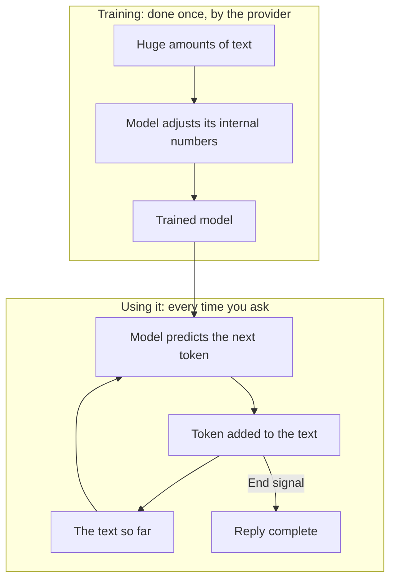

**In one line:** a large language model (LLM) is a program trained on huge amounts of text to predict what comes next, and that one skill turns out to be enough to write, summarise, answer questions and follow instructions.

## Why it matters

Everything else in this guide sits on top of an LLM. Chat assistants, agents and the tools that connect to your CRM all use one as their engine.

Knowing what it actually is explains behaviour that otherwise looks strange. It sounds confident when it is wrong. It knows nothing about your firm unless you tell it. It can answer the same question differently twice.

<mark>An LLM predicts plausible text. It does not look facts up.</mark>

## How it works

Start with something you already know: the suggestions above your phone keyboard when you type a message. They guess the next word from the words before it.

An LLM does the same job, with far more skill. It is trained on an enormous amount of text, and from that it learns the patterns of language, facts that appear often, and how instructions and answers tend to fit together.

Training works by repetition. The model is shown text with the next piece hidden and asked to guess it. Each wrong guess nudges its internal numbers slightly, and this happens billions of times. When it ends, those numbers (called **parameters**, or **weights**) are the model. Training is done once, by the provider, and takes a great deal of computing power.

Using the finished model is a different step, called **inference**. The model reads your text and predicts the next small piece, called a [token](/concepts/how-models-work/tokens-and-context-windows/). It adds that piece to the text and predicts the next one, and repeats until it produces an end signal. That is how a reply gets written, one token at a time.

Two things follow from this.

First, the model picks from likely options, not a single fixed answer. That is why the same question can get different wording each time.

Second, nothing in this process checks whether the text is true. The model produces what fits the pattern. Usually that is correct, because true statements are common in its training text. Sometimes it is fluent and wrong, which is called [hallucination](/concepts/how-models-work/hallucination-and-grounding/).

## In practice

You reach an LLM in two main ways: through a chat app, or through an API (a way for software to send it text and get a reply). Both talk to the same kind of model, which is usually hosted by the provider. Some models can also be downloaded and run on your own hardware, and that gets its own page.

The model does not hold your data. Anything it needs to know about your work has to be put in front of it for each conversation, by pasting it in or by letting it fetch it with [tools](/concepts/agents/tool-use/).

What it learned in training is frozen at a point in time, called the **knowledge cutoff**. Anything newer, such as recent news or this morning's email, is invisible to it unless a tool brings it in.

Models come in different sizes. Larger ones are generally more capable but slower and more expensive to run. Smaller ones are quicker and cheaper, and are often good enough for simple jobs.

## Worked example

Three questions an associate at Sample Ventures, the fictional fund, might ask a plain assistant with no tools:

- **"What does a convertible note do?"** The model answers from training. This is general knowledge that appears in a lot of text, so it is likely to be right.
- **"Summarise the call notes I just pasted."** The model works from the text in front of it. It is reliable here because the facts are right there in the conversation.
- **"What did we invest in last month?"** The model has no access to the fund's records. A well-behaved model says so. A poorly behaved one guesses something plausible, which is the risk.

The first answer comes from training, the second from the conversation, and the third needs a tool that can read the CRM.

## Costs and limits

- **Bigger costs more.** Larger models are slower and more expensive per reply. Match the model to the job.
- **Fluent is not the same as true.** The writing sounds equally sure whether the content is right or wrong.
- **No memory by default.** A new conversation starts blank. Anything the model seems to remember has been put back in front of it.
- **Exact work can slip.** Precise arithmetic, counting and long lists of figures are better handled by a tool than by the model alone.
- **Wording matters.** Small changes in how you ask can change the answer.

The most common mistake is treating an LLM as a database or a search engine. It is a text predictor that happens to know a lot.

## Often confused with

**LLM vs chatbot.** The LLM is the model. A chatbot or chat assistant is an application built around one, with a screen, a history, and often some tools.

**LLM vs AI.** AI is the broad field. An LLM is one kind of AI model, the kind that works with text.

## Related

- [Tokens and context windows](/concepts/how-models-work/tokens-and-context-windows/): the units a model reads and the limit on how many it can hold
- [Hallucination and grounding](/concepts/how-models-work/hallucination-and-grounding/): why models state false things confidently, and how to reduce it
- [Chat vs agent vs workflow vs automation](/concepts/agents/chat-agent-workflow-automation/): what gets built around an LLM
- [Embeddings](/concepts/how-models-work/embeddings/): how text becomes numbers that capture meaning

## The proper terms

- **Inference:** using a trained model to get a reply
- **Knowledge cutoff:** the point in time where the model's training text ends
- **Large language model (LLM):** a model trained on huge amounts of text to predict what comes next
- **Parameters (or weights):** the internal numbers a model learns during training (the word is also used for a tool's inputs)
- **Token:** the small piece of text a model reads and writes
- **Training:** adjusting a model's internal numbers by showing it large amounts of text
