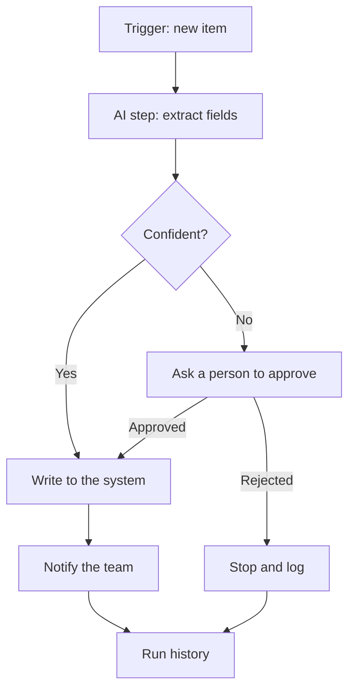

A trigger only answers the question of when a job starts. Orchestration tools handle what comes after: running the steps in order across your apps, and keeping a record of every run.

**In one line:** an orchestration tool is software that runs a series of steps across your apps in the right order, starting from a trigger and handling the schedule, retries and record-keeping for you.

## Why it matters

Connecting a CRM, a mailbox, a file store and a model sounds like a small job. In practice you need to sign in to each system, start the work at the right moment, pass data from step to step, retry when something fails, and keep a record of what happened. Writing all of that yourself for every workflow is slow.

Orchestration tools provide that plumbing, so you describe the flow and the tool runs it. They are where many small firms will first put an agent to work, because they give a quick, visible way to connect a model to real systems.

The choice of tool also decides where your credentials and data sit, and what happens if the vendor changes its terms.

<mark>The tool that makes a workflow quick to build is also the tool that holds your sign-ins and your data, so choose it with the second job in mind.</mark>

## How it works

Think of a production line with a supervisor. Each station does one job, and the supervisor decides what starts the line, passes the work along, deals with a station that jams, and writes down what happened. The orchestration tool is the supervisor.

Most tools share the same building blocks:

- **A trigger** that starts the flow (see [triggers and scheduling](/concepts/running-things/triggers-and-scheduling/)).
- **Steps** (often called nodes, actions or modules), each doing one thing: read a record, call a model, send a message.
- **Connectors**: ready-made links to common apps, so you do not write the sign-in and request code yourself.
- **Branches** that send the flow one way or another depending on a condition.
- **Error handling**: what to do when a step fails, such as retry, skip or alert.
- **Run history**: a list of every run, with what went in and out of each step.

An AI step is just one more box. It receives text, calls a model, and passes the answer on. If you ask for [structured output](/concepts/talking-to-models/structured-outputs/), the next step can use specific fields, such as the company name, without guessing.

There are three broad kinds of tool:

- **No-code and low-code automation platforms.** You build flows by dragging boxes in a visual editor. Fastest to start, and readable by non-programmers. Examples of the category: Zapier, Make, n8n and Microsoft Power Automate.
- **Workflow engines for developers.** You write the flow as code, and the engine makes it reliable: it keeps state, retries steps and can resume after a crash. Examples: Apache Airflow (mostly scheduled data pipelines) and Temporal (long-running, crash-proof workflows).
- **Plain code.** A script or a [serverless function](/concepts/running-things/serverless-functions/) on a timer or an event. Most control, and most to maintain yourself.

## In practice

Typical use: a trigger fires, a few steps read and write business systems, one step calls a model, and a person approves anything risky. The tool stores the sign-ins to each connected app, so it can act for you.

Some platforms can also expose flows or apps to an assistant through [MCP](/concepts/agents/mcp/), or call an agent as one step. In that case the line between "workflow with an AI step" and "agent with workflow tools" blurs. The difference is who decides the order of steps: you (workflow) or the model (agent). See [chat, agent, workflow and automation](/concepts/agents/chat-agent-workflow-automation/).

**How to choose.**

- **Speed versus control.** Visual tools get a first version running in an afternoon. Code gives you tests, version history, and exact control over odd cases.
- **Cost as volume grows.** Many platforms charge per run, step or credit. A flow that is cheap at ten runs a day may not be at ten thousand.
- **Self-hosting or the vendor's cloud.** Some tools can run on your own server, which keeps data in your hands but makes you responsible for updates, backups and security. Others run only in the vendor's cloud.
- **Where credentials and data live.** Every connected account is stored in the tool, and run history may keep copies of the data that passed through.
- **Vendor risk.** Pricing, limits and features change. Can you export your flows, and could you rebuild them elsewhere?
- **When to move to code.** When flows get complicated, need testing, or one tool's limits keep getting in the way.

**Snapshot, as of October 2026.** This paragraph describes things that change, so check the vendors' own pages before deciding. Zapier prices by tasks and has a free tier, with overage billed per task above your plan. Make prices by credits, with a free tier, and counts each module action as one credit. Its pricing page does not describe a self-hosting option, so check with the vendor. n8n can be self-hosted or used in its vendor cloud. Its source code is visible, but it is not open source in the usual sense: it uses a "fair-code" licence called the Sustainable Use License, which allows use for internal business purposes and non-commercial use, and restricts commercial redistribution. Read the licence text and ask a lawyer if your use is unusual. Microsoft Power Automate is a Microsoft service whose cloud flows come as automated (event), instant (button) and scheduled types. Apache Airflow is open source under the Apache License 2.0. Temporal's server is open source.

## Worked example

Sample Ventures, the fictional fund, wants every introduction email logged in the CRM. The operations lead builds the flow in an automation platform.

1. **Trigger.** A new email arrives in the shared deals mailbox.
2. **AI step.** A model reads the email and returns structured fields: founder name, company, one-line pitch, who made the introduction. It also returns a confidence value.
3. **Look up.** The flow searches the CRM for the company, for example "Acme Payments".
4. **Branch.** One clear match leads to an update. No match leads to a new company record. Two possible matches, or a low confidence value, leads to the approval step.
5. **Ask a person.** The flow posts to a team channel: "Is this the Acme Payments already in the CRM, or a new company?" with the email text and both options. An associate clicks one.
6. **Write.** The flow creates the person if needed and adds a note linked to the company. Before writing, it checks whether a note for this email's message ID already exists, so a repeated trigger does not create duplicates.
7. **Notify.** A short message goes to the team channel: "Logged introduction from [founder] about Acme Payments."

The operations lead has given the flow its own limited CRM account that can create notes and people, but cannot delete anything. She turns on alerts for failed runs and reads the run history each week for the first month.

## Costs and limits

- **Cheap to start, costly to scale.** Pricing usually grows with runs or steps. A busy flow with several model calls can cost much more than expected.
- **Hidden multiplication.** A loop over 500 records makes 500 runs of every step inside it. Check the volume before turning a flow on.
- **Visual flows get tangled.** A big canvas with dozens of boxes is hard to read, test and review. Split large flows into smaller ones.
- **Vendor limits.** Platforms cap run time, payload size or runs per month. Some limits only show up once a flow gets busy.
- **Stored credentials are a target.** The tool holds sign-ins to your CRM and files. Whoever can edit a flow can often use those sign-ins. Limit who can edit, and use dedicated accounts with narrow access (see [least privilege](/concepts/security/least-privilege/)).
- **Logs can hold data.** Run history often keeps the contents of each step. Check how long it is kept and who can see it, especially under [data protection rules](/concepts/security/gdpr-data-retention-and-dpas/).
- **Approval steps are not optional for risky writes.** Sending, deleting and paying should wait for a person (see [human-in-the-loop](/concepts/agents/human-in-the-loop/)).

The common mistake is building one flow that does everything, with broad access and no approvals, because it worked in the demo.

## Often confused with

**Orchestration tool vs agent framework.** An orchestration tool runs steps in an order that you set. An agent framework lets a model choose the steps. Several tools now do both, so look at who decides the order.

## Related

- [Chat, agent, workflow and automation](/concepts/agents/chat-agent-workflow-automation/): the difference between a fixed flow and an agent
- [MCP](/concepts/agents/mcp/): a standard way for assistants to reach tools, which some platforms support
- [Triggers and scheduling](/concepts/running-things/triggers-and-scheduling/): how a flow gets started
- [Rate limits, retries and failures](/concepts/running-things/rate-limits-retries-and-failures/): what the tool's error handling is doing for you

## The proper terms

- **Orchestration tool:** software that runs workflow steps across apps in order
- **Connector:** a ready-made link between a tool and an app
- **Node:** one step in a visual workflow
- **Run history:** the record of each run and what happened in it
- **Low-code:** building mostly with visual tools, with small pieces of code where needed
- **Workflow engine:** developer software that runs coded workflows reliably, resuming after failures
- **Self-hosting:** running software on your own servers instead of the vendor's cloud
- **Fair-code:** source-visible software with licence limits on commercial use

## Next up

Every step in a flow is a call to another system, and some of those calls will fail. [Rate limits, retries and failures](/concepts/running-things/rate-limits-retries-and-failures/) explains how to recover without making things worse.
