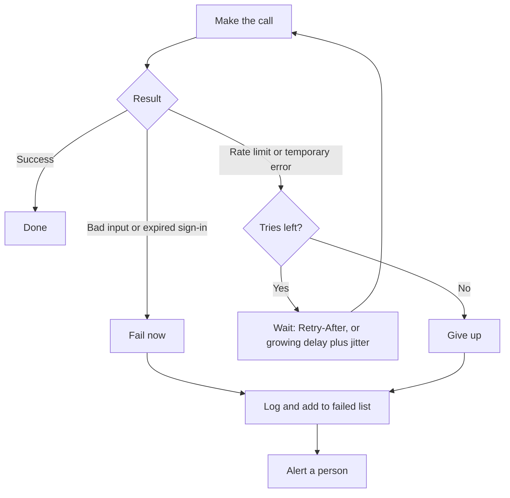

**In one line:** connected systems fail often in small ways, so a well-built job waits and retries the safe things, gives up after a limit, and tells a person when it cannot finish.

## Why it matters

Every connection between systems can fail: the CRM is slow, the model provider is busy, a sign-in has expired, the network drops. On a good day you will not notice. Across thousands of calls over months, you will meet every one of these.

A job that assumes everything works will stop halfway, send something twice, or hammer a struggling service until it falls over. A job built for failure carries on, or stops cleanly and says what happened.

<mark>A retry is only safe when repeating the action cannot do harm, so decide what is safe to repeat before deciding how many times to try.</mark>

## How it works

**Rate limits.** Most services cap how much you may ask of them: so many requests per minute or per day. For model providers the cap is often also in tokens (the small chunks of text a model counts, see [tokens and context windows](/concepts/how-models-work/tokens-and-context-windows/)) per minute. The cap protects the service from being overwhelmed and shares capacity fairly.

When you go over, the service refuses. The standard way to say this on the web is the HTTP status code **429**, "Too Many Requests". The web standard that defines it (RFC 6585) says such a response may include a **Retry-After** header, telling you how long to wait. Model providers follow the same convention. For example, Anthropic's documentation says an exceeded limit returns a 429 error with a `retry-after` header giving the seconds to wait.

**Other failures.** Rate limits are one kind among several:

- **Temporary server errors** (the 5xx family of status codes, such as 503 "service unavailable"). The service is struggling. Trying again shortly often works.
- **Timeouts.** The call took too long and nobody answered.
- **Outages.** The service is down for minutes or hours.
- **Expired sign-in.** The token or key no longer works (see [APIs, OAuth and API keys](/concepts/data/apis-oauth-and-api-keys/)). Retrying does not help; someone must renew access.
- **Bad input.** The request itself is wrong, such as a missing field. Retrying the same request will fail the same way.

The key skill is telling these apart. Rate limits, timeouts and temporary server errors are worth retrying. Expired sign-in and bad input are not.

**Retrying well.**

1. **Wait before retrying.** Retrying instantly usually meets the same problem.
2. **Back off.** Make each wait longer than the last: say 1 second, then 2, 4, 8. This is called **exponential backoff** (the wait roughly doubles).
3. **Add jitter.** Jitter is a small random amount added to each wait. Without it, a hundred clients that failed together all retry together, and fail together again. Amazon's engineering write-up on the topic found that adding randomness spreads the retries out and cuts the total work for everyone.
4. **Respect Retry-After.** If the service tells you how long to wait, use that over your own guess.
5. **Cap the tries.** Set a maximum number of attempts and a maximum total time. Forever is not a setting.
6. **Set timeouts.** Every call needs a deadline so nothing hangs indefinitely.
7. **Only retry what is safe.** If repeating the action could cause harm, such as sending an email, do not retry blindly. See idempotency, below.

**Idempotency.** An action is idempotent if doing it twice has the same result as doing it once (the web standard defines it in just this way for repeated requests). Reading a record is idempotent. "Set status to Active" is idempotent. "Send an email" and "add a note" are not, because each repeat adds another. For those, use an **idempotency key**: a unique label for this one intended action, such as the message ID. The job records the key when it succeeds and skips the action if it sees the key again. See also [triggers and scheduling](/concepts/running-things/triggers-and-scheduling/).

## In practice

Most client libraries for model providers and common APIs already include automatic retries with backoff. Automation platforms usually have a retry setting per step. Know what yours does by default, because the default may be no retries, or many.

Beyond retrying, there are further safety nets:

- **Fallbacks.** If one model or provider is down, switch to a second one (see [model routing](/concepts/cost/model-routing/)). Test that the fallback gives acceptable answers.
- **A failed-jobs list.** Items that could not be processed go into a list, often called a **dead-letter queue**, for a person to look at or rerun, instead of vanishing.
- **Alerts.** Tell a person when a job fails or when failures climb above normal (see [observability](/concepts/agents/observability/)).
- **Pacing.** For big batches, slow yourself down to stay under the limit rather than hitting it and recovering.

**Agents are different.** When an agent's tool call fails, the error message becomes text that the model reads. A vague error ("failed") may lead it to try something odd, like a different tool or an invented answer. Return clear messages that say what happened and what to do ("rate limited, wait 30 seconds" or "company not found, check the spelling"). Cap the number of steps in the [agent loop](/concepts/agents/the-agent-loop/), so a confused agent cannot keep trying forever. Ordinary retry logic should sit in the surrounding software, so the model does not have to handle every hiccup itself.

## Worked example

Sample Ventures, the fictional fund, imports 500 old meeting notes into a search index (see [RAG and chunking](/concepts/data/rag-and-chunking/)). The index service allows a limited number of requests per minute. Halfway through, the service answers 429.

**The naive job** loops through the notes and sends each one. At note 240 it gets a 429, treats it as a crash, and stops. The operations lead doesn't know which notes went in. She restarts it from the top, so 240 notes are indexed twice and the search results now show duplicates. If the naive job had instead retried instantly in a loop, it would have sent hundreds of requests a second into a service that was already refusing it.

**The well-built job** does this:

1. Gives each note a unique key (its note ID) and skips any already indexed, so reruns are safe.
2. Sends in small batches at a pace under the limit.
3. At note 240 it receives a 429 with a Retry-After of 30 seconds. It waits 30 seconds, then continues.
4. If a second 429 arrives without a hint, it waits with growing delays plus jitter, up to six tries.
5. Note 311 fails with "bad input" because the text is empty. The job does not retry it. It logs the note ID and carries on.
6. At the end it reports: "489 indexed, 11 failed. Failed list attached." An associate reviews the 11.

The whole import finishes a few minutes later than the naive one would have, and nothing is lost or duplicated.

## Costs and limits

- **Retry storms.** When many clients retry together against a struggling service, the retries themselves can keep it down. Backoff, jitter and a retry cap are the defences. Retrying at several layers at once (the library, the tool and your own code) multiplies attempts.
- **Duplicate actions.** The classic result of retrying something that is not idempotent: two emails sent, two records created.
- **Runaway cost.** Retried model calls are billed each time. A loop of retries or a confused agent can spend a lot before anyone looks. Set caps on tries, steps and spend.
- **Retrying the unfixable.** Retrying an expired sign-in or a bad request only wastes time. Fail early with a clear message.
- **Silent loss.** Giving up quietly is as bad as crashing. Every give-up should reach a log and a person.
- **Limits differ.** Each service sets its own limits, and some vary with your plan. Read them, and design the job to stay well under.

## Related

- [Triggers and scheduling](/concepts/running-things/triggers-and-scheduling/): idempotency, and why jobs run twice
- [Observability](/concepts/agents/observability/): the logs and alerts that make failures visible
- [The agent loop](/concepts/agents/the-agent-loop/): why a failed tool call needs a clear message and a step limit
- [Model routing](/concepts/cost/model-routing/): switching to another model when one is unavailable

## The proper terms

- **Rate limit:** a cap on how many requests or tokens a service accepts in a period
- **429:** the HTTP status code meaning too many requests
- **Retry-After:** a header telling you how long to wait before retrying
- **Exponential backoff:** waiting longer after each failed attempt, roughly doubling each time
- **Jitter:** a small random addition to waits so clients do not retry together
- **Timeout:** a deadline after which a call is abandoned
- **Idempotency key:** a unique label that lets a repeated action be recognised and skipped
- **Dead-letter queue:** a holding list for failed items awaiting human review
- **Retry storm:** many retries at once that worsen an outage
