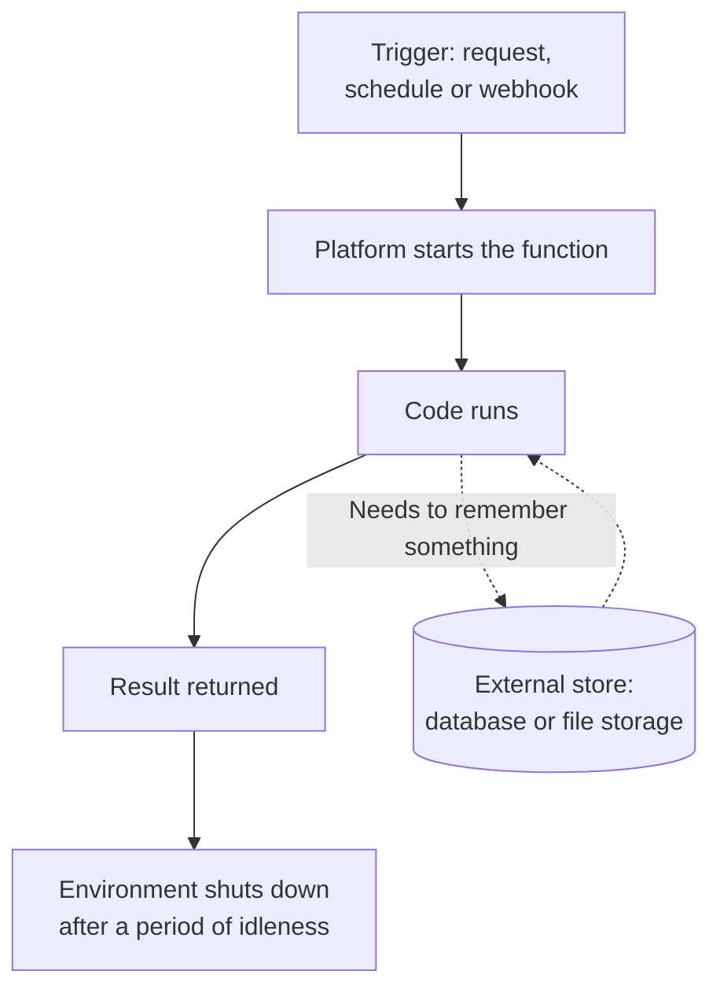

With a model as the engine, a harness as the rest of the car and a context layer as its maps, an agent is ready to drive. Running it for real means taking it out on real roads every day without anyone watching, and that starts with a place for its code to run.

**In one line:** a serverless function is a small piece of code that runs only when something triggers it, on a platform that manages the machines, so you pay for the runs rather than for waiting around.

## Why it matters

Plenty of useful jobs are tiny and occasional: receive a message from the CRM, update a record, send a reminder every Monday. Renting a computer to sit idle 99 per cent of the time, and keeping it secure and updated, is a lot of effort for that.

Serverless functions remove that effort. You hand the platform your code, say what should start it, and the platform does the rest. When nothing happens, nothing runs and (usually) nothing is billed.

For a context layer, this is often the glue: the small pieces that keep data fresh, receive events and give an agent simple tools to call.

<mark>A serverless function is built to do one short job and forget it: anything it needs to remember must be kept somewhere else.</mark>

## How it works

The word "serverless" is a little misleading. Servers still exist. You just do not set up, patch or look after them: the platform does. The proper term for the model is **function as a service** (FaaS).

A function has three parts: the code, a **trigger** that starts it, and some settings (how much memory, how long it may run). The trigger is usually one of these:

- **A web request.** Someone or something calls a web address, and the function answers. This makes a small API endpoint.
- **A schedule.** The platform starts it at set times, like a timed job (see [triggers and scheduling](/concepts/running-things/triggers-and-scheduling/)).
- **An event or webhook.** Another system sends a message saying "something changed". A **webhook** is exactly that: one system calling a web address you gave it when something happens (see [keeping data fresh](/concepts/data/keeping-data-fresh/)).

When the trigger fires, the platform finds or starts a small isolated environment, runs your code, returns the result and then lets the environment go.

Two properties follow from this design:

- **Stateless.** The function does not keep memory between runs. Variables from the last run may be gone, so lasting information goes into a database or file store.
- **Cold start.** If a function has been idle, the first run is slower because the platform has to prepare a fresh environment. Later runs while it is still warm are quicker.

## In practice

The big cloud providers all offer this. Examples of the category are AWS Lambda and Azure Functions, and there are similar offerings from other cloud and web hosting companies.

Good fits:

- **Webhook receivers.** A small endpoint that catches events from other systems.
- **Glue code.** Reshaping data from one system and passing it to another.
- **Small API endpoints.** A simple way for other software to ask for something.
- **Scheduled jobs.** A nightly check or weekly summary.
- **Tools an agent can call.** A function can sit behind a [tool](/concepts/agents/tool-use/): the agent asks, the function runs a short, defined action.

Poor fits:

- **Long-running agent loops.** An agent that keeps working for many minutes can run past the time limit. The [agent loop](/concepts/agents/the-agent-loop/) is better run somewhere without a short cut-off, or split into short steps.
- **Heavy, continuous work.** Constant, high-volume processing may cost more than a regular server.
- **Anything needing local files that must persist.** Local disk space, if any, is temporary.

Keys and passwords the function needs belong in its environment settings, not in the code (see [environment variables and secrets](/concepts/running-things/environment-variables-and-secrets/)). When a function chains with others, an [orchestration tool](/concepts/running-things/orchestration-tools/) (software that runs a chain of steps across apps in order, covered later in this chapter) may be a better home for the overall flow.

**Snapshot, as of October 2026.** Limits differ between platforms and change over time, so check the current documentation before designing around them. As an illustration only: AWS Lambda's documentation lists a maximum run time of 15 minutes for standard functions, memory settings from 128 MB to about 10 GB, a 6 MB cap on request and response size for direct calls, and a default of 1,000 concurrent runs per region that can be raised on request. It describes itself as built for short-lived tasks that do not keep state between runs. Azure Functions' documentation says its older consumption plan can scale to zero when idle, which can slow the first request, and gives a default run time of 5 minutes and a maximum of 10 minutes, with web-triggered functions capped at about 4 minutes. Newer plan types on both platforms offer ways to keep instances ready to reduce cold starts.

## Worked example

Sample Ventures' CRM sends a webhook whenever a company's stage changes. The agent answers questions from a search index built from the CRM (see [RAG and chunking](/concepts/data/rag-and-chunking/)), and the index must not be out of date.

The operations lead sets this up with one function:

1. **Create the function.** It is a short piece of code that accepts a web request from the CRM.
2. **Register the webhook.** In the CRM's settings, she gives it the function's web address and a shared signing secret, stored in the function's environment settings.
3. **A partner moves Acme Payments from "Meeting" to "Diligence".** The CRM sends a small message naming the company and its new stage.
4. **The function wakes.** It checks the signature to confirm the message really came from the CRM.
5. **It fetches the updated record** and rewrites that company's entry in the search index.
6. **It answers "received"** quickly and shuts down. The whole run takes a second or two.
7. **Next day, an associate asks the agent** "which deals are in diligence?" and Acme Payments is there.

Nothing runs between stage changes. If the update fails, the function reports the error so the CRM can retry, and the failure shows up in logs (see [rate limits, retries and failures](/concepts/running-things/rate-limits-retries-and-failures/)).

## Costs and limits

- **Cheap when idle, less so when busy.** Billing follows runs and run time, so occasional jobs cost very little. Constant heavy work can cost more than a regular server.
- **Time limits are real.** A function that runs too long is stopped mid-task. Design for short jobs, or hand long work to something else.
- **Cold starts add delay.** Fine for a nightly job, noticeable for something a person is waiting on.
- **No memory between runs.** Do not rely on variables or local files surviving.
- **Webhook senders can retry.** The same message may arrive twice, so a function should be safe to run twice with the same input.
- **Concurrency limits exist.** A burst of events can hit a ceiling on how many runs go at once.
- **Debugging is harder.** The environment vanishes after each run, so good logging matters (see [observability](/concepts/agents/observability/)).

A common mistake is putting a whole agent in one function and finding out at minute fifteen that it was stopped.

## Often confused with

**Serverless vs "no servers".** There are still servers. Serverless means you do not manage them.

**Functions vs workflows.** A function is one piece of code doing one job. A workflow joins several steps, often across different tools, with logic, waiting and retries between them. Workflows often call functions as steps.

## Related

- [Triggers and scheduling](/concepts/running-things/triggers-and-scheduling/): the ways a function gets started
- [Tool use](/concepts/agents/tool-use/): a function can be the thing a tool runs
- [Keeping data fresh](/concepts/data/keeping-data-fresh/): webhooks and scheduled functions are common ways to do it
- [Environment variables and secrets](/concepts/running-things/environment-variables-and-secrets/): where a function's keys should live

## The proper terms

- **Serverless:** running code on a platform that manages the servers for you
- **Function as a service (FaaS):** a platform that runs your small functions on demand
- **Trigger:** the event that starts a function
- **Webhook:** a message one system sends to a web address when something happens
- **Stateless:** keeping no memory between runs
- **Cold start:** the extra delay when a function starts after being idle
- **Concurrency:** how many runs of a function happen at the same time
- **Timeout:** the maximum time a function may run before being stopped

## Next up

A function that reaches a CRM or a model needs a key to get in. [Environment variables and secrets](/concepts/running-things/environment-variables-and-secrets/) explains where those keys should live.
