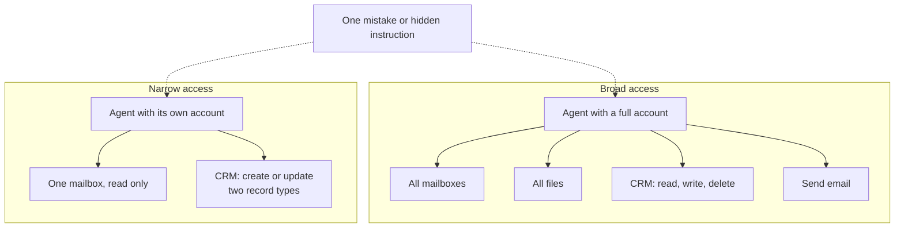

Locks are only as good as the keys handed out. Least privilege is the rule for handing them out: every agent gets the keys its job needs and no more, which limits what a fooled or mistaken agent can reach.

**In one line:** least privilege means each person, program or agent gets the minimum access its job needs, and nothing more, for no longer than needed.

## Why it matters

Giving an agent broad access is the easy path. One account, full permissions, everything works first time. Nobody has to work out in advance what it will need.

The cost shows up later. Anything that goes wrong now has a long reach. If the agent misreads a request, or is misled by a hidden instruction in an email (see [prompt injection](/concepts/security/prompt-injection/)), it can touch everything its account can touch.

Agents make this more important than it is for people. They act fast, they can be fooled, and a mistake can repeat many times before anyone looks. A person who makes one wrong click does one wrong thing. An agent in a loop can do it a hundred times.

<mark>Decide what an agent needs before you give it access, because what it can reach is the limit of what it can break.</mark>

## How it works

A hotel key card is a good picture. A guest's card opens their room and the lift to their floor. A cleaner's card opens the rooms on one shift. Nobody gets a master key just because it is more convenient.

The standard wording comes from security standards bodies. The US standards body NIST describes it as the principle that each entity is granted the minimum system resources and authorisations it needs to perform its function. Another NIST definition says a system should restrict the access of users, and of processes acting for them, to the minimum necessary to accomplish assigned tasks. Agents count as such processes.

The useful idea is **blast radius**: how much damage one mistake or compromise can do. Broad access means a large blast radius. Narrow access keeps the damage small and local.

With broad access, a single mistake can reach four areas. With narrow access, it can reach two small ones, and none that send or delete.

How to apply it to agents:

- **Read-only first.** Start with looking. Add the ability to change things only where the job needs it.
- **A separate account per agent.** If an agent uses its own identity, you can narrow, monitor or switch it off without affecting anyone else. Sharing a person's login hides who did what.
- **Narrow scopes on tokens.** A scope is a limit written into a credential, such as "read mail only". Ask for the smallest set (see [APIs, OAuth and API keys](/concepts/data/apis-oauth-and-api-keys/)). MCP's own security guidance recommends starting with minimal scopes and adding more only when needed.
- **Tool allowlists.** List the tools an agent may use, rather than listing the ones it may not.
- **Limits on reach.** Restrict which folders, records and fields it can see. Fields such as personal contact details can be excluded.
- **Time-limited credentials.** Access that expires, or is granted for one task, cannot be abused next month.
- **Separate test and live.** Develop against test data and a test account, so experiments cannot touch real records.
- **Switch off unused tools.** Every connected tool is both a risk and a cost, because its description takes up space in the [context window](/concepts/how-models-work/tokens-and-context-windows/). Fewer [MCP](/concepts/agents/mcp/) tools means a smaller blast radius and a tidier context.
- **Review regularly.** Access tends to grow and rarely shrinks. Check from time to time what each agent can still do, and remove what it no longer needs.

## In practice

Most of this is configured in the systems you already use. The mailbox, the file store and the CRM each have their own roles and sharing settings. Cloud platforms let you create service accounts with defined roles. The automation tool or agent platform lets you pick which tools an agent can call.

The simplest working method is to write down, for each agent, one sentence on its job and a short list of what it must read and write. Grant exactly that. If it fails with a "not allowed" message, that is the system working: decide whether the job really needs that access before widening anything.

It pairs naturally with [human in the loop](/concepts/agents/human-in-the-loop/). Least privilege limits what an agent can do at all. Approval gates add a person's judgement over the risky things it is allowed to do.

## Worked example

Sample Ventures, the fictional fund, builds an introduction logger. Its job: read introduction emails and record them in the CRM.

The operations lead writes down what it needs and grants only that:

1. **Its own account.** A dedicated identity, not an associate's login.
2. **Mailbox: read one folder.** An "Introductions" folder, read only. No other mailboxes.
3. **CRM: write two record types.** It can create and update contacts and interaction notes. It cannot delete, and it cannot touch deal or fund records.
4. **No send tool.** It cannot email anyone.
5. **No file store access.** It does not need the data room.
6. **Test first.** It runs against a test CRM before touching live records.

Weeks later someone suggests the logger could also draft replies. That is a new job, so the grant is reviewed. It gets permission to create drafts in a drafts folder, which reach no one. Sending stays off. If drafting later proves unneeded, the permission is removed.

Now a hidden instruction arrives in an email. At worst it could add a bogus contact note, which a person can see and fix. It cannot send, delete or read other folders.

## Costs and limits

- **More setup at the start.** Working out the minimum takes thought, and separate accounts take time to create.
- **Friction.** The agent will sometimes be unable to do something a person expected. That is a prompt to decide, not an error to bypass.
- **Access creeps.** People widen access to fix a one-off problem and never narrow it again. Review on a schedule.
- **Convenient shared accounts.** Using one broad account for several agents is the usual mistake. It removes your ability to narrow or revoke any single one.
- **It limits damage, it does not prevent mistakes.** An agent can still misuse what it legitimately has. Combine it with approvals and logging.
- **Some systems are coarse.** If a tool only offers "full access" or "none", you may need a gateway or a different tool to get finer limits.

## Often confused with

**Least privilege vs permissions and access control.** [Permissions and access control](/concepts/data/permissions-and-access-control/) is the machinery: how rules are set and enforced. Least privilege is the principle for deciding what those rules should say.

## Related

- [Permissions and access control](/concepts/data/permissions-and-access-control/): the mechanism that enforces the limits you choose
- [APIs, OAuth and API keys](/concepts/data/apis-oauth-and-api-keys/): where scopes on tokens are set
- [Prompt injection](/concepts/security/prompt-injection/): why a fooled agent should have little to misuse
- [MCP](/concepts/agents/mcp/): connect only the tools a job needs

## The proper terms

- **Blast radius:** how much damage one mistake or compromise can cause
- **Least privilege:** giving only the minimum access a job needs
- **Scope:** a limit written into a credential, such as read-only access to mail
- **Service account:** a shared identity used by software rather than a person
- **Time-limited credential:** access that expires after a set period or task

## Next up

Narrow access limits what can go wrong, but something will still go wrong eventually. [Audit trails](/concepts/security/audit-trails/) make sure you can say afterwards exactly what happened and who was responsible.
