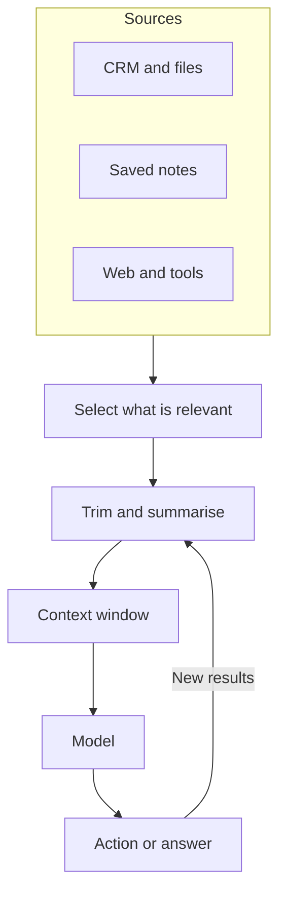

**In one line:** context engineering is deciding what goes into the model's context window at each step, so it has what it needs and little else.

## Why it matters

A prompt is one piece of what a model sees. In an agent, the model also sees tool descriptions, earlier steps, fetched documents and tool results. Its answer depends on all of it.

Many people building agents now say most failures are context failures, not model failures. The needed fact wasn't there, was out of date, was buried under noise, or was contradicted by something else in the window.

<mark>The model can only use what is in its window, so the quality of the answer is capped by the quality of what you put there.</mark>

## How it works

Start with what the [context window](/concepts/how-models-work/tokens-and-context-windows/) can hold: instructions, tool descriptions, the conversation so far, retrieved documents, tool results and any saved notes. Context engineering is the work of choosing, fetching, trimming and ordering those pieces for each step.

There are four basic moves:

- **Select.** Fetch only what is relevant to the question, not everything you have.
- **Compress.** Replace long older material, such as a finished stage of work, with a short summary.
- **Isolate.** Give a separate task its own clean window instead of crowding one shared window (this is what subagents do, and they get their own page).
- **Persist.** Save useful facts outside the window as notes, and bring them back only when needed.

The loop at the bottom matters. In an [agent loop](/concepts/agents/the-agent-loop/), every round adds new material, so the choosing and trimming happens again each time.

## In practice

This is the heart of a **context layer**: the set of sources, and the logic that assembles the right information from them for each question. That gets its own page.

The usual tools are search and retrieval to fetch the right passages, summarising to shorten old material, and memory notes to carry facts between conversations. The data stays in your systems and is fetched at the moment of the question, so it is as fresh as the source.

Permissions matter here. The assembly step should fetch only what the person asking is allowed to see. Otherwise, a clever question could pull confidential material into the window and then into an answer.

To improve it, you need to see what the model actually received. Looking at the real contents of the window, round by round, usually shows the problem straight away.

## Worked example

Someone at Sample Ventures, the fictional fund, asks an agent: "Who in our network could we introduce to the founder of Acme Payments?"

**The careless way:** load an export of the whole contact list. It is huge, mostly irrelevant, and crowds out the useful parts.

**The engineered way:**

1. Fetch the Acme Payments record, with its sector and stage.
2. Search contacts for people tagged with the same sector, and keep the ten best matches.
3. Fetch the last three notes on the company, in case they mention what the founder wants.
4. Leave everything else out, and summarise any earlier part of the conversation.

The window now holds a small, relevant set of material. The answer is faster, cheaper and easier to check.

## Costs and limits

- **Fetching has a cost.** Every search takes time and tokens, so more fetching is not automatically better.
- **Too little invites guessing.** If the needed fact isn't there, the model may [hallucinate](/concepts/how-models-work/hallucination-and-grounding/) one.
- **Too much adds noise.** Irrelevant material makes the right details harder for the model to use.
- **Summaries lose detail.** A compressed record can drop the one fact that mattered later.
- **Stale data misleads.** A fetched record is only as current as its source.

The most common mistake is treating a bigger window as the fix. Choosing well beats stuffing more in.

## Often confused with

**Context engineering vs prompt engineering.** [Prompt engineering](/concepts/talking-to-models/prompt-engineering/) is about the wording of instructions. Context engineering is about everything in the window, of which the prompt is one part.

**Context engineering vs RAG.** RAG (retrieval-augmented generation) means fetching relevant material to include in the window. It is one technique within context engineering, which also covers trimming, summarising and saving notes.

## Related

- [Prompt engineering](/concepts/talking-to-models/prompt-engineering/): the wording side
- [System prompts](/concepts/talking-to-models/system-prompts/): the standing instructions at the top of the window
- [Tokens and context windows](/concepts/how-models-work/tokens-and-context-windows/): the limit this works within
- [The agent loop](/concepts/agents/the-agent-loop/): why the choosing repeats every round

## The proper terms

- **Compression:** shortening older material so it takes less space in the window
- **Context engineering:** choosing and maintaining everything a model sees
- **Context layer:** the sources and logic that assemble the right information for each question
- **Selection:** fetching only the material that is relevant to the question
