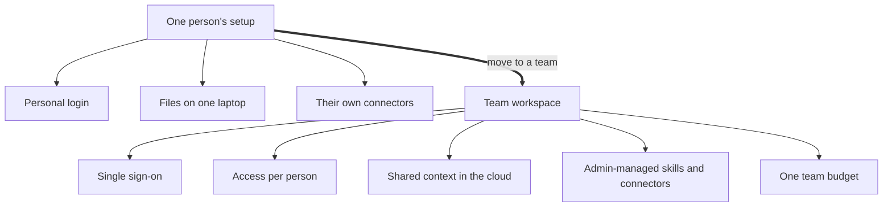

A [first agent](/building/your-first-agent/) is usually one person's project: their account, their laptop, their connections. Parts 1 to 4 were about you. From here on the guide is about doing it together, safely, and this page names what changes when "I use AI" becomes "the team uses AI".

**In one line:** moving from personal to team use means work accounts with central sign-in, access that follows each person, shared context that lives in the cloud rather than on one laptop, skills and connectors managed by an admin, written rules for data, and one team budget.

## The jargon: concepts covered on this page

- **Admin:** the person who manages a team's accounts, settings and approved tools
- **Delegated access:** an agent acting with the permissions of the person who asked
- **Identity provider:** the system that holds a company's work accounts and checks sign-ins
- **Seat:** one person's paid place on a team plan
- **Shared context:** instructions, files and knowledge kept where the whole team can use them
- **Single sign-on (SSO):** signing in to many tools with one work account
- **Team plan:** a paid account for a group, with central billing and admin controls

## Why it matters

A personal setup works because one person holds it all in their head. They know which files they uploaded, which tools they connected and what the agent is allowed to touch. Nobody else needs to understand it, and nothing breaks if it is a little messy.

That stops being true the moment a second person relies on it. If the setup lives on one laptop, it stops when that laptop is closed. If it uses one person's logins, everyone who uses it borrows that person's access. If nobody wrote down the rules, nobody knows what data is allowed in.

<mark>A team setup is not one person's setup copied to more people: it is the same tools with shared context, individual access and someone in charge.</mark>

The rest of Part 5 (how a team's information is stored, searched, kept fresh and permissioned) and Part 6 (running it reliably, securely and within budget) all serve this shift. This page is the overview; the pages after it fill in each piece.

## How it works

The change touches six things. The car metaphor helps: one person's car becomes a small fleet, and a fleet needs a key cabinet, shared maps, a fuel card and a fleet manager.

| | Just me | A team |
| --- | --- | --- |
| **Logins and accounts** | A personal account, often signed in with a private email | Work accounts on a team or business plan, ideally through single sign-on, with an admin who adds and removes people |
| **Who sees what** | You see everything you connected | Each person sees only what they could already open, and the agent acts on their behalf with their access |
| **Where context lives** | Files, notes and instructions on your laptop or in your own account | Shared, in the cloud, so the agent still works when someone is on holiday or leaves |
| **Skills, Projects and connectors** | You install whatever you like | An admin chooses which tools and connectors are allowed, and shares the useful skills and Projects with everyone |
| **Data and policy** | Your own judgement | Written rules on what data may go in, checked against data protection law |
| **Cost** | One subscription on your card | A team budget, with seats, usage limits and someone watching the total |

**Logins and accounts.** On a team plan each person has their own seat under one account the company controls. With single sign-on, people sign in with the work account they already use for email, held in the company's identity provider (such as Microsoft Entra ID or Google Workspace). When someone leaves, switching off their work account switches off their AI access too.

**Who sees what.** The rule from [permissions and access control](/data/permissions-and-access-control/) (covered later in this Part) becomes the centre of everything: an agent should never show someone what they could not have opened themselves. The safest pattern is delegated access, where the agent reaches each system with the asker's own login, usually through [OAuth](/agents/apis-oauth-and-api-keys/). A single shared login for everyone is simpler, but it hands the agent the widest key in the building.

**Where context lives.** Context means the instructions, files and knowledge the agent works from. On one laptop it is fragile and invisible to others. In a team it belongs in shared, cloud-hosted places: a shared Project, a shared drive, a hosted service. See [local vs cloud](/building/local-vs-cloud/) (where your agent and its files actually run) in Part 4.

**Skills, Projects and connectors.** [Skills](/agents/skills-and-instruction-files/), [Projects](/using-ai/projects-and-memory/) and [connectors](/agents/connectors-in-claude/) stop being personal choices. An admin decides which connectors the company trusts, and the best skills are written once and shared, so everyone gets the same instructions instead of ten slightly different copies.

**Data and policy.** Once colleagues, clients or investors' data are involved, rules need writing down: what may be pasted in, which plans are approved, how long anything is kept. Two later pages cover this: [GDPR, data retention and DPAs](/running/gdpr-data-retention-and-dpas/) (the data protection law and the contracts with AI providers, in Part 6) and [writing an AI policy](/running/writing-an-ai-policy/) (a short internal document setting the rules, also in Part 6).

**Cost.** One subscription becomes many seats plus any usage on top. Someone needs to set limits and check the total, the team's fuel bill. The cost pages in Part 6 make this concrete.

## In practice

Most AI providers sell a team or business plan alongside their personal ones, and the differences are mostly the ones in the table. As one example, Anthropic's Claude Team and Enterprise plans (as of October 2026) offer the following, according to Anthropic's help pages:

- **Central admin and billing:** owners manage members, roles and billing in one place, and can set spending limits for the whole organisation and for individual people.
- **Single sign-on and domain capture:** available on Team and Enterprise plans, so people sign in with their work account and new accounts on the company's email domain join the company workspace.
- **Shared Projects:** a Project can be visible to everyone in the organisation or shared with chosen people as "can view" or "can edit". Sharing a Project shares its instructions and knowledge, while each person's chats stay private unless they share them.
- **Admin-managed connectors:** an owner must turn a connector on for the organisation before members can use it, and each person then signs in to that tool with their own account, so their own permissions apply. Admins can also authorise some connectors once for everyone through the company's identity provider.
- **Organisation-wide skills:** owners can add skills that appear for everyone, and individuals can switch them off for themselves but not delete them.
- **Training defaults:** Anthropic says it does not use inputs or outputs from its commercial plans to train models by default. Personal plans have their own setting for this, so check it.

Enterprise plans add more, such as audit logs (a record of who did what) and automatic account provisioning from the identity provider. Plan names, features and limits change often, so check the current help pages before deciding. Other providers offer similar tiers; compare them on the same six rows.

A few habits make the move smoother whatever the product:

- **Move the context before the people.** Turn the personal instructions and files into a shared Project or shared folder first, then invite colleagues to it.
- **Connect with each person's own login** wherever the product allows it, rather than one shared account.
- **Name an owner.** One person adds and removes members, approves connectors and reads the usage figures.
- **Write the one-page rules** before the first sensitive document goes in, not after.

## Worked example

Sample Ventures, the fictional fund, started with one partner using a personal Claude account. She had a Project with the fund's investment notes, a skill for writing call-prep notes and a CRM connector signed in with her own login. It worked well, and soon two associates were asking her to "run the agent" for them.

That was the warning sign. Everything ran through her account, so the associates saw answers drawn from her access, including partner-only notes about Acme Payments' next round. When she went on holiday for two weeks, the call-prep notes stopped.

The fund moved to a team plan. The operations lead became the admin, turned on single sign-on with the fund's work accounts and set a monthly spending limit. The partner's Project was rebuilt as a shared Project with the investment notes the whole team may see, and partner-only material moved to a separate private Project for partners.

Next, the admin turned on the CRM connector for the organisation. Each person signed in with their own CRM login, so an associate's agent sees only what the associate can see in the CRM. The call-prep skill was added as an organisation-wide skill, so everyone uses the same version.

Finally, the team wrote a one-page AI policy: which plan is approved, what may not go in (personal data about founders beyond what the work needs, for example), and who to ask. When the partner next went on holiday, nobody noticed.

## Costs and limits

- **Team plans cost more per person** than personal ones and often need a minimum number of seats, so a two-person team pays for coordination it may not need yet.
- **Admin work is real work.** Someone has to add people, review connectors, read usage and update shared skills. Budget their time, not just the subscription.
- **Delegated access is only as good as the source systems.** If everyone in the CRM can see everything, the agent will too. Tidy the permissions at the source first.
- **Shared context goes stale faster.** A shared Project that nobody owns fills with old files. See [keeping data fresh](/data/keeping-data-fresh/) later in this Part.
- **Not every feature reaches every plan.** Some controls, such as audit logs, sit only on the top tiers, and they change. Check before you promise anything to a compliance team.

## Often confused with

**A team plan vs a shared login.** Several people using one personal account is not a team setup. Personal plans are usually meant for one person, and sharing one login hides who did what and gives everyone the same access. A team plan gives each person their own seat and their own permissions.

## Related

- [Your first agent](/building/your-first-agent/): the single-person build this page scales up
- [Permissions and access control](/data/permissions-and-access-control/): the keys that make a team setup safe
- [What a context layer is](/data/what-a-context-layer-is/): the shared maps the rest of Part 5 builds towards
- [Projects and memory](/using-ai/projects-and-memory/): the personal version of shared context
- [Connectors in Claude](/agents/connectors-in-claude/): how connectors are added and signed in to
- [Skills in Claude](/agents/skills-in-claude/): how skills are added, including for a whole organisation

## Next up

The first thing a team needs to understand about its shared information is that it comes in two very different shapes. [Structured vs unstructured data](/data/structured-vs-unstructured-data/) explains both, and why agents reach each one differently.
