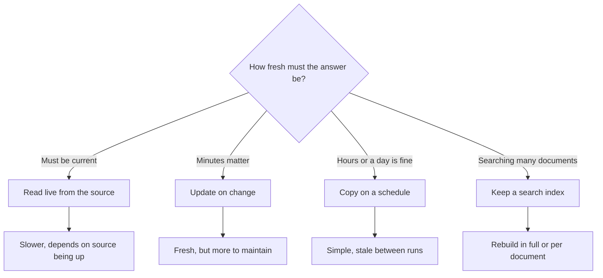

A map is only useful if the roads on it still exist. Clean, matched records go out of date too, and this page covers how to keep what an agent reads in step with the system where the information really lives.

**In one line:** keeping data fresh means making sure that what an agent reads is still true in the system where the information actually lives.

## The jargon: concepts covered on this page

- **Cache:** a short-lived copy kept to avoid asking the source again
- **Event:** a message saying something changed in a system
- **Freshness:** how closely a copy matches the current state of the source
- **Polling:** repeatedly asking a system whether anything has changed
- **Source of truth:** the system officially considered right about a fact
- **Stale data:** a copy that no longer matches its source
- **Webhook:** a message one system sends to another when something happens

## Why it matters

Information changes. A company raises money, a founder leaves, a document is replaced. The original system, such as the CRM, is updated within minutes.

The trouble starts with copies. To help an agent, data is often copied somewhere else: a search index, a spreadsheet export, a summary. Each copy is a snapshot of one moment, and it quietly drifts away from the original.

An agent cannot tell that its copy is old. It answers in the same confident tone either way, which is why stale data causes wrong answers that look right.

<mark>A copy is only as true as the last time it was updated, and an agent cannot tell how old its copy is unless you show it.</mark>

## How it works

Start with the **source of truth**: the one system that is officially right about a fact. For a company's stage, that might be the CRM. Everything else is a copy. When the copy and the source disagree, the source wins.

There are four main ways to get the source's information to an agent. They trade freshness against cost and complexity.

1. **Read live.** The agent asks the source at the moment of the question, using a [tool](/agents/tool-use/). The answer is always current. It is slower, uses the source's capacity on every question, and fails if the source is down.
2. **Copy on a schedule.** A job copies the data every night, or every hour. This is simple and fast to read. Anything that changed since the last run is missing.
3. **Update on change.** The source sends a message the moment something changes (this is called an event, and the delivery mechanism is often a **webhook**: a message one system sends to a web address when something happens). The copy is updated within seconds. It is fresher, but there are more moving parts: messages can be lost, arrive twice or arrive out of order.
4. **Rebuild a search index.** For documents, the text is split and indexed so it can be searched (see [RAG and chunking](/data/rag-and-chunking/)). That index is a copy too. It has to be refreshed when documents change, either in full on a schedule or one document at a time on change.

Many real setups mix them. Live reads for a few key facts such as stage and owner, a nightly copy for reporting, and an index for documents refreshed whenever files change.

Keeping data fresh is partly a matching problem too. When two systems hold the same company, [entity resolution](/data/entity-resolution/) tells you which record to update.

## In practice

Some habits matter more than the choice of method:

- **Decide the source of truth** for each fact, and write it down. Without it, two systems can overwrite each other.
- **Show "last updated" in answers.** If the agent says "Acme Payments is at seed stage (CRM record, updated 28 September)", a reader can judge how far to trust it.
- **Cache sensibly.** A cache is a short-lived copy kept to avoid asking the source repeatedly. Give it an expiry that fits the fact: minutes for a deal stage, days for a company description.
- **Make refreshes visible.** If a nightly job fails, someone should find out before the agent starts giving week-old answers. This is where [observability](/running/observability/) (keeping a record of what your jobs and agents actually did, covered in Part 6) helps.
- **Prefer reading live for small, important facts,** and copies for bulk search.

How an agent gets live access, and what it needs to sign in, is covered in [APIs, OAuth and API keys](/agents/apis-oauth-and-api-keys/).

## Worked example

At Bramley's, Sam's two-person bakery, the shop's till system is the source of truth for what is in stock. At 10:00 on Saturday the last sourdough loaf sells, and the till marks sourdough as sold out. At 10:30, a customer asks the bakery's online ordering assistant: "Can I collect a sourdough loaf this morning?" Here is what the assistant says under each approach.

- **Read live.** The assistant checks the till system now. It says "Sold out today". Correct, at the cost of one extra call.
- **Nightly copy.** The last copy ran at 02:00 on Saturday. The assistant says "Yes". It is wrong, it sounds sure, and the customer arrives to an empty shelf.
- **Update on change.** The till sent a message at 10:00 and the copy updated within seconds. The assistant says "Sold out". If that message had been lost, the copy would still say "In stock", and nobody would notice.
- **Search index.** Stock lives in a field, not in documents, so the index is the wrong tool. But the new opening-hours notice Sam uploaded at 10:15 will not be searchable until the next index refresh. The assistant would not mention it.

A good answer under any approach includes the time: "Sold out (till system, updated today at 10:00)". If the time shown is yesterday, the reader knows to double check.

## Costs and limits

- **Fresher costs more.** Live reads add delay and load on the source. Event-driven updates need more building and monitoring. Scheduled copies are the cheapest to run.
- **Rebuilding an index in full** on every change is wasteful for large collections. Refreshing only the changed documents is cheaper but harder to get right.
- **Sources go down or slow down.** A live read fails when the source does. Decide what the agent says then: an error is better than a guess.
- **Deletions are easy to miss.** A copy may keep a document that was deleted or restricted at the source. That is a freshness problem and a [permissions](/data/permissions-and-access-control/) problem.
- **Not everything needs to be fresh.** A company's founding year can be copied once. Chasing real-time for everything adds cost with no benefit.

The most common mistake is building a copy and forgetting that it is one. Name every copy, and note when it last ran.

## Often confused with

**Fresh vs correct.** Fresh data is current. Correct data is accurate. A record updated this morning can still be wrong, and an old record can still be right. You need both.

**Cache vs source of truth.** A cache is a convenience copy that can be thrown away and rebuilt. The source of truth is the original, which must not be lost.

## Related

- [RAG and chunking](/data/rag-and-chunking/): the search index is itself a copy that needs refreshing
- [Entity resolution](/data/entity-resolution/): deciding which record to update when systems disagree
- [What a context layer is](/data/what-a-context-layer-is/): freshness is one of its main design choices
- [Hallucination and grounding](/start/hallucination-and-grounding/): grounding in stale sources gives confident wrong answers
- [Triggers and scheduling](/building/triggers-and-scheduling/): how refresh jobs get started
- [Serverless functions](/building/serverless-functions/): a common home for small update jobs

## Next up

Current data still has to reach only the right people. [Permissions and access control](/data/permissions-and-access-control/) covers how to make sure an agent shows each person only what they are allowed to see.
