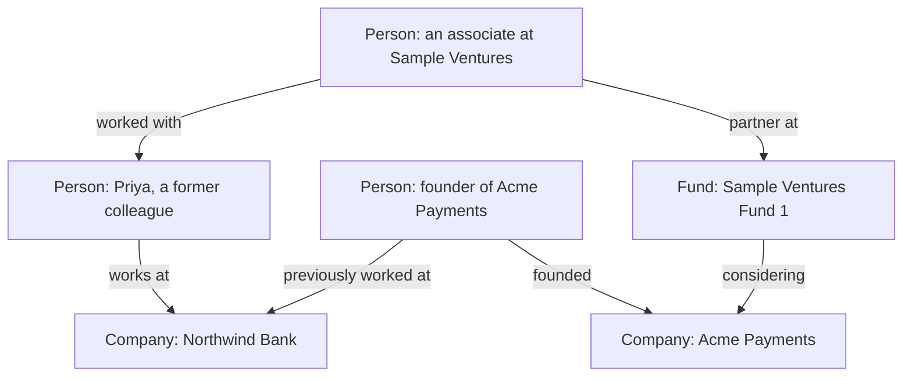

Tables answer "list all X" and retrieval answers "what did the documents say". Some questions are about how people and companies are connected, and a knowledge graph is built for those.

**In one line:** a knowledge graph stores facts as things (people, companies, funds) joined by labelled relationships (works at, founded, invested in), so you can follow the connections to answer questions like "how are these two people linked?"

## The jargon: concepts covered on this page

- **Cypher:** a query language for graph databases, used to find paths and patterns
- **Edge:** a labelled link between two nodes, such as "founded"
- **GraphRAG:** retrieval that uses a graph's links to choose which passages to fetch
- **Knowledge graph:** facts stored as nodes joined by labelled relationships
- **Node:** a thing in a graph, such as a person, company or fund
- **Ontology:** the agreed list of node types and relationship types in a graph
- **Triple:** one fact written as thing, relationship, thing

## Why it matters

Much of what a VC firm knows is about relationships. Who founded which company, who worked with whom before, who introduced whom, which fund backed what. These facts live in different places: a CRM, email, notes, a spreadsheet.

A normal table is good at "list all companies in our pipeline". It is awkward at "who do we know who knows the founder of Acme Payments?". That question means hopping from person to person, and the number of hops is not fixed.

A knowledge graph is built for exactly that kind of hopping. It also gives an agent a map of how things connect, which is useful context when it has to reason about people and companies.

<mark>A knowledge graph earns its keep when the connections between things matter as much as the things themselves.</mark>

## How it works

Think of a whiteboard covered in circles and arrows. Each circle is a thing. Each arrow is a relationship, and the arrow has a label saying what kind of relationship it is.

The proper terms are **nodes** (the circles) and **edges** (the arrows). A single fact, such as "Priya works at Northwind Bank", is one edge between two nodes. That one fact is often called a **triple**: thing, relationship, thing.

Nodes and edges can also carry details, such as a start date on "works at" or a job title. The labels and types you allow (Person, Company, Fund, "founded", "invested in") are called the **schema** or **ontology**. It is the agreed vocabulary of the graph.

Here is a tiny example from the fictional fund Sample Ventures:

To find a warm introduction, you ask the graph for a path from the associate to the founder. The answer here is: associate, worked with Priya, Priya works at Northwind Bank, the founder previously worked there. That is a path through three edges.

**How an agent uses a graph.** There are two main ways:

- **Graph queries.** Graph databases have their own query languages (Cypher is a common one) for questions like "find the shortest path between these two people". An agent can call a [tool](/agents/tool-use/) that runs a prepared query, in the same way it would for any other database (see [how LLMs talk to databases](/data/how-llms-talk-to-databases/)).
- **Graph-aware retrieval.** In this approach, often called GraphRAG, the system uses the graph to decide which passages to fetch. If a question mentions Acme Payments, it also pulls in text about the people and companies linked to it. It builds on ordinary [retrieval](/data/rag-and-chunking/).

**How the graph gets built.** Some of it comes straight from structured records, such as the CRM saying that a person belongs to a company. The rest sits in unstructured text like meeting notes and emails (see [structured vs unstructured data](/data/structured-vs-unstructured-data/)). A model can read that text and propose edges, for example "the note says Priya introduced the founder to a partner, so add an 'introduced' edge".

## In practice

Graph databases such as Neo4j are built to store and query this shape. You can also keep a graph inside an ordinary database, as a table of nodes and a table of edges. At small scale that often works fine.

A CRM already holds a simple graph: companies, people, and the links between them. Some CRMs expose relationship strength or "who knows whom" features built from email and calendar activity. A separate graph is mainly worth it when you want to combine several sources.

Model-extracted edges are suggestions, not facts. A sensible setup stores where each edge came from (which note, which date) and marks model-proposed edges as unconfirmed until a person approves them.

Keeping it current is a job in its own right. People change roles and companies get acquired, so edges need dates and a way to be updated. See [keeping data fresh](/data/keeping-data-fresh/).

## Worked example

An associate at Sample Ventures wants a warm introduction to the founder of Acme Payments, a seed-stage payments startup. They ask the firm's assistant: "Who can introduce us to the Acme Payments founder?"

1. The assistant has a tool called `find_intro_paths`. It takes two names and returns the shortest connection paths, up to three hops.
2. The model fills in the inputs: the associate's name and "Acme Payments founder". The application first resolves "the Acme Payments founder" to one specific person node (see [entity resolution](/data/entity-resolution/)).
3. The tool runs a prepared graph query and returns two paths. One goes through a former colleague who now works at a bank where the founder used to work. The other goes through a partner who co-invested with a fund the founder previously worked with.
4. The model reads both paths and writes the answer: who the connectors are, how each link is known, and when the last contact was. It notes that one link is a model-extracted edge from a meeting note, so it is worth confirming.
5. The associate picks the stronger path and asks the former colleague.

The graph found the paths. A person still decides whether the introduction is a good idea.

## Costs and limits

- **Building it takes effort.** You must decide the schema, load data from several systems and keep it all in step. That upfront work is the main cost.
- **Duplicates break it.** If "Priya Carter" and "S. Carter" are two nodes, the path between them is missing. Matching records to the same real-world thing is the hardest part, and it gets its own page: [entity resolution](/data/entity-resolution/).
- **Extracted edges can be wrong.** A model may read "met at a conference" as "worked together". Treat model-proposed edges as drafts.
- **Edges go stale.** Someone who "works at" a company last year may not now.
- **A path is not a relationship.** Two people being connected on paper says nothing about whether they would take the call.
- **It is private by nature.** A graph of who knows whom is sensitive. [Permissions](/data/permissions-and-access-control/) must apply to edges as well as nodes.

Many teams get a long way with ordinary tables and only add a graph when relationship questions dominate. If most of your questions are "show me the companies where X", tables are simpler and cheaper to run.

## Often confused with

**Database vs knowledge graph.** A database is the broad category: software that stores data and answers queries. A knowledge graph is a way of organising data, as things and labelled links, and it may live in a graph database or in ordinary tables.

| | Ordinary tables (relational database) | Knowledge graph |
| --- | --- | --- |
| Shape | Rows and columns, one table per kind of thing | Nodes and labelled edges |
| Good at | Filtering, counting, totals, "list all X where Y" | Following connections, "how is A linked to B" |
| Weak at | Questions with an unknown number of hops | Simple reports and totals |
| Schema | Fixed columns, set in advance | Flexible, new relationship types are easy to add |
| Effort | Familiar, widely supported | More upfront modelling and upkeep |

A rule of thumb: counting and listing suit tables, connecting suits a graph. For more on the options, see [types of databases](/data/types-of-databases/).

## Related

- [Entity resolution](/data/entity-resolution/): deciding that two records are the same thing, which a graph depends on
- [Types of databases](/data/types-of-databases/): where graph databases sit among the other kinds
- [RAG and chunking](/data/rag-and-chunking/): graph-aware retrieval builds on ordinary retrieval
- [What a context layer is](/data/what-a-context-layer-is/): a graph can be one part of it

## Next up

A graph falls apart if one company appears twice under different names. [Entity resolution](/data/entity-resolution/) is how software decides that different records describe the same thing.
