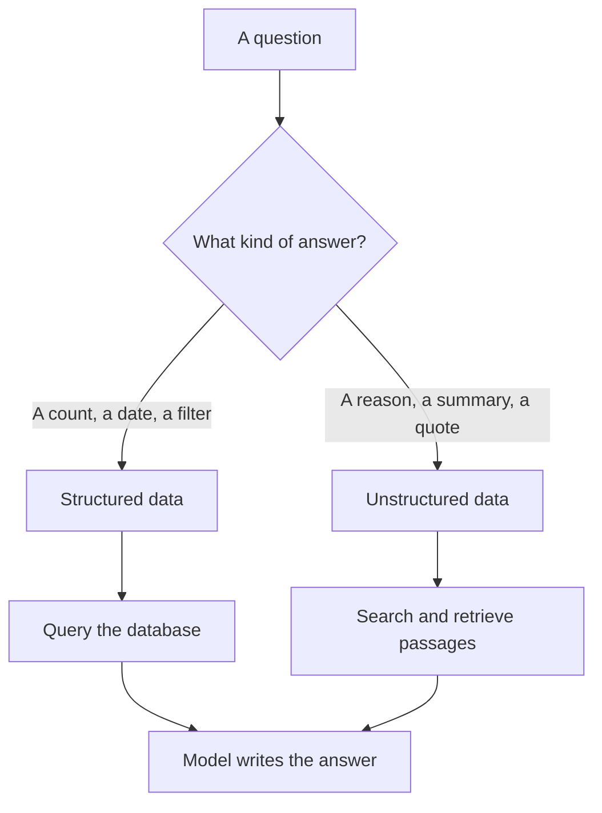

A first agent usually answers one kind of question from one data source (see [your first agent](/building/your-first-agent/)). To do more, it needs more of your data, the maps and road knowledge it drives by, and data comes in two very different shapes.

**In one line:** structured data fits into tables with fixed fields, such as a stage or an amount, while unstructured data is free-form text such as emails, documents and call notes.

## The jargon: concepts covered on this page

- **Extraction:** pulling structured fields out of free text
- **JSON:** a text format that labels each value, used to pass data between programs
- **Semi-structured data:** data with some labelled structure but loose or varying fields
- **Structured data:** data in tables with fixed fields and types
- **Unstructured data:** free-form content such as documents, emails and notes

## Why it matters

Most people picture "data" as a spreadsheet. But most of what a firm knows is not in a neat table. It is in emails, meeting notes, decks, PDFs and chat messages.

This matters for agents because the two kinds are found in different ways. Asking "how many companies are at the seed stage?" is a counting question, and a database answers it exactly. Asking "why did we pass on this company?" is a reading question, and the answer is buried in a paragraph of notes.

If you treat everything like a table, you miss most of what you know. If you treat everything like text, you lose the precision of the facts you have already tidied.

<mark>Databases are good at structured data, and models are good at unstructured data. A useful system uses each for what it is good at.</mark>

## How it works

**Structured data** has a fixed shape. Every record has the same fields, and each field holds one kind of value: a date, a number, a choice from a list. A CRM's "Stage", "Amount" and "Last contact date" fields are structured. You can sort, filter, count and add them up with no ambiguity.

**Unstructured data** has no fixed shape. A call note might be three lines or three pages, and the important point could be anywhere. Software can't count it or filter it directly, because the meaning is in the language.

**Semi-structured data** sits in between. A JSON file (a text format that labels each value, such as "name": "Acme Payments") has some structure, but the fields can vary. A spreadsheet with merged cells, notes in the margins and several tables on one sheet is similar: it looks structured, but a program can't read it reliably.

The two kinds reach an agent by different routes:

- **Structured data is queried.** The agent asks a precise question and gets an exact answer back. See [how LLMs talk to databases](/data/how-llms-talk-to-databases/).
- **Unstructured data is searched.** The system finds the passages most likely to be relevant, and the model reads them. This is [retrieval](/data/rag-and-chunking/).

There is also a bridge between the two. A model can read unstructured text and **extract** structured fields from it. Given an intro email, it can pull out the founder's name, the company, the sector and what they are asking for, and write those into CRM fields. This turns reading work into rows that can be counted later.

## In practice

Structured data usually lives in databases and in the fields of business tools such as a CRM. Unstructured data lives in file storage, email, chat and notes fields.

Real systems mix both. A CRM record has structured fields (stage, owner, date) next to free-text notes. A good [context layer](/data/what-a-context-layer-is/) (the connected setup that gathers the right information for each question, covered near the end of Part 5) uses both parts of the same record.

Extraction is useful, but it is not magic. The model can misread or invent a field, so important values need a check, or a person's confirmation, before they are saved. See [hallucination and grounding](/start/hallucination-and-grounding/).

Freshness differs too. A structured field is as current as the last person who updated it, and unstructured material is as current as its newest document. [Keeping data fresh](/data/keeping-data-fresh/) covers how to handle this.

## Worked example

Sam runs Bramley's, a two-person bakery with a shop and online orders. The online shop stores every order as a row: date, product, quantity, price, and collection or delivery.

That is **structured**: easy to filter and add up. Sam can ask how many sourdough loaves sold last month and get an exact number instantly.

But the **order notes and customer emails** tell another story. One reads: "Lovely cake, but could you do a gluten-free version? I'd order one every week for my daughter." Others ask about nut-free options or bigger loaves for parties.

Now compare two questions an agent might get:

1. "How many celebration cakes did we sell in September?" The agent queries the orders table and returns an exact count.
2. "What are customers asking for that we don't make?" The orders table can't answer this. The agent has to search the notes and emails for requests, read the matches, and report them, naming each message.

Only the second question surfaces the demand for gluten-free cakes. If Sam later adds a "Dietary request" field to the order form, the agent could extract it from the old messages once and make the question a simple filter from then on.

## Costs and limits

- **Structured data is cheap and exact to query.** Counting a field costs almost nothing, compared with reading documents.
- **Unstructured data costs more to use.** Searching, reading and summarising text takes more time and [tokens](/start/tokens-and-context-windows/), and the result is less exact.
- **Structured fields are often empty or stale.** A tidy table full of blanks is worse than it looks, because a count over blanks sounds authoritative.
- **Extraction makes mistakes.** A model may fill a field from a guess. Check it before saving.
- **Messy spreadsheets are a trap.** They look like tables but break programs that expect one clean table.

The most common mistake is trying to force all information into fields. Some knowledge, such as the reasoning behind a decision, is better kept as text and found by search.

## Often confused with

**Structured vs structured outputs.** "[Structured outputs](/building/structured-outputs/)" is a feature where a model is made to reply in a fixed format, such as a set of named fields. It is about the shape of a model's answer, not about how your data is stored. It has its own page in Part 4.

## Related

- [What a context layer is](/data/what-a-context-layer-is/): the layer has to serve both kinds of data
- [Types of databases](/data/types-of-databases/): where structured data is kept
- [RAG and chunking](/data/rag-and-chunking/): how unstructured text is searched and fed to a model
- [How LLMs talk to databases](/data/how-llms-talk-to-databases/): how structured data is queried

## Next up

Structured data has to live somewhere, and there is more than one kind of store. [Types of databases](/data/types-of-databases/) tours the main ones and the questions each suits.
