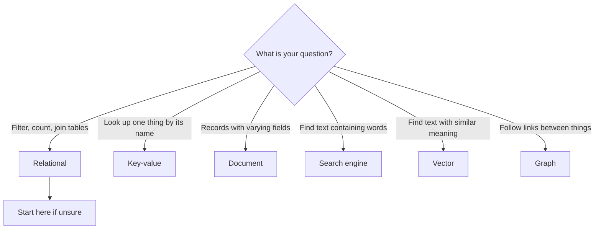

Data that fits in tables and data that lives in free text (see [structured vs unstructured data](/data/structured-vs-unstructured-data/)) need different homes. This page tours the main kinds of database and the question each one answers best.

**In one line:** a database is an organised store that software can search and update reliably, and the different types are built around different shapes of question.

## The jargon: concepts covered on this page

- **Database:** an organised store that software can search and update reliably
- **Document database:** stores flexible, self-contained records, usually as JSON
- **Graph database:** stores things and the links between them
- **Key-value store:** stores a value under a name for fast lookup
- **Relational database:** stores data in linked tables, queried with SQL
- **Search engine:** indexes words in text to find and rank matching documents
- **SQL:** a standard language for querying relational databases
- **Vector database:** stores embeddings to find items with similar meaning

## Why it matters

"Database" sounds like one thing, but there are several designs, each good at a different job. Picking the wrong one makes simple questions slow or awkward.

For an agent setup, the choice decides how information is stored, how it is found, and how safely it can be changed. Many early projects overbuild here, adding three kinds of database when one would do.

<mark>Start with the simplest thing that works, which is often one relational database, and add another type only when a real question needs it.</mark>

## How it works

Each type organises data differently. Here is the tour, using the question each one answers best.

**Relational.** Data lives in tables of rows and columns, and tables link to each other through shared ids. You query it with SQL (structured query language, a standard way to ask for data). Best for: "list the companies at seed stage with a first meeting this year". Examples: PostgreSQL, MySQL.

**Document.** Each record is a flexible, self-contained bundle of labelled data (usually JSON), and records in the same collection can have different fields. Best for: records whose shape varies or changes often. Example: MongoDB.

**Key-value.** The simplest design: you store a value under a name and fetch it by that exact name. It is very fast. Best for: "what is the saved state for this session?". Example: Redis.

**Search engine.** It indexes the words in text so it can find documents containing them and rank the best matches. Best for: "find notes that mention 'bank partner'". Examples: Elasticsearch, OpenSearch.

**Vector.** It stores [embeddings](/data/embeddings/), which are lists of numbers that capture the meaning of a piece of text, and finds items with similar meaning. Best for: "find passages about the same idea, even in different words". Examples: Pinecone, or pgvector (an add-on that gives PostgreSQL this ability).

**Graph.** It stores things and the links between them as first-class data. Best for: "who knows whom, and through which companies?". Example: Neo4j. See [knowledge graphs](/data/knowledge-graphs/).

Two clarifications help. First, **a spreadsheet is not a database.** It has no rules that stop a text entry going into a date column, and it handles many simultaneous users badly. Second, **a CRM is a database with an application on top.** The application gives you screens, buttons and permissions, while the data underneath sits in a database you usually can't reach directly, only through the CRM's API (a defined way for software to talk to it).

## In practice

The categories overlap more than the list suggests. Many relational databases can also store flexible JSON documents, and some can add vector search, which is why one general-purpose relational database can cover a lot.

Most small teams use only a few of these directly. The CRM already is a database. The file storage already has a search function. What you might add is one relational database for tidy facts the agents need.

Where the data lives matters for the [context layer](/data/what-a-context-layer-is/) (the connected setup that gathers the right information for each question, covered near the end of Part 5). Agents ask questions of these stores through [tools](/agents/tool-use/), often by writing queries, which is covered in [how LLMs talk to databases](/data/how-llms-talk-to-databases/).

Databases hold [structured data](/data/structured-vs-unstructured-data/) most naturally. Unstructured text can go into a search engine or vector database so that it can be found by words or meaning.

## Worked example

Sample Ventures, the fictional fund, wants to decide where each kind of information should live.

1. **Company and contact records** (stage, owner, dates, interactions): these already live in the CRM, which is a database with an application on top. They stay there as the source of truth.
2. **Pitch decks, memos and data room documents**: these stay in SharePoint. The agent searches them through a search function, and later may add a vector index so a question like "who mentioned a bank partner?" finds the right memo even if the wording differs.
3. **Facts the agents need to count and filter**, such as a cleaned table of companies with sector and funding round: one relational database, kept small and tidy.
4. **Who introduced whom**: for now, a column in the relational table. Only if the team starts asking multi-step questions about connections does a graph become worth considering.
5. **Temporary agent state**, such as "which step am I on": a simple key-value store, or even just a file.

Result: the fund adds one new database, not five. Each addition is tied to a question someone actually asks.

## Costs and limits

- **Every extra database adds upkeep.** Each one needs backups, access control and someone who understands it.
- **Copies drift.** Duplicating CRM data into another store means keeping the two in step, or one goes stale.
- **Switching later is harder than it looks.** Data shape and queries are built around the type you chose, though starting simple limits the damage.
- **Hype pulls people to the newest type.** Vector and graph databases suit particular jobs, not every job.
- **Search by meaning is approximate.** A vector search returns the closest matches, not guaranteed correct ones, so results need checking.

The most common mistake is picking a database because it sounds modern for AI, before knowing which questions it needs to answer.

## Often confused with

**Database vs spreadsheet.** A spreadsheet is a flexible grid for one person or a small group. A database enforces rules about what can be stored and handles many users and programs safely at once.

**Vector database vs search engine.** A search engine finds the words you typed. A vector database finds text with a similar meaning, even if no words match.

## Related

- [Structured vs unstructured data](/data/structured-vs-unstructured-data/): the kinds of data these databases hold
- [Embeddings](/data/embeddings/): what a vector database stores
- [Knowledge graphs](/data/knowledge-graphs/): the idea behind graph databases
- [How LLMs talk to databases](/data/how-llms-talk-to-databases/): how an agent actually queries them

## Next up

A database is no use to an agent until the model can ask it questions. [How LLMs talk to databases](/data/how-llms-talk-to-databases/) covers how a plain question becomes a query, and how to keep that safe.
