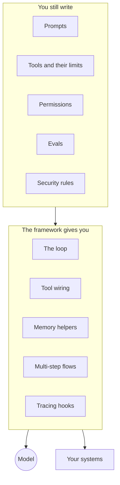

With models, data and connectors in place, something has to do the driving: ask the model, use a tool, look at the result, and go again. This layer is the ready-made software that does that, the build-or-buy side of the [agentic harness](/agents/agentic-harness/).

**In one line:** an agent framework is a ready-made library or platform that runs the agent loop and wires up tools and memory for you, so you write only the parts that are specific to your firm.

## Why it matters

Building an agent from nothing means writing the [agent loop](/agents/the-agent-loop/): send the task to the model, read its request for a tool, run the tool, feed back the result, and repeat until done. Then you add retries, limits, logging, memory and a way to ask a person for approval. None of that is hard, but it adds up, and it is the same work for everyone.

A framework supplies that shared machinery. It is, in effect, a pre-built [agentic harness](/agents/agentic-harness/). You get a working agent sooner, and you inherit years of fixes from other people's mistakes.

The risk is that a framework also makes choices for you, and some of them are hard to undo later. Which framework you pick matters less than knowing what it does for you and what it leaves to you.

<mark>A framework gives you the loop, not the judgement: prompts, permissions, tests and security stay yours however you build.</mark>

## How it works

Think of a framework as a kitchen with the appliances already installed. You still decide the menu, buy the ingredients and taste the food. What you skip is wiring the oven.

Most frameworks provide some mix of these:

- **The loop.** The decide, act, observe cycle, with a cap on rounds so a stuck agent stops.
- **Tool wiring.** A neat way to describe a function or an [MCP](/agents/mcp/) server so the model can call it (see [tool use](/agents/tool-use/)).
- **Memory helpers.** Ways to keep a conversation or notes between runs (see [memory](/agents/memory/)).
- **Multi-step flows.** Ways to chain steps, branch, or pass work between several agents (see [subagents and multi-agent systems](/agents/subagents-and-multi-agent-systems/)).
- **Approval hooks.** Places to pause for a person (see [human in the loop](/agents/human-in-the-loop/)).
- **Tracing hooks.** A record of every step, which feeds [observability](/running/observability/).

What you still own, whatever you pick:

- **Prompts and instructions.** What the agent is for and how it should behave.
- **The tools themselves.** What they do, and what they are allowed to touch.
- **Permissions and credentials.** Which accounts the agent uses (see [least privilege](/running/least-privilege/)).
- **Evals.** Tests that show whether the agent is actually right (see [evals](/running/evals/)).
- **Security.** Defences against [prompt injection](/running/prompt-injection/) and data leaving through tools.

Frameworks fall into four rough groups, and the edges blur.

- **Lab-provided agent SDKs.** Built by the companies that make the models. They are usually small and close to the model's own features.
- **Open-source orchestration frameworks.** Built by independent teams or large vendors, aimed at many models and many use cases. They tend to offer more building blocks, and more to learn.
- **No-code and low-code agent builders.** Visual tools where you assemble an agent by dragging boxes. Quick to start, and limited when you need unusual behaviour.
- **Ready-made agent products.** Finished agents you configure rather than build, such as a research assistant or a meeting-notes agent. Least control, least work.

## Example providers (snapshot, as of October 2026)

This section describes things that change. Names, status and licences in this area move quickly, and some products have been renamed or merged. Each entry below was checked against the project's own documentation or repository in October 2026. Check again before choosing.

| Group | Examples | Known for |
| --- | --- | --- |
| Lab-provided SDK | Claude Agent SDK (Python, TypeScript) | Gives you the same loop, built-in tools, permissions and subagents that power Claude Code, as a library |
| Lab-provided SDK | OpenAI Agents SDK (Python, and a separate TypeScript version) | A small set of ideas: agents, handoffs to other agents, guardrails, and tracing; its docs describe support for other model providers too |
| Lab-provided SDK | Google Agent Development Kit (ADK) | Open source, available in several languages, works with Gemini and can be used with other models |
| Open-source framework | LangChain and LangGraph | LangGraph runs long-lived, stateful agents with saved progress and human review points; it can be used without LangChain |
| Open-source framework | LlamaIndex | Strong on connecting your documents and data to models, with agents and workflows added |
| Open-source framework | CrewAI | Teams of agents (crews) steered by structured flows |
| Vendor framework | Microsoft Agent Framework | The successor to Microsoft's AutoGen and Semantic Kernel; .NET and Python are generally available, Go is in preview |
| No-code builder | Microsoft Copilot Studio | A graphical, low-code studio for building agents and workflows connected to your organisation's systems; many automation platforms also add AI agent steps |

Churn is part of the picture. OpenAI's own documentation marks its visual Agent Builder as deprecated, with a shutdown date announced for 30 November 2026, and points people to the Agents SDK instead. That is one example of why a page like this is a snapshot.

Lab SDKs are built around their maker's models first. Some support other providers, and some do not, so check before you assume you can swap models later.

## Choosing between them

Start with the simplest thing that works. For a small team, that is often an orchestration tool with an AI step (see [orchestration tools](/building/orchestration-tools/)), or a lab SDK if you have someone who can write a little code. Reach for a heavier framework only when you can name the need it solves.

Questions to ask:

- **Who writes the code?** If nobody on the team codes, a no-code builder or an orchestration tool is the realistic path.
- **How many models will you use?** A lab SDK fits one provider well. A broader framework suits switching models, at the price of more abstraction.
- **Do you need the agent to survive crashes or run for days?** Then saved progress and resumable steps matter, and frameworks built for that earn their keep.
- **How readable is it when something goes wrong?** Heavy layering can hide what the model was actually sent. Prefer tools that show you.
- **How locked in will you be?** Your prompts and tools usually move easily. Your flows, memory format and tracing setup often do not.
- **Who looks after updates?** Fast-moving libraries break things between versions. Someone needs to own that.

Be cautious about multi-agent designs early on. More agents mean more cost, more places to fail and more to test. One agent with good tools usually comes first.

## Worked example

Sample Ventures, the fictional fund, wants an agent that prepares a one-page brief before each partner meeting with a founder from Acme Payments. The operations lead considers three paths.

1. **Orchestration tool with an AI step.** The calendar event triggers a flow, the CRM and SharePoint are read, a model drafts the brief, and an associate approves it. No code, running in a day.
2. **A lab SDK.** A developer writes about a hundred lines. The agent decides which sources to search and how deep to go. More flexible, and the team must now host it and read its logs.
3. **A large framework with several agents.** One agent researches, one writes, one checks. It sounds impressive, and costs more, takes longer to build and is harder to test.

She starts with path one. After a month, the associates ask for deeper research on certain founders. That is a real need, so she moves only that step to a lab SDK, and keeps the rest in the flow. The prompts and the list of approved sources carry over unchanged.

## Costs and limits

- **The framework is usually free; the model calls are not.** Agents that loop many times, or use several agents, spend more tokens (see [how AI pricing works](/running/how-api-pricing-works/)).
- **Fast-changing code.** Versions change, features are renamed, and old tutorials stop working. Budget time for upgrades.
- **Hidden behaviour.** A framework may add its own instructions or retry rules that you did not write. Read what actually gets sent to the model.
- **Lock-in.** The more of your logic lives in a framework's special objects, the harder it is to leave.
- **Fewer safeguards than you expect.** Frameworks give you approval and guardrail hooks, but they do not decide your policies for you.
- **No framework replaces testing.** An agent that works in a demo can still fail on real files. Build evals early.

## Related

- [The agent loop](/agents/the-agent-loop/): the cycle every framework implements
- [Agentic harness](/agents/agentic-harness/): the wider set of parts a framework gives you a head start on
- [Subagents and multi-agent systems](/agents/subagents-and-multi-agent-systems/): when splitting work across agents helps, and when it does not
- [Orchestration tools](/building/orchestration-tools/): the lighter alternative for fixed workflows
- [Evals](/running/evals/): the tests no framework supplies for you

## The proper terms

- **Agent framework:** a library or platform that supplies the agent loop and common parts
- **SDK (software development kit):** a code package for building with a particular service
- **Orchestration:** coordinating steps, tools or agents so work happens in the right order
- **Handoff:** passing a task from one agent to another
- **Guardrail:** a check on an agent's input or output that can block it
- **Tracing:** recording each step an agent takes so you can inspect it later
- **Durable execution:** saving progress so a long job can resume after a failure
- **No-code builder:** a visual tool for assembling agents without writing code

## Next up

Every connection a framework makes needs a key that proves it is allowed in. [Auth and secrets](/map/auth-and-secrets/) covers who gets which keys and where they are kept.
