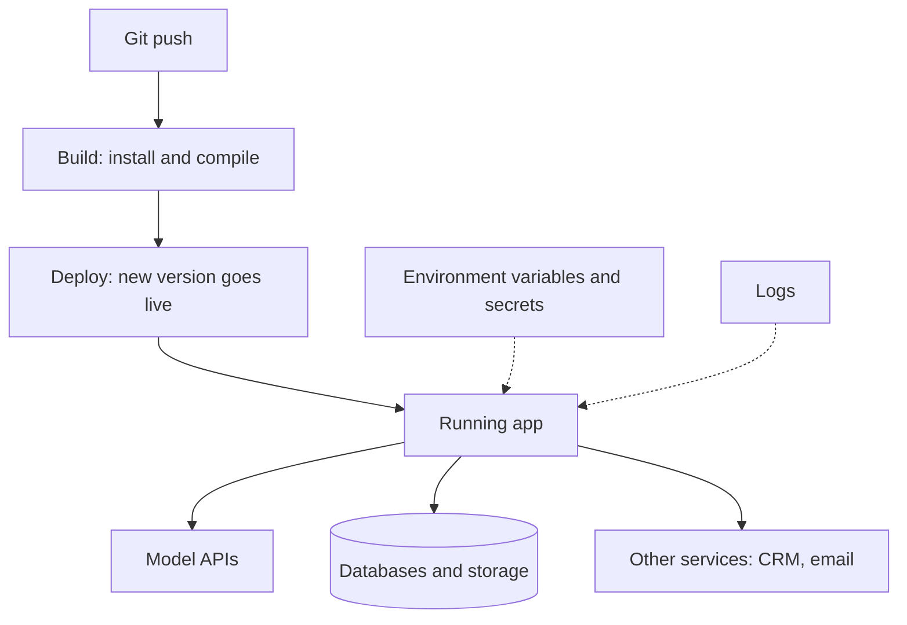

With the models covered, the map moves to your own code: the glue that receives a request, calls a model and returns a result. This layer is where that code runs, and it is the practical home of [serverless functions](/building/serverless-functions/) and scheduled jobs.

**In one line:** app hosting is the layer that keeps your own code running on someone else's computers, so a website, an API or a scheduled agent job works without you leaving a laptop switched on.

## Why it matters

Once you move past chatting with a model and start building your own tools, your code needs a home. A script on your laptop stops when the laptop sleeps. It cannot receive a message from the CRM at 3am, and nobody else can use it.

App hosting answers the question "where does my code run, and who looks after the machine?" Without it, every small tool becomes a project in server maintenance, with updates, security patches, restarts and logs all on your plate.

<mark>The hosting platform is where your keys, your logs and your running code all sit together, so pick it for its access controls and time limits as much as for how easy it is to use.</mark>

It also decides several things that matter to a firm: where your secrets are kept, how long a job can run, who can see the logs, and which country the code runs in.

## How it works

Hosting platforms turn a repeating chore into a routine. You keep your code in a git repository (a versioned folder of code, usually on GitHub or similar). When you push a change, the platform builds it, deploys it, and swaps the new version in for the old one.

Your app does not hold the intelligence. It is the glue: it receives a request, calls a model, reads or writes data, and returns a result. The model providers and databases sit elsewhere (see [model access platforms](/map/model-access-platforms/) and [databases and storage](/map/databases-and-storage/)).

There are four shapes of workload, and platforms differ in which ones they suit:

- **Static sites and front ends.** Files that do not change per visitor, such as a documentation site or a dashboard's pages. They are the simplest to host and often very cheap. This guide is a static site.
- **Back-end services.** Code that stays running and answers requests, such as an API that an assistant calls. Often packaged in a container (a sealed bundle of code plus everything it needs to run).
- **Serverless functions.** Small pieces of code that start when called and stop when done. You do not manage any machine. See [serverless functions](/building/serverless-functions/).
- **Scheduled jobs and workers.** Code that runs on a timer or picks tasks off a queue, such as "check for new filings every morning". See [triggers and scheduling](/building/triggers-and-scheduling/).

Agent work stretches these. An [agent loop](/agents/the-agent-loop/) may call a model many times and wait on slow tools, so it can run for minutes. That is longer than some serverless limits allow, which is why time limits are a first-order question for agents.

## Example providers (snapshot, as of October 2026)

This section describes things that change often. Check each provider's current documentation. The categories also blur: front-end platforms now run back-end code, and app platforms now host static sites.

**Front-end and edge platforms.** Built around deploying a website from git, with serverless functions alongside.

- **Vercel.** Deploys from GitHub, GitLab, Bitbucket and Azure DevOps. Each pushed change gets a preview deployment, and a chosen one is promoted to production. Function maximum durations depend on plan and are set per function. This guide is hosted on Vercel.
- **Netlify.** Static hosting plus serverless functions, including background and scheduled functions.
- **Cloudflare.** Runs code (Workers) on its global network, and can serve static files as part of a Worker. Its limits are described in terms of CPU time rather than only elapsed time, which suits code that mostly waits on other services.

**App platforms for services and containers.** Better when you need something running all the time.

- **Render.** Web services, static sites, background workers, cron jobs and managed Postgres.
- **Railway.** Deploys from a code repository or a container image and builds the container for you.
- **Fly.io.** Runs your app on small virtual machines (called Machines) that you can place in several regions, with volumes for stored files.
- **Google Cloud Run.** Runs containers or source code as services (answering requests) or jobs (batch work that finishes and stops).
- **Azure App Service.** Microsoft's managed platform for web apps and APIs in .NET, Java, Node.js, Python and PHP, or custom containers.
- **AWS options.** AWS Lambda runs serverless functions, with a documented maximum of 15 minutes per invocation. Amazon ECS runs containers, and AWS Fargate lets ECS run them without you managing servers.

**Self-managed servers.** You rent a virtual machine (from any cloud or hosting company) or use your own, and install and update everything yourself. Most control, most work.

## Choosing between them

- **What shape is the workload?** A website and a few short functions suit a front-end platform. A long-running agent worker suits an app platform or a container service.
- **How long can a job run?** Check the maximum duration for your plan, and what happens at the limit (the job is cut off). For long agent runs, look for background workers, queues or jobs rather than a request-bound function.
- **Does it deploy from git?** You want a push to deploy, with a preview first and an easy way back to the previous version.
- **Where do secrets go?** The platform should store [environment variables and secrets](/building/environment-variables-and-secrets/) separately from code, and let you set them per environment (preview versus production).
- **Logs.** Can you see what a failed run did, for how long are logs kept, and who can read them? Logs may contain personal data.
- **Who can reach the dashboard?** Whoever can edit settings can often read secrets or redeploy code. Use single sign-on and multi-factor sign-in where offered, and keep the admin list short.
- **Region and data location.** Choose a region close to your data and inside the jurisdiction you need. Some platforms let you pick; some default to the US.
- **Custom domains and access.** Check you can put the app on your own domain, and restrict who can open it (a sign-in, an IP allow list).
- **Lock-in.** Plain containers move easily between platforms. Platform-specific function formats and storage features are harder to move.
- **Big-cloud fit.** A firm already on Microsoft 365 may find Azure's sign-in and billing easiest. That is a convenience, not a quality ranking.

## Worked example

Sample Ventures wants a small internal assistant that answers questions about the pipeline in a team chat channel. The operations lead and an associate build it.

1. **Code in git.** The code lives in a private repository. Only the two of them can merge changes.
2. **Choose a host.** The answering part is short, so it runs as a serverless function on a front-end platform. A nightly job that refreshes the search index can run for twenty minutes, so it goes on a container platform as a scheduled job.
3. **Secrets.** The model key and the CRM key are added as environment variables in the host's dashboard, never in the code. Preview deployments use a test CRM account with read-only access.
4. **Deploy.** A push to a branch creates a preview link. The associate tests it, the operations lead approves, and the merge publishes to production.
5. **Watch.** Logs show each run. The operations lead sets an alert for failed nightly jobs and checks who has dashboard access every quarter.
6. **Region.** The function and the database are both placed in a UK or EU region, to keep data close and to keep the data-protection answer simple.

## Costs and limits

- **Static hosting is the cheapest tier**, and often fits within a free allowance for small sites.
- **Always-on services cost more than functions** because you pay for the machine even when nobody calls it. Functions cost more per use when traffic is heavy.
- **Time limits cut off agent runs.** A function that hits its maximum duration stops mid-task. Split long work into steps, or move it to a job or worker.
- **Cold starts.** A function that has not run recently may take extra moments to wake. Fine for background work, noticeable in a live chat.
- **Preview environments can leak.** If a preview points at the real database or real keys, a test can change real data. Keep test and live separate.
- **Platform changes.** Limits, plans and features move often. The most common mistake is building around a limit you read once and never rechecked.

## Related

- [Serverless functions](/building/serverless-functions/): code that runs only when called
- [Environment variables and secrets](/building/environment-variables-and-secrets/): how to keep keys out of your code
- [Triggers and scheduling](/building/triggers-and-scheduling/): starting jobs on a timer or an event
- [Auth and secrets](/map/auth-and-secrets/): the wider layer for sign-ins and key storage
- [Compute and cloud](/map/compute-and-cloud/): the machines underneath these platforms

## The proper terms

- **App hosting:** a service that runs your code on its computers and keeps it available
- **Deployment:** one built version of your app, put live on a host
- **Preview deployment:** a temporary live copy of a change, for testing before it goes public
- **Container:** a sealed bundle of code and everything it needs to run
- **Serverless:** running code without managing the machine; the platform starts it when called
- **Cold start:** the extra delay when idle code has to wake up
- **Region:** the geographic location of the data centres where your app runs
- **Custom domain:** your own web address pointing at a hosted app

## Next up

Your code reads and writes data, and that data needs a home of its own. [Databases and storage](/map/databases-and-storage/) covers where it sits.
