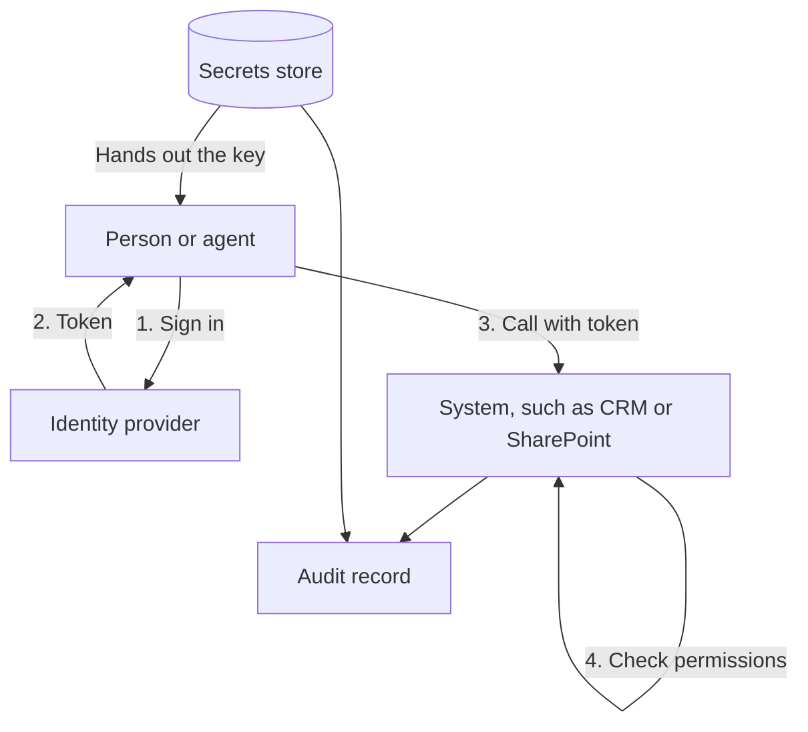

**In one line:** this layer decides who or what is allowed into each system, and keeps the keys and sign-ins that prove it somewhere safe, instead of scattered through files and chats.

## Why it matters

Every connection an agent makes needs a way to say "it's me, and I'm allowed". That proof is a password, a key or a token. If it leaks, whoever holds it can act as the agent. If it is too powerful, a mistake or an attack does more damage.

Two words get mixed up here. **Authentication** (auth for short) is proving who you are. **Authorisation** is what you are then allowed to do. A good setup keeps both tight, and records what happened.

The common failure is convenience. Someone pastes their own login or an API key into a script so the demo works. Months later it still runs, nobody remembers where the key is, and it has the same access as a senior partner.

<mark>Give an agent its own identity with the smallest access that works, never a person's login, so you can limit it, trace it and switch it off without touching anyone's account.</mark>

## How it works

Think of a hotel. Reception checks who you are (identity), then gives you a key card (token) that opens only your room and the gym (permissions). The card stops working on checkout. The master keys sit in a safe behind reception (the secrets store), and a log records which doors opened.

The pieces:

- **Identity provider (IdP).** The service that holds your accounts and checks who someone is. It also provides **single sign-on (SSO)**: one login that works across many apps.
- **Token.** A short-lived pass the identity provider issues after a successful sign-in. The agent shows the token to a system instead of a password.
- **OAuth.** The standard way a person approves an app to act for them, and the app receives a limited token (see [APIs, OAuth and API keys](/concepts/data/apis-oauth-and-api-keys/)).
- **API key.** A long string that works like a password for software. Simple, but it often grants wide access and does not expire on its own.
- **Service account.** A non-human account for software. It has its own name, its own permissions and its own log trail.
- **Secrets store.** A locked place for keys and passwords, which hands them to software only when needed (see [environment variables and secrets](/concepts/running-things/environment-variables-and-secrets/)).
- **Permissions.** The rules about what each identity may read or change (see [permissions and access control](/concepts/data/permissions-and-access-control/)).
- **Audit record.** A log of who did what and when (see [audit trails](/concepts/security/audit-trails/)).

**Why an agent needs its own identity.** If an agent borrows a partner's login, every action it takes looks like the partner did it. You cannot give it less access than the partner has, you cannot turn it off without locking the partner out, and if the partner leaves, the agent breaks. A separate identity fixes all of that, and is the practical form of [least privilege](/concepts/security/least-privilege/).

Some agents should act as the person asking, for example when an associate asks an assistant to find files. In that case the agent uses **delegated** access and sees only what that associate can see. Background jobs, such as a nightly sync, use **app-only** access with their own identity. Choose per job, and prefer delegated access where a person is present.

**Microsoft 365, conceptually.** Microsoft's identity service is called Microsoft Entra ID. To let your own software reach Microsoft 365 data through Microsoft Graph, you create an **app registration** in Entra. This tells Microsoft that a particular application exists and gives it an identifier. The app is then given **permissions**, such as "read files" or "read mail".

There are two kinds. **Delegated permissions** let the app act as a signed-in person, limited to what that person can access. **Application permissions** let the app act on its own, with no person signed in, and can reach anything the permission covers. Application permissions can only be approved by an administrator.

That approval is called **admin consent**: a privileged administrator says yes on behalf of the whole organisation. Microsoft's documentation says high-impact permissions need it, and an organisation can also set things so that ordinary users cannot approve apps at all. So an administrator must be involved before any broad access is granted. Microsoft also offers narrower options for SharePoint, such as permissions limited to selected sites rather than all of them. Ask for the narrow option.

The app registration has credentials of its own, such as a client secret or a certificate. These are exactly the kind of thing that belongs in a secrets store, not in a document.

## Example providers (snapshot, as of October 2026)

This section describes things that change. Each entry was checked against the vendor's own documentation in October 2026.

| Job | Examples | Known for |
| --- | --- | --- |
| Identity provider and SSO | Microsoft Entra ID | Microsoft's cloud identity service; included with Microsoft 365, and also used for Azure and other apps |
| Identity provider and SSO | Okta | A dedicated identity vendor covering workforce sign-in and, through Auth0, customer sign-in |
| Identity provider and sign-in | Google | Google accounts can sign people in using OpenID Connect, a layer on top of OAuth |
| Cloud secrets stores | Azure Key Vault, AWS Secrets Manager, Google Cloud Secret Manager | Store keys, tokens and certificates inside a cloud account, with access controlled by that cloud's own permissions; AWS and Google both describe automatic rotation |
| Team password vault with automation access | 1Password (service accounts) | Non-personal accounts, so scripts and automations can fetch secrets without tying them to a person |
| Identity for cloud workloads | Azure managed identities | Lets software running in Azure authenticate without any stored secret |

Agents are now a recognised kind of identity. Both Microsoft and Okta describe covering AI agents in their identity products. Expect this area to keep changing, and check current documentation.

## Choosing between them

- **Where do your accounts already live?** A Microsoft 365 firm already has Entra ID. Adding another identity provider is rarely worth it for a small team.
- **Where does your software run?** Secrets stores are tied to clouds. Pick the one where your agent runs, so access can be granted without another key.
- **Can you avoid a stored secret altogether?** Managed identities and short-lived tokens beat long-lived keys.
- **Who can approve access?** Know which person is your administrator, and agree a routine for requests.
- **Can you rotate and revoke?** Keys will leak sooner or later. Make changing one a ten-minute job.
- **Who can read the secrets?** Treat the people with access to the store as having the access of everything inside it.
- **Lock-in.** Identity is the hardest layer to move later, because every connected app depends on it. Secrets stores move more easily, though the code that fetches from them needs changing.

## Worked example

Sample Ventures, the fictional fund, wants an agent that reads the data room folders in SharePoint and writes notes to the CRM.

1. **Ask the administrator.** The operations lead asks the firm's Microsoft 365 administrator to create an app registration for the agent, named clearly so it is recognisable in logs.
2. **Narrow the permission.** Rather than read access to every site, she asks for access to the one data room site only. The administrator grants it through admin consent and notes the date.
3. **Separate CRM account.** The CRM gets a dedicated account for the agent. It can create notes and people but not delete anything.
4. **Store the keys.** The app's secret and the CRM key go in the cloud secrets store where the agent runs, not in the automation tool's notes field. The agent fetches them at start-up.
5. **Test and watch.** An associate asks about Acme Payments. The agent finds the folder and writes a note. The operations lead checks the logs and sees both actions under the agent's own name.
6. **Rotate.** Every quarter she replaces the secrets. If the agent ever misbehaves, she disables its identity, and nobody's personal account is touched.

## Costs and limits

- **Mostly cheap, mostly effort.** Identity is usually bundled with the productivity suite. Secrets stores are cheap compared with the cost of a leak. The real cost is the discipline to use them.
- **Admin dependence.** Broad access needs an administrator, which slows things down. That friction is a feature.
- **Secrets sprawl.** Keys copied into chats, notes, code and automation tools are the usual cause of leaks. Search for them occasionally.
- **Expiry surprises.** Secrets and tokens expire. Without a reminder, a working agent stops on a Monday morning.
- **Shared admin accounts.** One account used by everyone makes the audit record meaningless.
- **Tools sign in on your behalf.** Automation platforms and chat assistants store sign-ins. Whoever can edit a flow can often use them. See [orchestration tools](/concepts/running-things/orchestration-tools/).
- **Permissions do not stop bad instructions.** A well-scoped agent can still be tricked within its scope (see [prompt injection](/concepts/security/prompt-injection/)). Narrow access limits the damage.

## Related

- [APIs, OAuth and API keys](/concepts/data/apis-oauth-and-api-keys/): how sign-in and keys work underneath
- [Environment variables and secrets](/concepts/running-things/environment-variables-and-secrets/): how a running program receives its keys
- [Permissions and access control](/concepts/data/permissions-and-access-control/): deciding what each identity may do
- [Least privilege](/concepts/security/least-privilege/): the rule that shapes every choice on this page
- [Audit trails](/concepts/security/audit-trails/): the record that makes separate identities worth having

## The proper terms

- **Authentication:** proving who you are to a system
- **Authorisation:** deciding what an authenticated identity may do
- **Identity provider:** the service that holds accounts and verifies sign-ins
- **Single sign-on (SSO):** one login that works across many applications
- **Token:** a short-lived pass issued after sign-in
- **Service account:** a non-human account used by software
- **App registration:** a record telling an identity provider that an application exists
- **Admin consent:** an administrator approving an app's permissions for the whole organisation
- **Delegated permission:** access that lets an app act as a signed-in person
- **Application permission:** access that lets an app act on its own, without a person
- **Secrets store:** a protected service that holds keys and passwords and hands them out on request
- **Rotation:** replacing a key or secret with a new one on a regular basis
