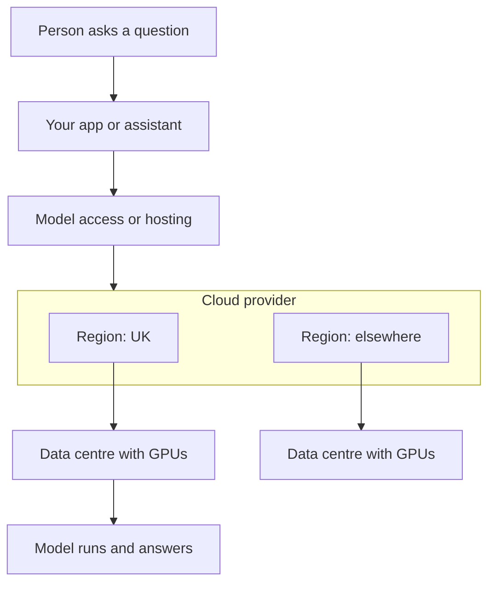

The map starts at the bottom of the stack, the ground every road is built on. Before any model or agent can run, a chip in a data centre has to do the work.

**In one line:** compute and cloud is the bottom layer of AI: the specialised chips and data centres that do the actual calculating, rented by the hour from a handful of large providers.

## Why it matters

Every other layer on this map sits on top of this one. When an agent answers a question, a chip somewhere in a data centre does the arithmetic, and the question and your data travel there and back.

A small firm almost never touches this layer directly. You rent model access and hosting from the layers above, and they deal with the hardware. But this layer still decides two things you care about: where your data is physically processed, and which country's laws can reach the company that holds it.

<mark>You rarely choose chips or data centres yourself, but you inherit the choices made here: where your data is processed and who can be compelled to hand it over.</mark>

Without understanding it, the questions a client or regulator may ask ("where does our data go?") sound like jargon. With it, they become a short checklist.

## How it works

**Why AI needs special chips.** A normal computer chip (a CPU) is built to do many different jobs one after another, very quickly. An AI model, though, is mostly one job repeated billions of times: multiplying large grids of numbers. A **GPU** (graphics processing unit) was designed to draw images by doing thousands of simple calculations at once, and that turns out to suit AI too. Think of a CPU as a few expert chefs and a GPU as a huge kitchen of cooks who each chop one vegetable at the same moment.

Chips built only for AI maths are called **accelerators**. Some are GPUs, and some are custom designs, such as Google's TPUs (tensor processing units) and Amazon's Trainium chips. They all do the same broad job: run the heavy number-crunching faster and for less energy than a general chip could.

**Two jobs, one kind of chip.** Building a model (training) needs thousands of these chips working together for weeks. Using a model to answer a question is called [inference](/concepts/how-models-work/inference/), and needs far less per question, but it happens millions of times. A small firm only ever pays, directly or indirectly, for inference.

**What "the cloud" means.** The cloud is other people's computers, rented by the hour over the internet. Instead of buying a server, you ask a provider for some computing power and pay for the time you use. The provider owns the data centres, the power, the cooling and the chips.

**Regions.** Cloud providers group their data centres into **regions**, each in a named area such as London, Frankfurt or Virginia. When you create something in the cloud, you pick a region, and your data is normally stored there. Within a region there are usually several separate buildings (often called availability zones), so one fire or power cut does not take everything down.

A region is where data is *stored*. Where it is *processed* can differ. Some model services route requests to other regions to find spare capacity, unless you choose a setting that keeps them inside a geographic area. Check this for any service that handles personal or confidential data.

**Whose law applies.** Where the data sits is one question. Which company holds it is another. A cloud provider is a company, and it is subject to the laws of the country where it is based. For example, US law (the CLOUD Act of 2018) lets US authorities require US-based providers to hand over data they control, even if it is stored abroad. Providers can challenge requests, and the UK and US have a separate agreement covering some cross-border requests. This is a normal factor in vendor assessment, not a reason for alarm. It is the reason a data processing agreement and a choice of region both matter (see [GDPR, data retention and DPAs](/concepts/security/gdpr-data-retention-and-dpas/)).

## Example providers (snapshot, as of October 2026)

This section names real companies and will date. Check each provider's own pages before deciding.

| Kind | Examples | Known for |
| --- | --- | --- |
| Large general clouds | Amazon Web Services (AWS), Google Cloud, Microsoft Azure | Hundreds of services beyond AI, regions worldwide, including the UK and Europe |
| Specialist GPU clouds | CoreWeave, Lambda | Rent GPUs and clusters built for AI work; CoreWeave describes itself as an AI cloud, Lambda as a GPU cloud |
| Chip makers | NVIDIA (GPUs), AMD (GPUs), Google (TPUs, offered only through Google Cloud), Amazon (Trainium, offered through AWS) | Make or design the accelerators the clouds install |

Chip makers are a footnote for a small firm: you do not buy from them, you rent chips through a cloud. The categories also blur. The big clouds build their own chips, GPU specialists now offer storage and software, and several AI labs rent capacity from more than one provider. The market is changing quickly, so treat this table as a starting map, not a shortlist.

## Choosing between them

For most small firms the real decision is not "which cloud?" but "which clouds do my other choices already put me in?". If the firm uses Microsoft 365, it already has a relationship with Azure. If a model service you want runs on AWS, you will touch AWS. Questions to ask:

- **Where is data stored and processed?** Ask for the region in writing, for storage and for model processing separately.
- **Which company and which country's law?** Know the provider's home jurisdiction and whether it offers a UK or EU region.
- **What does the contract say?** Look for a data processing agreement, how long data is kept, and whether your inputs are used to improve models.
- **How hard is it to leave?** Services that only exist at one cloud create lock-in. Plain storage and standard databases move more easily.
- **Do you need this layer at all?** Often the answer is no. Renting from the layers above means someone else manages chips and regions, and you manage the paperwork.

Specialist GPU clouds suit teams that run their own models and need raw chips. The large general clouds suit firms that want everything (storage, sign-in, models) under one contract. Neither is better in general.

## Worked example

Sample Ventures, the fictional fund, plans to let an assistant search its deal notes and draft summaries. The operations lead does not buy any chips. She makes three checks.

1. **Map the path.** She writes down where a question travels: the assistant app, a model service, and the cloud that service runs on.
2. **Ask about regions.** She asks the model service whether requests can be kept inside the UK or Europe, and whether processing stays there too. The answer goes into the firm's record of suppliers.
3. **Read the terms.** She confirms the service has a data processing agreement and does not train on the firm's inputs.

A partner later asks, "Could Acme Payments' pitch deck leave the UK?" She can answer from the record rather than guess.

## Costs and limits

- **Chips are scarce and costly.** GPUs are expensive to buy and run, which is why model access is priced as it is. You pay a share through usage charges rather than buying hardware.
- **Pay-as-you-go can surprise.** Renting GPUs directly bills by the hour, running or idle. That is fine for experiments and risky if left switched on.
- **Regions are a promise to verify.** "Stored in the UK" does not guarantee "processed in the UK", and backups or support access may sit elsewhere. Ask each question separately.
- **Capacity changes fast.** Availability, new chips and providers move quickly, and shortages can limit which models or regions you can use.
- **Concentration.** A few providers carry much of the world's AI workload, so an outage at one can affect many services at once.

## Related

- [Model access platforms](/map/model-access-platforms/): how a program reaches a model without owning any chips
- [Open-model hosting](/map/open-model-hosting/): what changes if you run a model yourself on rented chips
- [Inference](/concepts/how-models-work/inference/): the work these chips do when a model answers
- [GDPR, data retention and DPAs](/concepts/security/gdpr-data-retention-and-dpas/): the legal side of where data goes
- [App hosting](/map/app-hosting/): the next layer up, where your own software runs on the cloud

## The proper terms

- **GPU:** graphics processing unit, a chip that does many calculations at once
- **Accelerator:** a chip built to speed up AI maths
- **TPU:** tensor processing unit, Google's custom AI chip
- **Cloud:** computing power rented over the internet instead of owned
- **Region:** a named area where a cloud provider groups its data centres
- **Availability zone:** a separate data centre building or group within a region
- **Data residency:** the country or area where data is stored
- **CLOUD Act:** a US law letting authorities request data from US providers held abroad

## Next up

Nobody calls a chip directly. One layer up, [model access platforms](/map/model-access-platforms/) are the doorways your software uses to reach a model running on these chips.
