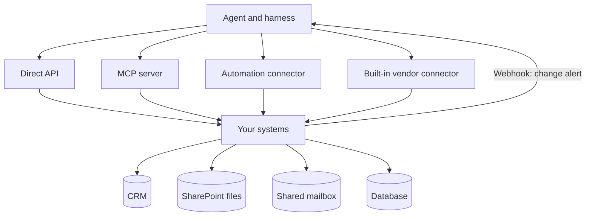

Data sits in many systems, and an agent cannot reach any of them on its own. This layer is the set of links that let it in, the practical side of [tool use](/agents/tool-use/) and [MCP](/agents/mcp/).

**In one line:** connectors and integrations are the links between an agent and the systems that hold your data, and each kind differs in who builds it, who keeps it working and what access it uses.

## The jargon: concepts covered on this page

- **Connector:** a ready-made link between an agent or tool and another system
- **Integration:** any working link between two systems, built by anyone
- **API:** a system's official interface for other software to talk to
- **Webhook:** an automatic call a system sends you when something changes
- **MCP server:** a standard wrapper that exposes a system's tools to assistants
- **Service account:** a non-human account that connects as the app, not a person
- **Delegated access:** a connection acting with the permissions of a signed-in person
- **Change notification:** Microsoft's name for webhook alerts about changed data

## Why it matters

A model on its own knows nothing about your firm. The facts live in other systems: the CRM, SharePoint, a shared mailbox, a calendar, a database. For an agent to read or change any of them, something has to connect the two.

This layer answers one question: how does the agent reach that system, and on whose authority? There are several ways, and they are not interchangeable. Pick badly and you end up with a link that breaks without warning, holds more access than it needs, or sends your data through a stranger's code.

<mark>Every connection is a door into your data, so ask who built it, who maintains it and which key it uses before you ask whether it works.</mark>

## How it works

The agent never talks to your CRM directly. It asks its [harness](/agents/agentic-harness/) to use a [tool](/agents/tool-use/), and something behind that tool does the real work. That "something" is the connection. There are six common kinds.

- **Direct API.** Your own code calls the system's API (its official interface for software) with a sign-in. Most control, most work, and you maintain it. See [APIs, OAuth and API keys](/agents/apis-oauth-and-api-keys/).
- **MCP server.** A standard wrapper in front of a system, so any assistant that speaks [MCP](/agents/mcp/) can use it. Often built by the system's vendor, sometimes by the community.
- **Automation-platform connector.** A ready-made link inside a tool such as Zapier or Power Automate. The platform maintains it and stores the sign-in. See [orchestration tools](/building/orchestration-tools/).
- **Built-in vendor connector.** A link that a product offers inside itself, such as the connectors in a chat assistant or in Microsoft 365. You click through a sign-in and the vendor looks after the rest.
- **Webhook.** The reverse direction: the system calls you when something changes, instead of you asking. Useful for keeping data fresh. See [keeping data fresh](/data/keeping-data-fresh/).
- **File and email connectors.** Links that read documents and messages, or watch a folder or mailbox. They matter because much firm knowledge sits in files and email rather than in neat database records.

Two things differ between these kinds and decide most of the risk. The first is **whose permissions it uses**. A connection signed in as a person can do what that person can do. A connection signed in as the app (a service account) can do what an administrator granted it, often more than any single person. See [permissions and access control](/data/permissions-and-access-control/).

The second is **what happens when the vendor changes something**. A direct API call breaks when the vendor retires an endpoint or changes a field, and you must fix it. A vendor-built connector is fixed for you, usually. A community MCP server is fixed when its author has time. Platforms and APIs both change on their own schedule, so every connection needs someone who notices when it stops working.

## Example providers (snapshot, as of October 2026)

This section describes things that change. Check each vendor's own documentation before relying on any detail.

| Kind | Examples | Known for |
| --- | --- | --- |
| API behind Microsoft 365 | Microsoft Graph | One endpoint for mail, calendar, Teams, OneDrive and SharePoint, with change notifications (webhooks) for many resources |
| Connectors inside a product | Claude connectors; Microsoft 365 Copilot connectors | Vendor-run links added inside the assistant, with the person signing in |
| Automation platforms | Zapier, Make, n8n, Power Automate | Large libraries of ready-made app connectors; Zapier's own site cites 9,000+ apps |
| CRMs used in venture | Affinity, Attio, DealCloud (from Intapp), HubSpot, Salesforce | Each has an API; Affinity and Attio also describe MCP support on their own sites |
| Standard for assistants | MCP | An open standard, with servers from vendors and from the community |

A few details, each taken from the vendor's own pages. Microsoft Graph is described by Microsoft as a single endpoint to data across Microsoft 365. Its change notifications use subscriptions that expire and must be renewed. Claude's connectors directory holds connectors verified by Anthropic, and custom connectors can point at a remote MCP server; on team plans an organisation owner decides which are available, and each person signs in separately. Microsoft 365 Copilot connectors (the new name for what were called Graph connectors) bring outside data into Copilot, either by indexing it into Microsoft Graph or by fetching it live over MCP.

On CRMs: Affinity describes itself as a CRM for private capital, Attio as a highly customisable CRM with a REST API, webhooks and an MCP server, and DealCloud as a configurable platform for deals and relationships. Other tools exist, and the market moves quickly. Many tools now ship their own MCP server, so the line between "API", "connector" and "MCP" is blurring.

## Choosing between them

Ask these questions about each connection, in this order.

- **Who built it?** Prefer an official connector from the system's own vendor. An unknown third-party connector is code you are trusting with your data and sign-ins, and it can become a route for data to leave (see [data exfiltration through tools](/running/data-exfiltration-through-tools/)).
- **Who maintains it, and what happens when the vendor changes something?** A vendor connector is usually updated for you. Your own API code is yours to fix.
- **Whose access does it use?** Prefer a dedicated account with the smallest access that works (see [least privilege](/running/least-privilege/)). Avoid borrowing a partner's login.
- **Read or write?** Start read-only. Add write access one action at a time, with approval for risky ones (see [human in the loop](/agents/human-in-the-loop/)).
- **Where does the data go?** Some connectors fetch live and keep nothing. Others copy data into an index or a platform's run history. That matters for [data protection rules](/running/gdpr-data-retention-and-dpas/).
- **How locked in are you?** Connections built inside one platform do not move easily. MCP servers and plain APIs travel better.

There is no single best option. A common sensible pattern for a small firm is a vendor connector or MCP server for reading, and an automation platform for the few scheduled or event-driven jobs.

## Worked example

Sample Ventures, the fictional fund, wants an assistant that can answer "where are we with Acme Payments?" across its systems. The operations lead lists what it touches.

1. **CRM.** She uses the CRM vendor's own MCP server, signed in as a dedicated read-only account.
2. **SharePoint files.** She uses the Microsoft 365 connector built into the assistant. It signs in as the person asking, so it only sees files that person can already open.
3. **Shared deals mailbox.** An automation tool watches the mailbox and logs introductions to the CRM. The mailbox runs through a webhook-style trigger, not constant checking.
4. **Database.** A small internal tool exposes two named queries. She does not connect the assistant to the whole database.

An associate asks the question. The assistant searches the CRM, looks in the data room folder, and replies with sources. A month later the CRM vendor renames a field. The vendor's MCP server is updated within days, but the automation step that wrote to the old field fails. Because failure alerts are on, the operations lead sees it the same morning.

## Costs and limits

- **Cheap to connect, costly to keep working.** Setup takes an afternoon. Maintenance is the long-term cost, because every vendor changes things.
- **Quiet breakage.** A changed field or an expired sign-in can make a connection return nothing rather than an error. Alerts and spot checks matter.
- **Over-wide access.** The easy path is a broad admin sign-in. The safe path takes longer and is worth it.
- **Rate limits.** Systems cap how often they can be called. A busy agent can hit the cap (see [rate limits, retries and failures](/running/rate-limits-retries-and-failures/)).
- **Too many tools.** Connecting everything bloats the model's context and makes wrong choices likelier.
- **Untrusted content comes through the door.** An email or document read through a connector can contain hidden instructions (see [prompt injection](/running/prompt-injection/)).

## Related

- [MCP](/agents/mcp/): the open standard behind many modern connectors
- [APIs, OAuth and API keys](/agents/apis-oauth-and-api-keys/): what sits underneath most connections
- [Orchestration tools](/building/orchestration-tools/): platforms whose connector libraries do much of the work
- [Data exfiltration through tools](/running/data-exfiltration-through-tools/): why unknown connectors are a risk
- [Auth and secrets](/map/auth-and-secrets/): where the sign-ins behind each connection are decided and stored

## Next up

Connectors give the agent its tools. [Agent frameworks](/map/agent-frameworks/) covers the software that runs the loop of calling them, so you do not have to write it from scratch.
