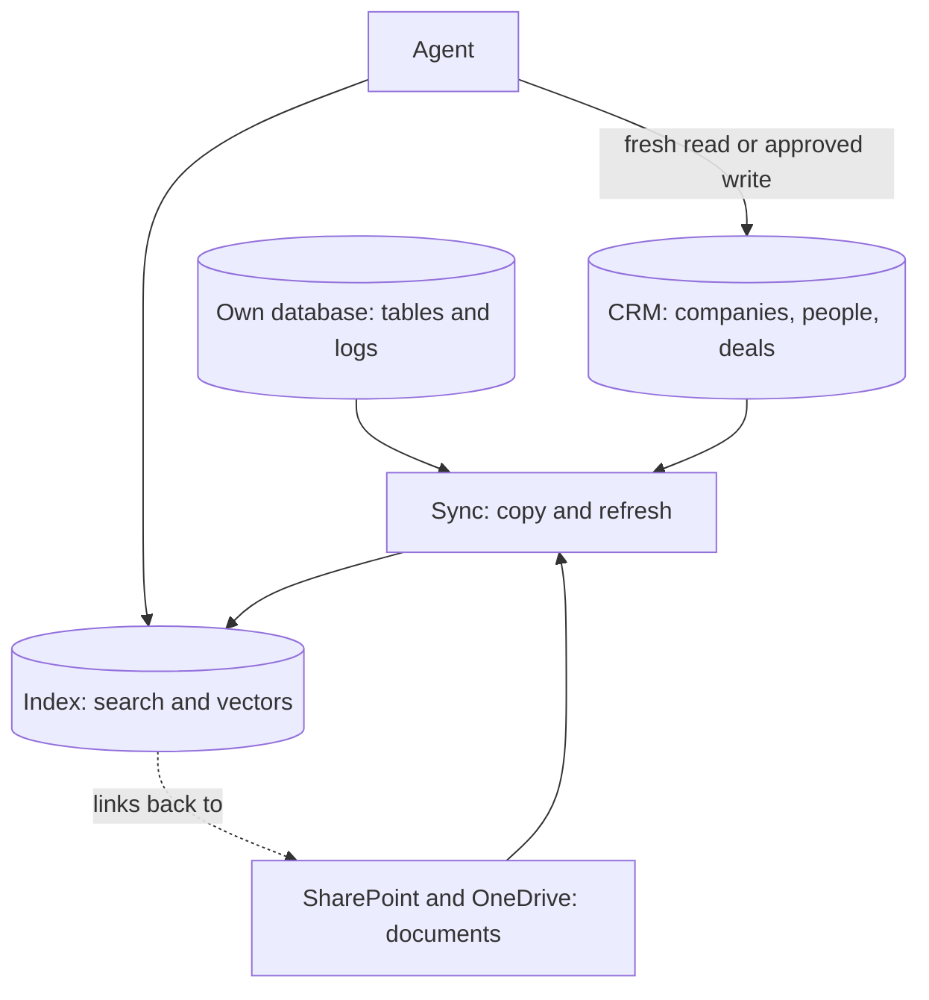

App hosting runs your code; this layer holds the data that code works with. It is the physical side of [types of databases](/data/types-of-databases/) and the context layer: the maps and road knowledge an agent finds its way by.

**In one line:** databases and storage are the places your information is kept, and the first job of any agent setup is to decide which place is the original and which are only copies built for searching.

## Why it matters

An agent is only as useful as the information it can reach. A model knows a lot about the world, but nothing about your deals, your contacts or last week's meeting notes. That information sits in systems you already own, and the question is where, and in what shape.

Data comes in different shapes, and each shape suits a different kind of store. A list of companies with fields suits a table. A pile of PDFs suits file storage. A question like "who introduced us to this founder?" follows connections, which suits a graph. See [structured vs unstructured data](/data/structured-vs-unstructured-data/) for the basic split.

Without a clear plan you end up with the same fact in four places, each slightly different, and an agent that quotes whichever copy it found first.

<mark>Keep one source of truth for each kind of fact, and treat every search index built on top of it as a disposable copy.</mark>

## How it works

Think of a library. The shelves hold the real books. The card catalogue is a faster way to find them, but it is not the books. If a catalogue card is wrong, you fix it by looking at the shelf. In data terms, the shelves are **systems of record** (the CRM, the shared drive, the finance system), and the catalogue is an **index** (a copy arranged for fast search).

The agent mostly reads from the index, because it is quick and can search by meaning. When it needs the latest value, or when it writes something, it goes back to the system of record. Keeping the copy up to date is its own job, covered in [keeping data fresh](/data/keeping-data-fresh/). The wider idea is described in [what a context layer is](/data/what-a-context-layer-is/).

The main kinds of store:

- **Relational databases.** Data in tables with rows and columns, linked by shared ids, and queried with SQL. The default choice for structured business data. See [types of databases](/data/types-of-databases/).
- **Document stores.** Each record is a flexible, JSON-like document. Handy when records vary in shape.
- **Vector databases, or vector features inside ordinary databases.** They store embeddings (lists of numbers that represent meaning) and find the closest matches. This is the engine behind [RAG](/data/rag-and-chunking/). Many ordinary databases now offer this as an add-on, so a separate vector database is often optional.
- **Graph databases.** Store things and the links between them, such as person, company, investor. See [knowledge graphs](/data/knowledge-graphs/).
- **File and object storage.** Whole files in folders or buckets: PDFs, decks, spreadsheets, recordings. Not queryable like a table, but ideal for documents.

## Example providers (snapshot, as of October 2026)

Names and features here change, and the lines between categories are blurring: databases are adding vector search, and file stores are adding it too. Check each vendor's own pages.

| Kind | Examples | Known for |
| --- | --- | --- |
| Relational | PostgreSQL | Open source database, free to use under the PostgreSQL Licence, with nearly 40 years of development behind it. |
| Relational (embedded) | SQLite | A database that lives in a single ordinary file with no separate server. Its code is in the public domain. Good for small local tools. |
| Hosted Postgres | Supabase, Neon | Supabase wraps Postgres with sign-in, file storage, serverless functions and vector features. Neon offers serverless Postgres with branching (cheap isolated copies for testing) and scale to zero. |
| Document | MongoDB | A document database with flexible schemas. It also offers vector search. Available as a cloud service (Atlas) or self-managed. |
| Vector | Pinecone, pgvector | Pinecone is a managed vector database service. pgvector is an open source extension that adds vector search to PostgreSQL. |
| Graph | Neo4j | A native graph database with its own query language (Cypher). Offered as a managed cloud service or self-managed. |
| Object storage | Amazon S3, Azure Blob Storage | Cloud storage for files, held in buckets (S3) or containers (Blob Storage). S3 now also lists "vector buckets" for storing embeddings. |
| Document libraries | SharePoint, OneDrive | Microsoft 365 services for shared and personal files. Files shared in Teams are stored in SharePoint or OneDrive. |

Also worth knowing: your CRM is itself a database with a friendly front end. For many small firms it is the most important data store they have, and it is rarely a place to put other kinds of data.

## Choosing between them

- **Start with what you already have.** Often that is the CRM for deals and contacts, SharePoint for documents, and one Postgres database for anything new. Add a store only when a real need appears.
- **Is this a source of truth or a copy?** Decide per kind of data. Contacts and deal stages live in the CRM. A search index of meeting notes is a copy and can be rebuilt.
- **Do you need a separate vector database?** For a few thousand documents, vector search inside Postgres or your existing database is usually enough. Dedicated services matter at larger scale or when you want the vendor to manage the index.
- **Do you need a graph?** Only if your questions are about paths and connections ("who knows whom"). Many teams get far with tables that record relationships.
- **Where does the data physically sit?** Check the region of each service, and where backups go. This matters for UK and EU data protection (see [GDPR, data retention and DPAs](/running/gdpr-data-retention-and-dpas/)).
- **Backups.** Know who does them, how often, and whether you have tested a restore. A backup you have never restored is a hope, not a backup.
- **Access control.** An index can accidentally expose documents to people who could not open them in SharePoint. Carry permissions across, or filter results by who is asking. See [permissions and access control](/data/permissions-and-access-control/).
- **Self-managed or hosted.** Hosting costs more per month than running your own, but you do not do the updates, backups or security patches.
- **Lock-in.** Standard formats (SQL, plain files) move easily. Vendor-specific query languages and index formats are harder to leave.

## Worked example

Sample Ventures wants an assistant that can answer questions about companies, people and documents.

1. **Systems of record.** The CRM holds companies, contacts and deal stages. SharePoint holds decks, notes and investor updates. Neither is replaced.
2. **One new database.** The operations lead sets up a hosted Postgres database in a UK region. It holds the search index, a table of sync times, and a log of what the assistant did.
3. **Index.** A nightly job copies new and changed CRM records, and reads new SharePoint files, splits them into passages, creates embeddings and stores them in Postgres with vector search turned on. Each row keeps a link back to the original record or file.
4. **Ask.** An associate asks about Acme Payments. The agent searches the index, then checks the live CRM record for the current deal stage before answering.
5. **Write.** If the associate says "log this call", the agent proposes a CRM note for approval. The note goes into the CRM, never only into the index.
6. **Permissions.** Documents carry the same access list as in SharePoint, so a partner's private folder is not searchable by an intern.
7. **Backups.** Postgres backups are on. The index itself can be rebuilt from the sources, so the backup that matters most is the CRM export.

## Costs and limits

- **Storage is cheap, searching and moving data is not free.** Keeping files costs little. Frequent reads, large transfers and embedding every document add up.
- **Hosted databases cost more as they grow.** Costs usually rise with storage, compute and data moved out. Watch for scale-to-zero features that pause idle databases and add a short wait on first use.
- **Stale copies mislead.** An agent that trusts a week-old index will state old facts with confidence. Show last-updated times, and read the source for anything that matters.
- **Duplicates and mismatched names.** The same company spelled two ways creates two records. See [entity resolution](/data/entity-resolution/).
- **Too many stores.** Each extra database is another thing to secure, back up and keep in sync. The common mistake is adding a vector database before checking that the existing database could do the job.
- **Sensitive data in indexes.** Copies of confidential documents are still confidential. Treat the index with the same care as the originals.

## Related

- [Types of databases](/data/types-of-databases/): the families of database and when each fits
- [What a context layer is](/data/what-a-context-layer-is/): how stored data becomes something an agent can use
- [RAG and chunking](/data/rag-and-chunking/): how documents are split and searched by meaning
- [Keeping data fresh](/data/keeping-data-fresh/): how an index stays in step with its source
- [Specialised models](/map/specialised-models/): the embedding and parsing models that fill the index

## The proper terms

- **System of record:** the one place a given fact officially lives
- **Index:** a copy of data arranged for fast searching
- **Relational database:** data in linked tables, queried with SQL
- **Document store:** a database of flexible, JSON-like records
- **Vector database:** a store that finds items by closeness of meaning
- **Graph database:** a database built around things and the links between them
- **Object storage:** cloud storage for whole files, held in buckets or containers
- **Backup:** a saved copy of data you can restore after a loss

## Next up

Most of that data sits in systems you already own, such as the CRM and SharePoint. [Connectors and integrations](/map/connectors-and-integrations/) covers how an agent reaches them.
