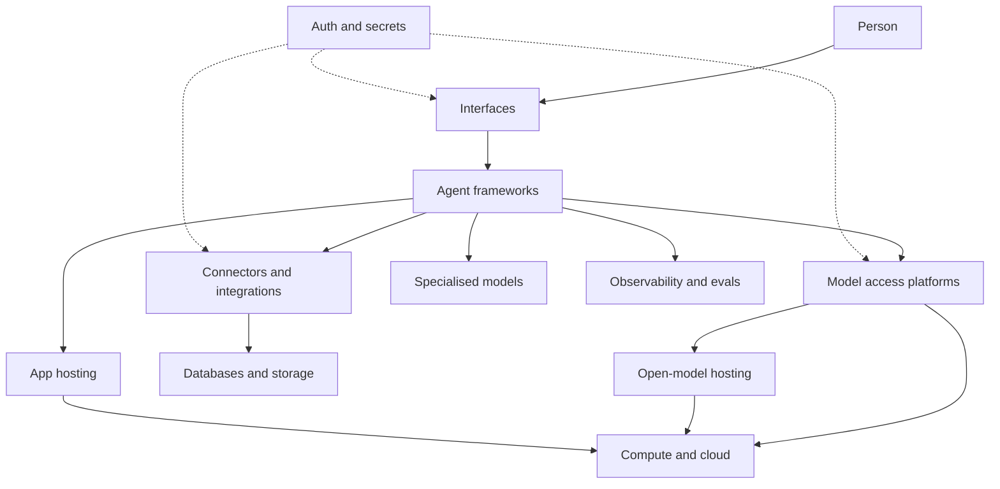

This section starts from first principles: what kinds of infrastructure exist, what each one does, and how they connect to make an agent work. Read the concepts first if a word is new; the [glossary](/start-here/glossary/) helps too.

Think of it as a stack. A person talks to an interface. Behind it, software runs an agent, which asks a model for decisions and uses connectors to reach your systems. Everything sits on rented computers, and every step needs a safe way to prove who is allowed to do what.

Solid arrows show who calls whom. Dotted lines show the sign-in and key handling that every call depends on.

## The layers

| Layer | The question it answers |
| --- | --- |
| [Compute and cloud](/map/compute-and-cloud/) | Whose computers run all of this, and where? |
| [Model access platforms](/map/model-access-platforms/) | How does a program reach a model? |
| [Open-model hosting](/map/open-model-hosting/) | If the model is open, who runs it? |
| [Specialised models](/map/specialised-models/) | Which small models handle the narrow jobs around the main one? |
| [App hosting](/map/app-hosting/) | Where does your own code live and run? |
| [Databases and storage](/map/databases-and-storage/) | Where does the data sit? |
| [Connectors and integrations](/map/connectors-and-integrations/) | How does the agent reach your other systems? |
| [Agent frameworks](/map/agent-frameworks/) | What runs the loop so you do not write it yourself? |
| [Auth and secrets](/map/auth-and-secrets/) | Who is allowed in, and where are the keys kept? |
| [Observability and evals](/map/observability-and-evals/) | How do you see what happened and test it? |
| [Interfaces](/map/interfaces/) | How does a person reach the agent? |

Every layer page has a short, dated list of example providers. Those lists change quickly, so treat them as examples of a category and not as a shortlist.

## Putting it together

[One question through every layer](/map/one-question-through-every-layer/) traces a single request across all of these, and ends with the smallest honest version to build first.
