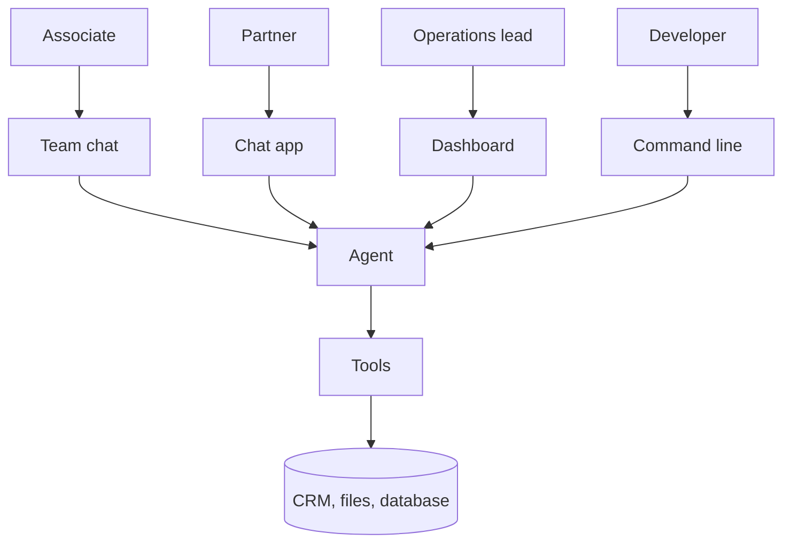

The infrastructure map ends at the top of the stack, where a person meets the agent. Every layer below, from chips to logs, is reached through this one.

**In one line:** the interface is the place where a person meets the agent, whether that is a chat window, a command line, a dashboard, a spreadsheet or a message in the team chat.

## The jargon: concepts covered on this page

- **Interface:** the surface a person uses to reach an agent
- **Command line (CLI):** a text-only window where you type commands
- **Coding assistant:** an AI tool that reads and edits code for developers
- **Internal tool:** a small app built for one team's own work
- **Channel:** a messaging service where an agent can send and receive messages
- **Approval step:** a pause where a person confirms an action before it runs
- **Retention period:** how long stored data is kept before deletion

## Why it matters

Every other layer sits out of sight. The interface is the only part people touch, so it decides who will actually use the agent and how much they trust it.

It also quietly decides four serious things:

- **Who can use it.** A command line suits a developer. A message in the team chat suits everyone.
- **How they sign in.** The interface is where identity enters the system, which feeds into [auth and secrets](/map/auth-and-secrets/).
- **What they see before an action happens.** If the agent wants to send an email or change a CRM record, the interface is where a person gets to say yes or no. This is [human in the loop](/agents/human-in-the-loop/), and a clumsy approval screen leads people to click through without reading.
- **Where conversation data is stored.** Chats can hold investor and founder details. Each interface keeps its history somewhere, under someone's retention rules.

<mark>The interface is where trust is won or lost, because it is the only layer your colleagues can see.</mark>

## How it works

The same agent can often sit behind several interfaces. The interface collects the person's request, passes it (with who they are) to the agent, and shows back the answer and any approval prompts. The agent then uses tools and data as usual.

Interfaces fall into a few families.

- **Chat apps and assistants.** A general chat window on the web, desktop or phone. Easy for everyone, and usually the first place people try an agent.
- **Coding assistants.** Tools aimed at people who write software. They live in a code editor, a terminal or the web, and can read files and run commands. Useful for the person building the agent, less so for the rest of the team.
- **Command line.** A text-only window where you type commands. It is the most direct interface and the easiest to automate, but unfriendly to non-programmers.
- **A dashboard or internal tool.** A small web app built for one job, such as a page where an associate pastes a company name and sees a summary, with buttons to approve actions. You control exactly what is shown.
- **Spreadsheets and documents with built-in AI.** The assistant sits inside the tools people already use all day, so there is nothing new to learn.
- **Email.** People send a request to an address, or forward a message, and get a reply. Slow, but needs no new habit.
- **Messaging channels.** Teams, Slack and WhatsApp, where the agent appears as a participant. These are covered in their own section later (see [Comms channels](/channels/)).

## Example providers (snapshot, as of October 2026)

This section describes things that change quickly, and the categories blur: chat apps now include coding and agent features, and productivity suites now host agents. Check each vendor's pages before relying on any detail. This is a list of examples, not a ranking.

| Family | Examples | Known for |
| --- | --- | --- |
| Chat apps and assistants | Claude, ChatGPT, Gemini, Microsoft 365 Copilot | Claude is available on the web, in desktop and mobile apps, in a Chrome extension, and inside Microsoft 365 apps. ChatGPT is available on the web and in desktop and mobile apps. Gemini is Google's assistant, as an app and built into Workspace apps. Microsoft 365 Copilot is built into Word, Excel, PowerPoint, Outlook and Teams, and works on your organisation's data within each person's existing permissions. |
| Coding assistants | Claude Code, Cursor, GitHub Copilot | Claude Code runs in a terminal, in editor extensions, as a desktop app and on the web. Cursor is a code editor with built-in agents, also with a command line and Slack and GitHub connections. GitHub Copilot works in editors, the command line, github.com and a desktop app. |
| Internal tools and dashboards | Streamlit, Retool | Streamlit is an open-source Python framework for turning scripts into small web apps, owned by Snowflake. Retool is a platform for building internal tools that connect to databases, APIs and models, with a self-hosted option. |
| Spreadsheets and documents with built-in AI | Microsoft 365 Copilot, Gemini in Google Workspace | Copilot appears in Word, Excel and Outlook. Gemini appears in Gmail, Docs, Sheets, Slides, Meet and Drive. |
| Messaging channels | Microsoft Teams, Slack, WhatsApp | Where people already talk. Details come in the channels section. |

Command line and email need no provider: they are ways of reaching an agent you or your developer run.

## Choosing between them

- **Who needs to use it?** Start with the least technical person who will rely on it. If they live in email and the team chat, go there.
- **How do people sign in?** Prefer the sign-in people already use for work, so access follows their existing account. Compare with [permissions and access control](/data/permissions-and-access-control/). An agent that acts for the person should see only what that person may see.
- **What does the approval look like?** Check that a person sees the actual action (the exact email, the exact field change) before it happens, not just a vague "continue?".
- **Where is the chat history stored, and for how long?** Find out who at the vendor can read it, whether it trains models, and how to delete it. See [GDPR, data retention and DPAs](/running/gdpr-data-retention-and-dpas/).
- **Can I switch?** If the interface is a thin layer over your own agent, you can change it later. If the logic lives inside one vendor's assistant, switching means rebuilding.
- **Build or buy?** A ready-made assistant is quicker. A small custom tool gives you control over what is shown and logged. Many firms use a ready-made chat app first.
- **Does it fit how the agent connects to data?** Some assistants connect to your systems through standard plugs such as [MCP](/agents/mcp/). Check that your interface supports the connection method you picked.

## Worked example

Sample Ventures, the fictional fund, has an agent that can read the CRM and SharePoint. The operations lead has to decide how the team reaches it.

1. **First interface: chat app.** She starts with one general chat assistant the whole team already has access to. It connects to the CRM and files with read-only accounts. Each person signs in with their own work account.
2. **What people see.** An associate asks for a summary of Acme Payments and gets an answer with links to the source records. The assistant shows its sources, so she can check them.
3. **A write action.** The team wants the agent to log meeting notes. The assistant shows the full note and the company it will attach to, and waits for a click. Nothing is saved until the associate approves.
4. **Second interface: team chat.** After a month, people ask for the same agent inside the team chat, where questions already happen. She adds it there, with the same permissions and the same approval step.
5. **Dashboard later, if needed.** For the weekly pipeline review, she builds a small internal page with a table and an "approve all" button. Only then does a custom interface earn its upkeep.

Throughout, the developer uses a coding assistant to build and change the agent. That is a different interface for a different person.

## Costs and limits

- **Cheapest: what you already pay for.** Using an assistant or suite your team already has costs little extra effort. Custom dashboards cost build and upkeep time.
- **More surfaces, more to secure.** Each new channel is another place where sign-in, permissions and approvals must be set up and checked.
- **Messages can carry attacks.** An email or a document the agent reads can hide instructions (see [prompt injection](/running/prompt-injection/)). The more channels feed text to the agent, the more exposure.
- **Approval fatigue.** Too many confirmation clicks teach people to approve without reading. Ask only for the risky actions.
- **Chat history is data.** It may sit with the vendor, in your suite or in your own database. Decide which, and set a retention period.
- **Features shift.** Interfaces gain and lose abilities quickly, and plan tiers decide which are available. Verify before you commit.

## Related

- [Auth and secrets](/map/auth-and-secrets/): how people and agents prove who they are
- [Human in the loop](/agents/human-in-the-loop/): what a person should see before an action
- [Chat, agent, workflow and automation](/start/chat-agent-workflow-automation/): how a chat window differs from an agent behind it
- [Permissions and access control](/data/permissions-and-access-control/): making sure the agent sees only what the person may see
- [One question through every layer](/map/one-question-through-every-layer/): a question travelling from the interface to the data and back

## Next up

That completes the layers. [One question through every layer](/map/one-question-through-every-layer/) puts them together by following a single request from the interface down to the data and back.
