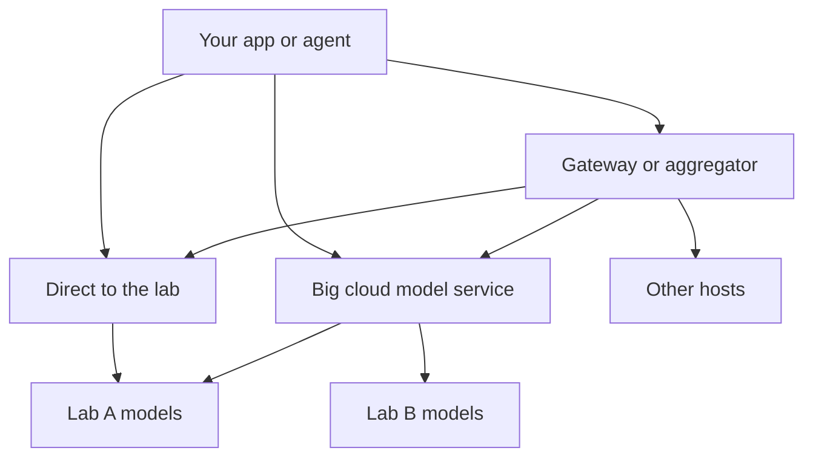

One layer above the chips sits the doorway to the model itself. This page covers the routes a program can take to reach a model that someone else runs on that hardware.

**In one line:** a model access platform is the doorway your software uses to send text to a model and get an answer back, and there are three kinds of door: the model maker's own, a big cloud's, or a gateway that fronts many.

## Why it matters

Your agent needs a model to think with, but you almost never run one yourself. Your software sends a request over the internet to a service that runs the model, and the answer comes back. The question is which service, and that choice quietly decides your bill, your sign-in, your data terms and how easily you can switch models later.

The same model is sometimes available through more than one door. The model is identical in name, but the contract around it can differ: who you pay, which region handles the request, what is logged, and how many requests per minute you may send.

<mark>Choosing a model and choosing the door to it are two separate decisions, and the door is the one that is hard to change later.</mark>

Without a plan, firms end up with several accounts, several invoices and several sets of terms nobody has read together.

## How it works

A request to a model is an ordinary web request: your program sends the prompt and an **API key** (a secret that proves who you are), and the service replies with the model's answer. See [APIs, OAuth and API keys](/agents/apis-oauth-and-api-keys/) for how keys work.

There are three routes:

1. **Direct from the lab.** The company that built the model runs its own API. You get an account with that company, pay it, and use its newest features first.
2. **Through a big cloud's model service.** The large cloud providers host models from several makers inside their own platform. You use your existing cloud account, bill and security setup.
3. **Through a gateway or aggregator.** A third service sits in front of many providers. You send every request to the gateway, and it forwards it to the right provider. Some are hosted services (you pay them), and some are software you run yourself.

**What a gateway does.** Many gateways accept requests in one common format (often the format popularised by OpenAI's API) and translate them for each provider. That means switching models can be a one-line change rather than a rewrite. Gateways can also add **fallbacks** (if one provider fails, try another), spending limits per person or project, and one place to see usage. This links to [model routing](/running/model-routing/), where requests are sent to cheaper or stronger models depending on the task.

**What changes with each door.**

- **Features.** A lab's own API tends to get new features first. Other doors may lag on the newest ones, or offer them in a slightly different form. Check that the specific feature you need exists on the door you choose.
- **Limits.** Each door has its own [rate limits](/running/rate-limits-retries-and-failures/), meaning caps on how many requests or how much text you can send per minute. The limits you have with a lab are not the limits you get through a cloud or a gateway.
- **Contracts and data terms.** Each door has its own terms on logging, retention, and training on your data. Reading them is part of the job (see [GDPR, data retention and DPAs](/running/gdpr-data-retention-and-dpas/)).
- **One more hop.** A gateway adds another company or another piece of software between you and the model. That is one more party that sees your text, and one more thing that can fail.

## Example providers (snapshot, as of October 2026)

Names and product branding change often. Verify on each provider's own site.

| Route | Examples | Known for |
| --- | --- | --- |
| Lab's own API | The APIs of model makers such as Anthropic, OpenAI and Google | Newest models and features first; direct relationship with the maker |
| Big cloud model service | Amazon Bedrock (AWS); Microsoft Foundry (Microsoft, previously called Azure AI Foundry); Gemini Enterprise Agent Platform (Google Cloud, which Google's pages describe as the home of what was Vertex AI) | Models from several makers under one cloud account, with the cloud's existing security and billing; AWS states Bedrock does not use your data to train models |
| Hosted gateway | OpenRouter | One API and one bill for hundreds of models from many providers, with automatic fallbacks |
| Self-run gateway | LiteLLM (open source) | Software you run yourself that gives one common interface to 100+ models, with spend tracking and per-key budgets |

Model makers appear on more than one row: Anthropic's Claude models, for example, are listed on Google's platform and Microsoft Foundry, and other makers' models appear in several clouds. The rows blur in both directions: the clouds are also gateways, and gateways are also adding hosting. Product names have already changed this year, so expect them to change again.

## Choosing between them

There is no ranking here. The right door depends on what you already have and what you must protect. Questions to ask:

- **What do we already pay for?** If the firm is on Microsoft 365, a Microsoft route may fit existing contracts and sign-in. If it uses AWS or Google Cloud, the same logic applies.
- **How many model makers do we want?** One maker suggests going direct. A mix suggests a cloud or a gateway.
- **How fast do we need new features?** If you depend on a feature released last month, check it is available on your door.
- **Where is data processed, and what is logged?** Ask for the region of processing, how long prompts are kept, and whether they are used to train. A gateway adds its own answers to these questions on top of the model provider's.
- **Who do we need to trust?** With a hosted gateway, text passes through the gateway and then the model provider. With a self-run one, it passes through your own server.
- **How hard is it to switch?** Using a common request format and keeping model names in settings (not scattered through code) keeps the door replaceable.
- **Who gets the invoice, and who controls keys?** One bill is convenient, but a single shared key for everything is a risk. Give each app or person its own key where you can (see [least privilege](/running/least-privilege/)).

Lock-in here is mostly about convenience: the more you use one platform's extra features (its agents, its storage, its guardrails), the more work it is to leave. Plain "send text, get text" calls move easily.

## Worked example

Sample Ventures wants an assistant that drafts meeting summaries and answers questions over its notes. The operations lead compares doors.

1. **Start from what exists.** The firm already has a Microsoft 365 tenant and a security policy that names its approved suppliers. A cloud model service on an existing cloud contract avoids adding a new supplier.
2. **Check the specifics.** She confirms with the provider which region handles requests, how long prompts are kept, and that the firm's data is not used for training. She records the answers.
3. **Try a second model.** An associate wants to compare two models on the same task. Because the code reads the model name from a setting, she points it at a different model without changing the program.
4. **Cap the risk.** She issues a separate key for the pilot, with a monthly spending limit, and stores it as a secret rather than in the code.
5. **Review.** After a month she reviews usage by key and decides whether a gateway is worth adding for routing and fallbacks.

The firm never needed to decide on chips or hosting. It chose a door, and wrote down the terms.

## Costs and limits

- **You usually pay by usage.** Charges follow how much text goes in and out, so costs grow with use (see [how AI pricing works](/running/how-api-pricing-works/)). Gateways may add their own fee or margin on top of the provider's charges; check how each one charges.
- **Spending limits are not automatic.** Set budgets and alerts early. A looping agent can use a surprising amount.
- **Rate limits differ by door.** A limit that was fine in testing can block a busy workflow in production. Build in retries and backoff.
- **Feature lag.** The newest capabilities may arrive on a cloud or gateway later than on the maker's own API.
- **Extra hop, extra risk.** Each extra service in the path is another place where text is processed, logged or interrupted by an outage.
- **Terms change.** Providers revise data terms and product names. Review them on a schedule rather than once.

## Related

- [Model routing](/running/model-routing/): sending each request to the model that suits it, which gateways often support
- [Rate limits, retries and failures](/running/rate-limits-retries-and-failures/): what to expect when a door says "too many requests"
- [APIs, OAuth and API keys](/agents/apis-oauth-and-api-keys/): how your program proves who it is
- [GDPR, data retention and DPAs](/running/gdpr-data-retention-and-dpas/): the contract questions behind every door
- [Compute and cloud](/map/compute-and-cloud/): the chips and regions underneath all three routes

## The proper terms

- **Model access platform:** a service your software calls to use an AI model
- **API key:** a secret string that identifies your program to a service
- **Gateway:** a service that sits in front of many model providers
- **Aggregator:** a hosted gateway that sells access to many providers on one account
- **Fallback:** automatically trying another model or provider when one fails
- **Rate limit:** a cap on requests or text per minute
- **Model garden or catalogue:** a cloud's list of models you can choose from
- **Data processing region:** the place where a request is actually run

## Next up

Those doors mostly lead to models run by their makers. [Open-model hosting](/map/open-model-hosting/) covers the other case: a model anyone can download, and the question of who runs it.
