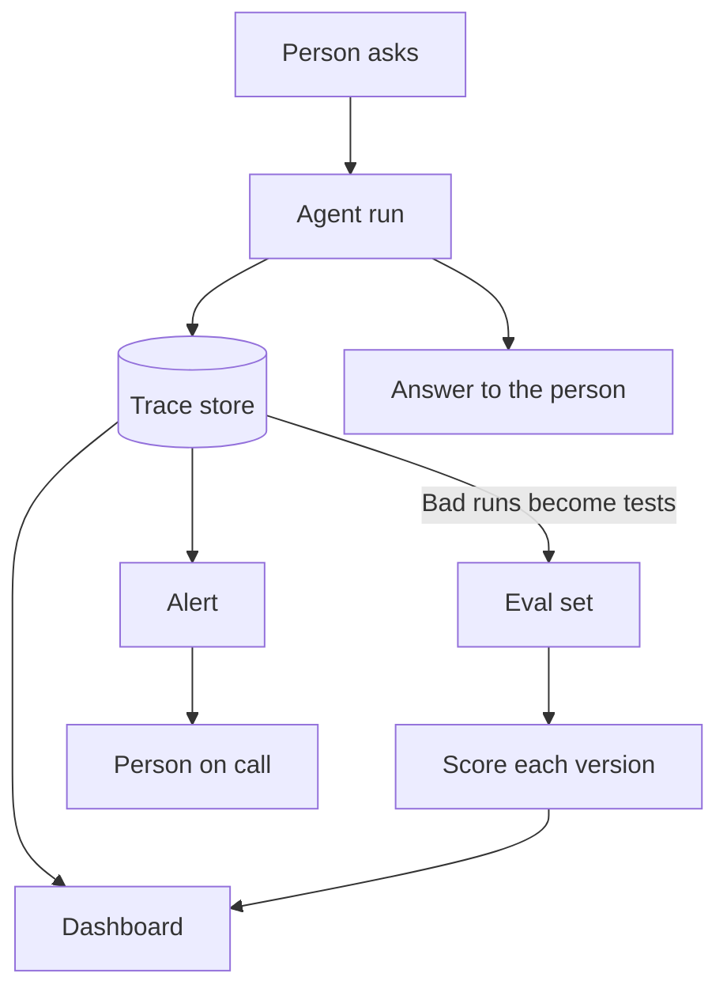

Once an agent runs with its own keys and access, the next need is seeing what it did. This layer is the tooling built around two ideas from running agents for real: recording each run and testing the results.

**In one line:** this layer is the set of tools that record what your agents did (observability) and check whether they do their job well (evals), so you can fix problems instead of guessing at them.

## Why it matters

This layer answers two questions. "What actually happened on that run?" and "Is the agent any good, and did my last change make it better or worse?" The first is [observability](/concepts/agents/observability/). The second is [evals](/concepts/agents/evals/).

Without it, every wrong answer is a mystery. You cannot tell whether the model misread the question, a search returned the wrong record, or a tool failed quietly. You also cannot tell whether a change to the instructions helped, because you only remember the last two examples you tried.

<mark>You do not need a platform to start, but you do need a record and a test list from day one.</mark>

The tools in this layer are a convenience. The ideas (keep a record, keep a test set) matter more than any product.

## How it works

Think of a flight recorder plus a pilot's check ride. The recorder captures every run so you can replay it. The check ride is a fixed set of exercises you repeat to see whether the pilot is still good.

In software terms, your agent runs and sends a **trace** (the full record of one run, made of steps called **spans**) to a **trace store**. A **dashboard** lets you browse traces, filter them and see cost and speed. Separately, you keep an **eval set**: a list of questions with known good answers. You run the agent over it and score the results. An **alert** tells you when something drifts, such as failures or a sudden jump in cost.

Many tools do several jobs at once. A typical platform stores traces, lets you tag runs with feedback, keeps datasets of test cases, runs scoring (sometimes with another model acting as the judge) and draws charts. So "tracing platform" and "eval tool" are often the same product.

There is also a shared plumbing standard. **OpenTelemetry** is a vendor-neutral, open standard for collecting traces, metrics and logs from software. Its community is developing conventions for AI-specific details, such as model calls and tool calls. If your agent emits OpenTelemetry data, you can usually send it to more than one tool, which lowers lock-in.

## Example providers (snapshot, as of October 2026)

This section describes things that change quickly. The market is moving fast: tools are being bought, and the categories blur (tracing tools add evals, eval tools add tracing, cloud monitoring adds agent views). Check each vendor's own pages before deciding. Nothing here is a ranking.

| Category | Examples | Known for |
| --- | --- | --- |
| Open-source-first tracing and evals | Langfuse, Arize Phoenix | Both publish their code and can be self-hosted, and both offer tracing and evaluation. Langfuse also manages prompts, and ClickHouse announced in early 2026 that it had acquired it. Phoenix is built by Arize AI on OpenTelemetry standards, with a managed enterprise option, Arize AX, from the same company. |
| Commercial platforms | LangSmith, Braintrust | LangSmith (from the makers of LangChain) offers tracing, monitoring and evaluation, works with many frameworks, and has cloud, hybrid and self-hosted options. Braintrust describes itself as an observability platform for agents, with tracing, evals and human annotation. Its documented self-hosting keeps your data in your own cloud while Braintrust runs the interface. |
| Gateways with logging | Helicone | A gateway that sits between your app and the model providers and logs the traffic. It was acquired by Mintlify and says its services will stay live in maintenance mode for the foreseeable future, so treat it as a caution about how fast this layer moves. |
| The open standard | OpenTelemetry | Not a product but a CNCF standard and set of kits for emitting traces, metrics and logs, which many of the tools above can receive. |
| Cloud providers' own monitoring | Azure Monitor Application Insights, Amazon CloudWatch (used by AWS AgentCore Observability), Google Cloud Observability | Each has views for AI agents running on that cloud. They suit you if the agent already lives there and you want one place for everything. |
| Plain tools | A log file, a spreadsheet | Enough for a first agent. |

Licences differ between these tools, and some change. If open source matters to you, read the licence file in the project, not just the marketing page.

## Choosing between them

Ask these questions in this order.

- **Do I need a platform yet?** For one agent and a few users, probably not. See the note below.
- **Where does the data go?** Traces contain the questions people asked and the documents the agent read. That can include investor or founder data. A hosted platform stores a copy outside your firm. Self-hosting or a "your cloud" option keeps it closer, but you then run it.
- **Can I leave?** Using OpenTelemetry, or keeping your own export of traces and test sets, makes switching less painful.
- **Does it fit my framework?** Most tools have ready-made hooks for the common agent frameworks (see [agent frameworks](/map/agent-frameworks/)). Check yours is covered.
- **Who will look at it?** A dashboard nobody opens is worthless. A tool a non-programmer can read may beat a more powerful one.
- **How long is data kept, and who can see it?** This ties to [data retention rules](/concepts/security/gdpr-data-retention-and-dpas/) and your [audit trail](/concepts/security/audit-trails/).

Note that observability is not the same as an audit trail. Observability is for debugging and improving. An audit trail is a tamper-resistant record of who did what, kept for accountability. One tool can sometimes serve both, but decide on purpose.

**The honest note for a first agent.** A plain log file that records each question, each tool call, the answer and the token count is enough to start. Add a hand-made list of ten to twenty test questions in a spreadsheet, with the correct answer beside each. Re-run them by hand after every change. Move to a platform when the log gets too big to read, when several people need to see it, or when you want automatic scoring.

## Worked example

Sample Ventures, the fictional fund, has an assistant that answers questions about portfolio companies from its CRM and SharePoint files. The operations lead sets up this layer in two stages.

1. **Week one: plain.** The assistant writes one line per tool call to a log file, plus the final answer and the number of tokens used. She also keeps a spreadsheet of twelve test questions, such as "When did we last speak to the Acme Payments founder?", each with the right answer checked against the CRM.
2. **A bad answer.** An associate reports that the assistant gave the wrong date for the last call. She opens the log and sees the assistant searched the CRM, got two records called "Acme Payments", and picked the older one. She adds this question to the test list.
3. **Month two: a platform.** The team now has four users and the log is hard to read. She chooses a tracing platform that can be hosted in the firm's own cloud, because traces contain founder emails. She sends the same data to it using OpenTelemetry-style tracing, so the old log is not wasted.
4. **Scoring and alerts.** She runs the test list on every change to the instructions and compares scores. An alert tells her if a run costs more than five times the usual amount.
5. **Cost check.** She uses the recorded runs to see what a typical question really costs, instead of guessing. See [estimating cost per task](/concepts/cost/estimating-cost-per-task/).

## Costs and limits

- **Cheap to start, grows with volume.** Storing every trace costs more as runs increase, and full text of long conversations takes the most room.
- **Traces hold sensitive text.** Anyone who can open the dashboard can read what people asked and what the agent saw. Limit access and set a retention period.
- **Automatic scoring is not truth.** When one model grades another, it can be wrong or biased. Spot-check scores by reading real examples (see [evals](/concepts/agents/evals/)).
- **A small test set misleads.** Ten questions will not catch rare failures. Add every real failure to the set.
- **More tools, more upkeep.** A platform you self-host needs updates and backups. A hosted one needs a data agreement.
- **Vendors change.** This layer is young, and products get acquired or reduced. Keep your own export.

## Related

- [Observability](/concepts/agents/observability/): the idea behind traces, spans and logs
- [Evals](/concepts/agents/evals/): how to build and run a test set
- [Audit trails](/concepts/security/audit-trails/): the accountability record, which is different from debugging traces
- [Estimating cost per task](/concepts/cost/estimating-cost-per-task/): turning recorded runs into a real cost per question
- [One question through every layer](/map/one-question-through-every-layer/): where the recording step sits in a full run

## The proper terms

- **Trace:** the full record of one agent run, step by step
- **Span:** one step inside a trace, such as a model call or tool call
- **Trace store:** the place where traces are saved and searched
- **Eval set:** a fixed list of test questions with known good answers
- **LLM-as-judge:** using one model to score another model's answers
- **OpenTelemetry:** an open standard for collecting traces, metrics and logs
- **Alert:** an automatic warning when a measure goes outside normal range
- **Self-hosting:** running software on your own servers instead of the vendor's cloud

## Next up

Everything so far sits out of sight. [Interfaces](/map/interfaces/) covers the one layer people actually see: where they meet the agent.
