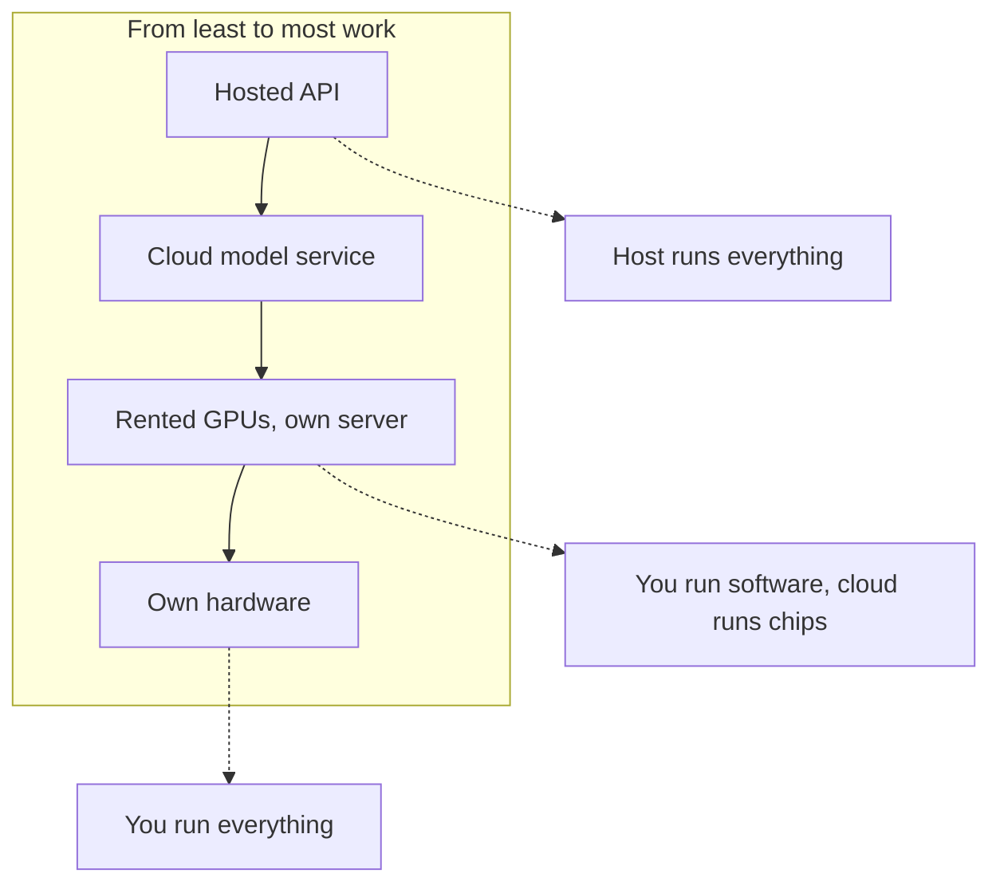

**In one line:** open-model hosting is the question of who actually runs an open-weight model, because downloading the model is free but running it needs chips, software and someone to look after both.

## Why it matters

An [open-weight model](/concepts/how-models-work/open-vs-closed-weights/) is one whose trained numbers (the weights) are published for anyone to download. That sounds like you can just use it, but a model file does nothing on its own. Something has to load it onto expensive chips, accept requests, and send answers back.

Firms look at open models for good reasons: keeping text away from a third-party lab, controlling exactly which model version runs, or lower cost for simple, high-volume jobs. Hosting is the price of those benefits, and it is where the plan often meets reality.

<mark>An open model is free to download, but running it well is a job, and the realistic default for a small firm is to let someone else do that job.</mark>

## How it works

Think of a restaurant recipe that anyone may copy. The recipe (the weights) is free. You still need a kitchen, a cook, ingredients and someone to clean up. Hosting options differ in how much of the kitchen you run yourself.

Here is the spectrum, from least to most work:

1. **A hosted inference service.** A company runs the open model on its own chips and you call it by API, just like calling a lab's API. You pay by usage. You run nothing.
2. **A big cloud's model service.** The large clouds also offer some open models in their catalogues, with the same account, billing and region controls as their other services (see [model access platforms](/map/model-access-platforms/)).
3. **Rent GPUs and run a server.** You rent chips from a cloud (see [compute and cloud](/map/compute-and-cloud/)) and install serving software on them. You manage the server, its updates and its security.
4. **Your own machine.** You run the model on a laptop, desktop or server you own. Cheapest to start and most private, but limited by the machine's memory and speed.

**Serving software.** To run a model on your own server you need an **inference server**: a program that loads the weights, handles many requests at once, and exposes an API. vLLM is a widely used open-source example. Many such servers copy the request format of the big labs' APIs, so your application code barely changes when you switch.

**Running locally.** Tools such as Ollama and llama.cpp make it simple to run models on a personal computer. They are good for experiments and for private work on small tasks. A laptop can run smaller models well, but not the largest ones at useful speed.

**Quantisation.** Models need a lot of memory. [Quantisation](/concepts/how-models-work/quantisation/) shrinks them by storing each number with less precision, a bit like saving a photo at a lower quality to fit on a smaller disk. It lets bigger models fit on cheaper hardware, at some cost to accuracy. Local tools rely on it heavily. When you host yourself, choosing the level is your decision. When someone else hosts, they have made that choice for you, often without saying.

**Same model, different results.** Two hosts serving the "same" model can behave differently. They may use different quantisation, different settings, or different serving software. The answers, speed and occasionally the quality can vary. If quality matters, test on your own examples with the host you will actually use (see [evals](/concepts/agents/evals/)).

**What you take on if you host.**

- **Updates.** New model versions, serving software and security patches arrive constantly.
- **Security.** An exposed model server is a door into your network. It needs sign-in, network controls and monitoring.
- **Scaling.** One user is easy. Ten people at 9am, or an agent that fires many requests, needs capacity planning.
- **Monitoring.** You need to know when it is slow, down, or answering badly (see [observability](/concepts/agents/observability/)).
- **Cost control.** Rented GPUs bill whether busy or idle.

## Example providers (snapshot, as of October 2026)

This section will date. Verify on each provider's own pages.

| Option | Examples | Known for |
| --- | --- | --- |
| Hosted inference by API | Together AI, Fireworks AI | Serve many open models by API, pay per use; both also offer dedicated GPU deployments and fine-tuning |
| Router across hosts | Hugging Face Inference Providers | One account and API that forwards to partner hosts (its docs list Together, Fireworks, Groq, Cerebras and others) |
| Big cloud catalogues | Amazon Bedrock, Microsoft Foundry, Google Cloud's Gemini Enterprise Agent Platform | Some open models alongside closed ones, under the cloud's existing contract |
| Rented GPUs | Large clouds; CoreWeave and Lambda | You get the chips, you bring the serving software |
| Serving software (open source) | vLLM | High-throughput inference server for NVIDIA and AMD GPUs, CPUs and other accelerators |
| Local tools | Ollama, llama.cpp (both MIT licensed) | Run models on your own computer; llama.cpp also provides an OpenAI-compatible server |

This area moves fast. The line between "hosted API" and "rented GPU" is blurry, since hosts sell both. Ownership and offerings of fast-inference companies have been changing, so check who actually runs a host before relying on it.

## Choosing between them

Start with why you want an open model. The answers point to different options:

- **"We do not want our text sent to a model lab."** A hosted inference service is still a third party. Read its data terms. Only your own hardware or your own rented server removes that, and then your own security becomes the question.
- **"We want to control the version."** Dedicated deployments or your own server pin it. A hosted shared service may change models or settings underneath you.
- **"We want lower cost."** Hosted APIs for open models are often cheaper per request than closed models. Your own server only saves money at steady, heavy use.
- **"We have no one to run it."** That points firmly to a hosted service or to not using open models at all.

Further questions: Where do the hosts run (region and country)? Does the host log or keep prompts? Which quantisation does it use? Can you move to another host without changing code? Is there an agreement covering personal data (see [GDPR, data retention and DPAs](/concepts/security/gdpr-data-retention-and-dpas/))?

Lock-in is low if you use standard request formats and keep the model name in a setting. It rises if you build on one host's special features.

## Worked example

An associate at Sample Ventures, the fictional fund, suggests running an open model on the office server so deal notes about Acme Payments never leave the building. The operations lead sets out the trade.

1. **Write the real goal.** The aim is privacy for sensitive notes. It is not "use open models" for its own sake.
2. **Count the jobs.** Someone must patch the server, secure it, watch it and fix it when it fails. The firm has no engineer, and the lead does not want that duty.
3. **Test cheaply first.** On an associate's laptop, a local tool runs a small model on a few non-sensitive notes. Quality is fine for summaries and weak for judgement-heavy questions.
4. **Compare the middle path.** A hosted service for open models, or a cloud catalogue in a UK or EU region, with a data processing agreement and no training on inputs, may meet the privacy goal with no server to look after.
5. **Decide and record.** The firm chooses the hosted route for now, keeps the local setup for small experiments, and sets a date to revisit if volume or sensitivity grows.

## Costs and limits

- **Hosted APIs are the cheap, easy end.** You pay for what you use, with no idle cost.
- **Your own server has fixed costs.** Rented GPUs run up charges while idle, and staff time is a larger hidden cost than the chips.
- **Hardware limits are hard limits.** A model that does not fit in memory will not run, or runs painfully slowly. Quantisation helps but reduces accuracy.
- **Capability gap.** Open models can be strong, but the strongest tasks (long, careful reasoning with many tools) often favour the leading closed models. Test for your own task rather than assuming either way.
- **Responsibility moves to you.** If you self-host, a data leak from your server is yours to explain.
- **Quality is not uniform across hosts.** Test the actual host and settings you will use.

## Related

- [Open and closed weights](/concepts/how-models-work/open-vs-closed-weights/): what makes a model open and what that does and does not mean
- [Quantisation](/concepts/how-models-work/quantisation/): shrinking a model to fit smaller hardware
- [Model access platforms](/map/model-access-platforms/): the other ways to reach models, including closed ones
- [Compute and cloud](/map/compute-and-cloud/): where rented chips come from
- [Inference](/concepts/how-models-work/inference/): what a model server is doing on each request

## The proper terms

- **Open-weight model:** a model whose trained numbers are published for download
- **Hosted inference:** a company runs a model for you and you call it by API
- **Inference server:** software that loads a model and answers requests
- **Dedicated deployment:** model capacity reserved for you alone
- **Self-hosting:** running the model on servers you control
- **Quantisation:** storing a model's numbers at lower precision to save memory
- **GPU:** a chip that does many calculations at once
- **Local model:** a model running on your own computer
