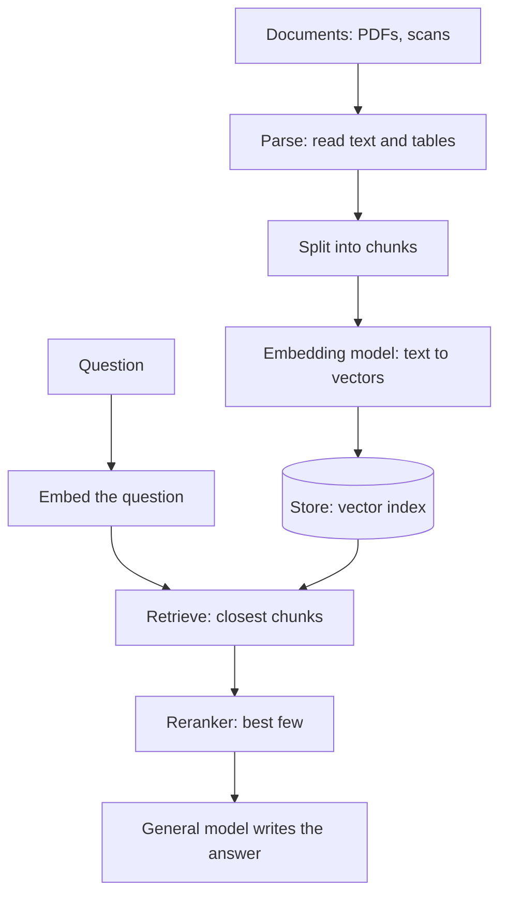

So far the map has followed one general model, whether reached through a lab's API or hosted as an open model. This page adds the smaller models that work alongside it on narrow jobs.

**In one line:** a specialised model is a model built to do one narrow job, such as embedding text, ranking search results or reading speech, so that the general chat model only has to do the thinking and writing.

## The jargon: concepts covered on this page

- **Specialised model:** a model trained to do one narrow job well
- **Embedding model:** a model that turns text or images into vectors
- **Vector:** a long list of numbers that represents meaning
- **Reranker:** a model that re-orders search results by how well they answer a question
- **Cross-encoder:** a model that reads a question and a passage together to score them
- **Speech-to-text:** software that turns spoken audio into written words
- **Text-to-speech:** software that turns written words into spoken audio
- **OCR:** optical character recognition, turning images of text into real text
- **Classifier:** a model that sorts an input into one of a fixed set of labels

## Why it matters

When people say "AI model", they usually mean a general chat model that can write, summarise and reason about almost anything. That flexibility is useful, but it is not always the right tool. Asking a large chat model to turn 10,000 documents into searchable numbers, or to transcribe an hour of audio, is like hiring a senior lawyer to photocopy.

Specialised models exist because one narrow job can usually be done faster, more cheaply and often more accurately by a model built only for it. They also give you a way to keep control of a pipeline: each step has a clear input, a clear output and a model you can swap without touching the rest.

Without them, you either pay general-model prices for simple jobs, or you hit jobs that a chat model does badly, such as reading a scanned PDF with a table in it.

<mark>A good agent setup is rarely one big model: it is a general model at the centre, surrounded by small specialists that fetch, sort and translate things into a form it can use.</mark>

## How it works

Most specialised models are the same kind of technology as a chat model (a [neural network](/under-the-hood/machine-learning-and-neural-networks/) trained on lots of examples, see [what an LLM is](/start/what-an-llm-is/)), but trained for one output. Instead of producing free-flowing text, they produce a vector, a score, a label or a transcript.

Here are the main families:

- **Embedding models.** They turn a piece of text (or an image) into a long list of numbers, called a vector, so that things with similar meaning end up close together. This is what makes search by meaning possible. See [embeddings](/data/embeddings/).
- **Rerankers.** A first search returns, say, the 50 passages that look most similar to a question. A reranker reads the question and each passage together, and scores how well each one actually answers it. You keep the top few. It is slower than the first search but more careful, so you only run it on a short list.
- **Speech-to-text and text-to-speech.** The first turns audio into written words (transcription). The second turns written words into spoken audio. Together they let an agent take part in a phone call or a meeting.
- **Vision and document models.** These read images, scans and PDFs. OCR (optical character recognition) turns a picture of text into real text. Document-understanding models go further and recover structure, such as which numbers sit in which table cell. See [multimodal models](/using-ai/multimodal-models/).
- **Small classifiers.** Tiny models that put an input into a bucket: spam or not, which of five topics, positive or negative. They are fast and cheap enough to run on every item.
- **Quantitative and scientific models.** Models trained on numbers, time series, molecules or proteins rather than everyday language. This area is young and the labels are still settling. See [LLMs, LRMs and LQMs](/under-the-hood/llms-lrms-and-lqms/).

A typical document pipeline chains several of these around the general model:

The left side runs once per document (and again when the document changes). The right side runs for every question. The general model only sees the handful of passages the specialists chose, which keeps its input short and focused. For the mechanics of splitting and searching, see [RAG and chunking](/data/rag-and-chunking/).

## Example providers (snapshot, as of October 2026)

This section names examples only. Products, model names and availability change quickly, so check each provider's own pages before choosing. Many providers appear in more than one row, and the categories blur: several general-model companies now sell embeddings, speech and document reading too.

| Job | Examples | Known for |
| --- | --- | --- |
| Embeddings | OpenAI, Google (Gemini API), Cohere, Voyage AI | Hosted embedding models you call through an API. Google's newest Gemini embedding model is described as multimodal (text, images, video, audio and documents in one space). Voyage AI focuses on embeddings and rerankers. |
| Embeddings (self-run) | Sentence Transformers (a Python library with many open models) | Run models on your own machine or server. |
| Rerankers | Cohere Rerank, Voyage AI rerankers, cross-encoder models in Sentence Transformers | Re-ordering a short list of search results by relevance to the question. |
| Speech-to-text | OpenAI Whisper, Deepgram, ElevenLabs (Scribe) | Whisper is an open model released under the MIT licence that you can run yourself. Deepgram and ElevenLabs offer hosted transcription. |
| Text-to-speech | ElevenLabs, Deepgram | Synthetic voices for agents that speak. |
| Document parsing and OCR | Azure Document Intelligence, Amazon Textract, Mistral OCR (part of Mistral Document AI) | Extracting text, tables and form fields from scans and PDFs. |
| Scientific models | AlphaFold (Google DeepMind) | Predicting protein structures. Shown only as an example of a model built for one scientific job. |

Some points to be aware of. Microsoft describes Azure Document Intelligence as a service for dependable extraction from structured documents, and points to a separate service, Azure Content Understanding, for AI-driven analysis of messier content. Cohere and Voyage AI each sell both embeddings and rerankers, so a team often picks the pair from one vendor, but nothing forces that.

## Choosing between them

Ask these questions, in roughly this order:

- **Does this step need a specialist at all?** For a few hundred documents, a general model with a long context window may be enough. Specialists pay off at volume, or when accuracy on one task matters.
- **Do embeddings and the search index match?** Vectors from different embedding models cannot be compared. If you change the embedding model, you re-embed everything.
- **Where does the data go?** A hosted API means your text leaves your systems. A self-run open model keeps it in, at the cost of running servers. See [open vs closed weights](/under-the-hood/open-vs-closed-weights/).
- **Language and document types.** Check the model handles your languages, handwriting, tables and scan quality. Test on a dozen of your own real documents, not a demo file.
- **Speed.** Live voice needs answers in a fraction of a second. Overnight document processing does not.
- **Lock-in.** Embeddings are the sticky one: your stored vectors belong to one model. Parsing and transcription are easier to swap, because the output is plain text.
- **Evidence.** Public [benchmarks](/under-the-hood/benchmarks/) rarely match your documents. Run your own small test and compare.

## Worked example

Sample Ventures, the fictional fund, wants to ask questions across its stored pitch decks and investor update PDFs. The operations lead sets up the pipeline.

1. **Parse.** A document-reading service extracts text and tables from each PDF. A scanned deck from Acme Payments comes out with its revenue table intact.
2. **Chunk and embed.** The text is split into passages, and an embedding model turns each passage into a vector.
3. **Store.** The vectors go into the firm's database, next to a link to the original file in SharePoint.
4. **Ask.** A partner asks, "What did Acme Payments say about churn in its last update?" The question is embedded and the 30 closest passages are retrieved.
5. **Rerank.** A reranker reads the question against those 30 passages and keeps the best four.
6. **Answer.** The general model writes a short answer from those four passages and cites the files.

Voice notes from calls are handled by a speech-to-text model first, then follow the same path. A small classifier tags each incoming email as "intro", "update" or "other" before anything else runs.

## Costs and limits

- **Cheap per call, large in total.** Embedding and transcription cost very little each, but a large archive or hours of audio adds up. Estimate volume first (see [estimating cost per task](/running/estimating-cost-per-task/)).
- **Re-embedding is the hidden bill.** Changing embedding model means processing the whole archive again.
- **Parsing errors travel downstream.** A misread number in an OCR step becomes a confident wrong answer later. Spot-check the parsed text, not just the final answer.
- **Rerankers add delay.** They are worth it when the first search returns plausible but noisy results.
- **Specialists do not reason.** They fetch and label. They will not notice that two documents contradict each other.
- **Privacy.** Audio, scans and contracts can hold personal data. Check where each provider processes and keeps it (see [GDPR, data retention and DPAs](/running/gdpr-data-retention-and-dpas/)).

## Related

- [Embeddings](/data/embeddings/): what the vectors are and why similar meanings sit close together
- [RAG and chunking](/data/rag-and-chunking/): the retrieval pipeline these models plug into
- [Multimodal models](/using-ai/multimodal-models/): models that handle images, audio and text together
- [Databases and storage](/map/databases-and-storage/): where the vectors and source files live
- [Model access platforms](/map/model-access-platforms/): where you call hosted models from
- [Machine learning and neural networks](/under-the-hood/machine-learning-and-neural-networks/): what a neural network is and how it learns

## Next up

Models, big or small, only run when some code calls them. [App hosting](/map/app-hosting/) covers where that code of your own lives and runs.
