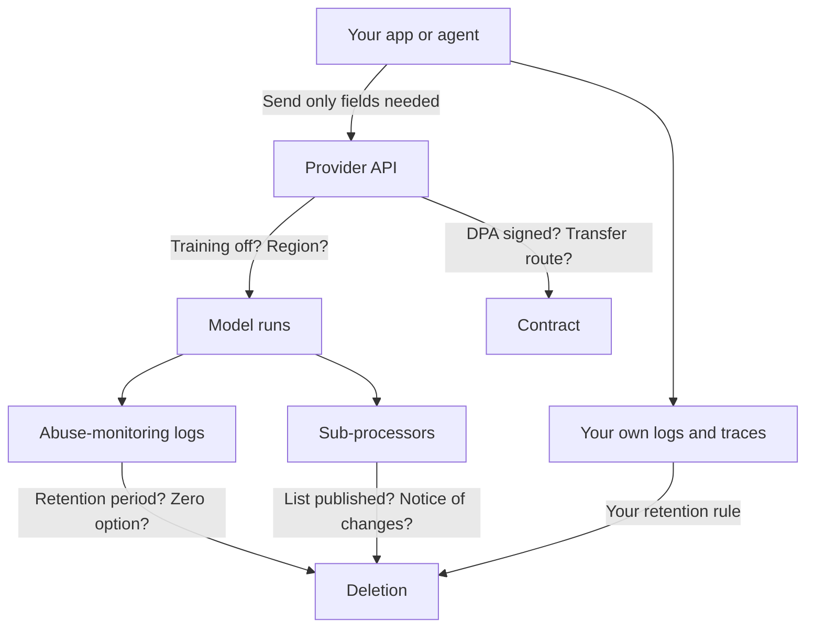

Each provider page has a short data section. This page puts the business and API terms of the major providers side by side, with the questions to ask any vendor.

**In one line:** before you send personal data or confidential material to a model provider, check six things in its official business terms: training, retention, contract, location, sub-processors and security evidence.

## Why it matters

A model provider is a company that receives your text. What it may do with that text is set by its terms, and those terms are not the same for a free chat app, a business plan and an API product from the same company.

For a UK firm, the stakes are practical. Personal data brings duties under UK data protection law, and confidential deal material brings duties to the people who shared it. The background is on [GDPR, data retention and DPAs](/concepts/security/gdpr-data-retention-and-dpas/).

This page records what each provider's own pages say as of 2 October 2026. It is a snapshot, not a recommendation, and not legal advice. Terms change, so read the current page before you rely on any line here.

<mark>The same company can have very different data terms for its consumer app, its business plans and its API, so always check the terms for the exact product you will use.</mark>

## How it works

**Which products are covered.** The table covers the business or API side only. Consumer apps are out of scope. For Google, the Gemini API (paid) and Vertex AI are shown together because they have different pages. For Microsoft, the page covers models sold directly by Azure in Microsoft Foundry, which includes OpenAI models run on Microsoft's cloud.

**How to read "not confirmed".** It means the answer was not found on an official page that could be opened. It does not mean the answer is no. Ask the vendor.

**Table 1: training, retention and zero retention**

| Provider and product | Used for training by default? | Default retention | Zero or reduced retention |
| --- | --- | --- | --- |
| Anthropic, commercial products and API | No. Commercial inputs and outputs are not used to train models by default; feedback you submit can be used | Inputs and outputs deleted from the backend within 30 days, with exceptions such as policy violations, which can be kept longer | Zero data retention available by agreement for eligible commercial customers; safety classifier results are still kept |
| OpenAI, API and business plans | No. Not used unless you opt in | Abuse-monitoring logs kept up to 30 days | Zero data retention and modified abuse monitoring available to eligible customers |
| Google, Gemini API (paid) | No. Paid services are not used to improve Google products | Logged for a limited period to detect abuse; length not confirmed | Not confirmed |
| Google, Vertex AI | No. Not used to train or fine-tune without your permission or instruction | In-memory caching with a 24-hour limit, which can be turned off; abuse logging unless an exception is granted; grounding features keep prompts and outputs for 30 days | Exception for zero data retention can be requested |
| Microsoft, models sold by Azure in Foundry | No. Prompts and completions are not used to train foundation models without your permission | Not confirmed on the page opened | Modified abuse monitoring available by approval (no stored data or human review for abuse monitoring; automated review may still run) |
| Mistral, API (pay-as-you-go) | Free tier may be used; pay-as-you-go users can opt out | Not confirmed for API content | Zero data retention for pay-as-you-go stateless API calls, by request and at Mistral's discretion |

**Table 2: contract, location, sub-processors and security evidence**

| Provider and product | Data processing agreement | Location options | Sub-processors published | Certifications mentioned |
| --- | --- | --- | --- | --- |
| Anthropic | Yes, with Standard Contractual Clauses, built into the Commercial Terms | Inference can be set to US only or global. Docs say no EU or UK option on that platform at the time of reading. Via a cloud partner, that partner's terms apply | Yes, listed in the trust centre | SOC 2, ISO 27001, ISO 42001 |
| OpenAI | Yes, Data Processing Addendum for GDPR | Regional storage for eligible customers, including the UK and Europe; most non-US regions need zero retention or modified abuse monitoring | Yes, via the trust portal | SOC 2 Type 2, ISO 27001 and others |
| Google, Gemini API (paid) | Yes, the processor addendum applies to paid services | Paid tier is required in the UK, EEA and Switzerland; location options not confirmed | Not confirmed | Not confirmed |
| Google, Vertex AI | Yes, Cloud Data Processing Addendum | A data residency page covers location options including UK and EU; details not confirmed | Not confirmed | Not confirmed; Google says its products undergo independent verification |
| Microsoft, Foundry | Yes, the Products and Services Data Protection Addendum | Standard (your chosen geography), data zone and global deployment types; EEA reviewers are in the EEA for EEA deployments | Not confirmed | Not confirmed |
| Mistral | Yes, with a published sub-processor process and 10 days' notice of new ones | Hosted in the EU by default; a US endpoint is optional; some features may send data outside the EU | Yes, in the trust centre | SOC 2, ISO 27001 |

**Source pages for the tables** (plain names; the exact web addresses were checked on 2 October 2026):

- Anthropic: privacy centre articles on data retention, model training, the data processing addendum and zero data retention; the trust centre; the platform documentation page on data residency.
- OpenAI: enterprise privacy page; API documentation page "Data controls"; trust portal.
- Google: Gemini API additional terms of service; Vertex AI data governance documentation; data residency documentation; compliance offerings page.
- Microsoft: "Data, privacy, and security for Foundry Models sold by Azure"; abuse monitoring documentation; the Data Protection Addendum landing page.
- Mistral: help centre articles on training, data location, zero data retention and retention; the data processing addendum; the trust centre.

**What changes between products.** The same pattern shows up everywhere. Free and consumer tiers often allow training by default. Business and API tiers usually do not. Retention, data location and zero-retention options are often available only to eligible customers, sometimes on request or by contract.

**Third-party access.** Many models are also sold through cloud platforms (for example Claude, Gemini or Mistral models inside another company's cloud). Then the cloud company's terms may govern, not the model maker's. Anthropic's own page says so for its DPA.

## In practice

Start with the plan you will actually buy, then read its terms, not the provider's general privacy page. A personal account used for work is the most common way firms end up on the wrong terms.

Ask the vendor to confirm in writing anything you could not find. Keep the answers, the signed DPA and the date you checked in one place, as part of your [audit trail](/concepts/security/audit-trails/). Re-check at least once a year, and whenever a provider announces a policy change.

## Worked example

Sample Ventures wants an agent to summarise notes on Acme Payments' founders. The operations lead takes the question list below to each shortlisted provider's pages.

**Questions to ask any vendor:**

1. Is customer content used to train models by default, on the exact plan we would buy?
2. How long are inputs and outputs kept, and can that be reduced to zero?
3. Will you sign a data processing agreement naming you as processor?
4. Where is data stored and processed, and is there a UK or EU option?
5. Who are your sub-processors, and how are we told when they change?
6. What happens to data when we leave, and how fast can we delete?
7. What independent security reports can we see?
8. Do human reviewers ever see our content, and under what rules?

She finds that two providers answer most questions on public pages and two leave gaps. She writes "not confirmed" in her comparison and sends the gaps to each provider's sales contact. The decision waits for the answers.

## Costs and limits

- **Public pages do not equal your contract.** Your signed terms and any negotiated changes win over a help-centre article.
- **Zero retention is narrower than it sounds.** Providers often keep some safety or legal records, and it may apply only to certain endpoints.
- **Residency has layers.** Where data is stored is not always where it is processed. Check both.
- **Gaps are common.** Several rows here say "not confirmed". That reflects what is published, not a flaw in any provider.
- **Cheaper or free tiers differ.** A free API tier can allow training that the paid tier forbids.

## Often confused with

**Privacy policy vs data processing agreement.** A privacy policy says how a company handles data in general. A DPA is a contract that binds the company, as your processor, to your instructions.

**Retention vs training.** A provider can delete your data after 30 days and still have used it for training before then, if the terms allow it. They are separate questions.

## Related

- [GDPR, data retention and DPAs](/concepts/security/gdpr-data-retention-and-dpas/): the law and contracts behind these questions
- [How to judge a new model](/models/how-to-judge-a-new-model/): where data terms fit in a model check
- [Open-weight options](/models/open-weight-options/): running a model yourself instead
- [Audit trails](/concepts/security/audit-trails/): keeping a record of what you checked and what the agent did

## The proper terms

- **Data processing agreement:** a contract setting how a vendor handles your personal data
- **Sub-processor:** another company the vendor passes your data to
- **Zero data retention:** an arrangement where the provider stores no inputs or outputs
- **Abuse monitoring:** checks a provider runs to catch banned uses
- **Data residency:** the country or region where data is stored or processed
- **Standard Contractual Clauses:** standard contract terms for sending personal data abroad
- **Restricted transfer:** sending personal data to a country outside the UK

## Next up

New models will keep arriving after this snapshot, and the data questions are only one part of the check. [How to judge a new model](/models/how-to-judge-a-new-model/) gives the full routine.
