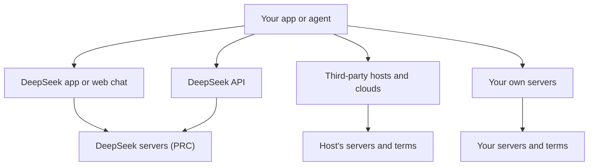

This is one of a set of parallel provider snapshots, each with the same headings. It covers DeepSeek, a Chinese lab whose case makes one point especially clear: a downloadable model file and the company's hosted service raise different questions.

**In one line:** DeepSeek is a Chinese AI lab that publishes its models as open weights and also runs its own chat app and API, and for a UK buyer the hosted service and the downloadable weights raise very different data questions.

## Why it matters

DeepSeek is widely discussed because it publishes the weights of its models, including large reasoning models, under a permissive licence. That means other companies and cloud platforms can host them, and you can run them yourself.

It is also a good case study for a distinction that applies to every provider with open weights: the model file and the company's hosted service are two separate things. The file runs wherever you put it. The hosted app and API run on the company's servers under the company's privacy policy.

<mark>For DeepSeek, the question is not "is the model safe to use" but "which door am I using": the company's own app and API, a third-party host, or my own machine.</mark>

## What it offers (as of October 2026)

DeepSeek's models fall into two broad families.

- **V-series (general models).** DeepSeek's general-purpose family. Its current documentation lists a fast tier called Flash and a larger tier called Pro. A September 2026 announcement said Pro requests would be redirected to Flash while the Pro tier is phased out, but DeepSeek's pricing page now lists a Pro model as available, so check which applies today.
- **R-series (reasoning models).** The family that first made DeepSeek widely known, built to think step by step before answering (see [reasoning models](/using-ai/reasoning-models/)). In the current API documentation, reasoning appears as a mode you switch on with a "thinking" setting and an effort level, rather than as a separate model name. DeepSeek's recent announcements mention no new standalone release in this family, so treat it as a lineage that has been folded into the V-series.

The newest model cards on DeepSeek's Hugging Face page describe mixture-of-experts designs (a model that activates only part of itself for each word), long context windows and, for the newest Flash model, native image understanding. See [multimodal models](/using-ai/multimodal-models/).

**Products.** DeepSeek's website lists a web chat, mobile and desktop apps, and an API platform. The API documentation says it uses a format compatible with the OpenAI and Anthropic APIs, so tools built for those can often be pointed at DeepSeek by changing a web address and key.

## How to reach it

- **DeepSeek's own app, web chat and API.** Data goes to DeepSeek's service, covered by its privacy policy (see below).
- **Third-party hosts.** Because the weights are published, other platforms offer DeepSeek models. For example, Alibaba Cloud's Model Studio lists DeepSeek among its third-party models. Your data then falls under that host's terms and regions. See [open-model hosting](/map/open-model-hosting/) and [model access platforms](/map/model-access-platforms/).
- **Self-hosted.** You download the weights and run them on your own hardware or cloud account. The largest models need substantial hardware; the newest cards give examples using multi-chip server nodes. Smaller distilled versions (see below) run on far less.

## Licence and openness

DeepSeek's recent releases are open weights under the **MIT licence**, a short permissive licence with few conditions. The Hugging Face cards for its recent Pro and Flash models state it, and the card for its first widely used reasoning model says the R-series is released under MIT, including permission to distil.

Two cautions. First, this has not always been true: an earlier general model card shows code under MIT but the weights under a separate custom Model License that permits commercial use. Licences can differ by release, so check each card. Second, the R-series card lists smaller **distilled** models built on Qwen and Llama base models, and says those keep their original licences (Apache 2.0 for the Qwen-based ones; Llama licences for the Llama-based ones).

See [open vs closed weights](/under-the-hood/open-vs-closed-weights/).

## Data and compliance notes

This is where the hosted service and the weights part ways. Everything below is from official pages, and none of it is legal advice.

**The hosted app and API.**

- DeepSeek's privacy policy says: "we directly collect, process and store your Personal Data in People's Republic of China." It lists account data, user inputs (prompts, uploaded files, chat history) and automatically collected data.
- The policy names Hangzhou DeepSeek Artificial Intelligence Co., Ltd. as operating the service, and names a data protection representative for users in the EEA, UK and Switzerland. It says users can opt out of their data being used for model training.
- The UK government said in a January 2025 written answer in Parliament that use of DeepSeek is a personal choice, that people should be alive to the risks and read National Cyber Security Centre advice, and that data entered "will be sent to China and thus is subject to Chinese law".
- Italy's data protection authority (the Garante) ordered a limit on processing Italian users' data by DeepSeek's operating companies on 30 January 2025. Its order cited, among other things, an English-only privacy notice, the lack of an EU representative and storage of personal data in China.
- The Berlin data protection commissioner told Apple and Google on 27 June 2025 that it regarded the app as unlawful content in Germany, citing transfer of user data to China without an EU adequacy decision.
- The UK ICO's disclosure log lists correspondence with DeepSeek about the lawful basis for training and about data protection impact assessments. The letter itself is not published there, so its outcome is not known from that page.

The official sources checked for this page show no UK ban on the app. Regulatory positions change, so check the regulators' pages before deciding.

**Open weights run elsewhere.** None of the above applies to weights you run on your own servers: no data leaves your environment unless you send it. A third-party host has its own policy and location, so read that. See [GDPR, data retention and DPAs](/running/gdpr-data-retention-and-dpas/).

## Things to watch

- **Tier and model names move fast.** DeepSeek announced in September 2026 that Pro requests would route to Flash, yet its pricing page now lists a Pro model as available, and some older names redirect. Check the live model list.
- **"Open" does not mean "private".** Open weights are private only if you run them yourself or use a host you trust. See [prompt injection](/running/prompt-injection/) too: self-hosting does not remove it.
- **Licence by release.** MIT is typical now, but older releases and the distilled models differ.
- **Size.** The newest weights are very large. Running them yourself is a serious infrastructure job; most small firms would use a host instead.
- **Regulatory attention may change.** The actions above date from 2025. Look for newer ones.

## Related

- [Qwen and other labs](/models/qwen-and-other-labs/): another Chinese lab with open weights, covered in the same way
- [Open-weight options](/models/open-weight-options/): how to compare downloadable models
- [Data terms at a glance](/models/data-terms-at-a-glance/): hosted terms side by side
- [Open-model hosting](/map/open-model-hosting/): who runs open models for you
- [How to judge a new model](/models/how-to-judge-a-new-model/): a checklist for any newcomer

## The proper terms

- **MIT licence:** a short permissive licence allowing commercial use with few conditions
- **Distillation:** training a smaller model to copy a larger model's behaviour
- **Mixture of experts:** a design that activates only part of the model for each word
- **Data protection representative:** a named contact for regulators when a company is based abroad
- **Adequacy decision:** an official finding that a country's data protection is equivalent
- **Standard contractual clauses:** approved contract terms that allow personal data to leave the UK or EU

## Next up

Next, the other Chinese lab covered in depth, plus a short list of labs that change fast. [Qwen and other labs](/models/qwen-and-other-labs/) closes the set of provider snapshots.
