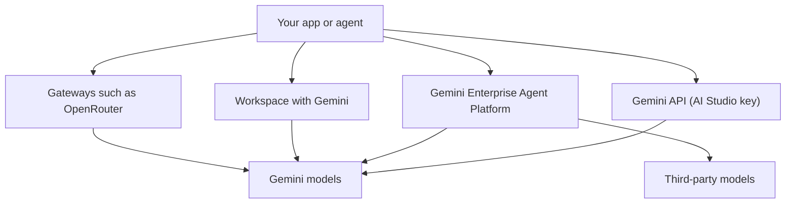

This is one of a set of parallel provider snapshots, each with the same headings. It covers Google, which builds models, runs the cloud they live on and ships the apps many firms already use.

**In one line:** Google makes the Gemini family of closed models, the open-weight Gemma models, and sells access through a consumer app, a developer API, Workspace, and an enterprise cloud platform, each with its own data terms.

## Why it matters

Google is one of the few companies that does everything in the chain: it builds the models, runs the cloud they live on, and ships the apps people already use, such as Gmail and Docs. If a firm uses Google Workspace, an assistant built on Gemini sits very close to its existing email, calendar and files.

It also matters because Google has several "front doors" to the same family of models, and they are not equal. The free developer route, the paid developer route, the Workspace route and the cloud platform route each come with different terms about what happens to your text.

<mark>With Google, "Gemini" names a family of models, not a contract: the data terms depend on which door you walk through.</mark>

## What it offers (as of October 2026)

**Gemini models.** Gemini is Google's main family of closed-weight models. Google's developer documentation lists them in three tiers, each available in more than one generation:

| Tier | What Google's documentation says it is for |
| --- | --- |
| Pro | The top tier by name; check Google's model pages for its stated strengths |
| Flash | Google's pages describe its Flash models as built for complex enterprise workflows |
| Flash-Lite | A lighter tier; Google says its lighter variants prioritise cost efficiency and speed for high-volume use |

Alongside these, Google lists specialised models for live voice conversation, text to speech, speech to text, image generation, video generation (Veo), music (Lyria), embeddings (see [embeddings](/data/embeddings/)) and robotics. Which generations are current changes often, so check the model list on Google's site rather than this page.

**Gemma (open weights).** Gemma is a separate family of smaller models whose weights Google publishes for download. Google's documentation lists sizes from small ones aimed at phones and laptops up to larger ones for servers. Gemma is not the same thing as Gemini: it is a different, smaller family built for people who want to run a model themselves.

**Apps.** The Gemini app is Google's consumer assistant, on the web, mobile, desktop and in Chrome. Google's overview page lists features such as voice conversation, Deep Research, a shared writing and coding workspace called Canvas, and custom assistants called Gems. Gemini is also built into Google Workspace products.

**Developer tools.**

- **Gemini API.** The route for developers, with a web tool called Google AI Studio for trying prompts and creating API keys. Official software kits exist for Python, JavaScript, Java and Go.
- **Gemini Enterprise Agent Platform.** Google Cloud's enterprise platform for building and running agents. Google's own page says it was formerly called Vertex AI. It includes a catalogue of 200+ Google and third-party models (see [model access platforms](/map/model-access-platforms/)).
- **Agent Development Kit (ADK).** Google's open-source framework for building agents, in Python, TypeScript, Go, Java and Kotlin. Its documentation says it works with Gemini, Claude, OpenAI models and locally run models, and agents can run on your own infrastructure or on Google Cloud. See [agent frameworks](/map/agent-frameworks/).
- **Antigravity.** Google describes it as its agentic development platform, with a desktop app, a terminal tool (one you run by typing commands in a text window, covered in [terminal basics](/building/terminal-basics/)), an SDK and an IDE (a code editor). Google also maintains an open-source terminal agent called Gemini CLI. Google has been reorganising its coding-agent products, so check which one is current before choosing.

## How to reach it

- **Direct, developer route.** Create a key in Google AI Studio and call the Gemini API. Quickest to start.
- **Direct, enterprise route.** Use the Gemini Enterprise Agent Platform inside a Google Cloud account, with Google Cloud's billing, access controls and data processing terms.
- **Inside Workspace.** Staff use Gemini in the apps they already have, under their organisation's Workspace admin settings.
- **Gateways.** Several gateways list Gemini models too. See [model access platforms](/map/model-access-platforms/) for how the three kinds of door compare.
- **Gemma.** Download the weights (Google points to Kaggle and Hugging Face) or use a host. See [open-model hosting](/map/open-model-hosting/).

## Licence and openness

Gemini is **closed-weight**: you can only use it through a service. Gemma is **open-weight**, and its licence changed between generations.

- Google's Gemma pages state that the newest generation is released under the **Apache 2.0** licence, a standard permissive licence.
- Earlier Gemma generations use Google's own **Gemma Terms of Use**. Those let you use, modify and distribute the models, but require you to pass on the use restrictions, include a copy of the terms, mark modified files, and follow a Prohibited Use Policy.

So the answer to "can we use Gemma commercially?" depends on which generation you download. Read the licence that ships with that exact download. For the wider picture, see [open vs closed weights](/under-the-hood/open-vs-closed-weights/).

## Data and compliance notes

Google's own pages show clearly different terms for each route. These are summaries, and terms vary by plan and change over time, so read the current text.

- **Gemini API, unpaid services.** Google's API terms say it may use submitted content and responses to improve its products and machine-learning technologies, and that human reviewers may read and annotate inputs and outputs.
- **Gemini API, paid services.** The same terms say Google does not use your prompts or responses to improve its products, and keeps logs for a limited period for abuse detection and legal needs.
- **Gemini app (consumer).** Google's Gemini Apps Privacy Hub says a subset of chats is reviewed by humans, and that conversations can be used to improve its systems unless you turn off the Keep Activity setting. It lists a default retention of 18 months with activity on, and 72 hours with it off. It says work or school accounts may be subject to different terms.
- **Workspace.** Google's Workspace privacy page says content is not human reviewed or used to train generative AI models outside your domain without permission.
- **Gemini Enterprise Agent Platform.** Google's cloud documentation says Google will not use your data to train or fine-tune models without your prior permission or instruction. It describes default in-memory caching for 24 hours, abuse-monitoring logging (with exceptions available for zero data retention), and some features, such as grounding with Google Search, that retain prompts for 30 days. Its practices sit under the Cloud Data Processing Addendum, with project-level data residency controls.

The practical lesson: a free API key and a Workspace account can sit at opposite ends of the privacy range. See [GDPR, data retention and DPAs](/running/gdpr-data-retention-and-dpas/).

## Things to watch

- **Names change.** Vertex AI became Gemini Enterprise Agent Platform. Old tutorials and Stack Overflow answers use the old name.
- **Free versus paid.** The same model can carry different data terms depending on whether the API usage is on a free or paid basis.
- **Generations move fast.** Google ships new Gemini generations and retires older ones on a schedule given in its documentation. Pin model names in settings and plan for swaps.
- **Product reshuffles.** Google's agent and coding products (ADK, Antigravity, Gemini CLI) are evolving and may be merged or replaced.
- **Gemma licence split.** Different Gemma generations carry different licences.

## Related

- [Model tiers](/models/model-tiers/): how Pro, Flash and Flash-Lite style tiers compare across providers
- [Model access platforms](/map/model-access-platforms/): the three kinds of door to a model
- [Open-weight options](/models/open-weight-options/): Gemma alongside other downloadable models
- [Data terms at a glance](/models/data-terms-at-a-glance/): the provider terms side by side
- [Agent frameworks](/map/agent-frameworks/): where ADK fits among the tools for building agents

## The proper terms

- **Model family:** a group of related models released under one name
- **Tier:** a size and capability level within a family, such as Pro or Flash
- **Open-weight model:** a model whose learned numbers are published for download
- **Apache 2.0:** a permissive open licence with few conditions on reuse
- **Prohibited use policy:** a list of uses a licence forbids
- **Grounding:** connecting a model's answer to a live source such as search
- **Data processing addendum:** a contract schedule setting how a provider handles your data
- **Data residency:** a control over which region stores and processes your data

## Next up

Next, a provider whose assistant is tied to a social network. [xAI](/models/xai/) covers the Grok family.
