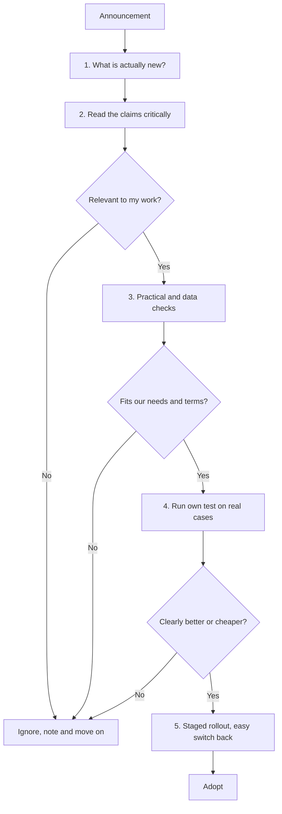

Carmakers launch new engines every season, and the brochure always says the new one is better. The provider pages are snapshots that will date; this page is the routine that will not, for deciding whether a newly launched model earns a place in your setup.

**In one line:** when a new model launches, read the announcement as marketing, check the practical and legal details, then test it on your own work before you change anything.

## The jargon: concepts covered on this page

- **Model family:** a line of related models from one maker
- **Eval:** a repeatable test set used to score an AI system
- **Blind scoring:** marking outputs without knowing which model wrote them
- **Noise:** random variation between runs that can look like a real difference
- **Staged rollout:** moving to a new model gradually, with a way back
- **Deprecation:** a provider announcing that a model will be retired
- **Harness:** the code around a model that adds tools, prompts and memory

## Why it matters

New models arrive often, each with a launch post that says it is better. Switching on that basis is risky. A model that looks stronger in a chart can be slower, more expensive, less careful with your kind of text, or covered by data terms that do not suit you.

Not switching has a cost too. A newer model can be cheaper or faster for the same quality, and old models are eventually retired.

You need a short, repeatable routine. It should take an afternoon for a first look and stop you from adopting or ignoring things for the wrong reasons.

<mark>A launch post tells you what to test, and only your own test tells you whether to switch.</mark>

## How it works

The routine has six steps. Each is short.

**Step 1: what is actually new?** Work out what kind of release it is. Is it a new family, a new tier within a family (a bigger, smaller, faster or cheaper variant, see [model tiers](/models/model-tiers/)), a new size, or a new mode such as reasoning or image input? A small update to an existing model line is a different decision from a new maker.

**Step 2: read the launch post critically.** A launch post is written by the people selling the model. That does not make it false, but it chooses what to show.

- **Claims versus evidence.** Look for what was tested, with what settings, and who ran it. Results run by the maker are less independent than results from outside groups. See [benchmarks](/under-the-hood/benchmarks/).
- **Fair comparisons.** Check that the comparison models were run under the same conditions, such as the same number of attempts, tools and thinking time.
- **What is missing.** If the post shows only some tasks, ask what was left out.
- **Anecdotes.** One impressive demo shows what the model can do on its best day.

**Step 3: check the practicalities.** A model that cannot do what your setup needs is not a candidate, however good it is.

- **Context window.** How much text fits in one request (see [tokens and context windows](/start/tokens-and-context-windows/))?
- **Input and output modes.** Does it accept images, documents or audio, and produce what you need (see [multimodal models](/using-ai/multimodal-models/))?
- **Tool use and structured outputs.** Does it support [tool use](/agents/tool-use/) and [structured outputs](/building/structured-outputs/) in the way your harness expects? Agents break when these are unreliable.
- **Speed.** Time to first word and total time. A slow model can be fine for overnight jobs and wrong for a live assistant.
- **Rate limits.** How many requests can you make per minute, and what happens when you hit the limit (see [rate limits, retries and failures](/running/rate-limits-retries-and-failures/))? New models often start with tight limits.
- **Availability.** Is it offered in your region, and through the cloud platform you already use?
- **Pricing structure.** How are input, output and extras like caching charged (see [how AI pricing works](/running/how-api-pricing-works/))? Compare cost per task, not per word.
- **Deprecation policy.** How much notice does the provider give before retiring a model? A short notice means rebuilding sooner.

**Data terms.** Check them next, before you test with anything sensitive. New models sometimes arrive as previews with different terms from the main product, such as logging or training allowed. See [data terms at a glance](/models/data-terms-at-a-glance/) for the questions to ask.

**Step 4: run your own small eval.** This is the step that matters most. An [eval](/running/evals/) is a repeatable test: the same inputs, scored the same way, each time you change something.

1. **Collect 20 to 30 real cases.** Pull them from the work you actually do. Remove or anonymise names, numbers and anything confidential first. Include a few awkward ones.
2. **Write down what good looks like.** For each case, note the right answer or a short checklist, before you see any model output. Writing it afterwards makes you grade to the answer you got.
3. **Run the current model and the new one on the same cases.** Use the same prompt and settings so the model is the only change.
4. **Score blind if you can.** Hide which output came from which model, or ask a colleague to mark them. A person who knows which is new tends to be kinder to it.
5. **Score a few things, not one.** Accuracy, missing information, invented facts, format, tone, plus cost and speed per case.
6. **Repeat awkward cases.** Models vary from run to run, so run each case two or three times.
7. **Read the failures.** Counts hide the interesting bit: how and why each version fails.

**What counts as noise.** With 25 cases, one case is 4 percentage points. A difference of one or two cases can vanish if you rerun. Treat a gap as real only if it is larger than the change you see when you rerun the same model, and if it appears across several kinds of case. A gap in a single type of case is a clue to dig into, not proof.

**Test in the real harness.** A chat window is not your setup. Your [agentic harness](/agents/agentic-harness/) adds your system prompt, tools, files and memory, and these change how a model behaves. A model that shines in chat can stumble when it must call tools in a long sequence. Run the test through the same code path your real work uses.

**Step 5: roll out in stages, with a way back.** Move one low-risk task first, or send a small share of traffic to the new model while watching results. Keep the old model configured so you can switch back in minutes. A setup that routes tasks to different models makes this easy (see [model routing](/running/model-routing/)). Keep your test set and re-run it when the provider updates the model, because the same name can change behaviour over time.

## In practice

You can do the first pass in one sitting: read the post for what is new, check the practical list and the data terms, and run your 20 to 30 cases. If the model passes, run it in the real harness for a week on non-critical work before you make it the default.

Keep a one-page log: the date, what you tested, the scores and the decision. When the next model launches, you start with the same cases, and the answer comes faster.

**Things that fool people:**

- **A pleasant tone read as accuracy.** A warm, fluent answer can be wrong. Check facts, not style.
- **Long, confident answers.** Length and certainty are not evidence. Models, and model judges, often favour longer answers.
- **Single examples.** One great or terrible answer says little. Use the whole set.
- **Leaderboards.** A ranking measures what was tested, not your work. It can also shift because of how people vote or how the test was run.
- **Your own bias.** You will notice what you expect to see. Blind scoring helps.
- **Novelty.** A model you are excited about gets the benefit of the doubt.

## Worked example

Sample Ventures reads that a new model has been released. The operations lead wants to know if it should draft first replies to intro emails from founders.

She starts with step 1 and finds a new tier of an existing family, with image input added. She notes that the launch post reports only results the maker ran, and lists no tests on email writing, so it gives her no evidence for her task.

On practicalities, the model supports structured outputs and is available in the cloud the firm already uses. The data terms are the same as the current model's. She moves on.

She builds a test of 25 anonymised intro emails: names and companies replaced with placeholders, nothing confidential. For each she writes a short checklist: reply addresses the founder's actual question, makes no claim about the fund's intentions, asks for the right follow-up, and stays under 150 words. An associate scores the old and new models' drafts without knowing which is which.

The new model passes 21 cases and the current one 20. She reruns and the gap disappears. The new one is faster and the cost per draft is lower. Quality did not clearly change, so the benefit is speed and cost.

She switches one low-risk task, keeps the old model configured, and re-runs the 25 cases a month later.

## Costs and limits

- **The test costs time, not much money.** 25 cases cost very little to run. Building good cases and scoring them takes hours.
- **Small tests find big differences only.** They are good at spotting a clear improvement or a clear failure, and weak at detecting small ones.
- **Your cases go stale.** Add real failures as they appear, and retire cases that no longer reflect the work.
- **Models change under the same name.** Some providers update a model in place. Re-run your test now and then.
- **Switching has hidden costs.** Prompts tuned for one model may behave differently on another.

## Often confused with

**Benchmark vs eval.** A benchmark is a public test for comparing models in general. An eval is your own test, using your work. Use the first to pick candidates and the second to decide.

**Trying vs testing.** Chatting with a model for ten minutes is trying. Running it on fixed cases with scoring is testing.

## Related

- [Benchmarks](/under-the-hood/benchmarks/): what public scores can and cannot tell you
- [Evals](/running/evals/): building and running tests for AI systems
- [Data terms at a glance](/models/data-terms-at-a-glance/): the data questions to ask any provider
- [Model routing](/running/model-routing/): sending different tasks to different models, and switching back
- [Model tiers](/models/model-tiers/): how models in one family are sized and priced

## Next up

Knowing the carmakers is one half of the picture. The other half is how people actually reach an agent day to day, so the last elective, [Comms channels](/channels/), covers connecting an agent to the chat apps and email people already use.
