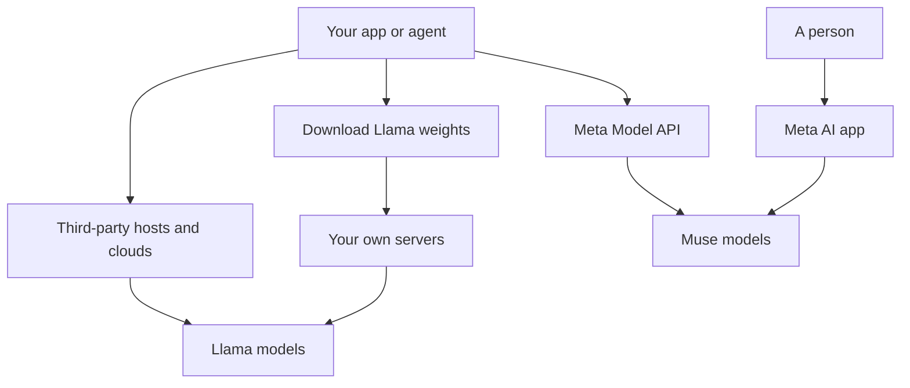

This is one of a set of parallel provider snapshots, each with the same headings. It covers Meta, whose Llama family is best known as weights you download and run yourself.

**In one line:** Meta publishes the Llama family as downloadable open-weight models under a custom licence, and has also launched a separate, currently proprietary family called Muse.

## The jargon: concepts covered on this page

- **Community licence:** a custom licence for open weights with conditions beyond standard terms
- **Monthly active users:** the number of distinct people using a product in a month
- **Mixture of experts:** a design where only part of the model runs for each token
- **Public preview:** a service open to use but still changing, with fewer guarantees
- **Fine-tuned model:** a model trained a little further on extra examples
- **Derivative work:** a new model or product built from an existing one

## Why it matters

Llama is a widely used example of a large company publishing a model's weights for anyone to download. Many hosting companies, cloud services and tools offer Llama models, so you will meet the name even if you never contact Meta.

Meta now has two different lines, and they work differently. Llama can be downloaded and run anywhere. Muse, from Meta Superintelligence Labs, is offered through Meta's own app and API. A reader who knows Meta only as "the open-weights company" will miss half the picture.

<mark>"Open weights" here means you can download and run the model under Meta's licence, which is not the same as open source in the strict sense.</mark>

## What it offers (as of October 2026)

| Line | What it is | How it is offered |
| --- | --- | --- |
| Llama | Open-weight models. The newest generation listed on Meta's developer site is described as natively multimodal with a mixture-of-experts design (see [multimodal models](/using-ai/multimodal-models/)) | Download, plus third-party clouds and hosts |
| Muse | Meta Superintelligence Labs' newer models, including Muse Spark; the developer site also lists Muse Image, Muse Voice Transcribe and Muse Glimmer, which Meta positions for local, always-on agents | Meta AI app, Meta Model API, Muse Code |
| SAM | Segment Anything: models that detect and outline objects in images and video | Listed on Meta's developer site and in the Meta Model API |

**Llama sizes.** Meta's repository lists Llama generations from 2023 onward, in sizes from about one billion to several hundred billion parameters (see [parameters and temperature](/under-the-hood/parameters-and-temperature/)). Small ones are meant for laptops and phones.

**Muse.** Meta's announcement describes Muse Spark as the first model from Meta Superintelligence Labs, powering the Meta AI app and website. Meta's later post says Muse Spark is available in Muse Code, a terminal-based coding tool (one run by typing commands in a text window, covered in [terminal basics](/building/terminal-basics/)), and in the Meta Model API, and that its roadmap includes a Muse Spark open-weights release. At the time of writing Muse Spark itself was proprietary, and Meta states no date for that release.

**Meta AI.** This is Meta's assistant, used in its own app and website, and Meta said it would extend Muse Spark to WhatsApp, Instagram, Facebook, Messenger and Threads.

## How to reach it

- **Llama, download.** Meta's pages direct you to accept the licence, then fetch the weights from Meta or from Hugging Face. You run them with your own tools on your own machines. See [inference](/under-the-hood/inference/).
- **Llama, via hosts.** Cloud services and specialist hosting companies run Llama for you and charge by use. See [open-model hosting](/map/open-model-hosting/) and [model access platforms](/map/model-access-platforms/).
- **Muse, Meta Model API.** Meta's developer pages say the API is in public preview, self-serve, and accessible to developers in the US. It is compatible with the OpenAI software kit, so existing code can often point at Meta's endpoint. Check for current availability outside the US.
- **Meta AI app.** For consumer use rather than building.

## Licence and openness

Llama is **open-weight under a custom licence**, the Llama Community Licence. There is a separate version for each generation. Based on the Llama 4 text on Meta's GitHub repository, the main conditions are:

- **Large-user threshold.** If your products had more than 700 million monthly active users in the month before the release date, you must request a separate licence from Meta.
- **Attribution.** If you distribute Llama materials or products built on them, you must show "Built with Llama" and include Meta's copyright notice.
- **Naming.** An AI model you create or improve using Llama materials and distribute must have "Llama" at the start of its name.
- **Acceptable use policy.** Use must follow Meta's policy, which bans categories such as illegal activity, harassment, unlicensed professional practice, malware and deception.
- **Patent clause.** The licence ends if you sue Meta claiming Llama infringes your intellectual property.
- **California law** governs.

**EU restriction.** Meta's Llama 4 acceptable use policy says that for the multimodal models in that generation, the rights are not granted to an individual domiciled in, or a company with its principal place of business in, the European Union. The same text says this does not apply to end users of products built on those models. Earlier generations may differ, so read the version you download. A firm in London should check the UK position with its own adviser, as this page has not verified it.

**Not the OSI sense of open source.** The Open Source Initiative's definition asks for the training code and detailed data information, not only the weights, and free use without field or user restrictions. Llama's thresholds, naming rules and use policy are the kind of conditions that make the licence custom rather than standard. See [open vs closed weights](/under-the-hood/open-vs-closed-weights/).

Muse Spark is currently proprietary, per Meta's announcement.

## Data and compliance notes

- **Llama.** Meta does not see your prompts when you run Llama yourself. If a host runs it for you, the host's terms decide retention, training and regions. Treat each host as its own supplier and read its terms. See [GDPR, data retention and DPAs](/running/gdpr-data-retention-and-dpas/).
- **Meta Model API.** Meta's developer page links to its general Terms of Service and Privacy Policy and gave no API-specific data handling statement on the page checked. Read those documents directly.
- **Meta AI app.** This page did not verify the app's data terms, because Meta's privacy page could not be retrieved automatically. Read them before putting anything sensitive in.

## Things to watch

- **Two strategies in one company.** Muse is proprietary for now, with an open-weights release promised but undated. The pages checked did not describe plans for future Llama generations.
- **Licence versions.** Each Llama generation has its own licence and policy. Do not assume the last one applies.
- **EU clause.** The multimodal restriction for EU-based companies matters to European buyers; check before building on it.
- **Preview status.** The Meta Model API is in public preview, US-only at the time of writing.
- **Naming obligations.** Distributing a fine-tuned Llama model triggers the naming and attribution rules.

## Related

- [Open-weight options](/models/open-weight-options/): Llama alongside other downloadable models
- [Open-model hosting](/map/open-model-hosting/): who runs an open model for you
- [Open vs closed weights](/under-the-hood/open-vs-closed-weights/): what the term does and does not promise
- [Quantisation](/under-the-hood/quantisation/): shrinking models so they fit smaller hardware
- [Data terms at a glance](/models/data-terms-at-a-glance/): provider terms side by side

## Next up

Next, a European lab that mixes downloadable models with paid services. [Mistral AI](/models/mistral/) shows how the licence can change from one sibling model to the next.
