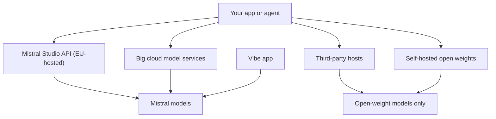

This is one of a set of parallel provider snapshots, each with the same headings. It covers Mistral AI, the Paris-based lab that sells some models as a service and publishes others as open weights.

**In one line:** Mistral AI is a Paris-based lab that offers a mix of downloadable open-weight models and commercial models, reachable through its own apps and developer platform, through big clouds, or on your own hardware.

## Why it matters

Mistral is the European model provider covered in this guide. For a UK firm that is weighing where its data is processed, a provider that is incorporated in France and says it hosts its own service in the EU is a different conversation from a US or Chinese one. That is a fact about contracts and location, not a verdict on quality.

It also matters because Mistral mixes two business models. Some of its models are published as [open weights](/under-the-hood/open-vs-closed-weights/) under a standard permissive licence, so anyone can run them. Others are sold only through paid services. Knowing which is which saves you from assuming "Mistral" means one thing.

<mark>With Mistral, the licence and the route matter more than the brand: one model may be free to download and run, while its sibling is only sold as a service.</mark>

## What it offers (as of October 2026)

Mistral's own documentation groups its models into families rather than one line. The names below are families and tiers only; versions change often, so check the live model list.

| Family or product | What the documentation says it is |
| --- | --- |
| Large, Medium and Small | General-purpose models that can read text and images. Small is described as combining instruction following, reasoning and coding in one model, and its model card describes a mixture of experts design (only part of the model works on each word) |
| Ministral | A series of small models for lighter hardware, with text and vision |
| OCR | Document models that read scanned pages and PDFs and return text with layout information such as bounding boxes and block labels |
| Codestral | A model family for code completion |
| Embedding models | Models that turn text or code into numbers for search (see [embeddings](/data/embeddings/)) |
| Voxtral | Speech models for transcription and text to speech |
| Moderation and safety models | Models that screen text for unsafe content |

**Apps and platform.** Mistral's chat assistant was known as Le Chat. Mistral's website now presents a product called Vibe, described as an agent for longer pieces of work, with plans called Free, Pro, Team and Enterprise, and over 100 connectors including MCP compatibility. The site's footer links "Get Mistral Vibe", and Mistral's privacy policy refers to "Vibe conversations", so Vibe appears to be the new name for the assistant, but check the site if the name matters to you.

For developers, the API platform is now called **Studio** (earlier materials call it La Plateforme). The documentation lists OCR, building agents with tools, document search and workflows. A separate product, Forge, is described as custom model training, and Compute as infrastructure for training and running models.

**Document AI.** Mistral's Document AI documentation describes an OCR processor, structured data extraction ("annotations") and question answering over documents, available through its SDKs and an `ocr` API endpoint. This is the part most relevant to reading data room PDFs. See [specialised models](/map/specialised-models/) for where this fits.

## How to reach it

- **Direct.** Sign up for Studio, create an API key and call the models. Mistral's site says its Mistral Cloud runs on "servers hosted in the EU". You can also use the Vibe app.
- **Through big clouds.** Mistral's site lists Google Cloud, AWS, Azure, SAP, IBM, Snowflake, NVIDIA and Outscale as cloud partners. Not every model or feature is on every cloud, so check the specific one. See [model access platforms](/map/model-access-platforms/).
- **Self-hosted or private.** Mistral's site says Studio can be deployed on a virtual cloud, at the edge or on premises. The open-weight models can also be downloaded and run by you or a host. See [open-model hosting](/map/open-model-hosting/).

## Licence and openness

Mistral publishes many weights, but not all, and the licences differ by model. Read the card for the exact model you plan to use.

- **Apache 2.0.** Mistral's model overview lists its Small and Large general models, the Ministral series and some speech and safety models as Apache 2.0 open weight. The Hugging Face cards for Small and Large state Apache 2.0.
- **Modified MIT.** The Hugging Face card for the Medium model says "Modified MIT License", with exceptions for companies with large revenue. Mistral's own overview describes Medium as commercial, so the two pages are worth reading together before you rely on either.
- **Other terms.** The overview lists the text to speech model under CC BY-NC 4.0, which is non-commercial. Premier-tier models such as OCR, Codestral and the embedding models are sold through Mistral's services.

For plain definitions of these terms, see [open vs closed weights](/under-the-hood/open-vs-closed-weights/).

## Data and compliance notes

These notes come from Mistral's own legal pages and may change. They are not legal advice.

- **Who Mistral is.** The privacy policy says Mistral AI is a French company incorporated in Paris, and acts as controller for consumer users.
- **Where data goes.** The policy says Mistral prioritises providers in the EU that adhere to the GDPR, may use non-EU providers, and attaches Standard Contractual Clauses to those contracts. Mistral's site says Studio on Mistral Cloud uses servers hosted in the EU.
- **Commercial customers.** Mistral publishes a Data Processing Addendum. It says the customer is the controller and Mistral AI is the processor, with a sub-processor list on its Trust Center and a right to object to changes. Mistral also acts as a controller for some purposes, including training models on feedback inputs and outputs unless you opt out.
- **Retention.** The privacy policy gives 30 rolling days for API data for abuse monitoring, unless zero retention is enabled. Vibe conversations are kept until deleted.
- **Training.** The privacy policy says input and output may be used for training "subject to your opt-out" for consumers, with an account setting to object. Terms for paid and enterprise plans can differ, so confirm yours.

Self-hosted open weights stay on your own infrastructure, so none of the hosted-service terms apply to them. See [GDPR, data retention and DPAs](/running/gdpr-data-retention-and-dpas/).

## Things to watch

- **Naming has changed.** The assistant, the platform and the product lines have all been renamed or reorganised. Documentation and blog posts from earlier periods may use old names.
- **Licence varies by model.** A family name does not tell you the licence. Check the card each time.
- **Deprecations.** Mistral's overview lists many deprecated models. If an agent pins a model name, plan for it to be retired.
- **Cloud versions can differ.** The same model on a cloud may carry that cloud's terms, regions and rate limits.
- **Consumer and business terms differ.** Opt-out and retention settings for the app are not the same as the API's.

## Related

- [Model tiers](/models/model-tiers/): how large, medium and small models differ in general
- [Open-weight options](/models/open-weight-options/): the wider set of models you can download
- [Data terms at a glance](/models/data-terms-at-a-glance/): a side-by-side view of provider data terms
- [Specialised models](/map/specialised-models/): OCR, embeddings and speech models
- [Model access platforms](/map/model-access-platforms/): the doors to reach a model

## The proper terms

- **Open weights:** model files published for anyone to download and run
- **Apache 2.0:** a permissive licence allowing commercial use with few conditions
- **OCR:** software that reads text from scanned pages and images
- **Mixture of experts:** a model design that activates only part of its parameters per word
- **Data processing addendum:** a contract schedule setting how a supplier handles your personal data
- **Zero retention:** a setting where the provider keeps no copy of your requests

## Next up

Next, a lab that publishes its models as open weights while running its hosted service from China. [DeepSeek](/models/deepseek/) shows why the model file and the company's own service are two separate questions.
