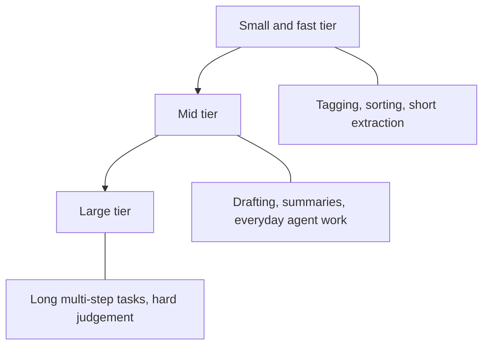

Every carmaker sells a range of engines, from small and frugal to large and powerful, and every model provider does the same. This page explains that ladder, so the provider pages that follow are easier to read.

**In one line:** a model family is a set of related models from one provider, and a tier is the size-and-speed level within it, so you can pick the cheap fast one for simple jobs and the heavyweight for hard ones.

## The jargon: concepts covered on this page

- **Model family:** a set of related models sold under one name
- **Tier:** a size and speed level within a family
- **Reasoning effort:** a setting for how long a model thinks before answering
- **Alias:** a model name that points at whichever version the provider chooses
- **Snapshot:** a fixed version of a model that does not change
- **Pinning:** choosing a fixed model version so results stay repeatable
- **Deprecation:** a provider's notice that a model will be switched off
- **Retirement:** the date a model stops answering requests

## Why it matters

Nobody sells one model any more. Each provider sells a family, with a larger model that handles hard work, a smaller one that answers quickly and cheaply, and often something in between. Picking the right level for each job is one of the biggest levers you have on cost and speed.

It also matters because names move fast. A model you rely on today will be replaced, and later switched off. If you understand tiers, you can ignore most of the naming noise and ask the same few questions every time.

<mark>Choose a tier for each job and keep the model name in a setting, because the name will change but the trade-off between capability, speed and cost will not.</mark>

This section of the guide therefore talks about families and tiers, not version numbers. Version numbers would be out of date within weeks.

## How it works

Think of a restaurant kitchen. A head chef can cook anything, but is slow and expensive, so you would not ask them to butter toast. A line cook is fast and cheap and handles the routine orders. Providers sell both, and you decide who cooks what.

A model's size is set in training. Bigger models (more **parameters**, the learned numbers inside, see [what an LLM is](/start/what-an-llm-is/)) tend to cope better with long, tangled or ambiguous tasks, but each answer takes more computing power. Smaller models give up some of that depth in return for speed and lower cost per answer (see [inference](/under-the-hood/inference/)).

Read the diagram from top to bottom: capability and cost per answer rise, speed falls. Where one job sits is a judgement call that you test, not a rule.

**Reasoning versus non-reasoning.** Separate from size, many models can spend extra effort thinking before they answer. This is a [reasoning model](/using-ai/reasoning-models/) behaviour. Some providers sell it as a separate family; others make it a setting on the same model, often called reasoning effort. More thinking usually means a slower, costlier answer, so it is a second dial next to the tier.

**Specialised variants.** Besides general text models, providers sell models for one job: embeddings (turning text into numbers for search, see [embeddings](/data/embeddings/)), speech in and out, image generation, and live voice. These are priced and limited separately from the chat models. See [specialised models](/map/specialised-models/).

**Why several tiers exist.** The trade-off between speed, cost and capability cannot be removed, so providers sell points along it. This also makes [model routing](/running/model-routing/) possible: sending each request to the tier that suits it.

**Names and versions churn.** Providers release new generations often, so a family name stays while the version behind it changes. The names also differ by provider. That is why the pages in this section describe families and tiers, and why you should check the provider's own page for what exists today.

**Deprecation and retirement.** Every provider eventually switches old models off, and each publishes a schedule. This is deprecation (marked for removal) followed by retirement (requests fail). A system that calls one model by name in twenty places breaks twenty times.

**Aliases and pinned versions.** A model name can work in two ways. An alias is a moving label that points at whatever the provider currently treats as the right version. A pinned (or snapshot) name points at one fixed version. Aliases save effort but can change behaviour under you. Pinned names give repeatable results but must be updated by hand before retirement.

## In practice

**Snapshot, as of October 2026.** These are tier labels the providers use themselves. They will date, so check the provider pages.

- **Anthropic** names its Claude tiers Fable, Opus, Sonnet and Haiku. Its documentation describes Haiku as its fastest, Sonnet as balancing speed and intelligence, and Opus and Fable as aimed at longer agentic and demanding reasoning work. It also lists a further tier, Mythos, that it says is only for vetted organisations.
- **OpenAI** names its current flagship GPT tiers Astra, Sol and Luna. Its documentation describes Astra as the most capable, Sol as near-Astra performance at lower cost, and Luna as its most efficient for focused, high-volume tasks. Reasoning effort is a setting on these models.
- **Google** uses Pro, Flash and Flash-Lite for its Gemini family. Its documentation describes Flash-Lite as the fastest and most cost-effective option for high-throughput work, and Pro as the option for advanced reasoning.

On deprecation, Anthropic's documentation states a minimum of 60 days' notice before retiring a publicly released model, with statuses of active, legacy, deprecated and retired. OpenAI's documentation gives minimum notice that varies by model type (at least six months for generally available models, shorter for specialised and preview ones). Google's documentation lists earliest possible shutdown dates and says it will give advance notice of the exact date. Terms differ by provider and can change, so read the current page.

On aliases, Anthropic's documentation says older aliases point to the newest dated snapshot, while its newer model IDs are fixed and an update ships under a new ID. Google's documentation describes a "latest" label that updates automatically alongside stable and preview versions. OpenAI's deprecation page shows both aliases and dated snapshots, and says timelines apply to specific versions.

Cloud platforms set their own schedules too. Anthropic notes that its dates apply to platforms it operates, and that partner-operated clouds may differ.

## Worked example

Sample Ventures runs an agent over its notes and its data room. The operations lead assigns a tier to each of three jobs.

1. **Tag notes.** Each meeting note gets a sector and stage label. The task is short, repetitive and easy to check. She starts with the small, fast tier, because a wrong tag is cheap to spot and fix.
2. **Draft a memo.** An associate wants a first-draft investment memo on Acme Payments from several sources. Quality of judgement and writing matters more than speed. She tries the mid tier first and moves up to the large tier only if drafts need heavy rewriting.
3. **Answer from the data room.** A partner asks a question that needs reading many documents and weighing conflicting figures. This is where a larger tier, or a reasoning setting, may earn its cost. She tests it on ten past questions with known answers (see [evals](/running/evals/)).

She writes each model name into one settings file, not into the code. When a provider announces a retirement, she changes one line, reruns the ten questions, and compares.

## Costs and limits

- **Bigger is not always better for the job.** A large model on a trivial task wastes money and time. A small one on a hard task wastes people's time on rework.
- **Tiers overlap.** A newer small model can match an older mid model on some tasks. Test on your own work, not on general claims (see [benchmarks](/under-the-hood/benchmarks/)).
- **Reasoning adds cost.** The extra thinking is billed as output text, and it adds delay. See [how AI pricing works](/running/how-api-pricing-works/).
- **Hard-wired names break.** Retirement dates arrive on the provider's schedule, not yours.
- **Floating aliases can shift behaviour.** A prompt that worked well last month may behave differently after an alias moves. Pin versions for anything you depend on, and watch the retirement dates.
- **Same name, different place.** A model reached through a cloud platform can have different features or schedules from the maker's own API.

## Often confused with

**Tier vs version.** A tier is a size level (small, mid, large). A version is a release of the family. A new version usually has all its tiers refreshed over time, and not always on the same day.

## Related

- [Model routing](/running/model-routing/): sending each task to a suitable tier automatically
- [Reasoning models](/using-ai/reasoning-models/): the extra thinking dial that sits beside the tier
- [How to judge a new model](/models/how-to-judge-a-new-model/): a repeatable test for each launch
- [Model access platforms](/map/model-access-platforms/): the doors through which tiers are reached
- [Estimating cost per task](/running/estimating-cost-per-task/): turning a tier choice into a number

## Next up

With the ladder in mind, the provider pages show how each maker labels its own. They are parallel snapshots in no order of merit, starting with [Anthropic](/models/anthropic/), the maker of the Claude family.
