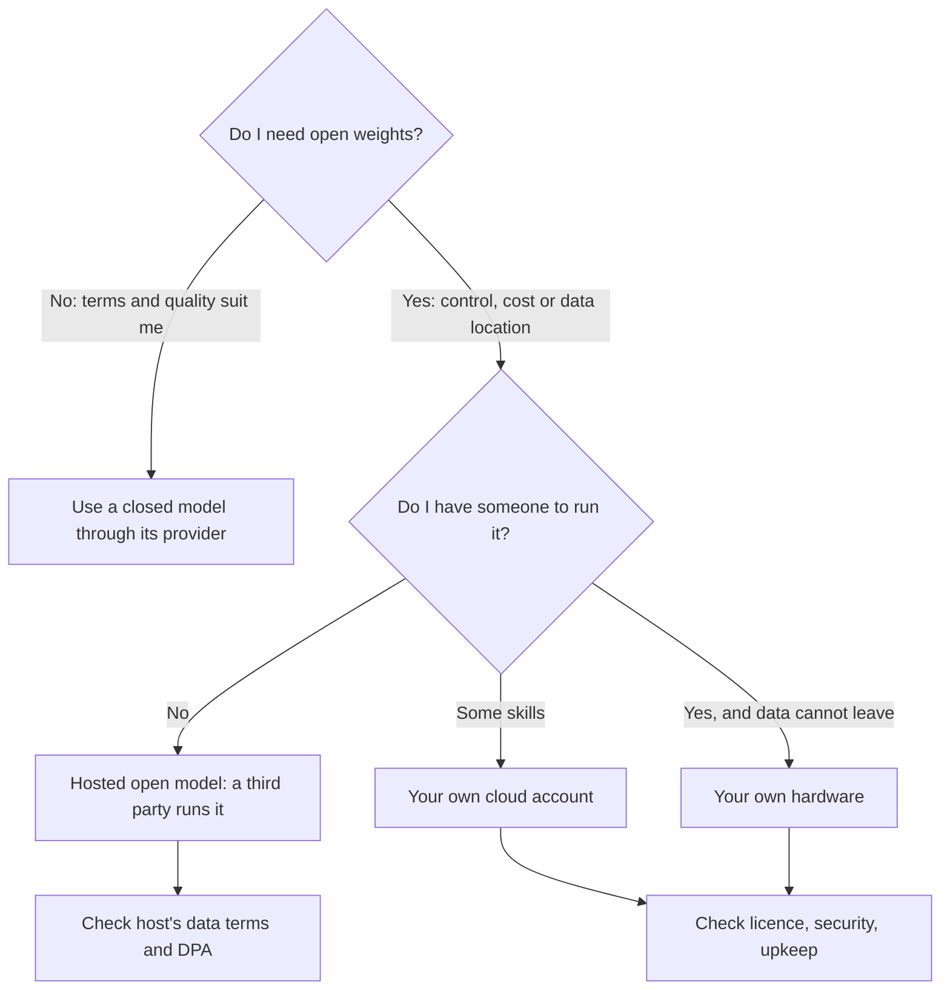

Several of the provider pages mention models you can download. This page lines them up side by side, grouped by the licence that decides what a business may do with each.

**In one line:** an open-weight model is one you can download and run yourself, and the licence attached to it, not the word "open", tells you what a business may do with it.

## Why it matters

Open-weight models give you a choice that closed models do not: you can bring the model to your data instead of sending your data to the model's maker. For a small firm that handles confidential material, that is worth knowing about even if you never use it. If the idea is new, start with [open vs closed weights](/under-the-hood/open-vs-closed-weights/).

The catch is that "open" covers a wide range of legal terms. Some licences are as relaxed as a standard software licence. Others add conditions about company size, naming or allowed uses. A few forbid commercial use entirely.

This page is a map, not a ranking. It lists families a business could realistically use as of October 2026, grouped by licence type. It makes no claims about which model is more capable.

<mark>The licence on the model card, not the word "open", decides what your business may do with a model.</mark>

## How it works

**Three groups of licence.** Each licence below was read on the maker's own model card or licence file. A maker can use different licences for different models in the same family, so treat each row as an example and check the card of the exact model you want.

**Permissive licences (Apache 2.0, MIT).** These let you use, change and share the model commercially, with few conditions beyond keeping the licence notice. Apache 2.0 also includes an explicit patent grant. They are the easiest to get through a legal review.

**Custom or modified licences with conditions.** The maker wrote its own terms, or took a standard licence and added to it. Common conditions are a size threshold (above a certain number of users or amount of revenue you need a separate agreement), a naming or credit rule, and an acceptable-use policy that lists banned uses.

**Restricted or research-only licences.** These allow study and non-commercial use but not building a paid product. A business needs a separate commercial agreement.

| Family | Maker | Licence as stated on the model card | Notes |
| --- | --- | --- | --- |
| gpt-oss | OpenAI | Apache 2.0 | Card says the smaller model needs about 16GB of memory, thanks to a compressed format |
| Gemma (newest generation) | Google DeepMind | Apache 2.0 | Google's open-source blog calls it the first Gemma generation under Apache 2.0; sizes run from small edge models up to 31 billion parameters |
| Qwen | Alibaba's Qwen team | Apache 2.0 on the model card checked | Check each size and release; licences within a family can differ |
| DeepSeek | DeepSeek AI | MIT | Card says the repository and the weights are under MIT |
| Mistral (Small and Large families) | Mistral AI | Apache 2.0 on the cards checked | Mistral also has other models with different terms (next row) |
| Phi | Microsoft Research | MIT | Small models aimed at modest hardware |
| OLMo | Allen Institute for AI | Apache 2.0 | Ai2 also publishes training code and datasets, which is closer to the open source AI definition than most |
| Granite | IBM | Apache 2.0 | Aimed at business use |
| Mistral (Medium family) | Mistral AI | Modified MIT | No rights above $20 million of global monthly company revenue unless you get a commercial licence or use Mistral's hosted service |
| Kimi | Moonshot AI | Modified MIT | Products above 100 million monthly users or $20 million monthly revenue must display "Kimi K2" in the interface |
| Gemma (earlier generations) | Google | Gemma Terms of Use (custom) | Commercial use allowed; bound by Google's prohibited use policy; redistribution conditions apply |
| Llama | Meta | Llama community licence (custom) | Separate licence needed above 700 million monthly users; "Built with Llama" credit; "Llama" at the start of the name of models you train from it; acceptable-use policy; California law |
| Command | Cohere | CC-BY-NC plus acceptable-use policy | Non-commercial: a business needs a separate agreement with Cohere |

The Llama row comes from the licence on one release's model card. Meta writes a new licence for each release, so read the one that matches the model you pick.

**What to check in a licence.** Read these six points before you build anything customers depend on:

1. **Commercial use.** Is it allowed at all? Non-commercial licences rule out paid products and often internal business use.
2. **Thresholds.** Are there user or revenue limits that trigger a separate agreement? A small firm may be far below them, but a portfolio company that grows might not be.
3. **Attribution and naming.** Do you have to display a credit or put the family name at the start of anything you build on it?
4. **Acceptable-use policy.** Which uses are banned? Check that your use case, and your customers' use cases, are not on the list.
5. **Outputs and training other models.** Can you use the model's answers to train or tune another model? Some licences say yes, some restrict it. If you plan to fine-tune or build a smaller model from outputs, this matters.
6. **Jurisdiction.** Which country's law governs, and where would a dispute be heard? Some custom licences name a US state.

**Weights-only licence vs open source AI.** Almost every model in the table is a weights release: you get the trained numbers and perhaps a technical report. The Open Source Initiative's Open Source AI Definition asks for more, including sufficiently detailed information about the training data and the code. Few releases meet it. A licence like Apache 2.0 on the weights is good news for you as a user, but it does not mean the whole system is open source. See [open vs closed weights](/under-the-hood/open-vs-closed-weights/).

**Size classes, in plain terms.** A model's size is counted in parameters, the learned numbers inside it (see [parameters and temperature](/under-the-hood/parameters-and-temperature/)). Roughly, more parameters means more memory needed to run it.

- **Small (a few billion parameters).** Runs on a laptop or a modest single machine. Good for simple, narrow jobs.
- **Medium (roughly 10 to 70 billion).** Needs a serious graphics card or several. Usually run on rented machines.
- **Large (100 billion and up, some above a trillion).** Needs a cluster of data-centre cards. Some of these are "mixture of experts" designs that only use part of the model for each word, which cuts the work but not the storage.

A rough rule: at full precision each billion parameters needs about 2GB of memory. [Quantisation](/under-the-hood/quantisation/), which stores the numbers with less detail, can cut that to a quarter or less, at some cost in quality. Your needs are the model plus working space for the conversation, so leave headroom.

**Open weights are not automatically private.** If you run the model on your own machine or in your own cloud account, your text stays there. If you use a third-party host for an open model, that host's data terms apply, not the model maker's licence. See [GDPR, data retention and DPAs](/running/gdpr-data-retention-and-dpas/) and the [data terms at a glance](/models/data-terms-at-a-glance/).

## In practice

Open models are published on sites such as Hugging Face and run with tools such as Ollama or vLLM, or rented from hosting companies. See [open-model hosting](/map/open-model-hosting/) for who does what.

Many small firms never need any of this. Closed models with strong business data terms are simpler. Open weights earn their place when data must stay inside your own environment, when you want a fixed model that cannot change under you, or when you want to fine-tune.

## Worked example

Sample Ventures wants a small assistant that reads notes about Acme Payments and other startups inside the firm's own cloud account. The operations lead shortlists two open families.

She opens each model card and writes down the licence. One is Apache 2.0, so she notes only the notice requirement. The other is a custom licence with a user threshold, a credit rule and an acceptable-use policy. She checks that the firm is far below the threshold, that the policy does not list its use case, and that the governing law is acceptable to the firm's adviser.

Then she asks where it will run. The firm has no spare graphics cards, so the model would run on rented machines in its cloud account. She records that data stays in the account, that the firm owns security and updates, and that someone must be named to do the upkeep.

## Costs and limits

- **You pay for machines, not per use.** Running a model yourself has a fixed cost that is often worth it only at steady, high volume.
- **Licences change.** A new release can arrive with different terms, and a licence only covers the version it came with.
- **Someone must look after it.** Updates, access control and monitoring are your job, and [prompt injection](/running/prompt-injection/) is still a risk.
- **Capability varies a lot by size and release.** This page makes no performance claims. Test on your own cases (see [how to judge a new model](/models/how-to-judge-a-new-model/)).
- **Cards can be wrong or out of date.** If the licence matters to a decision, read the licence file itself and ask a lawyer.

## Often confused with

**Open weights vs open source.** Open weights means the trained numbers are published. Open source AI, as the Open Source Initiative defines it, also needs detailed data information and code.

**Permissive vs free of conditions.** Even Apache 2.0 and MIT carry conditions, such as keeping the licence notice. They are just short ones.

## Related

- [Open vs closed weights](/under-the-hood/open-vs-closed-weights/): the concept behind this page
- [Quantisation](/under-the-hood/quantisation/): how large models are shrunk to fit smaller hardware
- [Open-model hosting](/map/open-model-hosting/): who runs an open model for you
- [Data terms at a glance](/models/data-terms-at-a-glance/): what major providers say about your data
- [Model tiers](/models/model-tiers/): small, medium and large models within a family

## The proper terms

- **Open-weight model:** a model whose trained numbers are published for download
- **Permissive licence:** a licence with few conditions, such as Apache 2.0 or MIT
- **Community licence:** a custom licence with extra conditions such as size thresholds
- **Acceptable-use policy:** a list of uses the licence bans
- **Parameters:** the learned numbers inside a model
- **Mixture of experts:** a design that uses only part of the model for each word
- **Quantisation:** storing a model's numbers with less detail to save memory
- **Self-hosting:** running a model on infrastructure you control

## Next up

Running a model yourself is one way to control where your data goes; reading a provider's terms closely is the other. [Data terms at a glance](/models/data-terms-at-a-glance/) sets those terms side by side.
