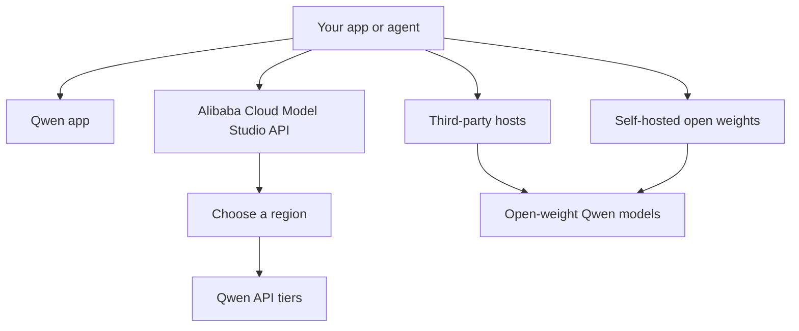

The last of the parallel provider snapshots covers Alibaba's Qwen family in full, then gives a short, fast-changing list of other labs worth knowing.

**In one line:** Qwen is Alibaba's model family, offered as an app, as a cloud API and as downloadable open weights under more than one licence, and it sits alongside a long tail of other labs that change quickly.

## Why it matters

Qwen is one of the most frequently published open-weight families, so you will meet it even if you never sign up for an Alibaba account. Many hosts and tools list Qwen models next to the American and European ones, and several other models are built on top of Qwen weights.

It also shows a point the open-weight section keeps returning to: a single family can have closed models, permissive open models and open models with conditions, all at the same time. The family name does not tell you the licence or where your data goes.

<mark>Within one family such as Qwen, some models are Apache 2.0, some carry a custom community licence, and the largest may be API only, so check the specific model.</mark>

## What it offers (as of October 2026)

- **Qwen app.** Alibaba's Qwen web and mobile app (chat.qwen.ai) describes chat, image and video understanding, image generation, document processing, tool use, voice chat and artifacts.
- **API tiers.** Alibaba Cloud's Model Studio describes three Qwen tiers: Max ("the highest-performing model in the Qwen series"), Plus (balancing performance and cost) and Flash (low cost, low delay, for simpler tasks). Model Studio is described as OpenAI-compatible, so existing code often needs only a new key, address and model name.
- **Third-party models too.** Model Studio also lists DeepSeek, Kimi and GLM models alongside Qwen, so it works as a model access platform as well as a Qwen door.
- **Open weights.** Qwen's Hugging Face page lists text and multimodal models in a range of sizes, safety "guard" models and image models. The Max tier's model page presents it as available via API; its weights were not found among those downloads.

## How to reach it

- **Direct via Alibaba Cloud.** Model Studio operates in six regions: China (Beijing), US (Virginia), Singapore, Japan (Tokyo), Germany (Frankfurt) and China (Hong Kong). The documentation says API keys are not interchangeable across regions and that the supported models differ by region. Choosing the region is therefore a data decision, not a detail.
- **Third-party hosts.** Many hosts serve open-weight Qwen models. See [open-model hosting](/map/open-model-hosting/) and [model access platforms](/map/model-access-platforms/).
- **Self-hosted.** The model cards name common serving tools such as vLLM and SGLang, so you can run the open models yourself.

## Licence and openness

- **Apache 2.0.** The card for a mid-sized multimodal Qwen model states Apache 2.0, a permissive licence with few conditions.
- **Qwen Community License.** The card for another recent model states the Qwen Community License. Its text, as checked, allows broad commercial use, asks for the model name to be shown in very large products (over 100 million monthly users or US$20 million monthly revenue), and requires a separate commercial licence to resell the model as a service or to build standalone AI coding or office assistant products. Internal use is allowed.
- **API only.** The top tier is documented as a Model Studio API product.

Always open the licence file for the exact model. See [open vs closed weights](/under-the-hood/open-vs-closed-weights/).

## Data and compliance notes

- **Hosted API.** Alibaba Cloud's Model Studio documentation says it "protects data privacy and will never use your data for model training" and that transmitted data is encrypted. The documentation also ties models and keys to the region you pick, so your contract and processing location depend on that choice. Confirm the processing region, retention and the data processing terms with Alibaba Cloud before sending personal data.
- **Qwen consumer app.** The consumer app's data location and retention terms were not verified for this page. Read its privacy policy directly.
- **Open weights.** Running the weights on your own infrastructure means requests never reach Alibaba. A third-party host applies its own terms.

See [GDPR, data retention and DPAs](/running/gdpr-data-retention-and-dpas/).

## Things to watch

- **Licence differs inside the family.** Apache 2.0 for one model does not carry over to the next.
- **Regional availability.** Not every model is in every Model Studio region.
- **Naming moves quickly.** Tier names, sizes and release names change often.
- **Derivatives.** Other labs have built models on Qwen weights, and those keep Qwen's licence terms (DeepSeek's smaller distilled reasoning models are an example).

## Other labs worth knowing (as of October 2026)

These labs were chosen because their open-weight or API models appear on Hugging Face or in vendor documentation with recent activity. This is not a ranking and the list is not complete. **This tail changes fastest and is the least stable part of the guide**: names, licences and even company status can shift within months, so treat each row as a prompt to check the source.

| Lab | Documented as offering | Licence or terms (from the model card or vendor page) |
| --- | --- | --- |
| Moonshot AI (Kimi) | Large multimodal open-weight models, including a coding variant | Custom modified MIT. Companies above US$20 million annual revenue must agree terms first; large products must show the model name. Internal use exempt |
| Z.ai (Zhipu AI, GLM) | Large open-weight models for coding and agent tasks, plus a small OCR model | Custom GLM licence, broadly permissive. Model-as-a-service businesses above US$10 billion revenue need a security review |
| MiniMax | Large multimodal open-weight models with long context, plus video and music models | MiniMax community licence. Commercial use needs "Built with" credit and an email notice, with prior authorisation above US$20 million revenue |
| NVIDIA (Nemotron) | Open-weight models in small, medium and large sizes, plus a safety model, released with datasets and recipes | NVIDIA Nemotron Open Model License, described by NVIDIA as allowing commercial and research use |
| IBM (Granite) | Small to mid-sized open models for language, vision, speech, embeddings and safety, positioned for business use | Apache 2.0, per IBM. Also available via IBM's watsonx and other hosts |
| Cohere (Command) | Command models for agents, multilingual work and retrieval with citations, via private deployments, cloud VPCs and on premises | Commercial terms for Command. Cohere's research arm publishes open models, which were not licence-checked here |

Candidates such as Microsoft's Phi, AI21 and the Allen Institute's OLMo were not checked, so they are left out rather than guessed at.

## Related

- [DeepSeek](/models/deepseek/): the other Chinese lab covered in depth
- [Open-weight options](/models/open-weight-options/): comparing downloadable models and licences
- [How to judge a new model](/models/how-to-judge-a-new-model/): a checklist for labs not on this page
- [Data terms at a glance](/models/data-terms-at-a-glance/): provider data terms side by side
- [Open-model hosting](/map/open-model-hosting/): who can run these weights for you

## The proper terms

- **Community licence:** a custom licence that allows broad use but adds conditions
- **Model as a service:** selling access to a model's answers to other businesses
- **Guard model:** a small model that screens text for unsafe content
- **Region:** the place where a cloud service processes your request
- **Derivative model:** a model built by training further on another model's weights

## Next up

With the makers covered, the next two pages cut across all of them. [Open-weight options](/models/open-weight-options/) lines up the downloadable models by licence.
