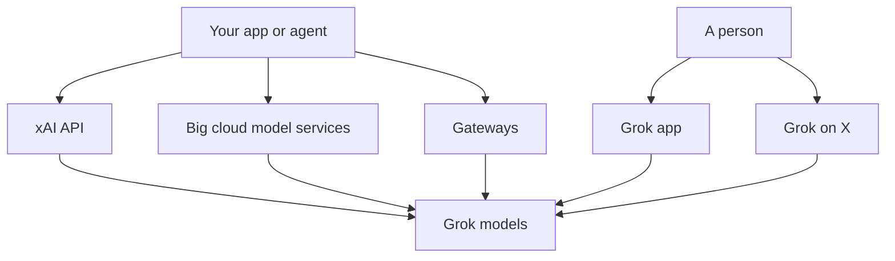

This is one of a set of parallel provider snapshots, each with the same headings. It covers xAI, whose Grok models are reached through a social network as well as an app and an API.

**In one line:** xAI builds the Grok family of models, offered through the Grok app, the X platform and a developer API, and it is now part of SpaceX.

## Why it matters

Grok is the one major assistant that is closely tied to a social network: Grok is available inside X, and its web search tools can search X posts. That makes it a different kind of product from the others in this section, with different data terms depending on where you use it.

The company's structure has also changed this year. A reader who learned about "xAI" from older articles will find a different corporate picture on the company's own site today.

<mark>The same Grok models can sit under three sets of terms: the X platform, the Grok app, and the business API, so always check which one applies.</mark>

## What it offers (as of October 2026)

**Models.** Grok is the family name. xAI's documentation currently lists a flagship general-purpose Grok model for chat, code and reasoning, with a configurable level of reasoning (see [reasoning models](/concepts/how-models-work/reasoning-models/)) and a context window of around half a million tokens (see [tokens and context windows](/concepts/how-models-work/tokens-and-context-windows/)). The documentation did not present a clear Pro, Flash style tier ladder when this page was written, so check xAI's model page for the current list.

The same documentation lists separate model lines called Grok Imagine for image and video generation, and a voice API for real-time conversation, text to speech and speech to text.

**Apps.** The Grok app runs on the web, iOS and Android, and Grok is also available inside X. xAI's page lists live search of the web and X, voice conversation, image and video generation, and a multi-agent mode where several agents work on a hard question in parallel. There is a free tier and a paid upgrade called SuperGrok.

**Developer API.** xAI's documentation lists tool calling (see [tool use](/concepts/agents/tool-use/)), web search, X search, code execution, structured outputs and a batch API on some models. It notes that without search tools enabled, Grok knows only what was in its training data.

**Coding agent.** xAI published "Grok Build", a coding agent harness and terminal interface (a tool run by typing commands in a text window, covered in chapter 10), as open source in July 2026 (see [agentic harness](/concepts/agents/agentic-harness/)).

## How to reach it

- **Own API.** Create an account and key in xAI's console. The company says it offers regional endpoints and data residency options for teams that need them.
- **Apps.** The Grok app, and Grok inside X.
- **Clouds.** xAI's API page says Grok models are accessible through Microsoft Azure AI Foundry, Oracle OCI Generative AI and Google Cloud's Vertex Model Garden (the model catalogue of what is now called Gemini Enterprise Agent Platform), as well as the native API.
- **Gateways.** Some gateways may also list Grok. Check the gateway's own model list. See [model access platforms](/map/model-access-platforms/).

## Licence and openness

Grok's current models are offered as a service only, and this page found no published weights for them. xAI has released older models as open weights:

- **Grok-1.** Released in March 2024 with its weights and architecture. The repository states the code and weights are under the **Apache 2.0** licence.
- **Grok 2.** The weights were later published on Hugging Face under a custom **Grok 2 Community License Agreement**. The licence text allows use, copying, distribution and modification, including commercial use if you follow xAI's acceptable use policy. It forbids using the materials, derivatives or outputs to train or improve foundational, large language or general-purpose AI models (apart from changes to the materials themselves), requires a "Powered by xAI" display and a licence notice, and ends if you sue over patent or copyright infringement.

Check xAI's pages and Hugging Face for any later releases. See [open vs closed weights](/concepts/how-models-work/open-vs-closed-weights/).

## Data and compliance notes

xAI's pages show different terms depending on the product. Terms vary by plan, so read the current text before relying on a summary.

- **Business and API.** xAI's enterprise terms state it will not use customer content to train foundation models, large language models or other AI systems without customer consent in an order form. They say content is deleted within 30 days after the end of a session unless the customer chooses longer retention, and describe a Zero Data Retention option. xAI's API page lists SOC 2 Type II certification, SAML single sign-on, audit logging, and HIPAA eligibility with a business associate agreement.
- **Consumer Grok.** The terms of service say logged-in users can choose whether xAI uses their content to improve products and train models, and that unlogged-in users grant training rights. The privacy policy describes a Private Chat mode with deletion within 30 days.
- **Grok on X.** xAI's documents say use of Grok on X is governed by the X Privacy Policy and X Terms, not xAI's own.
- **Signing in with X.** The terms say xAI can access X profile, post history and Grok on X conversation history if you log in with X credentials.

For what a data processing agreement is and when you need one, see [GDPR, data retention and DPAs](/concepts/security/gdpr-data-retention-and-dpas/).

## Things to watch

- **Ownership and naming.** xAI's own news page records that SpaceX acquired xAI on 2 February 2026. xAI's site and legal pages now carry the name SpaceXAI, and the service provider named in its terms is SpaceXAI LLC. The announcement page is brief, and this page does not describe the deal terms or how X (the social network) relates to the combined group. Check the company's own pages for current detail.
- **Naming in contracts.** You may see "xAI", "SpaceXAI" and "Grok" used for the same supplier. Confirm the legal entity on any contract.
- **Terms split across products.** Consumer, X and business terms sit in different documents.
- **Rapid change.** Model names, app tiers and cloud availability change often.

## Related

- [Model tiers](/models/model-tiers/): comparing size and capability levels across providers
- [Open-weight options](/models/open-weight-options/): older Grok weights alongside other downloadable models
- [Data terms at a glance](/models/data-terms-at-a-glance/): provider terms side by side
- [Model access platforms](/map/model-access-platforms/): direct, cloud and gateway routes
- [Prompt injection](/concepts/security/prompt-injection/): a risk to weigh with any model that reads live web or social content

## The proper terms

- **Zero data retention:** a setting where prompts and outputs are not stored after use
- **Community licence:** a custom open-weight licence with conditions beyond a standard one
- **Acceptable use policy:** a list of uses a licence or service forbids
- **SOC 2 Type II:** an audit report on a provider's security controls over time
- **Business associate agreement:** a contract for handling US health data
- **Single sign-on:** one company login used across many services
- **Regional endpoint:** a service address that keeps processing within a chosen region
- **Multi-agent mode:** several agents working on one question in parallel

## Next up

Next, a large company best known for publishing model weights for anyone to download. [Meta](/models/meta/) covers Llama and its newer Muse line.
