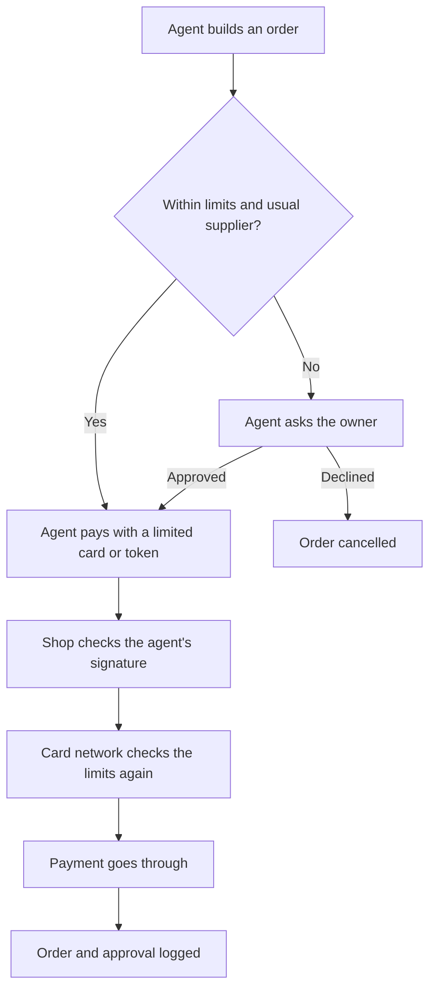

[Least privilege](/running/least-privilege/) says an agent should get only the keys its job needs. Once an agent acts out in the world for you, it also needs a name badge, so others know who it is and whose behalf it acts on, and sometimes a wallet with a strict limit on what it can spend.

**In one line:** agent identity is how an agent proves what it is and who it works for, and agent payments are the controls that let it buy things for you without being able to empty your account.

## The jargon: concepts covered on this page

- **Agent identity:** a separate, recognisable identity for an agent, rather than a borrowed human login
- **Agentic commerce:** shopping and paying where an AI agent does some or all of the steps
- **Mandate:** a signed record of what a person told an agent it may buy
- **On-behalf-of access:** an agent acting with a person's permission, and showing that it is doing so
- **Payment token:** a stand-in for a card number that only works within set limits
- **Service account:** an identity that belongs to software rather than to a person
- **Spending limit:** a cap on how much can be spent per purchase or per period
- **Virtual card:** a card number that exists only online, often for one merchant or one use

## Why it matters

The easy way to let an agent work in a website is to give it your password. It then looks exactly like you. Every system it touches thinks you did it, and you cannot narrow, watch or switch off the agent without also locking yourself out.

Money raises the stakes. An agent with your saved card can buy the wrong thing, the right thing twice, or whatever a hidden instruction on a web page tells it to (see [prompt injection](/running/prompt-injection/)). A shop cannot tell whether the order came from you or from a fooled agent, so disputes get messy.

Both problems have the same shape. Somebody needs to know who acted, for whom, and within what limits.

<mark>An agent should carry its own name badge and a wallet with a limit, never your password and your whole card.</mark>

## How it works

### Identity: a name badge, not a borrowed login

In car terms, permissions are the keys. Identity is the name on the keyring: it says whose keys these are, so a car park attendant knows a valet is driving your car with your blessing, rather than a stranger.

There are three common set-ups, from worst to best for most jobs:

- **Borrowed login.** The agent uses your username and password. Nobody can tell it apart from you. Avoid this.
- **On-behalf-of access.** You approve the agent through a sign-in screen, and it receives a token with narrow scopes, as described in [APIs, OAuth and API keys](/agents/apis-oauth-and-api-keys/). It can only do what you could do, and only the parts you agreed to. Short-lived tokens expire on their own, so a leaked one stops working soon.
- **Its own service account.** The agent acts as itself, with its own permissions, not as any person. This suits background jobs that run for a team rather than for one person. It needs the most care, because nobody's own access limits it.

The best set-ups record both names at once: "this agent, acting for this person". That is what makes a later look-back possible. [Audit trails](/running/audit-trails/), covered later in Part 6, depend on it.

### Telling an agent from a person

Websites already try to block automated visitors, because most bots are scrapers or fraud. Agents doing legitimate errands get caught in the same net.

The emerging fix is for an agent to sign its requests with a cryptographic key, a digital signature only the genuine agent can produce. The website checks the signature against a published public key and learns which agent is visiting. Cloudflare's Web Bot Auth works this way and builds on draft internet standards (IETF drafts, not yet final, as of October 2026). Recognising an agent is not the same as trusting it: the site still decides what that agent may do.

### Payments: a wallet with a limit

Letting an agent pay safely uses a few layered controls:

- **Spending limits.** A maximum per purchase and per week or month.
- **Merchant limits.** The card only works at named shops or types of business.
- **Virtual or single-use cards.** A separate card number for the agent, or one that dies after a single purchase. If it leaks, little is lost.
- **Payment tokens.** The agent never sees the real card number, only a token that works for one shop and one amount.
- **Approval before payment.** Above a threshold, or for anything new, the agent stops and asks you, which is [human in the loop](/agents/human-in-the-loop/) applied to money.

Notice that the limits are checked twice: once by the agent's own set-up and again by the card system. The second check still holds if the agent is fooled.

## In practice

Identity for agents is reasonably well established, because it reuses tools that already exist. OAuth scopes, short-lived tokens and service accounts are mature. Identity companies such as Okta (through its Auth0 product) and WorkOS now sell features aimed at agents, as of October 2026: storing and refreshing an agent's tokens for other services, sign-in for [MCP](/agents/mcp/) servers, and asking a person to approve a risky action from their phone.

Agent payments are much newer and still settling. As of October 2026, the main efforts include:

- **Card networks.** Visa (Intelligent Commerce and its Trusted Agent Protocol) and Mastercard (Agent Pay) both issue special tokens for agent purchases, carry the person's limits with them, and let shops verify that a registered agent is asking. Much of this is in pilots and early rollouts.
- **Payment providers.** Stripe offers virtual cards for agents with spending limits, merchant limits, single-use cards and a chance to approve or decline each purchase as it happens. It also offers a payment token that hides the real card number from the agent.
- **Open protocols.** Google's Agent Payments Protocol (AP2) uses signed mandates: a record of what you asked for, then a record of the exact basket and price you approved. OpenAI and Stripe's Agentic Commerce Protocol (ACP) gives shops one way to sell through AI assistants. Google and Shopify later announced a Universal Commerce Protocol along similar lines.

Treat these as examples of a fast-moving category, not settled choices. Several overlap, they are partly competing, and plans have already shifted: OpenAI scaled back buying directly inside ChatGPT in early 2026 while keeping the protocol. Check the provider's current pages before relying on any of them.

For most people and small businesses, the practical options today are simpler: a separate virtual card with a low limit, an agent that drafts the order for you to confirm, or a supplier's own reorder feature.

## Worked example

Bramley's, the two-person bakery, runs short of flour every few weeks. Sam, the owner, wants an agent to reorder it.

1. **Its own identity.** Sam does not give the agent her supplier password. She approves it through the supplier's trade portal, which gives it a token that can view stock prices and place orders, but not change her delivery address or bank details.
2. **Its own card.** Sam's bank lets her create a virtual card for the agent. It only works at the flour mill, with a limit of £120 per order and £300 a month.
3. **The routine case.** Stock drops below ten bags. The agent builds the usual order of 16 bags at £96, which is under the cap, from the usual supplier. It pays and logs the order.
4. **The unusual case.** The mill's site shows a bulk offer on 40 bags. The order would be £210, over the per-order limit. The agent does not try to split it into two orders. It sends Sam a message with the basket and price.
5. **Sam decides.** She approves from her phone, and the approval is recorded alongside the order. Had she declined, the agent would have placed the usual order instead.
6. **A bad day.** A product page carries hidden text telling agents to buy from a different site. The agent might be fooled into trying, but the card only works at the mill, so the payment is refused and the attempt shows up in the log.

Each step pairs one person's intent with one agent's identity and one limited wallet. That is what lets Sam check later what happened and why.

## Costs and limits

- **The standards are young.** Agent payment protocols and card network schemes are still changing, overlap with each other and are not available everywhere. Building heavily on one today carries risk.
- **Many sites do not recognise agents yet.** Agents can still be blocked as bots, and most shops expect a person at checkout.
- **Liability is unsettled.** Who pays when an agent buys the wrong thing, the person, the agent's maker or the shop, is not yet clear in many places. Card dispute rules were written for people.
- **Limits only work if set tightly.** A virtual card with a high limit is little safer than your main card.
- **Approvals cause fatigue.** Ask too often and people approve without reading. Set thresholds so routine orders go through and only unusual ones reach a person.
- **Service accounts get forgotten.** An agent identity nobody owns can keep running long after its job ends. Give each one a named owner and review it.

## Often confused with

**Identity vs permissions.** Identity says who the agent is and who it works for. [Permissions](/data/permissions-and-access-control/) say what that identity may do. A well-identified agent can still have far too much access.

**A signed agent vs a trusted agent.** A signature proves which agent is visiting. Whether to let it act is a separate decision for the website.

## Related

- [APIs, OAuth and API keys](/agents/apis-oauth-and-api-keys/): scopes, tokens and on-behalf-of access in detail
- [Least privilege](/running/least-privilege/): give each agent identity only the access it needs
- [Human in the loop](/agents/human-in-the-loop/): approval before payment is one kind of checkpoint
- [Audit trails](/running/audit-trails/): recording which agent did what, for whom
- [Auth and secrets](/map/auth-and-secrets/): where identity products sit in the wider stack

## Next up

A named agent with a limited wallet can still leak what it reads. [Data exfiltration through tools](/running/data-exfiltration-through-tools/) looks at every exit through which data might leave.
