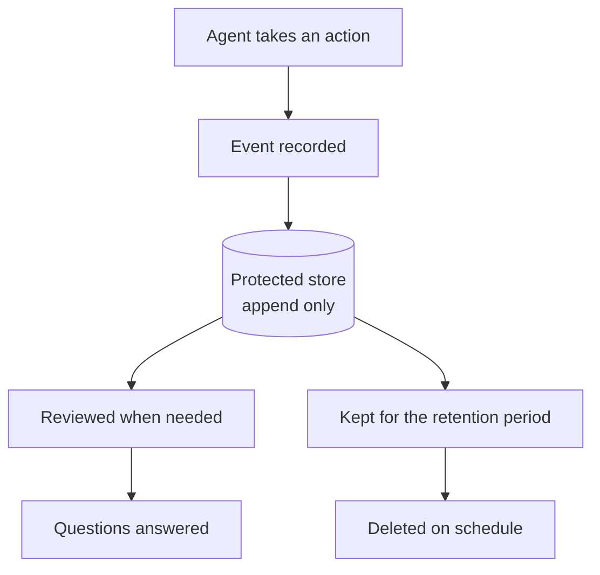

Narrow keys and closed exits, covered in [data exfiltration through tools](/running/data-exfiltration-through-tools/), limit what an agent can do. An audit trail records what it actually did, like an alarm system's log of every door opened and by whom.

**In one line:** an audit trail is a lasting, protected record of who did what, to which record, when, and with what result, kept so that someone can review and explain it later.

## Why it matters

Sooner or later someone asks, "who changed this?" It may be a partner noticing a wrong figure, a colleague wondering why a record vanished, or an outside reviewer checking how the firm handles investor data. Without a record, the honest answer is "we do not know".

With agents, the question gets harder. A change might have been made by a person, by an agent acting on a person's request, or by an agent acting on its own schedule. If your records cannot tell those apart, you cannot say who was responsible.

An audit trail also protects people. When it is clear that a change was approved by a named person, or made by an agent within its limits, nobody has to argue from memory.

<mark>For every important action an agent takes, you should be able to say afterwards who asked for it, what happened and who approved it.</mark>

## How it works

Think of the sign-in book at a building's front desk, or the history on a shared bank account. It does not stop anything happening. It makes sure that what happened can be traced to someone, and that nobody can quietly rewrite it.

For agents, each important action produces an **event**: one entry in the trail. A useful event records:

- **Who asked.** The human the agent was acting for.
- **Which agent.** The agent's own identity, kept separate from the person's.
- **What it did.** The action, such as "updated contact" or "created draft".
- **To what.** The target system and record.
- **When.** A timestamp.
- **The result.** Success, failure or refusal.
- **Approvals.** Whether an approval was needed, who gave or refused it, and when (see [human in the loop](/agents/human-in-the-loop/)).
- **A pointer to the full trace**, where one exists (see [observability](/running/observability/)).

This is close to what general security standards ask of audit records: what type of event occurred, when, where, the source and the identities involved, and the outcome.

### What makes a trail trustworthy

- **Complete for important actions.** Cover changes, sends, shares, deletes and approvals. Minor reads can be left out or summarised.
- **Hard to tamper with.** Entries are added but not edited. Ideally the log lives somewhere the agent itself cannot change, because a trail the actor can rewrite proves little.
- **Time-stamped.** With clocks that agree across systems.
- **Searchable.** You can find "everything done to this record" or "everything this agent did on Tuesday".
- **Access-controlled.** Only people who need to review it can read it.
- **Kept as long as needed and no longer.** Retention is a decision, and personal data in a log is subject to data protection rules (see [GDPR, data retention and DPAs](/running/gdpr-data-retention-and-dpas/)).

## In practice

Many systems already keep an audit log: file stores, CRMs, identity systems and databases often record who changed what. For an agent, the key is to make sure its actions show up in those logs under its own identity, and to add a record of the agent's own approvals. Agents that use a shared login make this much worse, because every action looks like it came from that one account. This is another reason for [least privilege](/running/least-privilege/) and separate accounts per agent.

Firms regulated in the UK may have record-keeping duties. For example, the FCA's rules on record-keeping expect firms to keep orderly records sufficient for the regulator to monitor compliance, in a form that prevents manipulation and shows any corrections. Some records carry minimum retention periods. What applies to a given firm depends on its permissions and activities, so check with compliance. This page is general information, not legal advice.

## Worked example

At Sample Ventures, the fictional fund, a partner notices that the funding stage on Acme Payments' investor record changed from "Seed" to "Series A" last Tuesday. Nobody remembers doing it. The operations lead investigates.

1. She searches the CRM's audit log for that record and that date.
2. The log shows one change at 14:12 by the account "intro-logger-agent", acting on behalf of an associate.
3. The agent's event links to its trace. In it, the agent read a forwarded email that mentioned a "Series A conversation" and updated the stage.
4. The approvals field shows no approval was required: the agent was allowed to update stage fields without asking.
5. The associate confirms she only asked the agent to log the email. The change went beyond that.
6. The operations lead restores the old value, which is logged too. She then changes the agent's permission so that stage changes need an approval, and records why.

The trail did three jobs: it identified what happened, separated the associate from the agent, and showed which control was missing. Without it, the team would have had a guess.

## Costs and limits

- **Logs hold sensitive data themselves.** An event may name an investor or include record contents. Protect the log like the data it describes, and log identifiers instead of full text where you can.
- **Storage and effort.** Keeping detailed records for a long time costs space, and someone has to look after them.
- **Too little.** If you record only some actions, the gap will be exactly where you need it.
- **Too much.** Recording every read buries the useful entries and builds a large pile of personal data. Choose what matters.
- **An editable log is weak evidence.** If the agent or an administrator can quietly change it, it proves little.
- **Retention is a trade-off.** Keep too short and you cannot investigate or meet duties. Keep too long and you hold personal data you have no reason to.
- **Nobody reads it until it matters.** Test that you can actually answer a question from it before you need to.

## Often confused with

**Audit trail vs observability.** [Observability](/running/observability/) is for builders: detailed traces of what an agent saw and decided, to fix and improve it. An audit trail is the accountability record, aimed at reviewers and sometimes regulators, and kept for a defined period.

**Audit trail vs monitoring.** Monitoring watches a few numbers and warns you when something is off. An audit trail is a record you look back on to establish what happened.

## Related

- [Observability](/running/observability/): the builder's detailed view; an audit event can link to it
- [Human in the loop](/agents/human-in-the-loop/): approvals and refusals belong in the trail
- [GDPR, data retention and DPAs](/running/gdpr-data-retention-and-dpas/): how long to keep logs, and the personal data in them
- [Least privilege](/running/least-privilege/): separate agent identities make a trail meaningful

## The proper terms

- **Append-only:** a record where entries can be added but not changed or removed
- **Audit event:** one entry recording who did what, to what, when and the result
- **Audit trail:** a lasting protected record of actions kept for accountability
- **Retention period:** how long records are kept before deletion
- **Tamper-resistant:** protected so records cannot be quietly altered

## Next up

An audit trail is full of information about people, and so are the prompts, logs and indexes around it. [GDPR, data retention and DPAs](/running/gdpr-data-retention-and-dpas/) covers the rules on how long that data may be kept and who may handle it.
