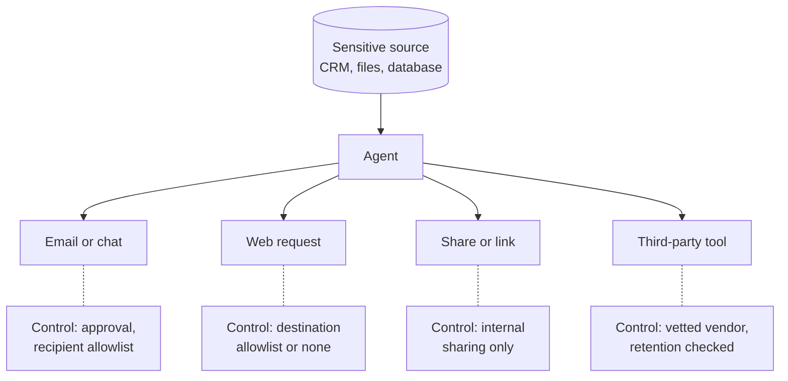

[Least privilege](/running/least-privilege/) limits what an agent can reach, and [agent identity and payments](/running/agent-identity-and-payments/) gives it a name badge and a capped wallet. Hidden instructions, or plain mistakes, still only do harm if the agent has a way to act on them, and this page looks at the most damaging way: tools that can carry sensitive data out, whether an attacker is steering or not.

**In one line:** data exfiltration is data leaving the place it should stay, and for an agent, every tool that can send something outside is a possible exit.

## The jargon: concepts covered on this page

- **Allowlist:** a short list of approved destinations or actions, with everything else blocked
- **Data exfiltration:** sensitive data leaving the place it should stay
- **Egress:** data or traffic leaving a system or network
- **Outbound channel:** any tool or route an agent can use to send something out
- **Redaction:** removing or masking sensitive details before data is shared

## Why it matters

Most people picture a data leak as someone breaking in. With agents, the more common picture is quieter. The agent is already inside, it can already read the sensitive material, and one of its tools can carry something out.

That tool might be as ordinary as "send an email". It might also be less obvious: a tool that fetches a web page, creates a shared link, or posts to a team channel. If the agent can put information into any of those, it can move information out.

The leak does not need an attacker. A busy assistant can email the wrong person or paste confidential text into a public tool. Either way, the question to ask of each agent is the same: where could data leave from, and what stands in the way?

<mark>Look at an agent's tools as a list of exits, and decide for each one whether to remove it, gate it or accept it.</mark>

## How it works

Think of a building with a locked records room. The risk is not only the lock on the room. It is also every door, window and delivery hatch in the building, because anything the assistant can carry to a door can leave.

For an agent, the exits are its tools. Common ones:

- **Messages.** Sending email, chat messages or texts.
- **Web requests.** Any tool that calls an outside web address can carry information in the request itself.
- **Sharing.** Creating a shared document or a link that anyone with the address can open.
- **Links and images in replies.** If the interface automatically loads an image or link, and the address contains data, loading it sends that data to whoever runs that server.
- **Shared spaces.** Writing to a wiki, a public repository or a channel with outside guests.
- **Third-party connectors.** A connector or [MCP](/agents/mcp/) server run by someone else receives whatever the agent sends it, and may log or keep it.

### Three ingredients

Deliberate leaks through agents usually need three things at once. These are the parts of the "lethal trifecta" described on the [prompt injection](/running/prompt-injection/) page:

1. **Private data** the agent can reach.
2. **Untrusted input** that can carry hidden instructions.
3. **An outbound channel** to carry data away.

Remove one and the attack mostly fails. This page is about the third ingredient, because it is often the easiest one to cut.

### Accidents need no attacker

The same exits cause plain mistakes. An agent picks the wrong "Alex" from the contacts and emails a draft to the wrong person. A well-meant user pastes a confidential note into a public web tool to tidy it up. A document is shared with "anyone with the link" because that was the default. None of these needs a villain.

## In practice

The defences, roughly from strongest to weakest:

1. **Remove outbound tools.** If an agent does not need to send anything, give it no way to. An agent that can only read and draft cannot email anyone.
2. **Allowlist destinations.** Where it must send, limit it to approved recipients, domains or web addresses. "Only to addresses at our own firm" is a very powerful rule.
3. **Approve outbound actions.** A person sees the exact recipient and content before it goes (see [human in the loop](/agents/human-in-the-loop/)). Keep the preview honest and complete.
4. **Separate agents.** One agent reads sensitive data but has no way out. Another can communicate but never touches the sensitive store, and receives only what the first passes on.
5. **Limit what it can reach.** Data the agent cannot read cannot be leaked. Use [permissions and access control](/data/permissions-and-access-control/) so it sees only what the job needs.
6. **Redact before sending.** Remove or mask names, figures or identifiers that the outside recipient does not need.
7. **Watch and alert.** Log outbound actions and raise an alert on unusual ones, such as a large attachment or a new recipient (see [observability](/running/observability/)).
8. **Check third parties.** For any connector or server run by someone else, ask what it logs, what it keeps, for how long, whether it uses the data for anything else, and what the contract and settings say. A data processing agreement (a contract setting how a vendor may handle the personal data you send it) may be needed (see [GDPR, data retention and DPAs](/running/gdpr-data-retention-and-dpas/)).

Standard guidance on language model security, such as that published by OWASP, also warns about output that automatically loads images or links carrying data, and advises sanitising what the interface renders.

## Worked example

Sample Ventures, the fictional fund, is reviewing an assistant used by the associates. The operations lead lists its tools and asks of each: what could leave through this?

| Tool | Exit risk | Decision |
| --- | --- | --- |
| Send email | High: any recipient, any content | Gate: draft only, a person sends |
| Fetch web page | Medium: addresses can carry data | Restrict: allowlist of news and company sites |
| Create sharing link | High: "anyone with the link" | Cut: not needed |
| Post to team channel | Low: internal channel, no guests | Leave, with logging |
| Third-party research connector | Medium: vendor receives queries | Keep after checking what the vendor stores |
| Read CRM and files | Not an exit | Leave, read-only |

The team also notices that the assistant reads outside emails and has access to the data room list. That is two of the three ingredients present, so the outbound channel is the one to remove. After the review:

1. The send tool becomes "create draft". A partner or associate presses send.
2. The sharing tool is removed.
3. Web access is limited to a short list of sites.
4. Every remaining outbound action writes a line to the log.

An associate asks the assistant to "send Acme Payments the follow-up questions". It now produces a draft with the recipient and text shown in full, and a person approves it. That adds ten seconds, and removes the whole class of silent sends.

## Costs and limits

- **Control costs convenience.** Every approval and allowlist is friction. The point is to spend it where the exits are widest.
- **Approvals get skimmed.** A person who clicks yes all day stops reading. Gate the few exits that matter.
- **Allowlists need upkeep.** New legitimate recipients and sites will be blocked until someone adds them. Plan who does that.
- **Indirect exits are easy to miss.** A tool that "only reads" a web page still sends a request. A shared spreadsheet that outsiders can view is an exit.
- **No single control is enough.** Combine removing exits, limited reach and logging.
- **Third-party terms change.** Review connector settings and contracts from time to time, not just once.

The usual mistake is securing the data store carefully and then giving the agent a tool that can carry data anywhere.

## Related

- [Prompt injection](/running/prompt-injection/): how hidden instructions turn an exit into a leak
- [Human in the loop](/agents/human-in-the-loop/): approvals for outbound actions
- [Permissions and access control](/data/permissions-and-access-control/): limit what the agent can reach in the first place
- [Observability](/running/observability/): spot unusual outbound activity

## Next up

Narrow keys and closed exits reduce what can go wrong, but something will still go wrong eventually. [Audit trails](/running/audit-trails/) make sure you can say afterwards exactly what happened and who was responsible.
