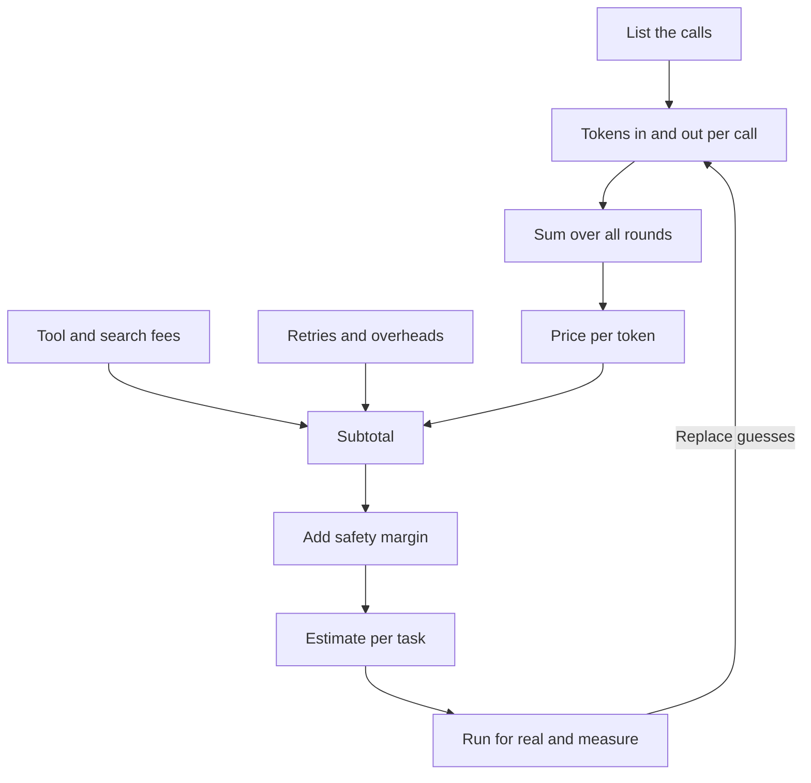

Prices, discounts and [model routing](/running/model-routing/) are the parts of the fuel bill. This page adds them up into the figure that matters for a decision: the cost of one finished task, worked out before you build and checked once it runs.

**In one line:** to estimate the cost of a task, list the model calls it makes, count the tokens in each, multiply by the price, add the extras, pad the result, and then replace your guesses with measurements from real runs.

## The jargon: concepts covered on this page

- **Input tokens:** the text a model reads in a call, including instructions and the record so far
- **Output tokens:** the text a model writes in a call, charged at a higher rate
- **Cost per task:** the full cost of one finished job, across all its calls
- **Safety margin:** extra added to an estimate to cover guesses that run low
- **Spending cap:** a hard limit on spend after which calls are refused or stopped
- **Long tail:** the few unusually long or costly runs that drive much of the total

## Why it matters

AI prices are quoted per token, but nobody buys tokens. You buy outcomes: a briefing written, an email filed, a deal summarised. To decide whether an agent is worth building, you need the cost of one finished task.

Agents make this harder than chat. A chat reply is one call. An agent might make eight, and it can't tell you in advance how many. Early guesses are often off by a large factor, in both directions.

A rough estimate still beats none. It tells you whether a task costs pennies or pounds, and which part of it is worth optimising.

<mark>In an agent, the model rereads the whole growing record on every round, so total input grows much faster than the number of rounds.</mark>

## How it works

The method has six steps.

1. **List the calls.** Write down every time the task asks a model for something. Include the setup call, each round of the [agent loop](/agents/the-agent-loop/), any checking step and the final answer.
2. **Estimate tokens per call.** Count the input (everything the model reads) and the output (everything it writes). A [token](/start/tokens-and-context-windows/) is a chunk of text, roughly three quarters of a word in English. Input includes the instructions, tool descriptions and the record so far.
3. **Multiply by the price.** Providers charge separately for input and output tokens, and output costs more per token.
4. **Add the extras.** Search or data-service fees, retried calls, and any overhead such as a checking pass.
5. **Add a safety margin.** Guesses are usually low. A margin of 30 to 100 per cent is common at the start.
6. **Measure and adjust.** Run the task for real, read the token counts in your logs (see [observability](/running/observability/)), and replace each guess with what you saw.

In words, the formula is:

**Cost of a task = (input tokens x input price) + (output tokens x output price), added up over every call, plus tool fees, plus retries, then multiplied by a safety margin.**

**Why rounds matter so much.** The model has no memory between rounds except the record of the conversation, so each round sends the whole record again. Round one sends the starting instructions. Round two sends those plus round one's output and result. Round three sends all of that plus round two's, and so on.

So the cost of round five is not like the cost of round one. The input grows steadily, and the total across rounds grows faster than the round count. Doubling the rounds can more than triple the input, as the example below shows.

**Three things change the sum.**

- **Caching.** Providers can store the repeated start of a request and charge much less to reread it. In an agent, the record repeats every round, so this helps a lot (see [prompt caching and batch processing](/running/prompt-caching-and-batch-processing/)). Batch processing, for work that can wait, is cheaper again.
- **Smaller models.** A cheaper model cuts the price per token for every call, or for the easy ones if you route (see [model routing](/running/model-routing/)). The catch is that a weaker model sometimes needs more rounds or more retries.
- **Reasoning tokens.** [Reasoning models](/using-ai/reasoning-models/) write hidden thinking before they answer. That thinking is usually charged like output, which is the dearer kind, even if you never see it. A call that returns a short answer can still carry a long bill.

## In practice

You can do the sums in a spreadsheet. Most providers show token counts for each call in their dashboard or in the response itself, and agent tools can log them for every round. Many also let you set a spending cap or an alert.

Use real figures from the provider's pricing page when you build the estimate. They change often and differ by model, which is why this page uses invented numbers (see [how AI pricing works](/running/how-api-pricing-works/)).

A good habit is to keep a small table per task type: calls, average tokens, cost per run, and cost per month at your expected volume. Update it after each batch of real runs.

## Worked example

Sample Ventures, the fictional fund, has a briefing agent. An associate asks for a one-page briefing on Acme Payments before a call. The agent takes five rounds: search the CRM, read the notes, search the web, search the shared files, write the briefing.

**Illustrative prices** (invented round numbers, not a real price list): $3 per million input tokens and $15 per million output tokens.

**Assumptions** (also invented): the starting instructions, tool list and request are 3,000 tokens. In each of rounds 1 to 4, the model writes a 300-token tool call and the tool returns a 2,000-token result, so the record grows by 2,300 tokens per round. In round 5 the model writes an 800-token briefing.

| Round | Input tokens (the whole record) | Output tokens |
| --- | --- | --- |
| 1 | 3,000 | 300 |
| 2 | 5,300 | 300 |
| 3 | 7,600 | 300 |
| 4 | 9,900 | 300 |
| 5 | 12,200 | 800 |
| **Total** | **38,000** | **2,000** |

Notice the gap. The task only ever adds about 12,000 tokens of new material, but 38,000 input tokens are billed, because the early material is reread in each round.

- Input: 38,000 x $3 per million = $0.114
- Output: 2,000 x $15 per million = $0.030
- **Total: $0.144**, about 14 cents.

**Doubling the rounds.** Run the same pattern for 10 rounds and the input total is 133,500 tokens, and output is 3,500. The cost is about $0.45. Twice the rounds cost about three times as much.

**A smaller model.** Suppose a smaller model costs $0.80 per million input and $4 per million output (also invented). The same 38,000 in and 2,000 out costs $0.0304 plus $0.008, about $0.038. That is roughly a quarter of the price, as long as it needs no extra rounds.

**With caching.** Suppose, illustratively, that rereading cached text costs a tenth of the normal input price, and that storing new text in the cache costs 25 per cent more than normal. Across the five rounds, 25,800 of the 38,000 input tokens are rereads and 12,200 are new text. That gives 25,800 x $0.30 per million = $0.0077 and 12,200 x $3.75 per million = $0.0458. With the same $0.030 of output, the total is about $0.083. That is roughly 40 per cent less than without caching.

**Adding the extras.** Say the web search costs $0.01 per search (invented) and the agent does one: subtotal $0.154. Add 20 per cent for retries and overheads: $0.185. Add a 50 per cent safety margin: about **$0.28**. That is the planning figure, about 30 cents per briefing.

**Setting it against the benefit.** If an associate would spend 45 minutes assembling the same briefing and 5 minutes checking the agent's version, the time saved is worth far more than 30 cents. But count the whole bill, not only the model fees: the time to build and test the agent, the upkeep when systems change, and the associate's review time each run. The cheap part is the model bill. The expensive parts are usually people.

Finally, the operations lead sets a spending cap on the account and an alert at half of the monthly budget, so a mistake shows up as an email and not as a surprise invoice.

## Costs and limits

- **Estimates vary widely.** Two runs of the same task can take 4 rounds or 15. Treat an estimate as a range, not a number.
- **The long tail matters more than the average.** Most runs may be cheap, but a few unusually long ones, such as an agent stuck repeating a failing search, can account for a large part of the month's bill. Measure the worst runs, not only the typical ones, and cap the number of rounds.
- **Tool results are often the biggest input.** A tool that returns an entire document adds thousands of tokens that are then reread every round. Trimming results is often the best saving.
- **Retries hide in the bill.** Failed and repeated calls are billed too (see [rate limits, retries and failures](/running/rate-limits-retries-and-failures/)).
- **Prices and models change.** An estimate is only true for the model, prices and prompts you used. Re-run it when any of them changes.
- **Counting only the cheap part.** Build time, upkeep and review are real costs, and they often outweigh the model fees for small teams.

The most common mistake is estimating from a single chat reply and ignoring the rounds.

## Often confused with

**Cost per token vs cost per task.** Cost per token is the price list: what a provider charges for each chunk of text. Cost per task is what one finished job costs, after counting how many calls it takes, how long the record grows, and what else gets added. A cheap token price can still mean an expensive task if the task takes many long rounds.

## Related

- [How AI pricing works](/running/how-api-pricing-works/): where the real per-token prices come from
- [Prompt caching and batch processing](/running/prompt-caching-and-batch-processing/): the two main ways to cut the repeated-input bill
- [Model routing](/running/model-routing/): using a cheaper model for the easy calls
- [The agent loop](/agents/the-agent-loop/): why the record grows and the rounds add up

## Next up

This page closes Part 6, so every part of the car now has a name, from the engine to the fuel bill. Part 7, Under the hood, is optional: deep dives into how the engine itself is built, for anyone curious, starting with [pre-training and post-training](/under-the-hood/pre-training-and-post-training/).
