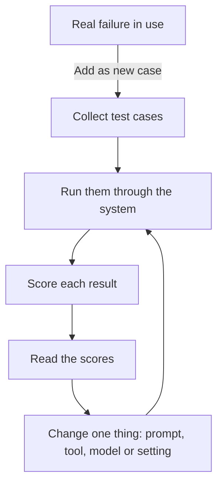

Traces, the step-by-step records described in [observability](/running/observability/), show what an agent did on real runs. Evals are its MOT, the regular roadworthiness check: the same set of checks, run after every change, so a tweak that quietly breaks something is caught before the agent goes back on the road.

**In one line:** an eval is a test for an AI system: a set of example inputs with a clear idea of what a good result looks like, run again every time you change something, so you can see whether things got better or worse.

## The jargon: concepts covered on this page

- **Benchmark:** a public standard test used to compare models in general
- **Eval:** a repeatable test of an AI system against example cases
- **Expected output:** the correct or ideal result recorded for a test case
- **LLM as judge:** using a second model to mark another model's output
- **Regression:** something that used to work breaks after a change
- **Rubric:** a short checklist used to mark a result

## Why it matters

Models do not behave like ordinary software. Ask the same question twice and the wording may differ. Change one sentence in a prompt and an answer you liked yesterday can quietly get worse today.

Without tests, you judge a change by trying two or three examples and going with your gut. That feels fine until the one case you did not try breaks.

<mark>An eval turns "it seems better" into "it got 23 of 25 right, up from 19".</mark>

This matters more as the work gets more important. An assistant that files notes in a CRM, or an agent that drafts messages to customers, needs a way to prove it still works after every tweak.

## How it works

Think of a driving test. The examiner uses the same route and the same marking sheet for every candidate, so passing means something. An eval does the same for your AI setup: fixed cases, fixed marking, repeatable results.

An eval has three parts:

1. **Cases.** A list of example inputs, such as real emails or questions. Each one comes with what a good result looks like (the proper term is the expected output, or a rubric if there is no single right answer).
2. **A way to run them.** The same cases are sent through your setup: your [prompt](/using-ai/prompt-engineering/), the model, any tools.
3. **A way to score.** Each result is marked as good or bad, or given a grade.

Then you change something and run it again. The loop is the whole idea.

There are four common ways to score:

- **Exact match or simple rules.** Check a result against known answers. Did the extracted company name equal "Acme Payments"? Is the date in the right format? This is cheap, fast and objective, but only works when there is one right answer.
- **Rubric scoring by a person.** A person reads each result and marks it against a short checklist, such as "accurate, no invented facts, right tone". Slow, but it handles judgement calls.
- **A second model as judge.** One model marks another's work against the rubric. This scales well, but judges have their own biases and errors, such as favouring longer answers. A person should spot-check a sample of their marks.
- **Cost and speed.** Record the tokens used and the time taken for each case. A change that improves quality but triples the cost is a trade-off you want to see.

For [agents](/agents/the-agent-loop/), the final answer is not the only thing to check. You also look at the route: did it call the right [tools](/agents/tool-use/), with sensible inputs, and did it stop at a sensible point instead of looping or giving up early?

## In practice

Start small. A couple of dozen real cases is enough to begin, and far better than none. Include awkward ones: a messy email, a missing field, two companies with similar names.

Then grow the set from experience. Every time the system fails in real use, turn that failure into a new case. Over a few months the eval set becomes a record of everything that has gone wrong before, so the same mistake cannot return unnoticed. When something that used to work breaks, that is called a **regression**, and catching regressions is the main job of an eval.

Evals can live in a spreadsheet, a simple script, or a dedicated tool. Many tracing and agent platforms include an eval feature. The tool matters far less than having the cases and the habit.

Real runs are the best source of new cases. That is one reason to keep a record of what your agent did (see [observability](/running/observability/)).

Keep a clear line between cases you tune against and cases you hold back. If you keep editing the prompt until every case passes, you may have only taught it those cases. A small held-back set tells you whether the gains are real.

## Worked example

Sam runs Bramley's, a two-person bakery with a shop and online orders. Sam has a prompt that reads order emails and pulls out four fields: the customer's name, the item, the quantity and the collection date (for example, "two sourdough loaves, Saturday").

Sam collects 25 real-style emails and writes down the correct four fields for each. A few are awkward on purpose: one email orders for two different days, one gives no collection date, one is forwarded by a friend with a long thread underneath.

1. Sam runs prompt version A on all 25. Rules check each field against Sam's answers. Version A gets 19 emails fully right.
2. Sam reads the six misses. Four are the forwarded-thread problem: the model picked up the wrong sender as the customer.
3. Sam writes version B, which adds a line telling the model to use the person the order is for, not the person who forwarded it.
4. Sam reruns all 25. Version B gets 23 right and fixes all four thread cases.
5. Sam checks the other cases did not get worse. One did: an email with no collection date now returns a made-up one. That is a regression, caught before anyone relied on it.
6. Sam adds "say 'none' if no collection date is stated" to the prompt, reruns, and gets 24 of 25.

Without the 25 cases, Sam would probably have tried two emails, seen version B work, and switched it on with the invented dates.

## Costs and limits

- **Building the cases takes real time.** Writing down correct answers is the slow part, and it needs someone who knows what "correct" means.
- **Running them costs a little each time.** Relative to the work, it is cheap. Using a judge model adds a second round of cost.
- **A small set can mislead.** With 25 cases, one result flipping changes the score a lot. Treat small differences as noise.
- **Cases go stale.** Real inputs drift over time. Review the set now and then and add recent examples.
- **Judges need checking.** A judge model can be confidently wrong. Read a sample of its marks yourself.
- **Passing is not proof.** An eval only covers the cases in it. A good score means "works on these", not "works everywhere".

The most common mistake is skipping evals until something goes wrong in front of a user. The second is writing only easy cases.

## Often confused with

**Evals vs benchmarks.** A benchmark is a public test used to compare models in general, such as how well they do at maths or coding (see [benchmarks](/under-the-hood/benchmarks/) in Part 7). Your evals are built around your own tasks and your own data. A model that tops a benchmark can still fail on your order emails, so your own evals are the ones that decide.

## Related

- [Observability](/running/observability/): records of real runs are the best source of new test cases
- [Prompt engineering](/using-ai/prompt-engineering/): evals tell you whether a prompt change helped
- [The agent loop](/agents/the-agent-loop/): for agents, check the route taken as well as the final answer
- [Benchmarks](/under-the-hood/benchmarks/): public tests, for shortlisting rather than deciding

## Next up

An agent that passes its tests can still be tricked by what it reads. [Prompt injection](/running/prompt-injection/) is the full story of that weakness: instructions hidden in the text an agent takes in.
