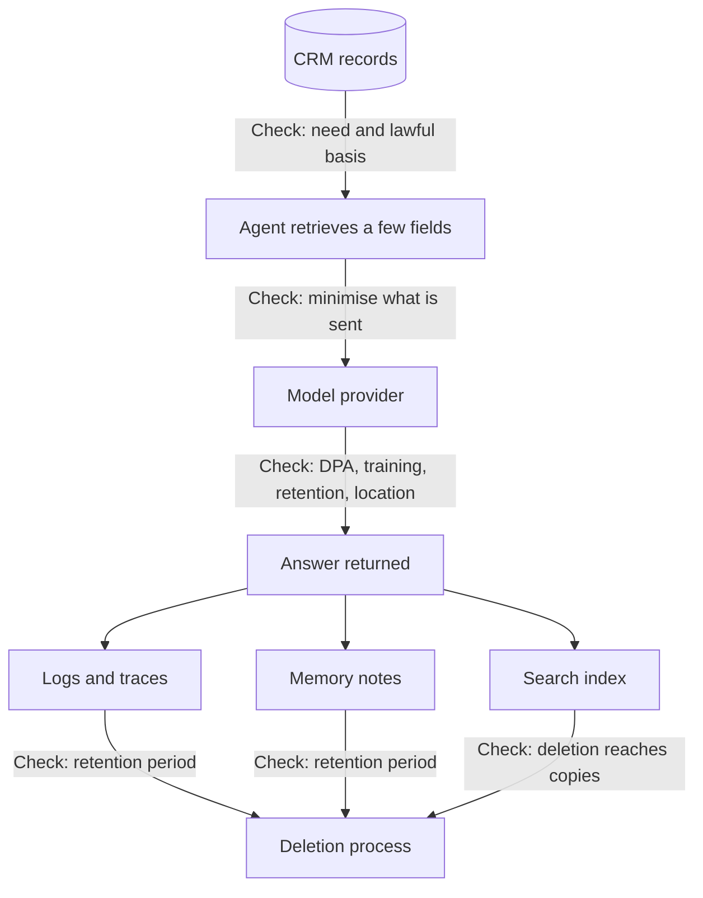

Security, from prompt injection through to [audit trails](/running/audit-trails/), keeps data away from the wrong people and records who touched it. Data protection law asks a further question, whether you should hold information about people at all, for how long, and who handles it for you, and this page closes the security pages of Part 6 with those rules as they apply to AI tools.

**In one line:** data protection law says you may use information about people only for good reasons, keep it only as long as needed, protect it, and have a written contract with any vendor who handles it for you, and AI tools do not change that.

This page is general information to help you ask better questions. It is not legal advice. For a real decision, speak to a lawyer or your organisation's data protection lead.

## The jargon: concepts covered on this page

- **Personal data:** any information about an identifiable living person
- **Controller:** the organisation that decides why and how personal data is used
- **Processor:** an organisation that handles personal data on a controller's behalf
- **Sub-processor:** another company a processor uses to handle the data
- **Lawful basis:** the legal reason that makes using personal data allowed
- **Data minimisation:** using only the personal data you actually need
- **Storage limitation:** keeping personal data no longer than necessary
- **Data retention:** how long data is kept before deletion
- **Data processing agreement (DPA):** the contract setting how a vendor may handle your personal data
- **DPIA:** a written risk review for higher-risk uses of personal data
- **Special category data:** sensitive personal data such as health, beliefs or ethnic origin
- **Restricted transfer:** sending personal data to a country outside the UK
- **ICO:** the UK regulator for data protection

## Why it matters

Most useful business data is about people. A CRM holds names, emails, roles and notes about founders and investors. If an agent reads those records, the information about those people moves into prompts, logs and search indexes, often at a vendor's servers.

Data protection law applies the moment that happens. It also gives people rights over what you hold, such as seeing it or asking for it to be deleted. If your AI setup scatters copies into places you cannot find, you cannot honour those rights.

<mark>An AI tool does not move your data protection duties onto the vendor: you stay responsible for the personal data you send it, so the contract and the housekeeping are your job.</mark>

## How it works

**The law in the UK.** Data protection in the UK rests on the UK GDPR (the General Data Protection Regulation as it applies in the UK after Brexit) and the Data Protection Act 2018. The regulator is the Information Commissioner's Office (ICO). The Data (Use and Access) Act 2025 has since changed parts of both, so guidance is still being updated (see the snapshot below).

**The EU law runs in parallel.** The EU GDPR is a separate law. It can apply to a UK organisation that has an establishment in the EU, or that offers goods or services to people in the EU, or monitors their behaviour. A UK fund that talks to EU founders and investors should not assume the UK rules are the only ones.

**Personal data** is any information about an identifiable person. That includes names, emails, phone numbers and job titles, and also notes and opinions about them. A note saying "founder was evasive about runway" is personal data, even if it never mentions an address.

**Controller and processor.** The **controller** decides why and how personal data is used. The **processor** handles it on the controller's behalf and follows the controller's instructions. A fund that decides to put its CRM notes through an AI assistant is the controller. The AI vendor is usually a processor. If a vendor starts using the data for its own purposes, it can become a controller too, with its own duties.

**The core principles.** The ICO sets out seven principles. These five matter most for AI work:

- **Lawfulness, fairness and transparency.** You need a **lawful basis** for using the data, such as legitimate interests or consent, and you must be open with people about what you do.
- **Purpose limitation.** Use data only for the purposes you stated. Notes collected to evaluate a deal should not quietly feed an unrelated marketing agent.
- **Data minimisation.** Use only what you need. Do not send a whole record to a model when two fields would do.
- **Accuracy.** Keep data correct and fix mistakes. Models can state wrong things about people with confidence (see [hallucination and grounding](/start/hallucination-and-grounding/)), so AI-written notes need checking before they are stored as fact.
- **Storage limitation.** Keep personal data no longer than you need it. This is what people mean by **data retention**: a stated period, then deletion.

The other two are **integrity and confidentiality** (security) and **accountability** (you must be able to show you comply).

**People's rights.** Individuals can generally ask to be told how their data is used, to see it, to have mistakes corrected, to have it erased in many cases, to restrict or object to some uses, and to have a human involved in certain automated decisions. These rights have conditions and exceptions, and organisations normally have to respond within a set time, commonly one month. Each request has to reach every place the data sits.

**The data processing agreement (DPA).** Law requires a written contract with any processor. Under the ICO's guidance it must say, among other things, that the processor acts only on your documented instructions, keeps staff bound by confidentiality, applies appropriate security, gets your authorisation before using **sub-processors** (other companies it passes the data to), helps you answer people's rights requests, deletes or returns the data when the contract ends, and lets you check compliance.

In this page "DPA" means this contract (a data processing agreement or addendum). The same letters can also mean the Data Protection Act, or a data protection authority such as the ICO, so check which one a document means.

Here is the path personal data takes in a typical AI setup, and the control to check at each hop.

## In practice

**What leaves your systems.** Every time an agent runs, personal data can travel in three ways: inside the person's question, in the results of [tool calls](/agents/tool-use/) (a CRM lookup returns a founder's record), and in retrieved documents added as context (see [RAG and chunking](/data/rag-and-chunking/)). All of it reaches the model provider's servers.

**Does the provider keep it or train on it?** This varies by vendor, product and plan, and consumer and business versions often differ. At a general level, the major providers say that their business and API products do not use your inputs and outputs to train their models by default, and they offer a DPA for business customers. Many keep inputs for a short period, often up to around 30 days, for abuse monitoring, with stricter "zero retention" options for qualifying customers. Free and personal plans can have different rules. Read the terms for the exact product you use, not the vendor's general reputation.

**Other stores of personal data.** The model call is only one place. [Logs and traces](/running/observability/) record prompts and answers. [Memory](/agents/memory/) stores facts about people for later. A search index holds chunks of documents. Each needs its own retention rule, and its own access limits (see [permissions and access control](/data/permissions-and-access-control/)). Without rules, they pile up forever.

**Deletion has to travel.** If a founder asks to be erased, deleting the CRM record is not enough. The copies in the index, in memory notes, in exported files and in logs all need to be found. Plan for this before you build, because it is hard to add afterwards.

**Retention pulls against audit.** You want to keep records of what the agent did, but you also must not keep personal data longer than needed. [Audit trails](/running/audit-trails/) therefore need a defined period, and sometimes a log that records the action without copying the personal details.

**Where processing happens.** Sending personal data to a provider outside the UK is called a **restricted transfer**. It needs a legal route. Examples are an adequacy decision (the UK government has recognised the destination's protections), the UK's International Data Transfer Agreement, or an addendum to the EU's standard clauses. For the United States there is also the UK-US data bridge, which covers US companies that have certified to it. Many providers offer regional processing options, sometimes at an extra cost.

**Special category data.** Some information needs extra care: racial or ethnic origin, political opinions, religious or philosophical beliefs, trade union membership, genetic data, biometric data used for identification, health, sex life and sexual orientation. You need a lawful basis and an extra condition to use it. A CRM note that mentions a founder's health is enough to bring this in. Keep it out of AI workflows unless you have a clear reason.

**Automated decisions.** There are extra rules for decisions made solely by automated means that have a legal or similarly significant effect on a person, such as automatically rejecting a job applicant. Having a person who really reviews and can change the outcome keeps you outside the strictest version of these rules (see [human in the loop](/agents/human-in-the-loop/)).

**Impact assessments.** A **DPIA** (data protection impact assessment) is a written review of the risks of a use of personal data. It is a legal requirement where processing is likely to be high risk. The ICO lists AI and machine learning as examples of innovative technology, and says a DPIA is required when that is combined with other risk factors, such as sensitive data. Its advice when in doubt is to do one.

**Snapshot, as of October 2026.** This paragraph describes things that change. The Data (Use and Access) Act 2025 amended the UK GDPR and the Data Protection Act 2018, and the ICO has said its AI and data protection guidance is under review as a result. The ICO published draft updated guidance on automated decision-making and profiling on 31 March 2026 and consulted on it until 29 May 2026, so check its website for whether the final version is out. The UK-US data bridge has applied since 12 October 2023, and only covers US organisations that have certified to the UK extension. As of this snapshot, OpenAI and Anthropic say they do not train on business and API data by default, and OpenAI describes up to 30 days of retention on its API. Check each provider's current terms and the ICO website before relying on any detail.

## Worked example

Sample Ventures, the fictional fund, wants an assistant that answers questions over its notes about founders and investors, such as "what did we hear about Acme Payments' CTO from our last three calls?"

The operations lead works through these questions before connecting anything.

**Questions for the vendor:**

1. Will you sign a DPA, and does it name you as a processor acting on our instructions?
2. Are our prompts and outputs used to train any model, on the exact plan we would buy?
3. How long do you keep prompts and outputs, and can we reduce that or turn it off?
4. Where is data processed and stored, and what legal route covers any transfer outside the UK?
5. Who are your sub-processors, and how are we told when they change?
6. How do we get data deleted, and how fast?
7. What security evidence do you have, such as independent audit reports?

**Internal housekeeping:**

1. List every place the assistant touches personal data: the CRM, the search index, the logs, any memory.
2. Send only the fields the question needs, not whole records.
3. Keep special category details out of notes the assistant can read.
4. Set a retention period for logs, memory and the index, and name who deletes.
5. Write down how a deletion request reaches each store.
6. Complete a short DPIA and record the decision and the reasons.
7. Update the privacy notice so people know AI tools are involved.
8. Keep a human review step on anything that affects a person's opportunities.

The result is a short file: the signed DPA, the DPIA, and a one-page map of where the data lives. When a founder later asks what the fund holds on them, the team can answer in an afternoon rather than a month.

## Costs and limits

- **The paperwork is cheap, the discipline is not.** A DPA and DPIA take hours. Keeping retention and deletion working across all copies takes continuing effort.
- **Plan differences catch people out.** The same vendor may offer strong terms on a business plan and weaker ones on a personal plan. Staff using a personal account for work data is a common cause of problems.
- **Free tools are rarely covered.** If there is no DPA, you have no contract for what the vendor does with the data.
- **Deleting from a model is not the same as deleting from a log.** Once data has been used to train a model it is effectively impossible to remove. This is why the "do not train on our data" term matters.
- **Law and guidance move.** The rules for AI are still being worked out in places, and terminology is not settled. Re-check at least once a year.
- **Special category data and automated decisions are where risk concentrates.** Treat them as a stop-and-think point.
- **Fines and complaints are real, but the usual failure is smaller.** It is a founder asking for their data and the firm being unable to say where it is.

## Often confused with

**GDPR vs UK GDPR.** They are two separate legal texts with very similar rules. The EU GDPR applies in the EU. The UK GDPR, together with the Data Protection Act 2018, applies in the UK. A UK firm handling EU people's data can fall under both.

**DPA (contract) vs DPA (Act or authority).** A data processing agreement is the contract with a vendor. The Data Protection Act 2018 is UK law. A data protection authority is a regulator such as the ICO. Context tells you which.

**Security vs compliance.** Encrypting data protects it. Compliance also asks whether you should have it, why, for how long, and whether the person knows.

## Related

- [Audit trails](/running/audit-trails/): the record of what an agent did, which must itself have a retention period
- [Permissions and access control](/data/permissions-and-access-control/): who may see personal data once it is in your systems
- [Memory](/agents/memory/): a store of facts about people that needs retention rules
- [RAG and chunking](/data/rag-and-chunking/): indexes hold copies of personal data that deletion must reach

## Next up

With the locks fitted and the paperwork in order, the remaining practical question is what all of this costs to run. The rest of Part 6 is about the fuel bill, starting with [how API pricing works](/running/how-api-pricing-works/).
