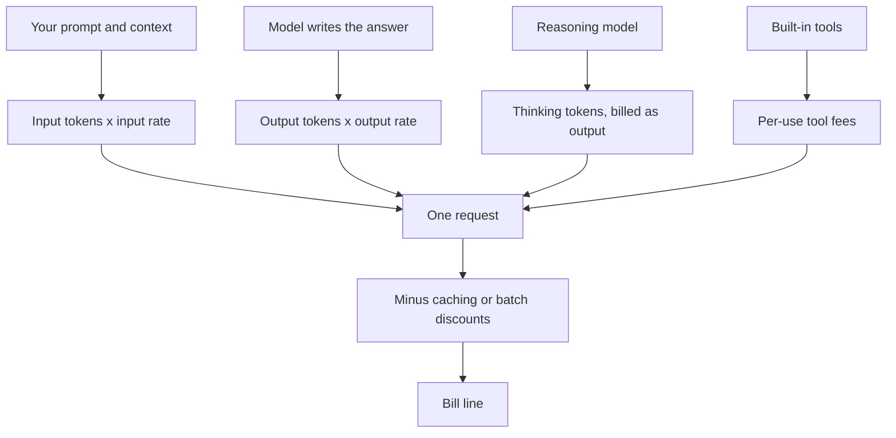

An agent that is safe and handles data properly, as [GDPR, data retention and DPAs](/running/gdpr-data-retention-and-dpas/) describes, still has to be affordable. If the model is the engine and tokens are its fuel, the last pages of Part 6 are about the fuel bill, starting with how providers charge when your software calls a model through the API.

**In one line:** API use is billed by the token, with the text you send and the text you get back priced separately, and everything else (thinking, tools, discounts) is a variation on that.

*For the basics of free plans, subscriptions and when you need the API at all, see [free, subscription or API](/start/free-vs-subscription-vs-api/). This page assumes you are paying per token.*

## The jargon: concepts covered on this page

- **MTok:** one million tokens, the usual unit for pricing
- **Input tokens:** the tokens you send to the model
- **Output tokens:** the tokens the model writes back
- **Thinking tokens:** hidden working a reasoning model writes before answering
- **Tier:** a size band of models, from small and cheap to large and expensive
- **Long-context pricing:** a higher rate some providers charge for very large prompts
- **Credits:** prepaid units that are drawn down as you use a service

## Why it matters

An agent can run hundreds of times a day without anyone watching. A cost that looks tiny per request can become a real line in the budget, and a cost that looks fine in a test can jump when the real data arrives.

Pricing pages are also hard to compare. Each provider names its tiers differently and lists extras in different places. Knowing the few moving parts lets you read any of them.

<mark>The price of one request is simply tokens in times the input rate, plus tokens out times the output rate, so you can estimate almost any bill on the back of an envelope.</mark>

## How it works

A **token** is a small chunk of text, roughly three quarters of an English word (see [tokens and context windows](/start/tokens-and-context-windows/)). Providers count tokens and charge per **million tokens**, often written MTok.

A bill is built from a few parts:

- **Input tokens.** Everything you send: the question, the [system prompt](/using-ai/system-prompts/), tool descriptions, retrieved documents and the conversation so far.
- **Output tokens.** What the model writes back. These almost always cost more per token than input, commonly several times more, because generating text is more work than reading it.
- **Thinking tokens.** [Reasoning models](/using-ai/reasoning-models/) write out working before they answer. Providers usually bill those hidden tokens at the output rate, so a short answer can sit on top of a long, paid-for think.
- **Tool charges.** Built-in tools, such as web search, are often billed per use on top of the tokens.
- **Discounts.** Reused input can be cheaper, and non-urgent work can be sent in bulk at a lower rate. Both are covered in [prompt caching and batch processing](/running/prompt-caching-and-batch-processing/).

**Tiers.** Providers sell families of models in sizes. A small model is cheap and fast and good for simple, repeated jobs. A mid model suits most work. A large model costs the most and is for hard problems. Choosing the right tier for each job is called [model routing](/running/model-routing/).

**Long inputs.** Some providers charge a higher rate once a single prompt passes a certain size. Others charge the same rate throughout the context window. Check the page for any line about "long context".

**Credits.** Some services sell a pot of prepaid credits that each action draws down, sometimes at an exchange rate the vendor sets. Underneath, the vendor is usually paying per token too.

## In practice

When you read a pricing page, check these in order:

1. **Price per million input tokens and output tokens**, for the tier you would use.
2. **Context size**, meaning how much you can send in one request, and any higher rate for long inputs.
3. **Extra fees**: thinking, tools, search, storage for cached material, regional processing.
4. **Discounts** for cached input and batch use, and what you must do to get them.
5. **[Rate limits](/running/rate-limits-retries-and-failures/)**: how many requests or tokens per minute you may use. Cheap models with tight limits can be unusable at volume.
6. **Data terms**: whether prompts are kept or used for training, and whether you can get a data processing agreement (see [GDPR, data retention and DPAs](/running/gdpr-data-retention-and-dpas/)). The cheapest option is sometimes the one with the weakest terms.

To estimate a job's cost before you build it, see [estimating cost per task](/running/estimating-cost-per-task/).

**Snapshot, as of October 2026.** Everything in this section is a real figure that will go out of date. The official pricing pages of three providers were read in October 2026: Anthropic, OpenAI and Google (Gemini API). Figures are US dollars per million tokens, rounded into ranges that span the cheapest and dearest of the three providers' current models in each tier.

| Tier | Input | Output |
| --- | --- | --- |
| Small | about $0.20 to $1 | about $1.20 to $5 |
| Mid | about $0.75 to $2 | about $3.75 to $12 |
| Large | about $2 to $10 | about $12 to $50 |

Across these providers, output tokens cost roughly five or six times the input rate. The batch discount was 50% on all three. Cached input read at a tenth of the normal input price on OpenAI's page, and Anthropic's page also listed cache reads far below its normal input rates. Anthropic and OpenAI both listed web search at $10 per 1,000 searches, and Google gave 5,000 free search requests a month and then $14 per 1,000. Google charged a higher rate for its large model once a prompt passed 200,000 tokens. One of its mid-tier prices was shown as a promotional rate that doubles after 31 December 2026, which is a reminder that these numbers move.

Prices have fallen and changed shape many times in the last few years, with new tiers appearing and old ones being retired. Check the current page before you commit to a budget.

## Worked example

Sample Ventures, the fictional fund, wants an agent to read each introduction email and pull out the founder's name, the company, the sector and the ask. The operations lead estimates the cost of one email on a mid-tier model.

Assumptions (illustrative round numbers):

- Input: about 1,500 tokens (the email plus the instructions).
- Output: about 200 tokens (a short structured record).
- No thinking, no tools.

Using the mid-tier ranges from the snapshot:

| | Tokens | Low rate | High rate | Low cost | High cost |
| --- | --- | --- | --- | --- | --- |
| Input | 1,500 | $0.75 per million | $2 per million | $0.001125 | $0.003 |
| Output | 200 | $3.75 per million | $12 per million | $0.00075 | $0.0024 |
| Total | | | | $0.001875 | $0.0054 |

So one email costs roughly $0.002 to $0.005, or between a fifth of a US cent and about half a US cent.

For 1,000 emails that is about $1.88 to $5.40. If the job is not urgent and runs as a batch at half price, it is about $0.94 to $2.70. The model is almost never the expensive part at this scale. People's time reviewing the results usually costs far more.

If the same job ran on a large-tier model, the range rises to about $5.40 to $25 per 1,000 emails, which is a good reason to check whether a smaller model does the job well enough.

## Costs and limits

- **Output and thinking cost more than they look.** A prompt that asks for long explanations, or a reasoning model left on for a simple task, can multiply the bill.
- **Context grows.** In an [agent loop](/agents/the-agent-loop/) each step resends the earlier ones, so a long job pays for the same text many times unless caching helps.
- **Tool descriptions count as input.** Connecting many tools adds tokens to every request.
- **Mistakes multiply.** A loop that retries forever, or a script that runs on every record by accident, is the usual way a bill surprises someone. Set spending limits and alerts with the provider.
- **Prices are not capability.** A higher price does not mean a better answer for your task. Test on your own examples.

## Often confused with

**Price per token vs cost per task.** The price per token is a rate. The cost per task is that rate times how many tokens the task needs, which depends on your prompt, your documents and how many steps the agent takes.

**API billing vs subscription limits.** A subscription gives a person an allowance in the apps; the API charges per token with no allowance. They are billed separately, as [free, subscription or API](/start/free-vs-subscription-vs-api/) explains.

## Related

- [Free, subscription or API](/start/free-vs-subscription-vs-api/): the beginner's view of the three ways to pay
- [Tokens and context windows](/start/tokens-and-context-windows/): what a token is and how much fits in one request
- [Prompt caching and batch processing](/running/prompt-caching-and-batch-processing/): the two main discounts
- [Model routing](/running/model-routing/): sending easy jobs to cheap models and hard ones to strong models
- [Estimating cost per task](/running/estimating-cost-per-task/): working out a budget before you build

## Next up

Two discounts appear on almost every pricing page, and both reward planning ahead. [Prompt caching and batch processing](/running/prompt-caching-and-batch-processing/) explains how they work.
