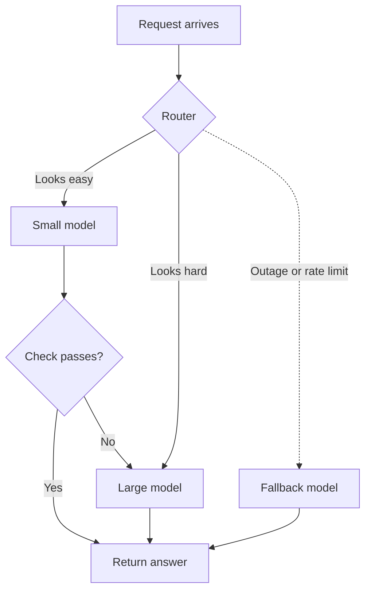

Discounts such as [prompt caching and batch processing](/running/prompt-caching-and-batch-processing/) make each token cheaper, but the biggest price difference is between the models themselves. Model routing is the habit of matching each job to the cheapest model that can do it well.

**In one line:** model routing means using different models for different jobs or steps, so easy work goes to a small, cheap, fast model and hard work goes to a stronger, costlier one.

## The jargon: concepts covered on this page

- **Model routing:** choosing which model handles each request or step
- **Router:** the logic that picks a model for each request
- **Cascade:** trying a cheap model first and escalating if a check fails
- **Escalation:** passing a request to a stronger model after a weaker one falls short
- **Fallback:** a backup model used when the first choice fails or is unavailable
- **Gateway:** a service giving one doorway to many models, often with routing built in
- **Load balancing:** spreading identical requests across several copies of a model or provider

## Why it matters

Models come in sizes. A small model is quick and cheap but makes more mistakes on hard problems. A large one is slower and costs more, but copes with subtle reasoning and careful writing. If you use the large model for everything, you pay premium prices for work such as sorting emails or pulling a date out of a sentence, which a small model does fine.

The gap is big enough to matter. Agents make many calls, and most of those calls are routine. Routing is the habit of matching the model to the difficulty of each call.

It is also a way to stay running. If one provider has an outage or tells you to slow down, a routing setup can send the request somewhere else.

<mark>Routing saves money only when you have tested that the cheap route is good enough on your own cases, and when the bill or the delay is big enough to justify the extra moving parts.</mark>

## How it works

A **router** is a small piece of logic that sits between your application and the models. Each request arrives, the router picks a model, and the answer comes back. There are three common styles.

**Fixed rules by task type.** You decide in advance: "extracting fields goes to the small model, drafting an investor update goes to the large one." There is nothing clever about it, which is its strength. It is predictable and easy to debug.

**A classifier decides.** A small model (or a simple scoring rule) reads the request first and rates how hard it looks. Easy ones go to the cheap model, hard ones to the strong one. This copes with mixed traffic, but the classifier can misjudge, and it adds a call of its own.

**A cascade.** You try the cheap model first and then check its answer. If the check passes, you are done. If it fails, you escalate the same request to the stronger model. The check might be a rule (is the date a real date?), a confidence score, or a second model acting as a judge.

**Fallback routing** is a separate idea with a similar shape. Here the router does not care about difficulty. If the first-choice model fails, is overloaded or returns a rate-limit error, the request goes to a backup model, often after a short wait and retry (see [rate limits, retries and failures](/running/rate-limits-retries-and-failures/)).

Routing can also happen inside an agent. In a system of [subagents](/agents/subagents-and-multi-agent-systems/), the main agent might run on a strong model while helpers that do narrow jobs, such as searching or summarising, run on a small one. Each subagent is simply given its own model.

## In practice

You can build a router yourself with a few lines of code and an if-statement, which is often enough for fixed rules. Some tools also do it for you.

**Snapshot, as of October 2026.** This paragraph names products, which change. Gateways are services that give you one doorway to many models and handle routing for you. OpenRouter is a hosted gateway: you send requests to one place, it can pick among many providers, and you can list backup models to try in order if the first one fails. It also offers an automatic option that classifies the prompt and chooses a model. LiteLLM is a gateway you can run yourself: its router handles load balancing, retries and fallbacks across several models or providers, and supports routing options such as budget limits and tags. Check each product's documentation for current features before relying on any detail.

Agent products and frameworks often let you set a model per agent or per step, which covers fixed rules without any gateway.

Wherever the router lives, the data goes wherever the chosen model runs. That matters, as the next sections explain.

## Worked example

Sample Ventures, the fictional fund, has an introduction pipeline. When a founder or a partner firm sends an introduction email, an agent extracts the startup name, the person who made the introduction, the sector and the ask, then files a record in the CRM.

The operations lead sets it up as a cascade, in five steps:

1. **Try the small model first.** It reads the email and returns the four fields plus a confidence note for each.
2. **Run cheap checks.** Is the startup name present? Is the sector one from the fund's list? Does the introducer match a known contact? Did the model flag low confidence anywhere?
3. **Tidy emails pass.** A short, clear email with a signature and a one-line ask passes every check and goes straight to the CRM.
4. **Messy emails escalate.** A long forwarded chain, with three companies mentioned and the ask buried in the middle, fails a check. The same email is sent to the stronger model, which untangles it.
5. **Test before trusting.** Before going live, the lead ran 50 past emails through the pipeline and compared the results with records a person had filled in by hand.

To see the effect, use **illustrative** numbers (invented, not a real price list). Say a call to the small model costs 1 unit and a call to the large model costs 10. Suppose 80 out of every 100 emails are tidy.

- Large model for all 100 emails: 100 x 10 = 1,000 units.
- Routed: 100 small calls (100 units) plus 20 escalations to the large model (200 units) = 300 units.

That is about 70 per cent less, and the tidy emails come back faster too. The real saving depends on your mix of emails and on how often the checks catch a miss. If most emails were messy, the saving would shrink, and at some point the extra small-model call would not be worth it.

## Costs and limits

- **More moving parts.** A router, checks and several models are more to build, host and keep working than a single call.
- **Harder debugging.** When an answer is wrong, you need to know which model produced it and why the router chose it. Without good records, this is guesswork (see [observability](/running/observability/)).
- **Inconsistent style.** Two models phrase things differently. A summary from the small model and one from the large may read like they came from different people, which is awkward in client-facing writing.
- **Every route needs testing.** A cheap route that works on easy examples can quietly fail on yours. Test each route on your own cases and re-test when a model changes (see [evals](/running/evals/)).
- **The router can be wrong.** A classifier that sends a hard job to the small model produces a confident, wrong answer with nothing to catch it. Checks after the small model are what make cascades safer.
- **Data terms differ between providers.** Each provider has its own rules on how long it keeps your data, whether it trains on it, and where it is processed. A route or fallback may therefore send data somewhere you have not approved. Before adding any model to a route, check its terms and the agreements you have in place (see [GDPR, data retention and DPAs](/running/gdpr-data-retention-and-dpas/)). This applies with extra force to gateways, which may pass your request on to several providers.
- **Escalations cost double.** In a cascade, a request that escalates pays for the small attempt and the large one.

The most common mistake is adding routing on day one. Start with one good-enough model and measure what you spend and how long things take. Add routing only to the steps where the bill or the delay justifies the work. For many small teams, that is a handful of simple steps, if any.

## Often confused with

**Model selection vs routing.** Model selection is a one-off choice made by a person: "we will use this model for the briefing agent." Routing is a decision made by software for each request, so different requests can end up on different models.

**Routing vs load balancing.** Load balancing spreads identical work across several copies of the same model or provider so no single one is overloaded. Routing chooses between different models because they differ in cost, skill or terms. The tools overlap, and gateways often do both.

## Related

- [How AI pricing works](/running/how-api-pricing-works/): why the price gap between small and large models exists
- [Estimating cost per task](/running/estimating-cost-per-task/): how to work out what a routed task would cost
- [Rate limits, retries and failures](/running/rate-limits-retries-and-failures/): the failures that fallback routing is built to survive
- [Subagents and multi-agent systems](/agents/subagents-and-multi-agent-systems/): helpers that can each run on their own model

## Next up

Pricing, discounts and routing each change one part of the bill. [Estimating cost per task](/running/estimating-cost-per-task/) puts them together into one figure for a finished job, before you build anything.
