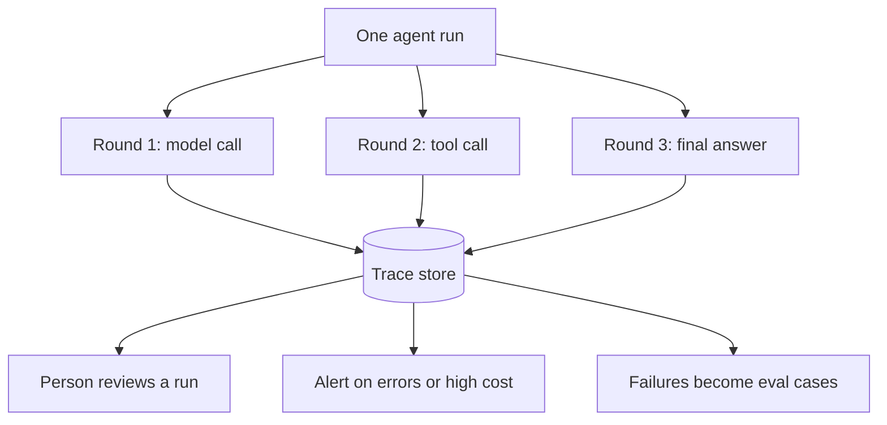

Retries keep an unattended agent going when a service fails, as [rate limits, retries and failures](/running/rate-limits-retries-and-failures/) explains. But once it runs on its own, nobody is watching it work. Observability is the dashboard gauges and the trip recorder: the record that shows afterwards what it saw, decided and did.

**In one line:** observability is being able to look back at exactly what an agent saw, decided and did on a run, round by round, so you can explain why it behaved as it did.

## Why it matters

An agent works in the middle of a process you cannot see. You ask a question, you get an answer, and a dozen steps happened in between. When the answer is wrong, the answer alone does not tell you why.

Without a record, you are guessing. Was the instruction unclear? Did a search return the wrong thing? Did the agent ignore a result? You can spend hours on theories.

<mark>If you cannot see what an agent did, you cannot fix it, price it or explain it.</mark>

A record helps in four ways: debugging odd behaviour, understanding where the cost goes, proving what happened when someone asks, and turning real failures into test cases for your [evals](/running/evals/) (repeatable tests of an AI system, covered on the next page).

## How it works

Think of a flight recorder. It does not stop anything going wrong. It captures enough about the flight that, afterwards, you can replay what happened.

An agent works in rounds (see [the agent loop](/agents/the-agent-loop/)): the model reads, decides, asks for a [tool](/agents/tool-use/), gets a result, and goes round again. Observability means writing down each round as it happens. The full record of one run is called a **trace**, and each step inside it is often called a **span**.

For each round, a good trace holds:

- What the model was shown (the instructions, the conversation, earlier tool results)
- What it decided, including which tool it called and with what inputs
- What came back from the tool
- How many [tokens](/start/tokens-and-context-windows/) were used
- How long the step took
- Any errors or retries

Around the traces sit two simpler things. **Logs** are plain timestamped records of events. **Alerts** are automatic warnings when something looks wrong, such as a run costing far more than usual or a tool failing repeatedly.

## In practice

Two kinds of tool help. Many agent frameworks have built-in logging that records runs in a standard shape. Dedicated tracing platforms, such as Langfuse, LangSmith or Arize Phoenix, collect traces from your agent, store them and give you a screen to browse them. There is also an open standard for this kind of data, OpenTelemetry, which a number of these tools can read. The names change often, so treat these as examples of a category.

You do not need to log everything forever. Decide three things up front:

1. **What to record.** The full text of every step is the most useful, and also the most sensitive.
2. **How long to keep it.** Keep traces long enough to debug and learn from, then delete them.
3. **Who can see them.** Not everyone who uses the agent should read every trace.

This matters because a trace contains whatever the agent saw. If the agent read an investor's email or a confidential data room file, the trace now holds a copy. Logs deserve the same [access control](/data/permissions-and-access-control/) as the source data. Where you can, redact (blank out) personal details before they are stored. Rules on personal data (such as GDPR, the data protection law in the UK and EU) and audit trails get their own pages later.

## Worked example

An associate at Sample Ventures, the fictional fund, asks an agent to attach an introduction email to the right company in the CRM. The agent files it under "Acme Payments Ltd". The email was actually about "Acme Payroll", a different startup.

1. The associate notices the wrong record and tells the operations lead.
2. The operations lead opens the trace for that run.
3. Round 1: the model reads the email and extracts the name "Acme".
4. Round 2: the agent calls the CRM search tool with the input "Acme". The tool result shows two companies, Acme Payments Ltd and Acme Payroll.
5. Round 3: the model picks the first result and moves on. Nothing in the trace shows it checking the email's text for a clue, such as the sector.
6. The cause is now clear: the search was too loose, and the agent did not check between near-matches. This is a case of [entity resolution](/data/entity-resolution/) failing.
7. The fix is a clearer instruction: "If a search returns more than one company, compare sector and website before choosing, or ask." The team also adds this email as a new case in their evals, so the problem cannot return unnoticed.

Without the trace, the team would only know that the agent "got it wrong sometimes".

## Costs and limits

- **Storing traces costs space and money.** Full text for every step adds up. Relative to the agent's own running cost it is usually small, but it grows with volume.
- **Traces hold sensitive data.** They are a second copy of everything the agent touched. Treat them as sensitive from day one.
- **Too much detail hides the problem.** A trace with hundreds of steps is hard to read. Good tools let you filter and search.
- **It shows what happened, not always why.** A trace tells you the model chose the first result. It cannot tell you its reasoning with certainty.
- **Nobody reads them unless there is a habit.** A weekly look at a handful of runs, and at any flagged ones, finds problems early.

The most common mistake is adding observability after the first serious incident. Switch it on from the first test run.

## Often confused with

**Observability vs an audit trail.** An audit trail is a durable record of who did what and when, kept for accountability, often for rules or regulators. Observability is aimed at the people building the system, to understand and improve it. The two can share data, but they have different jobs and different retention.

**Observability vs monitoring.** Monitoring watches a few numbers and warns you when something is off, such as error rates or cost. Observability gives you the detail to find out why. Monitoring says "something is wrong", observability helps you see what.

## Related

- [Evals](/running/evals/): real failures found in traces become new test cases
- [The agent loop](/agents/the-agent-loop/): each round of the loop becomes a step in the trace
- [Entity resolution](/data/entity-resolution/): the cause behind the wrong "Acme" in the example
- [Permissions and access control](/data/permissions-and-access-control/): traces need the same protection as the data they copy
- [Audit trails](/running/audit-trails/): the accountability record, as opposed to the builder's view
- [Estimating cost per task](/running/estimating-cost-per-task/): turning measured runs into a realistic cost
- [Observability and evals tooling](/map/observability-and-evals/): example platforms

## The proper terms

- **Alert:** an automatic warning when a run looks wrong or unusual
- **Log:** a timestamped record of something that happened
- **Observability:** the ability to see what a system did and why
- **Redaction:** blanking out sensitive details before data is stored
- **Retention:** how long records are kept before deletion
- **Span:** one step inside a trace, such as a model call or tool call
- **Trace:** the full step-by-step record of one agent run

## Next up

A record of real runs shows what went wrong once. [Evals](/running/evals/) turn those failures into repeatable tests, so every change can be checked before it reaches real users.
