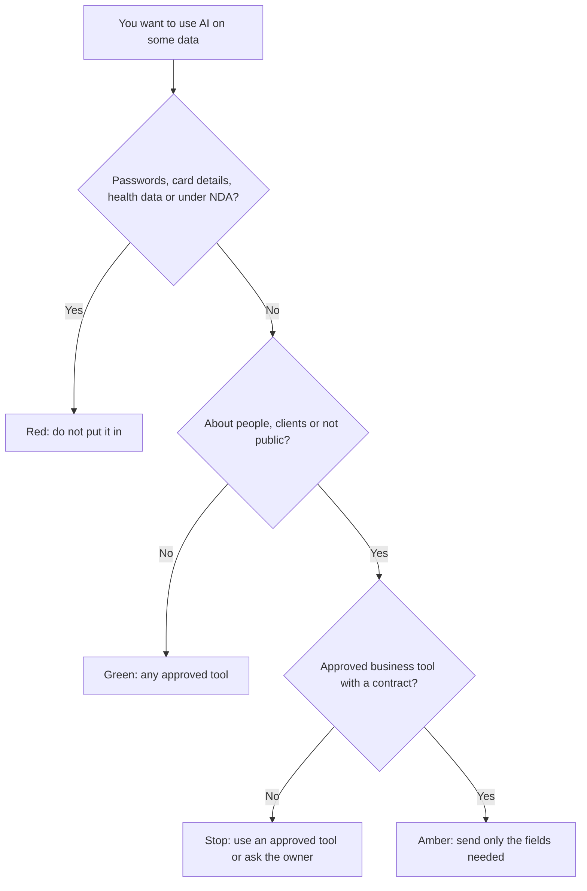

Data protection law, covered in [GDPR, data retention and DPAs](/running/gdpr-data-retention-and-dpas/), sets the floor: the things you must do with information about people. An AI policy is your own house rules on top of that floor, written down so everyone on the team uses AI tools and agents the same careful way.

**In one line:** an AI policy is a short document that says which AI tools your team may use, what data may go into them, what must be checked by a person, who may connect agents to what, and who to tell when something goes wrong.

This page is general guidance to help you write sensible rules. It is not legal advice. If you are regulated, or handle sensitive data, have a lawyer or your compliance lead check the result.

## The jargon: concepts covered on this page

- **AI literacy:** enough understanding of AI to use it sensibly and spot its mistakes
- **AI usage policy:** written house rules for how a team may use AI tools
- **Approved tools list:** the named tools and plans the team is allowed to use for work
- **Data classification:** sorting information into groups by how sensitive it is
- **Disclosure:** telling clients or the public that AI helped produce something
- **Human review:** a person checking AI output before it is used or sent
- **Incident:** something that went wrong, such as data in the wrong tool or a wrong answer sent out
- **Shadow AI:** staff using AI tools the organisation does not know about or has not approved

## Why it matters

People are already using AI at work, whether or not anyone has said they may. Someone pastes a client email into a free chatbot to draft a reply, or uploads a spreadsheet to get a summary. This is called **shadow AI**, and banning it rarely works. Giving people approved tools and clear rules works better.

Without rules, three things tend to go wrong. Data leaks into tools with no contract and unclear terms (see [GDPR, data retention and DPAs](/running/gdpr-data-retention-and-dpas/)). Quality is uneven, because one person checks every figure and another sends whatever the model wrote (see [hallucination and grounding](/start/hallucination-and-grounding/)). And when a client, investor or regulator asks "how do you use AI?", nobody can give the same answer twice.

<mark>A one-page policy that people actually read beats a twenty-page policy that sits in a folder.</mark>

## How it works

In car terms, the law is the highway code and your policy is the house rules for the company car: who may drive it, where, what you never carry in it, and who to call after a scrape. It does not need to be long. It needs to answer the questions people actually face on a Tuesday afternoon.

A short policy usually covers these parts.

**Approved tools and plans.** Name the tools people may use for work, and the plan. The plan matters as much as the brand: the same vendor can offer very different data terms on a free personal account and a business account. Say plainly that work data does not go into personal accounts.

**What data may go in.** The simplest method is a traffic light, a basic form of **data classification**:

- **Green:** public or low-risk. Published material, your own drafts with no personal or confidential details, general questions. Any approved tool.
- **Amber:** internal or personal data that the business tools are approved for. Client names and emails, internal notes, figures that are not public. Only approved business tools covered by a contract, and only the fields the task needs.
- **Red:** never goes in, or only with a named person's sign-off. Passwords and keys, payment card and bank details, health and other special category data, anything under a confidentiality agreement that forbids it, and anything you would be unable to explain to the person it is about.



**Human review.** Say what must be checked by a person before it leaves the building. A good rule of thumb: anything sent to a client, published, used in a decision about a person, or containing figures, facts, quotes or legal wording. The person who sends it owns it, whoever drafted it. See [human in the loop](/agents/human-in-the-loop/) for the agent version.

**Agents and automations.** Once AI can take actions, through connectors, scheduled tasks or agents, the policy needs a few extra lines. Who may connect a tool to company systems. Which actions need an approval first, such as sending email, paying, deleting or sharing outside the company. And the rule from [least privilege](/running/least-privilege/): each agent gets its own account with only the access its job needs, so its actions show up in [audit trails](/running/audit-trails/).

**Disclosure.** Say when you tell people AI was involved. Many teams disclose when AI produced a substantial part of something a client relies on, when a customer is talking to a bot rather than a person, and whenever a client contract or a regulator requires it. Routine help, such as fixing grammar, usually does not need a label. Whatever you choose, make it consistent.

**Owner and accountability.** Name one person who owns the policy, keeps the approved tools list, and answers questions. In a small team this is often the founder or operations lead.

**Training.** A short session when someone joins, and a refresher when tools change, covering what the tools are good and bad at (see [what AI is good and bad at](/start/what-ai-is-good-and-bad-at/)), the traffic light, and [prompt injection](/running/prompt-injection/) for anyone running agents. This is what people mean by **AI literacy**.

**Incident reporting.** Say what to do when something goes wrong: red data pasted into the wrong tool, a wrong answer sent to a client, an agent doing something unexpected. Tell the owner the same day, without blame. A quick report lets you ask the vendor to delete data, correct a message or tighten a permission. Some incidents involving personal data may need reporting to the regulator within strict time limits, which is another reason to hear about them fast.

**Review date.** Tools and terms change quickly. Put a date on the policy and look at it again at least every six months, and whenever you add a major tool or agent.

## In practice

**Keep it to one or two pages.** Write in the words your team uses. If a rule needs a paragraph of explanation, it probably belongs in training, not the policy.

**Roll it out in person.** Send it, then spend fifteen minutes walking through it with real examples from your work. Ask people which tools they already use. You will learn about shadow AI, and some of those tools may deserve a place on the approved list.

**Make the easy path the safe path.** Pay for the business plan of the tools people want. Set up the approved tools with sensible defaults. People follow rules more readily when the approved tool is also the most convenient one.

**Keep a short log.** The approved tools list, the date each was checked, and any incidents. This is the evidence that the policy is real.

**Optional further reading.** You do not need any of these to write a good small-team policy, but they help if you grow or are asked about your approach. As of October 2026:

- **The EU AI Act's AI literacy duty (Article 4).** It has applied since 2 February 2025 to providers and deployers of AI systems within the Act's scope, which can include UK businesses whose AI use reaches the EU. An amendment in force from 27 July 2026 softened it: organisations must take measures to support their staff's AI literacy, but do not have to guarantee a set level for each person. Whether and how it applies to you depends on your situation, so check.
- **ISO/IEC 42001.** An international standard, published in 2023, for an AI management system: the policies, roles and processes an organisation uses to run AI responsibly. Some larger organisations certify against it.
- **The NIST AI Risk Management Framework.** A free, voluntary US framework for thinking through AI risks, with a companion profile for generative AI. NIST says it is being revised, so check for a newer version.
- **The ICO's guidance on AI and data protection.** The UK regulator's guidance on using personal data with AI. The ICO says it is under review after the Data (Use and Access) Act 2025, so check its website for the current version.

### A template to copy

Each heading gets one or two lines. Fill in the brackets, delete what does not apply.

```text
[Business name] AI policy        Owner: [name]    Review by: [date]

1. Why: we use AI to save time; these rules keep client data safe and our work accurate.
2. Approved tools: [tool and plan]. Work data never goes into personal or free accounts.
3. Data: Green any approved tool. Amber approved business tools only, minimum needed.
   Red never: [passwords, card and bank details, health data, NDA material].
4. Check before it goes out: anything to clients, published, about a person, or with figures.
5. Agents: only [owner] connects tools to company systems. Approval needed to [send, pay, delete, share].
6. Disclosure: we tell clients when AI produced a substantial part of [deliverable]. Bots say they are bots.
7. Owner: [name] keeps the tools list and answers questions.
8. Training: walk-through on joining and when tools change.
9. Something went wrong? Tell [name] the same day. No blame.
10. Review: every six months, or when we add a major tool.
```

## Worked example

**Bramley's, one page.** Sam runs the bakery with one part-time assistant. Sam uses an AI assistant to write product descriptions, answer order emails and plan the weekly bake. The policy fits on one side of paper on the office wall:

- Approved: one AI assistant on a business plan, and the AI features in the online shop.
- Green: recipes, product descriptions, social posts. Amber: customer names and order details, only in the business plan. Red: card details, allergy and health notes about named customers, the shop's passwords.
- Check before sending: any reply that mentions allergens, prices or delivery dates.
- The flour reorder agent can only order from the usual mill under its card limit (see [agent identity and payments](/running/agent-identity-and-payments/)). Only Sam changes its settings.
- No disclosure needed for descriptions. The chat on the website says it is an assistant and offers Sam's email.
- Anything odd: text Sam. Review in March and September.

That is the whole policy. Its most important line is the allergen check, because that is where a wrong answer could hurt someone.

**Sample Ventures, two pages.** The fictional fund has eight people, handles founder and investor data, and is regulated. Its policy uses the same headings with more detail:

- Approved tools list with the plan, the date the DPA was signed and the training setting checked for each.
- The traffic light with fund examples: public news about Acme Payments is green, CRM notes and pipeline data are amber, investor bank details, unannounced deal terms under NDA and anything about a founder's health are red.
- Human review for every investor update, anything quoted to a founder, and any figure going into a fund report.
- Agents: each has its own account, read-only by default. Writing to the CRM or sending external email needs an approval, recorded in the audit trail. Only the operations lead adds connectors.
- Disclosure: investor reports note where AI helped prepare analysis. Founders are told if call notes are transcribed by AI.
- A named owner, compliance sign-off, training for new joiners, a same-day incident rule, and a six-month review.

Both policies answer the same questions. The fund needs more lines because it has more data, more people and a regulator. Neither needs more than two pages.

## Costs and limits

- **The writing is quick, the follow-through is not.** A first draft takes an afternoon. Keeping the tools list current and running refreshers takes steady effort.
- **Business plans cost money.** The safest policy fails if the approved tool is worse or pricier than the free one people already use. Budget for it.
- **Rules nobody can follow get ignored.** A ban on all AI use pushes people to shadow AI. Aim for rules people can follow while doing their job.
- **A policy is not a control.** It tells people what to do. Settings, permissions and approvals in the tools themselves are what actually stop mistakes, so do both.
- **Templates are a start, not an answer.** A copied policy full of rules that do not fit your work will not be read. Cut it down to your real cases.
- **It goes stale.** New features and new terms arrive every few months. A policy without a review date quietly stops being true.

## Often confused with

**AI policy vs privacy notice.** A privacy notice tells people outside the business what you do with their data. An AI policy tells people inside the business how to use AI tools. You may need to update the privacy notice when the policy changes.

**AI policy vs AI management system.** A policy is a short set of rules. An AI management system, the kind ISO/IEC 42001 describes, is the whole set of roles, risk reviews, records and audits around AI. A small team needs the first; larger organisations may build the second.

## Related

- [GDPR, data retention and DPAs](/running/gdpr-data-retention-and-dpas/): the legal floor your house rules sit on
- [Least privilege](/running/least-privilege/): the rule behind giving agents narrow keys
- [Audit trails](/running/audit-trails/): where approvals and agent actions get recorded
- [Human in the loop](/agents/human-in-the-loop/): how approvals before risky actions work
- [Safety basics](/agents/safety-basics/): the short version of agent safety for everyday use

## Next up

With the house rules written down, the remaining question is what all of this costs to run. The rest of Part 6 is about the fuel bill, starting with [how API pricing works](/running/how-api-pricing-works/).
