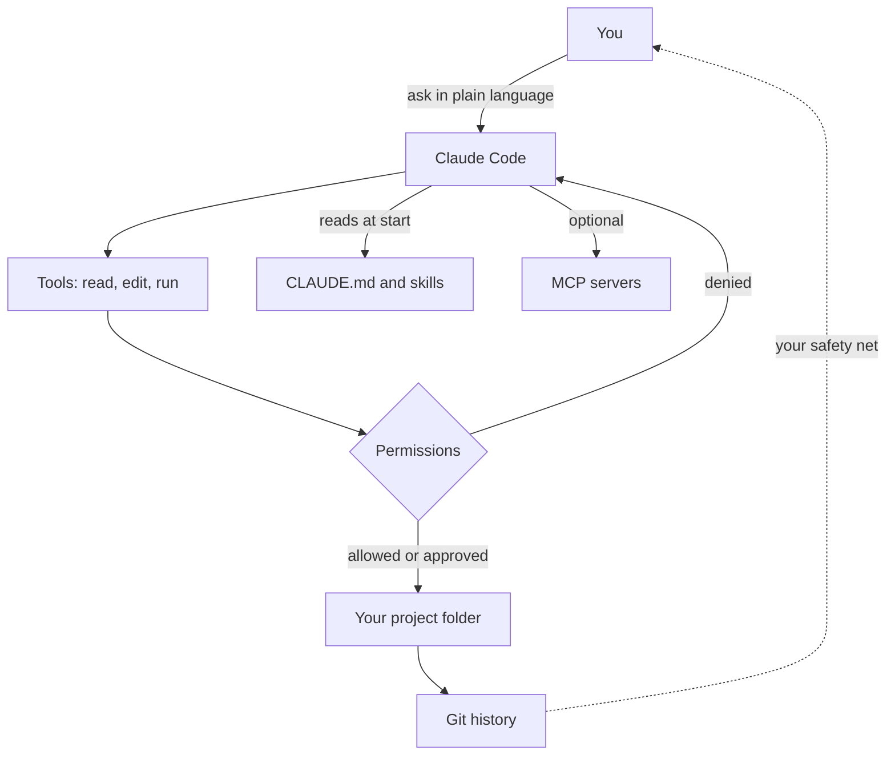

Choosing Claude Code is the easy part. This page covers the controls that decide what it may do, what it remembers between sessions and how it can be extended.

**In one line:** Claude Code is an agent that works inside one folder on your computer, reading and changing files and running commands, with you deciding how much it may do without asking.

*Snapshot, as of October 2026. Claude Code changes quickly. Commands and menu names here come from Anthropic's documentation at code.claude.com, so check there if something looks different on your machine.*

## Why it matters

A chat window can only talk. Claude Code can act: it can open your files, edit them, run a script and check the result. That is what makes it useful for building a website, tidying a folder of notes or maintaining a set of instructions, and also what makes it worth handling carefully.

For a team of one, it works like a very fast junior colleague who forgets everything between sessions. <mark>The skill is in setting it up so each session starts well-informed and cannot do much damage.</mark> This page covers the controls that do that. For how it differs from the chat apps, see [Claude.ai, Claude Code and the Claude API](/setup/claude-surfaces/).

## How it works

Claude Code is an [agentic harness](/concepts/agents/agentic-harness/): a program that wraps a model, gives it [tools](/concepts/agents/tool-use/) and runs the [agent loop](/concepts/agents/the-agent-loop/). The tools are things like reading a file, editing a file and running a shell command. Between the model and your computer sits a permission layer that decides what needs your approval.



### Install and start

Anthropic's setup page lists macOS 13 or later (plus recent Windows and Linux versions) and an internet connection. A paid Claude plan or a Console account is required, and the free plan is not enough. The recommended install on a Mac, from a terminal (see [terminal basics](/setup/terminal-basics/)), is:

```bash
curl -fsSL https://claude.ai/install.sh | bash
```

Open a new terminal window and run `claude --version`. If it prints a version number, it worked. Then go to the folder you want to work in and start it:

```bash
cd your-project
claude
```

The first run asks you to log in through your browser. Homebrew is an alternative (`brew install --cask claude-code`), but Anthropic notes it does not update itself. `claude doctor` checks your installation and settings if something seems off. Windows has its own install commands, listed on the same page. If you prefer no terminal at all, the Claude desktop app has a Code tab that includes it.

### The permission model

Claude Code asks before it does most things that change something. Anthropic's documentation says reading files in your working folder needs no approval, while running shell commands, editing files, fetching web pages and searching the web do. When it asks, you can allow once, allow and stop asking, or say no.

You can set standing rules. **Allow** rules let a tool run without asking, **ask** rules always ask, and **deny** rules forbid it. Rules look like `Bash(npm run build)` or `Read(./.env)`. Deny rules are checked first, so an allow rule cannot override a deny. Type `/permissions` to see and edit them.

These rules are enforced by Claude Code itself. Anthropic stresses that instructions in a prompt or CLAUDE.md shape what Claude tries to do but do not change what it is allowed to do. If something must never happen, use a deny rule.

**Permission modes** set the baseline. Press Shift+Tab to cycle through them in the terminal:

- **Manual** (called `default` in settings): asks before most actions. The safest.
- **Accept edits** (`acceptEdits`): file edits and common file commands such as creating, moving and copying run without asking.
- **Plan** (`plan`): Claude researches and proposes a plan but does not edit your files until you approve it. Start it with `/plan` or `claude --permission-mode plan`.
- **Auto** (`auto`): a second model acts as a safety checker on actions instead of you. Availability depends on your plan, version and organisation.
- **Bypass permissions** (`bypassPermissions`): skips prompts. Anthropic's warning is to use it only in isolated environments such as a container or virtual machine. Do not use it on your own laptop.

### CLAUDE.md: the rulebook

Each session starts with a blank memory. A **CLAUDE.md** file is a markdown file Claude reads at the start of every session, holding the rules and facts you would otherwise repeat. This is the "instruction file" idea from [skills and instruction files](/concepts/agents/skills-and-instruction-files/).

Anthropic lists several locations: a project file (`./CLAUDE.md` or `./.claude/CLAUDE.md`, shared through git), a personal one for all projects (`~/.claude/CLAUDE.md`), and a personal per-project one (`./CLAUDE.local.md`, which you should keep out of git). Files in the folder you start in and the folders above it load at launch. Files in subfolders load when Claude reads files there.

What belongs in it: build and check commands, conventions, project layout and "always do X" rules. Anthropic suggests keeping each file under about 200 lines, since longer files use more [context](/concepts/how-models-work/tokens-and-context-windows/) and are followed less reliably. Run `/init` to have Claude draft a first one, and `/memory` to edit your memory files. Claude Code also keeps its own "auto memory" notes, which `/memory` lets you view or switch off.

### Skills

A skill is a folder containing a `SKILL.md` file with a name, a description of when to use it and the steps to follow. Anthropic's documentation says they live in `.claude/skills/<name>/` for one project or `~/.claude/skills/<name>/` for all your projects. You can run one by typing `/` and its name, and Claude can also pick one up on its own when your request matches the description. Use a skill for a multi-step procedure and CLAUDE.md for rules that are always true.

### Slash commands

Typing `/` shows the commands available. Type `/` and a few letters to filter. Ones documented by Anthropic include:

- `/help`: show help and available commands
- `/init`: draft a CLAUDE.md for the project
- `/memory`: edit memory files
- `/permissions`: manage allow, ask and deny rules
- `/plan`: enter plan mode
- `/rewind`: go back to an earlier point (aliases `/undo` and `/checkpoint`)
- `/compact`: summarise the conversation to free up space
- `/clear`: start a fresh conversation
- `/context`: show what is filling the context window
- `/resume`: return to an earlier conversation
- `/mcp`, `/hooks`, `/agents`, `/config`, `/usage`, `/doctor`: manage servers, hooks, subagents, settings, usage and installation health

### Hooks

A **hook** is a command that runs automatically at a set moment in Claude Code's work, for example after every file edit or when Claude is waiting for you. Unlike CLAUDE.md, which Claude may or may not follow, a hook always runs. Anthropic's guide uses a notification hook as the first example: it pops up a desktop notice whenever Claude needs your input, so you can look away while it works. Hooks are set in a settings file, and `/hooks` lists what is configured. Because hooks run commands on your computer, read any hook you did not write before adding it.

### Subagents

A **subagent** is a helper Claude hands a side task to, working in its own separate context window and returning just a summary. That keeps long searches from cluttering your main conversation. Built-in ones include Explore (read-only search) and Plan. You can define your own as markdown files in `.claude/agents/` or `~/.claude/agents/`. See [subagents and multi-agent systems](/concepts/agents/subagents-and-multi-agent-systems/).

### MCP servers

[MCP](/concepts/agents/mcp/) servers give Claude Code new tools, such as reading a database or a project tracker. Anthropic documents adding one from the terminal:

```bash
claude mcp add --transport http server-name https://example.com/mcp
```

Use `claude mcp list` to see what is installed and `/mcp` inside a session to check status and sign in. Scope matters: by default a server is local to you and the current project, `--scope project` writes a `.mcp.json` file meant to be shared through git, and `--scope user` makes it available in all your projects. Anthropic warns to trust each server first, since servers that fetch outside content carry [prompt injection](/concepts/security/prompt-injection/) risk. A worked example is in [Supabase](/setup/supabase/).

### Settings files

Settings are JSON files at different scopes. Per Anthropic's documentation: `~/.claude/settings.json` applies to you in every project, `.claude/settings.json` is shared with everyone on the project, and `.claude/settings.local.json` is yours for one project. Organisations can add managed settings that override the rest. Settings set higher up win. `/config` opens a settings screen without editing the files by hand.

### Checkpoints and undo

Claude Code takes a snapshot of your files before each prompt. Run `/rewind`, or press Esc twice with an empty prompt, to restore the code, the conversation or both. There are limits. Anthropic says changes made by shell commands (such as deleting or moving files) are not tracked, nor are edits from outside the session. It calls checkpoints session-level recovery, not a replacement for git.

### Managing context

A long session fills the [context window](/concepts/how-models-work/tokens-and-context-windows/), and quality and cost both suffer. `/context` shows what is using space. `/compact` summarises the conversation to make room, and you can add a note on what to keep. Claude Code also compacts automatically when it gets full. `/clear` starts clean. This is the practical side of [context engineering](/concepts/talking-to-models/context-engineering/): put lasting rules in files, and keep each conversation focused on one job.

### How this guide uses it

This guide is a working example. The repository holds a rulebook file (CLAUDE.md) covering what the site is for, what must never appear on it, the writing style, and the checks to run before publishing. It also holds a publishing skill, a short list of steps: review what changed, run safety and style checks, build the site, then publish and confirm it is live.

Because the rules sit in files, every session behaves the same way, whether it is Monday's or next month's. Nothing depends on remembering to say "no em dashes" again. Changes to the rules are visible in git and can be undone.

## Setting it up

Claude Code is its own setup, so the steps are short:

1. Install it and check `claude --version`, as above.
2. Make a folder for the work and put it under git. See [git and GitHub for one](/setup/git-and-github-for-one/).
3. Start `claude` in that folder, log in, and run `/init` to draft a CLAUDE.md.
4. Read the CLAUDE.md and trim anything that is not true or not needed.
5. Run `/permissions` and add deny rules for files that must stay private, such as `.env`.
6. Try a small task in plan mode, read the plan, then approve it.

## Good habits

- **Work in small tasks.** One change at a time is easier to check and undo.
- **Plan before big changes.** Use plan mode when a task touches many files.
- **Commit before risky work.** Git is the safety net that checkpoints are not. See [git and GitHub for one](/setup/git-and-github-for-one/).
- **Review the changes.** Read the diff, meaning the list of lines added and removed, before you commit.
- **Read what it plans to run.** Check commands before approving, especially ones that delete, download or send.
- **Never give it secrets.** Do not paste keys into prompts or CLAUDE.md. Keep them in [environment variables](/concepts/running-things/environment-variables-and-secrets/) and deny reading `.env`.
- **Treat what it reads as untrusted.** Files and web pages can contain hidden instructions. See [prompt injection](/concepts/security/prompt-injection/).
- **Stay in the loop.** Anything that sends, deletes or publishes deserves your eyes. See [human in the loop](/concepts/agents/human-in-the-loop/).

## When things go wrong

- **`claude` is not found after installing.** Open a new terminal window. If it persists, the install folder is not on your PATH, and Anthropic's installation troubleshooting page explains the fix.
- **It keeps asking permission.** That is by design. Allow specific safe commands with "don't ask again" or a rule in `/permissions`, rather than switching permissions off.
- **It ignores a rule in CLAUDE.md.** CLAUDE.md is guidance and not enforcement. Make the rule shorter and more concrete, remove conflicts, or use a deny rule or hook for what must hold.
- **It broke something.** Use `/rewind` for edits it made itself. For anything else, such as deleted files, use git.
- **The session feels slow or confused.** The context is probably full. Run `/context`, then `/compact` or `/clear`.
- **Wrong billing.** If an `ANTHROPIC_API_KEY` is set, Claude Code may use API billing rather than your plan.

## Costs and limits

- **Long sessions cost more.** Everything in the context is re-read each turn, so tight sessions are cheaper. See [not burning tokens](/setup/not-burning-tokens/).
- **Subagents use their own usage.** They keep your main conversation tidy but are not free.
- **Plan allowance is shared.** On a subscription, Claude Code and the Claude apps draw from the same limits.
- **It makes mistakes.** It can edit the wrong file or misread an instruction. Review is your job.
- **Settings change often.** Rely on `/help` and Anthropic's documentation for the latest.

## Related

- [Claude.ai, Claude Code and the Claude API](/setup/claude-surfaces/): how this tool differs from the apps and the API
- [Skills and instruction files](/concepts/agents/skills-and-instruction-files/): the idea behind CLAUDE.md and skills
- [Git and GitHub for one](/setup/git-and-github-for-one/): the safety net under every session
- [Human in the loop](/concepts/agents/human-in-the-loop/): why approval steps matter
- [Prompt injection](/concepts/security/prompt-injection/): the main risk when an agent reads outside content

## The proper terms

- **Permission mode:** a setting for how much Claude Code does without asking
- **Allow, ask and deny rules:** standing permissions for specific tools or commands
- **CLAUDE.md:** a file of standing instructions Claude Code reads each session
- **Auto memory:** notes Claude Code writes itself between sessions
- **Hook:** a command that runs automatically at a set moment
- **Checkpoint:** a snapshot of your files taken before each prompt
- **Compaction:** summarising a long conversation to free up context space
- **Diff:** a view of exactly which lines changed

## Next up

Claude Code is one way to build with AI, and not the only one. [Cursor and AI app builders](/setup/cursor-and-app-builders/) covers the code editors and website builders that do a similar job, and how they compare.
