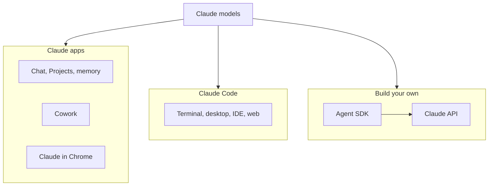

The foundations so far store, publish and hold your work, but none of them does any thinking. This page sorts out the different ways to put Claude to work on top of them, and which one fits which job.

**In one line:** Anthropic offers several ways to use Claude (apps for chatting and delegating, a coding agent for working in folders, and an API for building your own), and the names sound similar enough that it pays to know which is which.

*Snapshot, as of October 2026. Anthropic renames and reshapes these products often, so use this page for the shape of the landscape and check Anthropic's own pages for details.*

## Why it matters

When you start building, you will hear "just use Claude" about very different things. A chat window, a command-line tool and a programming interface all use the same models, but they behave differently, bill differently and keep your information in different places.

Picking the wrong one is a common early mistake. People try to build a repeatable workflow inside a chat when they need an agent with files and tools. Or they reach for the API when a Project in the app would have done the job in ten minutes.

<mark>The model is the same everywhere; what changes is who runs the agent, what it can touch, and how you pay.</mark>

## How it works

Think of one engine in several vehicles. The model is the engine. The apps are the family car: easy, nothing to install, good for everyday trips. Claude Code is a workshop vehicle built for one job, changing files in a folder. The API is the bare engine you can fit into your own machine.

### The Claude apps

Per Anthropic's help pages, Claude is available on the web at claude.ai, in a desktop app for Mac and Windows, and in mobile apps for iOS and Android. They share the same chat interface. Useful features include:

- **Projects.** Self-contained workspaces with their own chat history, uploaded knowledge files and project instructions. Free accounts can make a small number, and paid plans get more capacity.
- **Memory.** Claude can save context about you and your work across chats. Anthropic says it is on by default for Free, Pro and Max, and that you can pause it, reset it, or switch it off for a single chat. Team and Enterprise owners control it for their members. See [memory](/concepts/agents/memory/).
- **Connectors.** Links to outside tools and data, including custom connectors built on remote [MCP](/concepts/agents/mcp/) servers. Anthropic advises connecting only to servers you trust.
- **Skills.** Packaged instructions that Claude uses when relevant, including built-in ones for documents and spreadsheets and custom ones you upload. They need code execution switched on. See [skills and instruction files](/concepts/agents/skills-and-instruction-files/).
- **Research.** A paid feature that runs several connected searches and returns an answer with citations. It needs web search turned on.

### Cowork

Cowork is Anthropic's agent mode for multi-step work. Instead of a back-and-forth chat, you describe an outcome and Claude carries it out: creating documents, organising files, synthesising research. Anthropic says it needs a paid plan and is available in the desktop app, on the web and on mobile.

When a task needs your local files or browser, Cowork reaches them through the Claude Desktop app, so the app must stay open. You choose which local folders it may use. Anthropic describes three approval styles: Manual (ask first), Auto (a safety-checked mode) and Skip (no checks).

Anthropic's own safety page warns about [prompt injection](/concepts/security/prompt-injection/): content Claude reads can contain hidden instructions. Its advice is to give access only to folders you need, avoid sensitive files, and keep scheduled tasks low risk.

### Claude Code

Claude Code is a coding agent that works in a folder on your computer. It reads files, edits them and runs commands, asking permission along the way. Anthropic lists these places to use it: the terminal, VS Code and JetBrains extensions, the desktop app (Code tab) and the web at claude.ai/code, which is also reachable from the mobile app.

Despite the name it is not only for programmers. Anyone who works with a folder of text files, such as a website, notes or a set of documents, can use it. This whole guide is built that way. The full tour is in [Claude Code in depth](/setup/claude-code-in-depth/).

### Claude in Chrome

Claude in Chrome is a browser extension. Anthropic's Claude Code documentation describes it as letting Claude open tabs, click, type and read pages, using your browser's logged-in sessions. That is powerful and risky in equal measure, since the pages you are signed into enter Claude's view. It works with Claude Code via a flag or the `/chrome` command, and it needs a paid Anthropic plan.

### The Claude API and the Agent SDK

The **Claude API** is how programs talk to Claude directly. You create a Claude Console account, generate an API key, and send requests. Anthropic provides official client libraries for several languages. You write the code, and you decide what tools the model gets and how the agent loop runs.

The **Claude Agent SDK** sits one level up. Anthropic describes it as Claude Code's tools, agent loop and context management packaged as a library for Python and TypeScript, so you can embed that agent in your own application. See [agent frameworks](/map/agent-frameworks/) for how it compares with other ways to build.

### Plan mode

Plan mode is a Claude Code setting where it researches and proposes a plan without editing your files. Per Anthropic's documentation, it reads files, runs read-only exploration and writes a plan, and edits stay blocked until you approve. Enter it by pressing Shift+Tab to cycle modes, by typing `/plan` at the prompt, or by starting with `claude --permission-mode plan`.

It is the cheapest safety habit available: look at the plan before anything changes.

### Subscriptions versus API billing

A **subscription plan** (Pro, Max, Team or Enterprise) is a monthly arrangement with usage limits that reset over time. Anthropic's help pages say paid plans have a session limit and a weekly limit. A plan covers the Claude apps and, per Anthropic, Claude Code too: activity in both draws from the same allowance. The free plan does not include Claude Code.

**API billing** is pay as you go, measured in [tokens](/concepts/how-models-work/tokens-and-context-windows/). It is what you use when your own software calls the model, and what the Agent SDK uses.

One trap is documented by Anthropic: if an `ANTHROPIC_API_KEY` environment variable is set on your computer, Claude Code uses API billing instead of your subscription. See [how AI pricing works](/concepts/cost/how-ai-pricing-works/) for the underlying idea.

## Which one to use when

| I want to... | Use |
| --- | --- |
| Ask questions, draft text, think something through | Claude app (web, desktop or mobile) |
| Keep documents and instructions for an ongoing piece of work | A Project in the Claude app |
| Hand over a multi-step task on my files and review the result | Cowork |
| Edit a folder of files, build a website, keep a repeatable setup | Claude Code |
| See a proposed plan before anything changes | Claude Code in plan mode |
| Have Claude work in a web page I am signed into | Claude in Chrome |
| Add Claude to my own software or a scheduled job | The Claude API |
| Build my own agent with Claude Code's tools | The Agent SDK |

And the three names people mix up most:

| | Claude.ai (apps) | Claude Code | Claude API |
| --- | --- | --- | --- |
| What it is | Chat and delegation for people | A coding agent working in a folder | A way for programs to call Claude |
| Who runs the work | Anthropic's apps | You, on your computer or in a web session | Your own code |
| Memory lives in | Projects and memory | CLAUDE.md files and skills | Whatever you build |
| Billed through | Subscription | Subscription or API key | Pay per token |
| Best for | Everyday questions and documents | Building and maintaining things | Products and automations |

### Where to keep things

In the apps, durable context goes in Projects (instructions and files) and in memory. In Claude Code, it goes in files in your project: a CLAUDE.md rulebook and skills, which you can read, edit and keep in git. Files are easier to inspect and fix than hidden memory, which is why this guide uses them. Anthropic says skills you enable in the apps can sync to Claude Code when you sign in with the same account.

### Other vendors

Other companies offer similar things: chat apps from OpenAI and Google, and coding agents such as OpenAI's Codex or Cursor's agent. The ideas on this page carry over. Each has its own chat app, folder-based coding agent and API. See [interfaces](/map/interfaces/) for the wider picture.

### Planning and building are different jobs

This guide was planned in a chat inside a Claude Project, where the plan, decisions and instructions live. It is built with Claude Code in a repository, where the rulebook and publishing steps live. The chat is good for thinking, explaining and drafting prompts. Claude Code is good for changing files and checking the result. Keeping the roles apart stops either one from doing the other's job badly.

## Good habits

- **Choose by the job, not the brand.** Thinking: chat. Changing files: Claude Code. Software: API.
- **Know your billing path.** Check whether Claude Code is using your plan or an API key.
- **Match approval to stakes.** Use manual approval for anything hard to undo.
- **Give agents their own folder.** Keep sensitive files out of reach.
- **Do not rely on memory alone.** Write important rules into a file or Project.

## When things go wrong

- **Claude Code asks you to log in and the free plan is refused.** Anthropic says Claude Code needs a paid plan or a Console account.
- **Unexpected API charges.** An `ANTHROPIC_API_KEY` environment variable may be set. Unset it to use your subscription.
- **Claude says it cannot see your files.** Chat in a browser cannot read your folders. Use Cowork with a folder you grant, or Claude Code.
- **A feature is missing.** Availability varies by plan and platform. Check Anthropic's help page for that feature.
- **Memory seems wrong.** Review or reset it in settings, or turn it off for a single chat.

## Costs and limits

- **Subscriptions have usage limits.** Heavy agent work uses more of the allowance than light chat.
- **API costs scale with use.** Longer conversations, larger files and more tool calls all cost more.
- **Features differ by plan.** Several features above need a paid plan.
- **Your data is held differently in each.** See [data terms at a glance](/models/data-terms-at-a-glance/) before putting anything sensitive in.

## Related

- [Claude Code in depth](/setup/claude-code-in-depth/): permissions, CLAUDE.md, skills and settings
- [Anthropic](/models/anthropic/): the company and its model families
- [Agent frameworks](/map/agent-frameworks/): ways to build your own agents
- [Interfaces](/map/interfaces/): the places where people meet an agent
- [How AI pricing works](/concepts/cost/how-ai-pricing-works/): subscriptions, tokens and why they differ

## The proper terms

- **Claude Code:** Anthropic's coding agent that works in a folder on your computer
- **Cowork:** Anthropic's agent mode for multi-step file and task work
- **Claude Console:** the web account where API keys and billing are managed
- **Agent SDK:** a library that packages Claude Code's agent for your own software
- **Plan mode:** a Claude Code mode that proposes changes without making them
- **Subscription plan:** monthly access to the apps with usage limits
- **API billing:** pay-as-you-go charges based on tokens used
- **Project:** a Claude app workspace with its own files, instructions and chats

## Next up

Of these, Claude Code is the one that builds and maintains things in your folders, which makes it the main workbench for the rest of this chapter. [Claude Code in depth](/setup/claude-code-in-depth/) covers how to set it up so it stays useful and safe.
