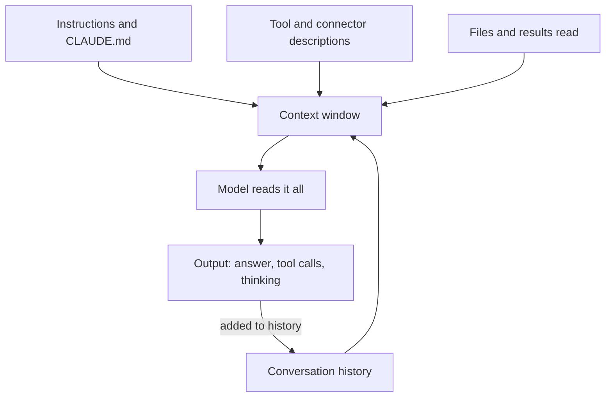

Safe settings cap the damage a session can do, including how much it can spend. The habits on this page keep the fuel bill low in the first place, mostly by giving the model less to read.

**In one line:** keep each session short and focused, send the model less to read, and use the smallest model that does the job.

## Why it matters

A token is a small chunk of text, and every token a model reads or writes counts against something: a subscription's usage allowance, or an API bill. Most waste comes from a few habits, not from any single big request. Long sessions, huge pasted documents and unused tools quietly add up.

The mechanism is easy to miss. A model has no memory between turns, so the tool resends the whole conversation each time you press enter. Claude Code's own documentation says it sends your full conversation with every request, and again each time Claude uses a tool. A one-line question at the end of a day-long session still carries everything before it.

<mark>Every turn pays for the whole conversation so far, so the cheapest token is the one you never put into the session.</mark>

Details here are as of October 2026. Command names and limits change, so treat the habits as the lasting part.

## How it works

Think of the context window (the space the model can read at once, see [tokens and context windows](/concepts/how-models-work/tokens-and-context-windows/)) as a desk. Everything on the desk is looked at again on every turn. Five things sit on it.

- **Instructions:** your instruction files and the tool's own built-in instructions, loaded at the start of every session.
- **Tools:** the list of what the agent can call. Connectors add to it.
- **History:** everything said and done so far, which grows each turn.
- **Files and results:** whatever the agent opened or searched, often the biggest part.
- **Output:** what the model writes, including hidden reasoning, which is charged like output.

Two things soften the cost. Prompt caching lets the provider reread repeated text cheaply (see [prompt caching and batch processing](/concepts/cost/prompt-caching-and-batch-processing/)), and Claude Code compacts old history automatically near the limit. Neither removes the growth, so the habits below still matter.

## Habits that help most

Ranked roughly by how much they save for a non-developer working with Claude Code. Most apply to chat too.

1. **Start a fresh session for each new task.** Use `/clear` when you switch to unrelated work. Stale context wastes tokens on every later message. If you may want the old session back, run `/rename` first and `/resume` later. Clearing costs nothing, and it also resets the session's cost figure.

2. **Be specific about what to read.** "Improve this folder" makes the agent scan widely. "Add a title to each page in the setup folder" lets it read only what it needs. Name the file or folder when you can. This is [context engineering](/concepts/talking-to-models/context-engineering/) in its simplest form.

3. **Plan first on anything large.** Plan mode (press `Shift+Tab` until the status bar says plan mode) lets Claude explore and propose before changing anything. Catching a wrong direction at the plan stage avoids expensive rework.

4. **Choose a smaller model for easy work.** Use `/model` to switch mid-session. Anthropic's guidance is that Sonnet handles most coding tasks well and costs less than Opus, which is best kept for hard reasoning. See [model tiers](/models/model-tiers/) and [model routing](/concepts/cost/model-routing/). Thinking is billed as output, so for simple tasks you can also lower the effort level with `/effort`.

5. **Switch off tools and connectors you are not using.** Claude Code defers connector tool definitions by default, so only names enter context until a tool is used, but unused servers are still clutter and risk. Run `/mcp` and disable what you do not need. Run `/context` to see what is taking up space. Where a plain command-line tool exists, it adds less to context than a connector.

6. **Keep instruction files short.** Your CLAUDE.md file loads at the start of every session. The documentation suggests aiming for under 200 lines, and moving specialised instructions into skills, which load only when used (see [skills and instruction files](/concepts/agents/skills-and-instruction-files/)).

7. **Search instead of pasting.** Pasting a 60-page document puts all of it on the desk for every later turn. If the agent can search the source, or you can paste the one relevant section, do that. For repeated lookups, a search index beats stuffing documents in (see [RAG and chunking](/concepts/data/rag-and-chunking/)).

8. **Let subagents do the bulky reading.** A subagent works in its own separate context window and returns only a summary, so logs and search results do not flood your main conversation. Their work still counts toward your usage, so a smaller model for them helps. See [subagents and multi-agent systems](/concepts/agents/subagents-and-multi-agent-systems/).

9. **Compact when a long session is worth keeping.** `/compact` summarises older history. You can steer it, for example `/compact Focus on the decisions and open questions`. Compacting a large context is itself a big request, so use it before a session balloons, and prefer `/clear` when you do not need continuity.

10. **Stop runaway loops early.** An [agent loop](/concepts/agents/the-agent-loop/) can repeat a failing step many times. Press `Escape` to stop, and use `/rewind` to return to an earlier checkpoint. Be careful with scheduled or looping tasks: Claude Code's documentation notes that scheduled tasks fire on their interval even while a session is idle, each time sending your full context. Where you build your own agents, set a step limit.

11. **Give the agent a way to check itself.** Include the expected result or a test in your request. When the agent can verify its own work, it fixes issues before you ask, which saves whole rounds.

## Good habits

- Check usage now and then with `/usage` (`/cost` is an alias). On subscription plans it shows plan usage bars. API users see token counts and an estimated cost, which the docs say is an estimate and not the invoice.
- Notice the first message after a long break. Cached context expires after a while (an hour on a subscription, shorter in some setups), so that message reprocesses everything and costs more.
- On Pro and Max plans, Claude Code usage and Claude chat usage draw on the same allowance, so a heavy chat day leaves less for building.
- Do your estimate before building something that runs often (see [estimating cost per task](/concepts/cost/estimating-cost-per-task/)).

## When things go wrong

- **"You've hit your limit" message.** On a subscription this is a usage window, not a bill. It shows when the window resets, and switching models may not help because the allowance is shared across them.
- **A session feels slow and costly.** It is probably long. Save anything you need into a file, `/clear`, and restart with a short brief.
- **Usage jumps with no obvious reason.** Check for a looping task, several subagents or an old session left open. `/usage` can flag behaviours such as long context or cache misses.
- **You are billed per token and did not expect it.** If an API key is set in your environment, Claude Code uses it instead of your subscription, per the support documentation. Remove the key if you meant to use the plan.
- **A context or auto-compact warning.** That is not a usage limit. The conversation is near the window size and older history is about to be summarised.

## Costs and limits

There are two billing worlds, and they behave differently. A subscription gives a usage allowance that resets in windows: Anthropic describes a session window of several hours plus a weekly allowance, shared across chat and Claude Code, with optional paid extra usage on top that you can cap. The API charges per token, with spend limits you set yourself.

On a subscription you hit a wall; on the API you get a bill. Neither tells you in advance which task will be expensive. Allowances and rules change, so read the vendor's current usage page.

Anthropic says the amount you can do depends on message length, attached files, conversation length and the model or feature you use. All four are in your hands, which is why the habits above work.

## Related

- [Tokens and context windows](/concepts/how-models-work/tokens-and-context-windows/): what is actually being counted
- [Prompt caching and batch processing](/concepts/cost/prompt-caching-and-batch-processing/): how repeated text gets cheaper
- [Model routing](/concepts/cost/model-routing/): matching the model to the difficulty
- [Estimating cost per task](/concepts/cost/estimating-cost-per-task/): turning habits into numbers
- [Recommended settings](/setup/recommended-settings/): spending limits and connector hygiene

## The proper terms

- **Compaction:** summarising older conversation to free space in the context window
- **Usage window:** a time period after which a subscription allowance resets
- **Usage credits:** optional paid extra usage once a subscription allowance runs out
- **Effort level:** a setting that controls how much a model thinks before answering
- **Checkpoint:** a saved earlier state of conversation and files you can return to

## Next up

The toolkit is now complete: foundations, building tools, connections, safe settings and frugal habits. [Your first agent](/setup/your-first-agent/) puts them together into one small, safe build.
