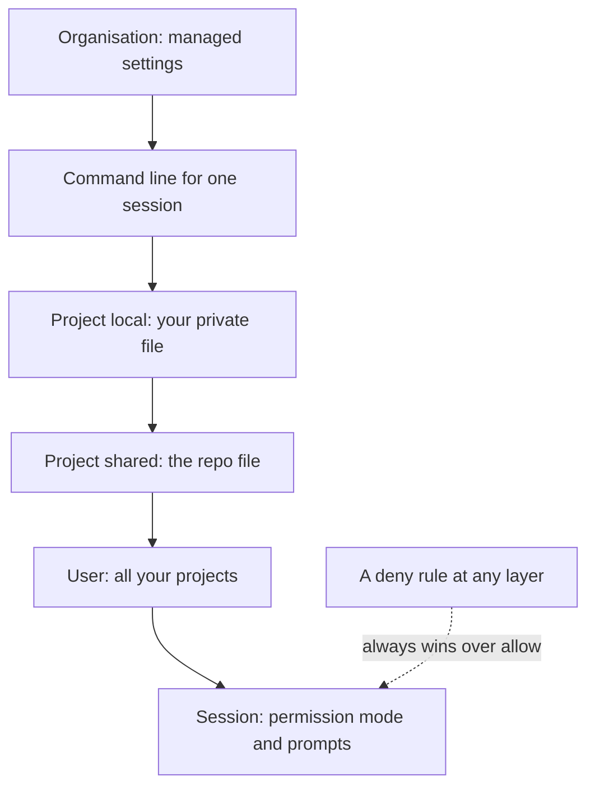

Each tool in this chapter has its own switches, spread across different menus. This page gathers the ones that matter for safety into a single checklist, so the locks are on before anything goes wrong.

**In one line:** switch on the safety settings before you need them: ask-first permissions, blocked secret files, two-factor sign-in, trimmed connectors, privacy choices and spending limits.

## Why it matters

Most AI tools ship with defaults that favour convenience. That is fine for a hobby project. In a small regulated firm, the same defaults can mean an agent reading a file it should not, an account with one weak password, or a bill nobody noticed.

The good news is that a handful of settings do most of the work. None of them needs coding skills, and most take a few minutes. They are also boring, which is the point: you set them once and stop worrying.

This page is a checklist. Each item says what the setting does, why it matters and where to find it. Details here are as of October 2026, and menus move, so if a label differs, search the vendor's help pages for the setting's name.

<mark>Settings that stop a mistake from happening beat instructions that ask the agent to be careful, because the agent can ignore an instruction but cannot ignore a rule the tool enforces.</mark>

## How it works

Settings in Claude Code come in layers. A higher layer can restrict a lower one, and a block set anywhere wins over an allow set elsewhere. Your organisation sits at the top, you and your project sit in the middle, and each session sits at the bottom.



The files are plain text in a format called JSON (a tidy way of writing settings as labelled values). The five places, from strongest to weakest, are:

- **Managed settings:** deployed by an administrator for everyone in an organisation. Nothing you set overrides them, apart from a few security-sensitive exceptions.
- **Command line:** options you type when starting one session.
- **Project local:** `.claude/settings.local.json`, yours alone, for one project.
- **Project shared:** `.claude/settings.json`, shared with everyone who uses the repository.
- **User:** `~/.claude/settings.json`, applying to all your projects.

For a team of one, the user file and the project file are the two you will use. If your firm later gets a Team or Enterprise plan, an administrator can add managed settings above you.

One rule is worth remembering. Claude Code checks blocking rules (called deny rules) first, then ask rules, then allow rules. A deny set at user level beats an allow set at project level, and the other way round.

## The checklist

### In Claude Code

1. **Start in a mode that asks first.** The permission mode decides what the agent may do without asking you. The modes are `default` (shown as Manual: asks before most actions), `acceptEdits`, `plan`, `auto` (a second model reviews actions instead of you), `dontAsk` and `bypassPermissions`. As of October 2026, newer versions of Claude Code can start in auto mode by default, so look at the status bar under the prompt to see which mode you are in. For work involving real firm data, choose Manual. Press `Shift+Tab` to cycle modes inside a session, or set `permissions.defaultMode` in your user settings file.

2. **Never use bypass mode on your own machine.** `bypassPermissions` skips permission prompts, including for protected folders such as `.git` and `.claude`. The documentation says to use it only in isolated environments such as containers or virtual machines. You can lock it off by setting `permissions.disableBypassPermissionsMode` to `"disable"`.

3. **Start big jobs in plan mode.** In plan mode Claude reads and explores but does not edit your files until you approve a plan. Start a session this way with `claude --permission-mode plan`, or cycle to it with `Shift+Tab`. It is the cheapest way to catch a wrong direction.

4. **Block secret files with deny rules.** A deny rule stops the tool from being used on a path. Add rules like these to the `permissions.deny` list in your user or project settings file:

   ```json
   {
     "permissions": {
       "defaultMode": "default",
       "deny": ["Read(./.env)", "Read(./secrets/**)"]
     }
   }
   ```

   A `Read` deny rule also stops Edit and Write on the same path. A `.claudeignore` file has no effect, so do not rely on one. In your user file, a path that starts with a single `/` is relative to the settings folder, so use a `~/` path there for rules that should apply in every project.

5. **Know what deny rules do not cover.** Claude Code applies `Read` deny rules on a best-effort basis to its file tools and to common file commands. They do not stop a script that opens files itself, or a command that searches a whole folder without naming the file. For a hard, operating-system level wall, turn on the sandbox with `/sandbox`. The sandbox runs on macOS, is off by default, and covers shell commands only.

6. **Keep an eye on what you approve.** The prompt "Yes, and don't ask again" saves a rule. Review saved rules now and then with `/permissions`.

### Secrets and git

7. **Keep `.env` files out of git.** Secrets belong in environment variables (see [environment variables and secrets](/concepts/running-things/environment-variables-and-secrets/)), and the file that holds them locally must be listed in `.gitignore` so it is never committed. Add the deny rule from item 4 as a second line of defence. Never paste a key into a chat.

### Connectors and MCP

8. **Turn off what you are not using.** Each connected tool is a door and a cost (see [MCP](/concepts/agents/mcp/)). In Claude Code, run `/mcp` to see servers and toggle one off for the current project. If you sign in with a Claude subscription, connectors you added in the Claude apps also appear in Claude Code. You can switch them all off with `disableClaudeAiConnectors` set to `true` in settings, or hide a single one in `/mcp`.

9. **Approve project servers on purpose.** Servers listed in a repository's `.mcp.json` file ask for your approval before use. Read what you are approving, prefer reviewed connectors from the official directory, and treat any server that fetches outside content as a route for prompt injection.

10. **Start read-only.** Where a connector offers read and write, give it read access first. See [least privilege](/concepts/security/least-privilege/).

### Claude apps: privacy and memory

11. **Learn the training rule for your plan.** On Free, Pro and Max accounts, the setting is "Help improve our AI models" under Settings, then Privacy. It decides whether your chats can be used to train future models, and it applies to Claude Code used from those accounts too. Under commercial terms (Team, Enterprise and the API), Anthropic says it does not train on your prompts or code unless the customer opts in to a programme such as the Development Partner Program. Switching the setting off only affects future conversations. Conversations flagged for safety review can still be used. For firm or investor data, use a commercial plan and read [data terms at a glance](/models/data-terms-at-a-glance/) and [GDPR, data retention and DPAs](/concepts/security/gdpr-data-retention-and-dpas/).

12. **Decide on memory and chat search.** In the Claude apps, both live under Settings, then Memory. You can pause or reset memory, switch off "Search and reference chats", or start an incognito chat (the ghost icon) that is saved to neither history nor memory. On Team and Enterprise plans memory is off until an owner enables it. In Claude Code, auto memory is a separate feature: `/memory` shows a toggle, and `autoMemoryEnabled` can be set to `false` per project. See [memory](/concepts/agents/memory/).

13. **Check what stays on your Mac.** Claude Code keeps session transcripts locally as plain text for 30 days by default. The `cleanupPeriodDays` setting changes that. Treat the folder like any place where client information sits.

### Accounts

14. **Switch on two-factor sign-in where it exists.** GitHub supports authenticator apps, passkeys, security keys, GitHub Mobile and text messages, under Settings, then Password and authentication. It recommends an authenticator app over text messages. Vercel supports an authenticator app and passkeys, under account settings, in the authentication section. Save the recovery codes somewhere safe, away from the device. Claude accounts have no password: you sign in with Google or an emailed link, and the support pages do not describe a separate two-factor option. So protect the Google account or email behind it with two-factor sign-in. This guide could not verify an equivalent for the Claude Console, so check its security settings yourself.

15. **Keep experiments and real data apart.** Use a separate account, workspace or project for trying things out. In the Claude Console (the API side), workspaces let you split development from production, each with its own spend limit.

### Spending

16. **Set limits and alerts.** The Claude Console offers spend limits per workspace. On Pro and Max plans, `/usage-credits` opens the page where you can turn extra usage on or off and set a monthly spend limit. On Vercel, Spend Management sends alerts at set thresholds, but it only stops production deployments if you also switch on "Pause Production Deployments". Pick a limit below the most you would accept, because checks run every few minutes, not instantly. See [estimating cost per task](/concepts/cost/estimating-cost-per-task/).

## Good habits

- Do the checklist once, then put a quarterly reminder in your calendar to repeat it.
- Run `/status` to see which settings sources apply to you, and `/permissions` to see the rules in force.
- Keep user-level rules for what is true everywhere (block secrets, no bypass mode) and project rules for what is true of one repository.
- Test a deny rule by asking Claude to read the blocked file. You should see a refusal that names the rule.
- Use a password manager, and never type or paste a secret into a chat or prompt.
- Write down which account holds what data, so you know where to look if something leaks.

## When things go wrong

- **A rule seems ignored.** Run `claude doctor` to see skipped or invalid settings. A rule that names the wrong tool or a bad path may be skipped with a startup warning.
- **A setting will not change.** An organisation's managed settings may override it. `/status` names the managed source.
- **A secret was pasted or committed.** Treat it as leaked: revoke the key at the provider and create a new one. Deleting the file afterwards is not enough, because git keeps history.
- **You are locked out of an account.** Use your recovery codes. This is why you saved them.
- **An agent did something you did not expect.** Stop it with `Escape`, and use `/rewind` to go back to an earlier checkpoint.

## Costs and limits

Most of these settings are free. Two-factor sign-in, deny rules and plan mode cost nothing but a few minutes.

Some controls depend on your plan. Managed settings need an organisation plan, and Vercel's Spend Management is for paid team plans. Prices and plan names change, so check the vendor pages.

A limit protects you from a runaway bill but can also stop work. Set alerts below the hard limit, so you hear about it before anything stops.

## Related

- [Least privilege](/concepts/security/least-privilege/): the principle behind every deny rule and read-only connector
- [Environment variables and secrets](/concepts/running-things/environment-variables-and-secrets/): where keys should live instead of in files
- [MCP](/concepts/agents/mcp/): what you are switching on and off in the connector list
- [Data terms at a glance](/models/data-terms-at-a-glance/): training and retention rules by provider
- [Not burning tokens](/setup/not-burning-tokens/): the usage side of the same discipline

## The proper terms

- **Permission mode:** a session setting that decides which actions need your approval
- **Deny rule:** a settings entry that blocks a tool or path outright
- **Managed settings:** organisation-wide settings that individuals cannot override
- **Sandbox:** an operating-system boundary limiting which files and sites commands can reach
- **Two-factor authentication:** signing in with a password plus a second proof such as a phone code
- **Passkey:** a phone or device based sign-in that replaces a password
- **Recovery codes:** one-time codes that let you back into an account if your second factor is lost
- **Spend limit:** a cap on money spent, after which use stops or alerts fire

## Next up

Settings keep an agent safe; habits keep it affordable. [Not burning tokens](/setup/not-burning-tokens/) covers how to keep usage, and the fuel bill, down day to day.
