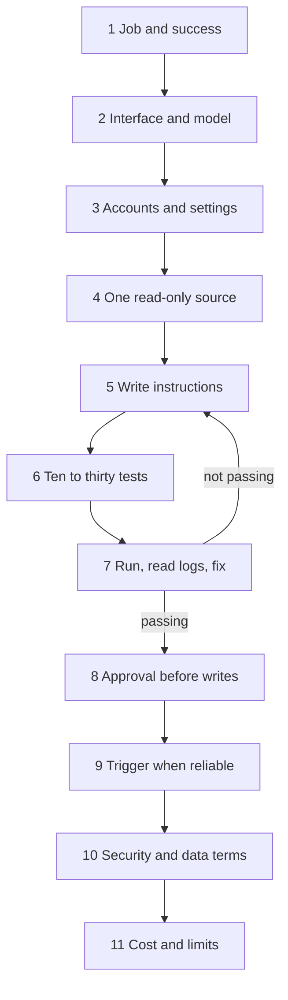

With the garage stocked, from the terminal to safe settings and frugal habits, it is time to build something. This page turns the whole guide into one small, safe build path.

**In one line:** build one read-only agent that answers one kind of question from one data source, test it against ten questions you have checked by hand, and only then let it grow.

## Why it matters

The guide so far has explained the pieces: models, tools, connectors, permissions, cost. It is easy to read all that and still not know where to start. The risk of starting badly is real. An agent that can read everything, write anywhere and run on a schedule can do a lot of damage before anyone notices.

A first agent is mainly a learning project. You learn how your data behaves, how your questions are really phrased, and what goes wrong. A small version teaches you all of that cheaply, and it still touches every layer of the map.

<mark>Make the first agent small enough that you can check every answer by hand, because trust comes from tests you can see, not from how confident the agent sounds.</mark>

This page names categories of tools and points to the pages that hold tool-specific detail, so it stays true as products change.

## The smallest honest version

"Honest" means it does a real job, with real data, and shows its working. It does not mean it does everything. The smallest honest version has six parts.

- **One job:** a single type of question, such as "what do we know about this company?"
- **One data source:** reached through an official connector from the vendor, not a homemade workaround.
- **Read-only access:** no writing, no deleting, no sending.
- **A log:** one line for every question, tool call, answer and token count.
- **Ten test questions:** each with an answer you have checked by hand.
- **One named person:** someone who reads the log every week.

This is the same shape as the path traced in [one question through every layer](/map/one-question-through-every-layer/). Notice what is missing: no second data source, no schedule, no automatic actions. They come later, if at all.

## The build path

The stages run in order, with a loop at the heart: you test, read the logs, fix, and test again. Do not skip ahead to a later stage until the earlier one is solid.

1. **Write down the job and what good looks like.** In two or three sentences, say who asks, what they ask and what a good answer contains. Include what the agent must never do. "Never guess a figure: say it is missing" is a good rule. If you cannot describe a good answer, you cannot test for one.

2. **Choose the interface and the model.** Decide where people will ask: a chat app, a terminal, a team chat tool. See [interfaces](/map/interfaces/). Then choose a model that is good enough for the job and no stronger, using [how to judge a new model](/models/how-to-judge-a-new-model/). A cheaper model that passes your tests beats an expensive one you have not tested.

3. **Set up accounts and safe settings.** Use accounts with two-factor sign-in, block secret files, and set spending limits before you connect anything. The checklist is in [recommended settings](/setup/recommended-settings/). Keep experiments apart from real data.

4. **Connect one read-only source.** Pick the single system the job needs most, and connect it through the vendor's official connector with a read-only account. Follow [connecting business tools through MCP](/setup/connecting-business-tools-through-mcp/). Check what the connector can actually see, and remove anything the job does not need.

5. **Write the instructions as a skill or instruction file.** Put the job, the rules and the answer format in a short file the agent loads, which is what [skills and instruction files](/concepts/agents/skills-and-instruction-files/) are for. Say where to look, how to cite the source, and what to do when data is missing. Keep it short: long instructions cost tokens on every turn.

6. **Build ten to thirty test questions with expected answers.** Write real questions in the words your colleagues would use, with answers you have verified by hand. Include a few awkward ones: a company that does not exist, two companies with similar names, a question with no answer in the data. This is your [eval](/concepts/agents/evals/) set, and it is the most valuable thing you will build.

7. **Run, read the logs, fix.** Run all the questions, and read the [observability](/concepts/agents/observability/) record for every miss: which tool was called, what came back, where the answer went wrong. Fix the instructions, the data or the connector, then run the whole set again. Repeat until it passes consistently, not just once.

8. **Add an approval step before any write.** Only when reading works well should you consider letting the agent change anything, and then only with a person approving each action first. See [human in the loop](/concepts/agents/human-in-the-loop/). Start with drafts that reach no one.

9. **Add a trigger or schedule only when it is reliable.** A schedule makes mistakes repeat without anyone watching. Wait until the tests pass on several different days and the log shows no surprises. Then see [triggers and scheduling](/concepts/running-things/triggers-and-scheduling/), and begin with something low stakes.

10. **Review security and data terms.** Ask what a hidden instruction in a document could make the agent do (see [prompt injection](/concepts/security/prompt-injection/)), and confirm where the data goes and how long it is kept (see [GDPR, data retention and DPAs](/concepts/security/gdpr-data-retention-and-dpas/)). If you handle investor or personal data, this step is not optional.

11. **Estimate cost and set limits.** Measure real runs from the logs, work out the cost per task and the monthly figure, and set a cap with an alert below it. See [estimating cost per task](/concepts/cost/estimating-cost-per-task/).

## How you know it is working

You can say yes to each of these:

- The test set passes, including the awkward questions, on more than one day.
- Every answer shows its source, and a person can click through and check it.
- When the data is missing, the agent says so instead of filling the gap.
- The log lets you explain any single answer in a few minutes.
- Someone reads the log weekly and the notes of what they found lead to fixes.
- The monthly cost is close to your estimate.
- Colleagues use it without being asked, and tell you when it is wrong.

If a test fails, that is the system doing its job. Add the failure to the set so it cannot return unnoticed.

## What to leave for later

Resist these until the evals pass and the log is quiet:

- A second data source.
- Writing to any system, even "just notes".
- Schedules and automatic triggers.
- Several agents working together.
- Your own database or search index.
- A custom dashboard.
- Clever memory.

Each is a good idea at the right time. Growth in scope should follow evidence, and each addition gets its own tests before it goes live.

## Worked example

Sample Ventures, the fictional fund, wants a faster way to prepare for founder calls. The operations lead picks a single job: "what do we know about this company?"

She writes what good looks like. The answer lists the last three interactions with dates, the stage and the open questions, each linked to its CRM record, and says "no record found" when there is none. She chooses the team chat as the interface, and a mid-sized model.

She sets up the safe settings, then connects the CRM through its official connector using a read-only account. The instructions fit on one page. She writes twelve test questions about Acme Payments and other startups, with answers she checked by hand. Three include traps: a startup spelled two ways, one with no notes, and a name that matches two records.

The first run passes seven. The log shows the agent picked the wrong record for the duplicate name and invented a date for the empty one. She tightens the instructions and flags the duplicate in the CRM. Two runs later, all twelve pass, on two different days.

For the next month she changes nothing. An associate reads the log each Friday and adds two new test questions from real misses. Then she adds a draft-only step: the agent writes a call-prep note into a drafts folder, and an associate approves it before it is filed.

Only then does she try a Monday briefing. A schedule runs the same question for the week's calls and posts the results to a private channel for the team to read, with no actions attached. After a month of clean logs, she reviews the data terms again and checks the cost against her estimate. The agent stays read-only for anything that touches investors.

## Costs and limits

The biggest costs are people's time: writing the tests, reading the logs and keeping instructions current. The model bill for a read-only question agent is usually small by comparison, but it grows with long sessions, large tool results and loops (see [not burning tokens](/setup/not-burning-tokens/)).

Limits to keep in mind: an agent is only as good as its data and permissions, a passing test set covers only the questions you thought of, and results vary between runs. A small agent also gives you a false sense of safety if you widen access without widening the tests.

## Related

- [One question through every layer](/map/one-question-through-every-layer/): the path this agent travels
- [Recommended settings](/setup/recommended-settings/): the safe defaults for step 3
- [Evals](/concepts/agents/evals/): how to build and run the test set
- [Human in the loop](/concepts/agents/human-in-the-loop/): the approval step before any write
- [Estimating cost per task](/concepts/cost/estimating-cost-per-task/): the last step, made concrete

## The proper terms

- **Test set:** a fixed list of questions with checked answers, rerun after every change
- **Read-only access:** permission to look at data but not change it
- **Smallest honest version:** the minimum build that does a real job and shows its working
- **Draft-only step:** an action that prepares output without sending or filing it
- **Scope creep:** adding features and access faster than you can test them

## Next up

Once the agent works, the next question is how colleagues reach it without opening a terminal or learning a new app. [Comms channels](/channels/) covers letting people talk to the agent from the chat apps and email they already use.
