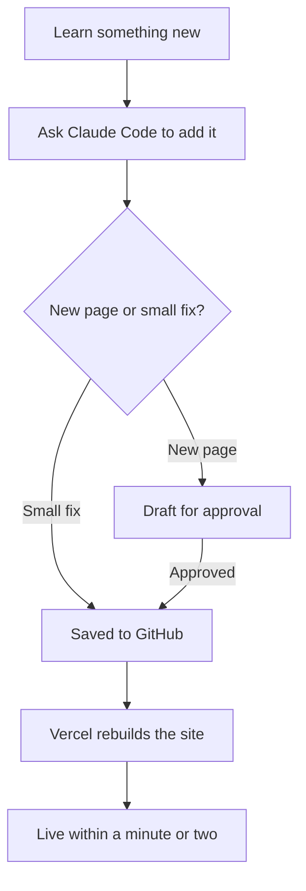

## Every concept page follows the same shape

1. **In one line:** a plain-English definition
2. **Why it matters:** the problem it solves
3. **How it works:** the mechanics, with a diagram where it helps
4. **In practice:** the real tools that do this and how they connect
5. **Worked example:** how a small VC firm might use it
6. **Costs and limits:** what it costs to run and where it breaks
7. **Often confused with:** the thing people mix it up with, and the difference
8. **Related:** links to neighbouring concepts
9. **The proper terms:** the vocabulary to get comfortable using

Because every page has the same layout, you always know where to look.

## How the guide grows

New concepts are added with a Claude Code skill. Small fixes publish straight away. New pages are drafted first and only go live once approved.

## Dates and snapshots

Each page shows when it was last reviewed. Pages about specific models or prices are marked as snapshots, since those change quickly. Everything else aims to stay true for years.

## The worked examples are fictional

Examples use an imaginary small VC firm. Nothing on this site comes from a real firm's data.
