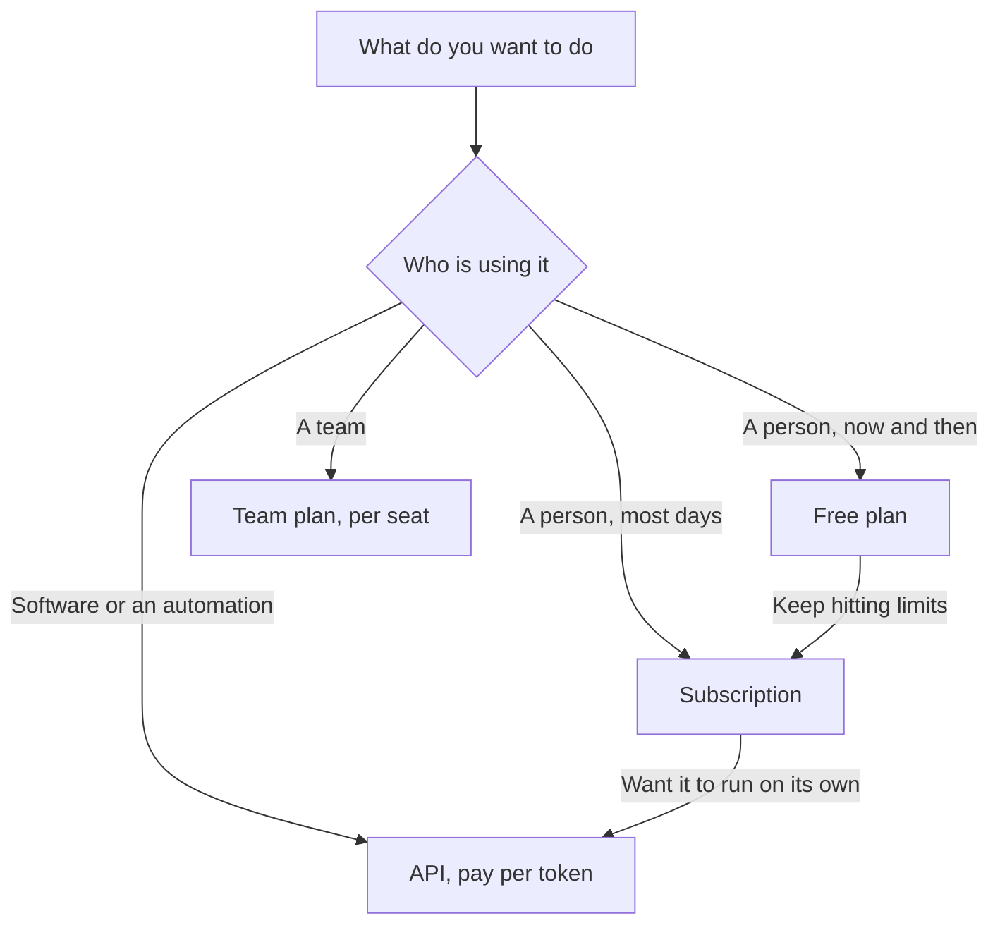

Once you have an idea of [which AI to use](/start/which-ai-should-i-use/), the next question is how to pay for it. This page explains the three options (free, a subscription, or paying per use through the API) in plain terms, so the pricing pages stop looking like a puzzle.

**In one line:** free plans let you try a chat app with tight limits, subscriptions give one person a monthly allowance in the apps, and the API charges per token for software that calls the model directly.

*Snapshot, as of October 2026. Plans and prices change often, so check the provider's own pricing page before you buy.*

## The jargon: concepts covered on this page

- **Free tier:** a no-cost plan with a small usage allowance
- **Subscription:** a fixed monthly fee for one person's use of the apps
- **Seat:** one person's licence on a team or business plan
- **Usage limit:** the cap on how much you can use a plan before it resets
- **Pay as you go:** paying only for what you use, with no fixed fee
- **API key:** a secret string your software sends to prove it may use the API
- **MTok:** one million tokens, the usual unit on API pricing pages

## Why it matters

The same model can be reached in all three ways, and they are billed completely differently. Picking the wrong one either wastes money or leaves you hitting a limit halfway through your work.

A common mix-up is assuming a subscription pays for everything. It covers the apps a person uses. It does not usually pay for your own software or automations calling the model, which go through the API and are billed separately.

<mark>A subscription pays for a person using the apps; the API pays for software using the model.</mark>

## How it works

If the model is the engine and [tokens](/start/tokens-and-context-windows/) are its fuel, the three options are three ways of buying fuel.

- **Free plan.** A test drive. You get the chat app on the web, desktop and phone, with a small allowance. When you hit the limit, you wait for it to reset.
- **Subscription.** A monthly fee for one person, with a bigger allowance and more features. Think of it as a fuel card with a cap that refills on a schedule. Team and business versions charge per person, called a **seat**, and add admin controls.
- **API (pay as you go).** You pay for exactly the tokens your software uses, with no monthly fee. It is the fuel pump: every drop is metered. This is how agents, automations and your own apps are normally billed.

The API needs a little set-up: an account on the provider's developer console, a payment method, and an **API key** (a secret password your software sends with each request). The page on [APIs, OAuth and API keys](/agents/apis-oauth-and-api-keys/) covers keys properly.

## In practice

**Free plans.** Most big chat apps, including Claude, ChatGPT and Gemini, have a free plan. Per Anthropic's pricing page, Claude's free plan includes chat on web, desktop and mobile, web search, file creation, memory and connecting apps. It does not include Claude Code, Anthropic's coding agent.

**Consumer subscriptions.** As of October 2026, Anthropic's pricing page lists:

| Plan | Price (US dollars) | Who it suits |
| --- | --- | --- |
| Free | $0 | Trying it out, occasional use |
| Pro | $20 a month, or $17 a month billed yearly | Regular personal use, Claude Code, Research, Projects |
| Max | from $100 a month (5x Pro usage), or $200 a month (20x) | Heavy daily use |
| Team | $25 a seat a month, or $20 billed yearly; a Premium seat is $125, or $100 billed yearly | Small teams that want shared admin and billing |
| Enterprise | $20 a seat a month billed yearly, plus usage at API rates | Larger organisations needing controls such as audit logs |

Other providers sell similar ladders of free, personal, heavy-use and team plans. Compare their own pages rather than relying on memory, since names and prices move.

**Usage limits.** Anthropic's help pages say paid plans have a **five-hour session limit** and a **weekly limit**. Longer messages, big files, long conversations, research, tools and stronger models all use the allowance faster. For Pro and Max, Anthropic says the Claude apps and Claude Code draw from the same allowance.

**The API.** Prices are quoted per million tokens, with text you send (input) and text the model writes (output) priced separately. Output usually costs several times more than input. Rates range from well under a dollar per million tokens for small models to tens of dollars for the largest. The detail, with current ranges, is on [how API pricing works](/running/how-api-pricing-works/). Some providers, such as Google's Gemini API, also offer a free API tier with low limits for experiments.

## Worked example

Bramley's is a two-person bakery. Sam, the owner, uses AI to draft product descriptions and reply to tricky customer emails a few times a week. The free plan covers this until December, when the limit runs out most days. A personal subscription is the obvious step up.

In the new year Sam wants every online order email checked automatically and the details added to a spreadsheet. That is software doing the work, not a person in a chat, so it runs on the API. A few hundred short emails a month on a small model costs well under a dollar in tokens.

Jo, a freelance researcher, works the other way round. Jo reads and writes all day, so a subscription with a higher allowance makes sense, and the API is not needed at all.

## Costs and limits

- **Subscriptions are capped, not unlimited.** Heavy agent work burns through the allowance much faster than light chat.
- **The API has no cap unless you set one.** A script stuck in a loop keeps spending. Set a monthly spending limit in the developer console.
- **An API key can quietly switch billing.** Anthropic warns that if an `ANTHROPIC_API_KEY` environment variable is set, Claude Code uses it and bills the API instead of your subscription.
- **Free and personal plans may have weaker data terms.** Check how your data is used before pasting anything sensitive. See [data terms at a glance](/models/data-terms-at-a-glance/).
- **Feature lists differ by plan.** Several features in this guide need a paid plan. Check the plan page for the feature you want.

## Often confused with

**Subscription vs API credit.** Paying for a personal or team plan does not give you API credit, and buying API credit does not raise your app limits. They are separate accounts with separate billing.

## Related

- [Tokens and context windows](/start/tokens-and-context-windows/): what a token is and why long chats cost more
- [How API pricing works](/running/how-api-pricing-works/): per-token rates, tiers and discounts in detail
- [The Claude apps](/using-ai/claude-apps/): what the subscription actually gets you
- [APIs, OAuth and API keys](/agents/apis-oauth-and-api-keys/): how software proves who it is

## Next up

With a plan chosen, the next step is knowing where to actually type and what each part of the app is for. [The Claude apps](/using-ai/claude-apps/) is a tour of the web, desktop and mobile apps and the tools inside them.
